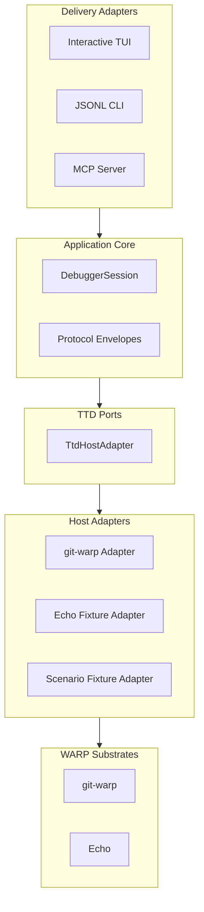

# ARCHITECTURE

WARP TTD is an industrial-grade time-travel debugger organized around a strict Hexagonal (Ports and Adapters) architecture.

## System Shape

## Core Components

### 1. Delivery Adapters
The external interfaces to the debugger. They consume the `DebuggerSession` and project substrate facts to the user or agent. The TUI is the primary human surface; the CLI is the primary agent surface.

### 2. DebuggerSession
The central coordination object. It manages investigator state, including the active playback head, frame snapshots, and pinned observations. It ensures that investigation context survives navigation.

### 3. TtdHostAdapter (The Port)
The host-neutral interface. It defines the capabilities (Read Frame, Step, Seek, Fork) that a host must declare. Host adapters implement this interface, translating substrate-specific facts (like Git patches) into protocol-compliant envelopes.

### 4. Host Adapters
Platform-specific bridges.
- **git-warp**: Indexes Lamport ticks from Git patches and maps TickReceipts to TTD summaries.
- **Echo**: Maps real-time causal transitions from the Echo simulation engine.
- **Scenario**: Contrived data providers for edge-case verification (multi-writer conflicts, effect suppression).

## Protocol: GraphQL Bedrock

The TTD protocol is defined via a Wesley schema (`schemas/warp-ttd-protocol.graphql`). Wesley compiles this schema into TypeScript types, Zod validators, and IR for heterogeneous codegen. The protocol is the sovereign boundary.

---
**The goal is inevitably. Every component is defined by its boundary.**
