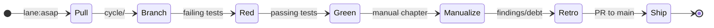

# METHOD

The WARP TTD work doctrine: GitHub Issues, a loop, and honest bookkeeping.

## Principles

- **AGENT-NATIVE, AGENT-FIRST.** LLM agents are primary users, not an
  afterthought. Default to a structured MCP/CLI/read-model surface before TUI or
  browser rendering; human views compose those surfaces instead of becoming the
  first implementation.
- **The agent and the human sit at the same table.** Both matter. Both are named
  in every design.
- **Tests are the executable spec.** Design names the hill and playback
  questions. Tests prove the answers. Design-doc assertions are evidence-ledger
  checks; they are not implementation proof.
- **GitHub Issues are the live tracker.** Issue labels carry Method lane,
  legend, type, priority, and active-work state. Repository files are the
  evidence ledger for designs, witnesses, retros, manuals, and signposts.
- **Process is calm.** No sprints or velocity theater. A labeled issue queue,
  clear evidence, and a loop for doing it well.

## Structure

| Signpost | Role |
| :--- | :--- |
| **`README.md`** | Public front door and project identity. |
| **`MANUAL.md`** | Durable operator and maintainer manual compiled from design cycles. |
| **`GUIDE.md`** | Orientation and productive-fast path. |
| **`VISION.md`** | Core tenets and the observer geometry mission. |
| **`ARCHITECTURE.md`** | Authoritative structural reference. |
| **`METHOD.md`** | Repo work doctrine (this document). |

## GitHub Issue Lanes

| Label | Purpose |
| :--- | :--- |
| **`lane:asap`** | Imminent work; pull into the next cycle. |
| **`lane:cool-ideas`** | Interesting but not committed work. |
| **`lane:bad-code`** | Technical debt that must be addressed. |
| **`lane:inbox`** | Unprocessed ideas; must be promoted or buried before entering a cycle. |
| **`work-in-progress`** | Someone is actively working the issue. |

Legacy files under `docs/method/backlog/**` are migration evidence until issue
[#72](https://github.com/flyingrobots/warp-ttd/issues/72) retires or stubs
them. Do not treat those directories as the live tracker for new work.

## The Cycle Loop

1. **Pull**: Choose a GitHub Issue, mark it `work-in-progress`, and link it
   from the design doc.
2. **Branch**: Create a branch from the issue title slug.
3. **Red**: Write failing tests based on the design's playback questions,
   starting with the agent-facing contract when the feature has any inspection
   or interaction surface.
4. **Green**: Implement the solution until tests pass.
5. **Manualize**: Add or update a `MANUAL.md` chapter when the cycle introduces
   durable doctrine, architecture, protocol boundary, operator workflow, or
   agent contract knowledge.
6. **Retro**: Document findings and follow-on debt in the retro packet.
7. **Ship**: Open a PR to `main`. Update `docs/BEARING.md` after merge.

## Design Format

New cycle design docs use `docs/templates/design-cycle.md` and must pass
`npm run check:method`. Existing pre-format designs are listed in
`docs/templates/legacy-design-docs.txt` until migrated.
