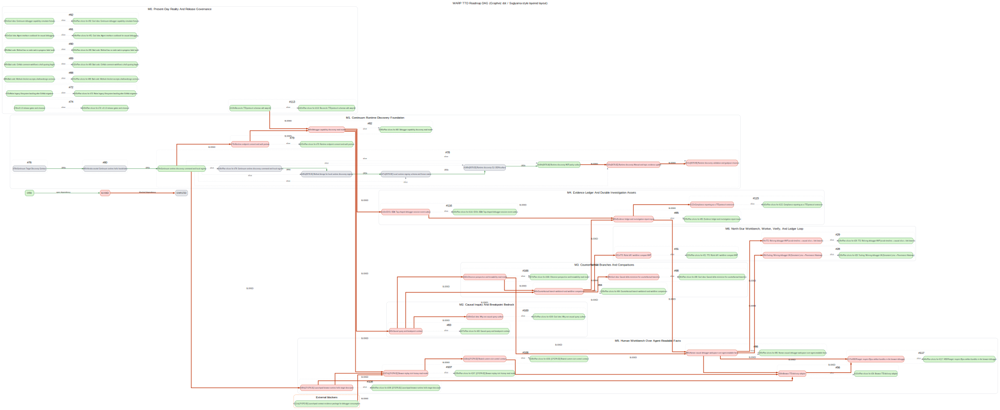

# ROADMAP

This roadmap is the project ladder from current WARP TTD reality to the outcome-oriented debugger north star.
This repository's GitHub Issues are authoritative for task state, parent/child issue relationships, and repository-local blocked-by/blocking edges.
Run `npm run roadmap:generate` after changing issue relationships, and commit this file plus the generated DAG artifacts.



## Operating Model

| Layer | Meaning | Source of truth |
| --- | --- | --- |
| Milestone | Product-stage grouping from present day to north star. | This roadmap, reviewed in PRs. |
| Goalpost | Feature-scoped parent issue that can be designed, reviewed, and closed. | GitHub parent issue. |
| Slice | Commit-sized child issue under a goalpost. | GitHub sub-issue. |
| Dependency | A `blockedBy` / `blocking` issue edge inside this repository. | GitHub native issue dependency graph. |

Status colors in the DAG: green means open and unblocked, red means blocked by at least one open issue in this repository, and gray means completed.
Dependency edges point from repository-local blocker to blocked issue. A red thick edge means the blocker is still open; a green normal edge means the blocker is complete.
The Graphviz `dot` layout is used as the Sugiyama-style layered layout for the roadmap DAG.

## Canonical Sources

| Question | Source | Rule |
| --- | --- | --- |
| What are we building? | [VISION.md](./VISION.md) | Durable product doctrine and north star. |
| What is the active bearing? | [docs/BEARING.md](./docs/BEARING.md) | Current queue and active tensions. |
| What has shipped? | [CHANGELOG.md](./CHANGELOG.md) | Historical release truth. |
| What is live work? | [GitHub Issues](https://github.com/flyingrobots/warp-ttd/issues) | Authoritative state and dependencies. |
| What gates release? | [#74](https://github.com/flyingrobots/warp-ttd/issues/74) | v0.1.0 closeout checklist. |
| How do cycles move? | [METHOD.md](./METHOD.md) | Design/proof workflow. |

## North Star

WARP TTD becomes the agent-native, facts-first core of Xyph Workbench: an outcome-oriented debugger for Continuum-compatible runtimes.
It does not merely replay one execution. It navigates admissible executions around the current basis, with causal passports behind each value, future envelopes ahead, explicit apertures around every question, and durable evidence artifacts after every investigation.

The shipped product remains disciplined: facts before UI, capability-gated operations, immutable history, explicit evidence posture, visible apertures and blind spots, named uncertainty membranes, and identical structured surfaces for humans and agents.

## Milestones, Goalposts, And Slices

### M0. Present-Day Reality And Release Governance

Make the current tracker, docs, schema ownership, and release gates honest before expanding the debugger surface.

User stories:
- As a maintainer, I can see which work is release-scoped and which work is exploratory without reading private notes.
- As an agent, I can determine the next legal slice from GitHub Issues and reproduce the roadmap DAG without editing markdown by hand.
- As a reviewer, I can reject a PR when the ROADMAP, issue graph, and generated DAG disagree.

Requirements:
- GitHub Issues remain the source of truth for state, parent/child issue relationships, and blocked-by/blocking edges.
- The generated roadmap and DAG are committed before any PR that changes sequencing, scope, or dependencies is opened.
- Protocol/schema ownership gaps are represented as issues before downstream implementation relies on them.

Acceptance criteria:
- ROADMAP.md and docs/roadmap-dag.svg regenerate cleanly from live GitHub issue data.
- v0.1.0 gates are visible as GitHub issues, not private backlog notes.
- Release readiness is blocked until local-only or undocumented work is either published, deferred, or removed from scope.

#### Goalpost [#74 v0.1.0 release gates and closeout](https://github.com/flyingrobots/warp-ttd/issues/74)

Status: **open**

User story: Close v0.1.0 from a clean, auditable state where tracker, docs, tests, and release notes agree.

Requirements:
- All scoped work is represented on GitHub.
- No release-relevant work remains private/local-only.

Acceptance criteria:
- Baseline validation passes at the release commit.
- docs/BEARING.md points to the next true target.

GitHub checklist:
- [ ] [#74 v0.1.0 release gates and closeout](https://github.com/flyingrobots/warp-ttd/issues/74) - parent goalpost
  - [ ] [#123 Plan slices for #74: v0.1.0 release gates and closeout](https://github.com/flyingrobots/warp-ttd/issues/123) - child slice

#### Goalpost [#72 Retire legacy filesystem backlog after GitHub migration](https://github.com/flyingrobots/warp-ttd/issues/72)

Status: **open**

User story: Retire legacy filesystem backlog as live planning state while preserving useful history as evidence.

Requirements:
- GitHub Issues own live work.
- Legacy cards are retired, stubbed, or explicitly deferred.

Acceptance criteria:
- No active slice requires reading docs/method/backlog as source of truth.

GitHub checklist:
- [ ] [#72 Retire legacy filesystem backlog after GitHub migration](https://github.com/flyingrobots/warp-ttd/issues/72) - parent goalpost
  - [ ] [#122 Plan slices for #72: Retire legacy filesystem backlog after GitHub migration](https://github.com/flyingrobots/warp-ttd/issues/122) - child slice

#### Goalpost [#88 Bad code: Method checker accepts shallow design sections](https://github.com/flyingrobots/warp-ttd/issues/88)

Status: **open**

User story: Make Method design checks strict enough that shallow sections cannot pass as implementation-ready plans.

Requirements:
- Method check enforces required design depth.
- CI gates the checker.

Acceptance criteria:
- A shallow design fixture fails the checker with actionable output.

GitHub checklist:
- [ ] [#88 Bad code: Method checker accepts shallow design sections](https://github.com/flyingrobots/warp-ttd/issues/88) - parent goalpost
  - [ ] [#131 Plan slices for #88: Bad code: Method checker accepts shallow design sections](https://github.com/flyingrobots/warp-ttd/issues/131) - child slice

#### Goalpost [#89 Bad code: GitHub comment workflow is shell-quoting fragile](https://github.com/flyingrobots/warp-ttd/issues/89)

Status: **open**

User story: Make GitHub comment and review-note workflows file-backed or API-safe instead of shell-quoting fragile.

Requirements:
- Agents can post long structured comments safely.
- No secret-bearing shell interpolation is required.

Acceptance criteria:
- A workflow test or documented smoke demonstrates safe comment posting.

GitHub checklist:
- [ ] [#89 Bad code: GitHub comment workflow is shell-quoting fragile](https://github.com/flyingrobots/warp-ttd/issues/89) - parent goalpost
  - [ ] [#132 Plan slices for #89: Bad code: GitHub comment workflow is shell-quoting fragile](https://github.com/flyingrobots/warp-ttd/issues/132) - child slice

#### Goalpost [#90 Bad code: Method has no stale work-in-progress label audit](https://github.com/flyingrobots/warp-ttd/issues/90)

Status: **open**

User story: Detect stale active-work labels before they distort roadmap health.

Requirements:
- Closed or inactive issues cannot silently keep work-in-progress posture.

Acceptance criteria:
- A checker reports stale work-in-progress or lane labels.

GitHub checklist:
- [ ] [#90 Bad code: Method has no stale work-in-progress label audit](https://github.com/flyingrobots/warp-ttd/issues/90) - parent goalpost
  - [ ] [#133 Plan slices for #90: Bad code: Method has no stale work-in-progress label audit](https://github.com/flyingrobots/warp-ttd/issues/133) - child slice

#### Goalpost [#91 Cool idea: Agent interface cookbook for causal debugging](https://github.com/flyingrobots/warp-ttd/issues/91)

Status: **open**

User story: Teach agents and humans how to use the first structured debugger surfaces once the contracts stabilize.

Requirements:
- Cookbook examples use CLI JSON/MCP/read-model facts.
- No examples depend on scraping TUI output.

Acceptance criteria:
- A new agent can execute at least one causal-debugger workflow from the cookbook.

GitHub checklist:
- [ ] [#91 Cool idea: Agent interface cookbook for causal debugging](https://github.com/flyingrobots/warp-ttd/issues/91) - parent goalpost
  - [ ] [#134 Plan slices for #91: Cool idea: Agent interface cookbook for causal debugging](https://github.com/flyingrobots/warp-ttd/issues/134) - child slice

#### Goalpost [#92 Cool idea: Continuum debugger capability simulator fixtures](https://github.com/flyingrobots/warp-ttd/issues/92)

Status: **open**

User story: Provide deterministic simulator fixtures for capability discovery and unsupported/obstructed capability states.

Requirements:
- Fixtures cover present, absent, unsupported, obstructed, rights-limited, and redacted cases.

Acceptance criteria:
- Capability discovery tests can run without live Echo or browser targets.

GitHub checklist:
- [ ] [#92 Cool idea: Continuum debugger capability simulator fixtures](https://github.com/flyingrobots/warp-ttd/issues/92) - parent goalpost
  - [ ] [#135 Plan slices for #92: Cool idea: Continuum debugger capability simulator fixtures](https://github.com/flyingrobots/warp-ttd/issues/135) - child slice

#### Goalpost [#113 Reconcile TTD protocol schemas with warp-ttd](https://github.com/flyingrobots/warp-ttd/issues/113)

Status: **open**

User story: Reconcile canonical WARP TTD schemas with downstream Echo/TTD consumers before deeper protocol growth relies on mirrors.

Requirements:
- Canonical schema ownership is explicit.
- Generated downstream artifacts stay downstream.

Acceptance criteria:
- The external handoff path is reproducible or the remaining gap is explicitly tracked.

GitHub checklist:
- [ ] [#113 Reconcile TTD protocol schemas with warp-ttd](https://github.com/flyingrobots/warp-ttd/issues/113) - parent goalpost
  - [ ] [#141 Plan slices for #113: Reconcile TTD protocol schemas with warp-ttd](https://github.com/flyingrobots/warp-ttd/issues/141) - child slice

### M1. Continuum Runtime Discovery Foundation

Move from descriptor-backed witness targets to deterministic runtime discovery, consent/auth posture, and capability reporting.

User stories:
- As an agent, I can list configured Continuum-compatible targets and inspect why a runtime is reachable, absent, unsupported, or obstructed.
- As an operator, I can see endpoint trust and auth posture without leaking secrets into logs, JSON, MCP, screenshots, or reports.
- As a debugger client, I can ask which operations are legal before trying replay, causal query, breakpoint, branch, comparison, ledger, or export features.

Requirements:
- Discovery is deterministic and consent-aware; there is no ambient network scanning.
- Endpoint consent/auth/redaction is represented as structured posture, not implicit connection failure.
- Capability discovery reports legal debugger operations separately from authority grants.

Acceptance criteria:
- CLI JSON/JSONL and MCP expose the same discovery and capability facts.
- Unsupported and obstructed targets include machine-readable reasons.
- No slice issues authority, performs runtime admission, mutates a host, or parses raw Echo WAL.

#### Goalpost [#76 Continuum Target Discovery Contract](https://github.com/flyingrobots/warp-ttd/issues/76)

Status: **completed**

User story: Establish app/vendor/substrate identity as reported target facts, not dispatch boundaries.

Requirements:
- jedit and graft remain witness descriptors.
- Synthetic third target registration is possible.

Acceptance criteria:
- targets and target-session JSON iterate registered Continuum-compatible descriptors.

GitHub checklist:
- [x] [#76 Continuum Target Discovery Contract](https://github.com/flyingrobots/warp-ttd/issues/76) - parent goalpost
  - [x] No child slice issues recorded before the roadmap DAG contract existed.

#### Goalpost [#80 Vendor-neutral Continuum runtime hello handshake](https://github.com/flyingrobots/warp-ttd/issues/80)

Status: **completed**

User story: Define and expose vendor-neutral runtime hello posture before local registry and endpoint connection hardening.

Requirements:
- continuum.debug.hello.v1 is inspected without authority or mutation.
- MCP parity exists.

Acceptance criteria:
- runtime-hello JSON and MCP return explicit evidence posture.

GitHub checklist:
- [x] [#80 Vendor-neutral Continuum runtime hello handshake](https://github.com/flyingrobots/warp-ttd/issues/80) - parent goalpost
  - [x] No child slice issues recorded before the roadmap DAG contract existed.
Dependencies:
- blocked by [#76 Continuum Target Discovery Contract](https://github.com/flyingrobots/warp-ttd/issues/76) (completed)

#### Goalpost [#78 Continuum runtime discovery command and local registry](https://github.com/flyingrobots/warp-ttd/issues/78)

Status: **open**

User story: Add deterministic local runtime discovery and registry facts for Continuum-compatible runtimes.

Requirements:
- Local registry shape is explicit.
- Absent, unsupported, obstructed, and reachable states are distinct.

Acceptance criteria:
- Agents can run discovery and get deterministic CLI/MCP output.

GitHub checklist:
- [ ] [#78 Continuum runtime discovery command and local registry](https://github.com/flyingrobots/warp-ttd/issues/78) - parent goalpost
  - [x] [#124 Plan slices for #78: Continuum runtime discovery command and local registry](https://github.com/flyingrobots/warp-ttd/issues/124) - child slice
  - [x] [#146 [0078-S1] Method design for local runtime discovery registry](https://github.com/flyingrobots/warp-ttd/issues/146) - child slice
    - blocked by [#124 Plan slices for #78: Continuum runtime discovery command and local registry](https://github.com/flyingrobots/warp-ttd/issues/124) (completed)
  - [x] [#147 [0078-S2] Local runtime registry schema and fixture matrix](https://github.com/flyingrobots/warp-ttd/issues/147) - child slice
    - blocked by [#146 [0078-S1] Method design for local runtime discovery registry](https://github.com/flyingrobots/warp-ttd/issues/146) (completed)
  - [x] [#148 [0078-S3] Runtime discovery CLI JSON surface](https://github.com/flyingrobots/warp-ttd/issues/148) - child slice
    - blocked by [#147 [0078-S2] Local runtime registry schema and fixture matrix](https://github.com/flyingrobots/warp-ttd/issues/147) (completed)
  - [ ] [#149 [0078-S4] Runtime discovery MCP parity surface](https://github.com/flyingrobots/warp-ttd/issues/149) - child slice
    - blocked by [#148 [0078-S3] Runtime discovery CLI JSON surface](https://github.com/flyingrobots/warp-ttd/issues/148) (completed)
  - [ ] [#150 [0078-S5] Runtime discovery Manual and topic evidence update](https://github.com/flyingrobots/warp-ttd/issues/150) - child slice
    - blocked by [#149 [0078-S4] Runtime discovery MCP parity surface](https://github.com/flyingrobots/warp-ttd/issues/149) (open)
  - [ ] [#151 [0078-S6] Runtime discovery validation and goalpost closeout](https://github.com/flyingrobots/warp-ttd/issues/151) - child slice
    - blocked by [#150 [0078-S5] Runtime discovery Manual and topic evidence update](https://github.com/flyingrobots/warp-ttd/issues/150) (blocked by #149)
Dependencies:
- blocked by [#80 Vendor-neutral Continuum runtime hello handshake](https://github.com/flyingrobots/warp-ttd/issues/80) (completed)

#### Goalpost [#79 Runtime endpoint consent and auth posture](https://github.com/flyingrobots/warp-ttd/issues/79)

Status: **blocked by #78**

User story: Report consent, authentication, trust, redaction, and credential failure posture before live endpoints grow.

Requirements:
- Secrets are never emitted in structured surfaces.
- Denied, expired, missing, and malformed credentials are distinct.

Acceptance criteria:
- Policy tests prove redaction and consent/auth posture output.

GitHub checklist:
- [ ] [#79 Runtime endpoint consent and auth posture](https://github.com/flyingrobots/warp-ttd/issues/79) - parent goalpost
  - [ ] [#125 Plan slices for #79: Runtime endpoint consent and auth posture](https://github.com/flyingrobots/warp-ttd/issues/125) - child slice
Dependencies:
- blocked by [#78 Continuum runtime discovery command and local registry](https://github.com/flyingrobots/warp-ttd/issues/78) (open)

#### Goalpost [#82 Debugger capability discovery read model](https://github.com/flyingrobots/warp-ttd/issues/82)

Status: **blocked by #113, #79**

User story: Expose a debugger capability matrix before agents or humans attempt causal debugger operations.

Requirements:
- Capabilities include replay, query, breakpoint, branch, comparison, ledger, export, and admitted-control posture.

Acceptance criteria:
- CLI JSON and MCP report capability support with reasons for every unsupported or obstructed feature.

GitHub checklist:
- [ ] [#82 Debugger capability discovery read model](https://github.com/flyingrobots/warp-ttd/issues/82) - parent goalpost
  - [ ] [#126 Plan slices for #82: Debugger capability discovery read model](https://github.com/flyingrobots/warp-ttd/issues/126) - child slice
Dependencies:
- blocked by [#79 Runtime endpoint consent and auth posture](https://github.com/flyingrobots/warp-ttd/issues/79) (blocked by #78)
- blocked by [#113 Reconcile TTD protocol schemas with warp-ttd](https://github.com/flyingrobots/warp-ttd/issues/113) (open)

### M2. Causal Inquiry And Breakpoint Bedrock

Teach WARP TTD to answer why, why-not, first-cause, absence, invariant, and breakpoint questions as agent-readable facts.

User stories:
- As an investigator, I can ask why a fact happened and receive a replay-basis-linked cause chain.
- As an investigator, I can ask why an expected fact did not happen and receive explicit absence evidence.
- As an agent, I can set deterministic breakpoint predicates and inspect machine-readable hit records.

Requirements:
- CausalQuery and BreakpointSpec forms are deterministic and testable.
- Hit records cite replay basis, coordinate, predicate, inspected facts, evidence posture, and retry/export options.
- No UI-only truth ships before CLI JSON/MCP/read-model surfaces.

Acceptance criteria:
- A RED test evaluates at least one real causal-debugger predicate against a deterministic replay basis.
- Breakpoint hits and query answers are evidence-backed machine-readable facts.

#### Goalpost [#83 Causal query and breakpoint contract](https://github.com/flyingrobots/warp-ttd/issues/83)

Status: **blocked by #82**

User story: Define the causal query and breakpoint contract that becomes the Explain half of Workbench.

Requirements:
- WHY, WHY_NOT, causal slice, first cause, absence, and invariant search are named.

Acceptance criteria:
- At least one predicate executes against a deterministic replay basis.

GitHub checklist:
- [ ] [#83 Causal query and breakpoint contract](https://github.com/flyingrobots/warp-ttd/issues/83) - parent goalpost
  - [ ] [#127 Plan slices for #83: Causal query and breakpoint contract](https://github.com/flyingrobots/warp-ttd/issues/127) - child slice
Dependencies:
- blocked by [#82 Debugger capability discovery read model](https://github.com/flyingrobots/warp-ttd/issues/82) (blocked by #113, #79)

#### Goalpost [#100 Cool idea: Why-not causal query surface](https://github.com/flyingrobots/warp-ttd/issues/100)

Status: **blocked by #83**

User story: Promote why-not causal query thinking into the contract once the main query surface exists.

Requirements:
- Absence and blocked alternatives are inspectable rather than inferred.

Acceptance criteria:
- Why-not answers cite the facts that prevented the expected outcome.

GitHub checklist:
- [ ] [#100 Cool idea: Why-not causal query surface](https://github.com/flyingrobots/warp-ttd/issues/100) - parent goalpost
  - [ ] [#137 Plan slices for #100: Cool idea: Why-not causal query surface](https://github.com/flyingrobots/warp-ttd/issues/137) - child slice
Dependencies:
- blocked by [#83 Causal query and breakpoint contract](https://github.com/flyingrobots/warp-ttd/issues/83) (blocked by #82)

### M3. Counterfactual Branches And Comparisons

Make Follow real: create debugger-local branch records, compare actual and counterfactual facts, and keep assumptions visible.

User stories:
- As an investigator, I can follow an admissible path in a deterministic fork without mutating canonical history.
- As a reviewer, I can see exactly which facts changed, which stayed fixed, which assumptions were used, and which evidence proves the comparison.
- As an agent, I can inspect actual-vs-branch diffs through CLI/MCP before any visual workbench renders them.

Requirements:
- CounterfactualBranch records include basis, intervention, assumptions, evaluator posture, divergence coordinate, changed/unchanged/obstructed/redacted facts.
- Counterfactual history is never presented as actual history.
- Comparison output remains host-neutral and capability-gated.

Acceptance criteria:
- Actual-vs-branch and recorded-run-vs-recorded-run comparison facts are exportable.
- Assumption and obstruction posture are visible in every branch comparison.

#### Goalpost [#84 Counterfactual branch workbench and worldline comparison](https://github.com/flyingrobots/warp-ttd/issues/84)

Status: **blocked by #83**

User story: Design and expose the counterfactual branch workbench and worldline comparison read model.

Requirements:
- Branch basis, intervention, assumptions, divergence, and comparison facts are explicit.

Acceptance criteria:
- A reviewer can audit what changed and why from structured output.

GitHub checklist:
- [ ] [#84 Counterfactual branch workbench and worldline comparison](https://github.com/flyingrobots/warp-ttd/issues/84) - parent goalpost
  - [ ] [#128 Plan slices for #84: Counterfactual branch workbench and worldline comparison](https://github.com/flyingrobots/warp-ttd/issues/128) - child slice
Dependencies:
- blocked by [#83 Causal query and breakpoint contract](https://github.com/flyingrobots/warp-ttd/issues/83) (blocked by #82)

#### Goalpost [#98 Cool idea: Causal delta minimizer for counterfactual branches](https://github.com/flyingrobots/warp-ttd/issues/98)

Status: **blocked by #84**

User story: Minimize causal deltas for counterfactual branches once basic comparison exists.

Requirements:
- Counterfactual deltas are ranked by causal relevance, not raw text size.

Acceptance criteria:
- A branch comparison can point to the smallest meaningful causal divergence.

GitHub checklist:
- [ ] [#98 Cool idea: Causal delta minimizer for counterfactual branches](https://github.com/flyingrobots/warp-ttd/issues/98) - parent goalpost
  - [ ] [#136 Plan slices for #98: Cool idea: Causal delta minimizer for counterfactual branches](https://github.com/flyingrobots/warp-ttd/issues/136) - child slice
Dependencies:
- blocked by [#84 Counterfactual branch workbench and worldline comparison](https://github.com/flyingrobots/warp-ttd/issues/84) (blocked by #83)

### M4. Evidence Ledger And Durable Investigation Assets

Convert debugging sessions into durable assurance assets: reports, receipts, tests, obligations, compliance envelopes, and event streams.

User stories:
- As an incident responder, I can export the evidence behind an investigation as Markdown plus JSON for issue, PR, or audit review.
- As an agent, I can consume the same evidence bundle without scraping a rendered report.
- As an assurance owner, I can see which obligations, redactions, rights limits, budget limits, and obstructions remain.

Requirements:
- Reports cite replay basis, coordinates, query results, breakpoint hits, branch assumptions, source refs, and validation commands.
- Redaction and consent posture survive export.
- Debugger-session events have deterministic IDs and ordering before browser/TUI consumers depend on them.

Acceptance criteria:
- A generated evidence bundle can be attached to a PR and independently inspected by an agent.
- Compliance and diagnostic envelopes are protocol-shaped, capability-gated, and test-backed.

#### Goalpost [#116 COOL IDEA: Tap-shaped debugger session event outbox](https://github.com/flyingrobots/warp-ttd/issues/116)

Status: **blocked by #82**

User story: Define a Tap-shaped debugger-session event outbox for deterministic session event streams.

Requirements:
- Backfill/live cutover, per-source ordering, event IDs, sequence numbers, and ack posture are explicit.

Acceptance criteria:
- CLI JSONL and MCP can expose identical event streams before UI consumers rely on them.

GitHub checklist:
- [ ] [#116 COOL IDEA: Tap-shaped debugger session event outbox](https://github.com/flyingrobots/warp-ttd/issues/116) - parent goalpost
  - [ ] [#143 Plan slices for #116: COOL IDEA: Tap-shaped debugger session event outbox](https://github.com/flyingrobots/warp-ttd/issues/143) - child slice
Dependencies:
- blocked by [#82 Debugger capability discovery read model](https://github.com/flyingrobots/warp-ttd/issues/82) (blocked by #113, #79)

#### Goalpost [#85 Evidence ledger and investigation report export](https://github.com/flyingrobots/warp-ttd/issues/85)

Status: **blocked by #116, #84**

User story: Define evidence ledger and investigation report export surfaces.

Requirements:
- Receipts, witnesses, admission results, readings, redactions, rights limits, budget limits, and obstructions are preserved.

Acceptance criteria:
- Markdown plus JSON bundles can be attached to issues or PRs.

GitHub checklist:
- [ ] [#85 Evidence ledger and investigation report export](https://github.com/flyingrobots/warp-ttd/issues/85) - parent goalpost
  - [ ] [#129 Plan slices for #85: Evidence ledger and investigation report export](https://github.com/flyingrobots/warp-ttd/issues/129) - child slice
Dependencies:
- blocked by [#84 Counterfactual branch workbench and worldline comparison](https://github.com/flyingrobots/warp-ttd/issues/84) (blocked by #83)
- blocked by [#116 COOL IDEA: Tap-shaped debugger session event outbox](https://github.com/flyingrobots/warp-ttd/issues/116) (blocked by #82)

#### Goalpost [#115 Compliance reporting as a TTD protocol extension](https://github.com/flyingrobots/warp-ttd/issues/115)

Status: **blocked by #85**

User story: Extend the TTD protocol with compliance reporting envelopes where hosts expose compliance checks.

Requirements:
- Violation and summary envelopes are capability-gated.
- Severity, code, tick, channel, and rule refs are preserved.

Acceptance criteria:
- Compliance violations can render inline with replay facts and export through evidence bundles.

GitHub checklist:
- [ ] [#115 Compliance reporting as a TTD protocol extension](https://github.com/flyingrobots/warp-ttd/issues/115) - parent goalpost
  - [ ] [#142 Plan slices for #115: Compliance reporting as a TTD protocol extension](https://github.com/flyingrobots/warp-ttd/issues/142) - child slice
Dependencies:
- blocked by [#85 Evidence ledger and investigation report export](https://github.com/flyingrobots/warp-ttd/issues/85) (blocked by #116, #84)

### M5. Human Workbench Over Agent-Readable Facts

Render the Workbench only after structured facts exist: evidence timeline, fact inspector, inquiry workbench, browser targets, and replay controls.

User stories:
- As a developer fixing a blocked PR, I can open the failed region, inspect the causal passport, see a dangerous future ghost, run Explain, Follow the trace, and export a test.
- As an accessibility reviewer, I can audit the workspace without relying on visual-only truth.
- As an agent supervisor, I can compare what the human saw with the CLI/MCP facts the agent consumed.

Requirements:
- The UI composes structured facts from prior milestones and never becomes canonical debugger truth.
- Actual/counterfactual status, evidence posture, redaction, and rights limits are represented textually and structurally, not only by color or layout.
- Browser and VISOR targets use the same target discovery, hello, capability, replay, and report contracts.

Acceptance criteria:
- The rendered workspace can be audited without screen scraping.
- Blocked PR to Workbench v0.1 flow completes in the narrow demo: region, passport, ghost, Explain, Follow, export test, obligation update, blind spots.

#### Goalpost [#86 Human causal debugger workspace over agent-readable facts](https://github.com/flyingrobots/warp-ttd/issues/86)

Status: **blocked by #85**

User story: Design and implement the human causal debugger workspace over agent-readable facts.

Requirements:
- Evidence Timeline, Fact Inspector, and Inquiry Workbench compose prior structured surfaces.

Acceptance criteria:
- No visual-only truth is required to understand or audit a debugging session.

GitHub checklist:
- [ ] [#86 Human causal debugger workspace over agent-readable facts](https://github.com/flyingrobots/warp-ttd/issues/86) - parent goalpost
  - [ ] [#130 Plan slices for #86: Human causal debugger workspace over agent-readable facts](https://github.com/flyingrobots/warp-ttd/issues/130) - child slice
Dependencies:
- blocked by [#85 Evidence ledger and investigation report export](https://github.com/flyingrobots/warp-ttd/issues/85) (blocked by #116, #84)

#### Goalpost [#108 [LP-GP4-S1] Launchpad browser runtime hello target descriptor](https://github.com/flyingrobots/warp-ttd/issues/108)

Status: **blocked by #78**

User story: Add a Launchpad/browser runtime hello target descriptor.

Requirements:
- Browser runtime target identity and hello posture follow the same contracts as other Continuum targets.

Acceptance criteria:
- Browser targets can participate in runtime hello inspection.

GitHub checklist:
- [ ] [#108 [LP-GP4-S1] Launchpad browser runtime hello target descriptor](https://github.com/flyingrobots/warp-ttd/issues/108) - parent goalpost
  - [ ] [#140 Plan slices for #108: [LP-GP4-S1] Launchpad browser runtime hello target descriptor](https://github.com/flyingrobots/warp-ttd/issues/140) - child slice
Dependencies:
- blocked by [#78 Continuum runtime discovery command and local registry](https://github.com/flyingrobots/warp-ttd/issues/78) (open)

#### Goalpost [#107 [LP-GP4-S2] Browser replay tick history read model](https://github.com/flyingrobots/warp-ttd/issues/107)

Status: **blocked by #82, #108, #111**

User story: Expose browser replay tick history as a debugger read model.

Requirements:
- Browser replay history is deterministic and agent-readable.

Acceptance criteria:
- Replay tick history can be consumed without browser screen scraping.

GitHub checklist:
- [ ] [#107 [LP-GP4-S2] Browser replay tick history read model](https://github.com/flyingrobots/warp-ttd/issues/107) - parent goalpost
  - [ ] [#139 Plan slices for #107: [LP-GP4-S2] Browser replay tick history read model](https://github.com/flyingrobots/warp-ttd/issues/139) - child slice
Dependencies:
- blocked by [#82 Debugger capability discovery read model](https://github.com/flyingrobots/warp-ttd/issues/82) (blocked by #113, #79)
- blocked by [#108 [LP-GP4-S1] Launchpad browser runtime hello target descriptor](https://github.com/flyingrobots/warp-ttd/issues/108) (blocked by #78)
- blocked by [#111 [LP-GP2-S3] Launchpad contract evidence package for debugger consumption](https://github.com/flyingrobots/warp-ttd/issues/111) (open)

#### Goalpost [#106 [LP-GP4-S3] Rewind current visit control contract](https://github.com/flyingrobots/warp-ttd/issues/106)

Status: **blocked by #107**

User story: Define rewind current visit control contract for browser sessions.

Requirements:
- Control is capability-gated and does not imply host authority beyond the declared surface.

Acceptance criteria:
- Rewind control can report unsupported, obstructed, and permitted posture.

GitHub checklist:
- [ ] [#106 [LP-GP4-S3] Rewind current visit control contract](https://github.com/flyingrobots/warp-ttd/issues/106) - parent goalpost
  - [ ] [#138 Plan slices for #106: [LP-GP4-S3] Rewind current visit control contract](https://github.com/flyingrobots/warp-ttd/issues/138) - child slice
Dependencies:
- blocked by [#107 [LP-GP4-S2] Browser replay tick history read model](https://github.com/flyingrobots/warp-ttd/issues/107) (blocked by #82, #108, #111)

#### Goalpost [#56 Browser TTD delivery adapter](https://github.com/flyingrobots/warp-ttd/issues/56)

Status: **blocked by #86, #108, #106**

User story: Deliver the browser TTD adapter as a real witness target for the Workbench ladder.

Requirements:
- Browser adapter uses target discovery, runtime hello, capability discovery, replay, and evidence posture contracts.

Acceptance criteria:
- Browser sessions can be inspected through structured debugger surfaces.

GitHub checklist:
- [ ] [#56 Browser TTD delivery adapter](https://github.com/flyingrobots/warp-ttd/issues/56) - parent goalpost
  - [ ] [#121 Plan slices for #56: Browser TTD delivery adapter](https://github.com/flyingrobots/warp-ttd/issues/121) - child slice
Dependencies:
- blocked by [#86 Human causal debugger workspace over agent-readable facts](https://github.com/flyingrobots/warp-ttd/issues/86) (blocked by #85)
- blocked by [#106 [LP-GP4-S3] Rewind current visit control contract](https://github.com/flyingrobots/warp-ttd/issues/106) (blocked by #107)
- blocked by [#108 [LP-GP4-S1] Launchpad browser runtime hello target descriptor](https://github.com/flyingrobots/warp-ttd/issues/108) (blocked by #78)

#### Goalpost [#117 VISOR target: inspect Bijou artifact bundles in the browser debugger](https://github.com/flyingrobots/warp-ttd/issues/117)

Status: **blocked by #86, #56**

User story: Use WARP TTD to inspect Bijou VISOR artifact bundles in the browser debugger.

Requirements:
- VISOR bundle facts, replay metadata, and render receipts enter the debugger as structured facts.

Acceptance criteria:
- Unsupported contract versions fail loudly and deterministically.

GitHub checklist:
- [ ] [#117 VISOR target: inspect Bijou artifact bundles in the browser debugger](https://github.com/flyingrobots/warp-ttd/issues/117) - parent goalpost
  - [ ] [#144 Plan slices for #117: VISOR target: inspect Bijou artifact bundles in the browser debugger](https://github.com/flyingrobots/warp-ttd/issues/144) - child slice
Dependencies:
- blocked by [#56 Browser TTD delivery adapter](https://github.com/flyingrobots/warp-ttd/issues/56) (blocked by #86, #108, #106)
- blocked by [#86 Human causal debugger workspace over agent-readable facts](https://github.com/flyingrobots/warp-ttd/issues/86) (blocked by #85)

### M6. North-Star Workbench, Worker, Verify, And Ledger Loop

Finish the outcome-oriented debugger: apertures as code, membranes, Force/Forbid, Worker obligation loops, Verify capsules, retro-patrol, and multiplayer forensics.

User stories:
- As a developer, I can select a bad future and receive bounded, evidence-graded intervention plans rather than unverified suggestions.
- As an agent, I receive an aperture and obligation, not a whole repo and vague prompt.
- As an auditor, I can verify support obligations, receipt capsules, and residual assumption debt across boundaries.

Requirements:
- Aperture profiles are versioned artifacts that show included, excluded, abstracted, and blind-spot facts.
- Uncertainty membranes name external chaos, owner, TTL, containment level, and gate impact.
- Force and Forbid remain bounded and evidence-graded; a patch is not called proof-discharged until a verifier earns that claim.
- Worker and Verify operate through the same issue, evidence, receipt, and gate loop as humans.

Acceptance criteria:
- Workbench v0.1 grows into Follow, Force, Forbid, Explain without toolbar inflation.
- Agent work product is admissible-or-rejected by the same Gate and entered into the same evidence ledger.
- Retro-patrol can reobserve archived history under new observers without pretending to re-execute unavailable facts.

Future parent issues to create before implementation:
- [ ] Aperture profiles and Aperture Diff as code.
- [ ] Uncertainty membranes and assumption capsules.
- [ ] Force solver with bounded constraints and explicit unsupported cases.
- [ ] Forbid intervention plans with fork validation and patch evidence grades.
- [ ] Xyph Worker obligation loop over aperture-bounded tasks.
- [ ] Xyph Verify support obligation capsule export and ingest.
- [ ] Retro-patrol and multiplayer investigation records.

#### Goalpost [#28 Tooling: Reliving debugger UX (Constraint Lens + Provenance Heatmap)](https://github.com/flyingrobots/warp-ttd/issues/28)

Status: **blocked by #86**

User story: Carry forward the Constraint Lens and Provenance Heatmap ideas into Workbench north-star planning.

Requirements:
- Constraint and provenance views stay downstream of structured facts.

Acceptance criteria:
- Future UI work can map lens output to causal query, passport, and evidence bundle facts.

GitHub checklist:
- [ ] [#28 Tooling: Reliving debugger UX (Constraint Lens + Provenance Heatmap)](https://github.com/flyingrobots/warp-ttd/issues/28) - parent goalpost
  - [ ] [#118 Plan slices for #28: Tooling: Reliving debugger UX (Constraint Lens + Provenance Heatmap)](https://github.com/flyingrobots/warp-ttd/issues/118) - child slice
Dependencies:
- blocked by [#86 Human causal debugger workspace over agent-readable facts](https://github.com/flyingrobots/warp-ttd/issues/86) (blocked by #85)

#### Goalpost [#29 TT2: Reliving debugger MVP (scrub timeline + causal slice + fork branch)](https://github.com/flyingrobots/warp-ttd/issues/29)

Status: **blocked by #86**

User story: Keep the reliving debugger MVP thread aligned with the Workbench v0.1 loop.

Requirements:
- Timeline scrub, causal slice, and fork branch map to Explain and Follow facts.

Acceptance criteria:
- No reliving UI depends on hidden state unavailable to agents.

GitHub checklist:
- [ ] [#29 TT2: Reliving debugger MVP (scrub timeline + causal slice + fork branch)](https://github.com/flyingrobots/warp-ttd/issues/29) - parent goalpost
  - [ ] [#119 Plan slices for #29: TT2: Reliving debugger MVP (scrub timeline + causal slice + fork branch)](https://github.com/flyingrobots/warp-ttd/issues/119) - child slice
Dependencies:
- blocked by [#86 Human causal debugger workspace over agent-readable facts](https://github.com/flyingrobots/warp-ttd/issues/86) (blocked by #85)

#### Goalpost [#31 TT3: Rulial diff / worldline compare MVP](https://github.com/flyingrobots/warp-ttd/issues/31)

Status: **blocked by #84**

User story: Promote rulial diff/worldline compare work only after branch comparison facts exist.

Requirements:
- Worldline compare uses structured branch comparison facts.

Acceptance criteria:
- Diff output can be exported and inspected as evidence.

GitHub checklist:
- [ ] [#31 TT3: Rulial diff / worldline compare MVP](https://github.com/flyingrobots/warp-ttd/issues/31) - parent goalpost
  - [ ] [#120 Plan slices for #31: TT3: Rulial diff / worldline compare MVP](https://github.com/flyingrobots/warp-ttd/issues/120) - child slice
Dependencies:
- blocked by [#84 Counterfactual branch workbench and worldline comparison](https://github.com/flyingrobots/warp-ttd/issues/84) (blocked by #83)

## Dependency Checklist

These expected repository-local blocker edges are part of the planned product sequence. `npm run roadmap:check` verifies that GitHub native issue dependencies match them.

- [x] [#76 Continuum Target Discovery Contract](https://github.com/flyingrobots/warp-ttd/issues/76) blocks [#80 Vendor-neutral Continuum runtime hello handshake](https://github.com/flyingrobots/warp-ttd/issues/80)
- [x] [#80 Vendor-neutral Continuum runtime hello handshake](https://github.com/flyingrobots/warp-ttd/issues/80) blocks [#78 Continuum runtime discovery command and local registry](https://github.com/flyingrobots/warp-ttd/issues/78)
- [x] [#78 Continuum runtime discovery command and local registry](https://github.com/flyingrobots/warp-ttd/issues/78) blocks [#79 Runtime endpoint consent and auth posture](https://github.com/flyingrobots/warp-ttd/issues/79)
- [x] [#79 Runtime endpoint consent and auth posture](https://github.com/flyingrobots/warp-ttd/issues/79) blocks [#82 Debugger capability discovery read model](https://github.com/flyingrobots/warp-ttd/issues/82)
- [x] [#113 Reconcile TTD protocol schemas with warp-ttd](https://github.com/flyingrobots/warp-ttd/issues/113) blocks [#82 Debugger capability discovery read model](https://github.com/flyingrobots/warp-ttd/issues/82)
- [x] [#82 Debugger capability discovery read model](https://github.com/flyingrobots/warp-ttd/issues/82) blocks [#83 Causal query and breakpoint contract](https://github.com/flyingrobots/warp-ttd/issues/83)
- [x] [#83 Causal query and breakpoint contract](https://github.com/flyingrobots/warp-ttd/issues/83) blocks [#100 Cool idea: Why-not causal query surface](https://github.com/flyingrobots/warp-ttd/issues/100)
- [x] [#83 Causal query and breakpoint contract](https://github.com/flyingrobots/warp-ttd/issues/83) blocks [#84 Counterfactual branch workbench and worldline comparison](https://github.com/flyingrobots/warp-ttd/issues/84)
- [x] [#84 Counterfactual branch workbench and worldline comparison](https://github.com/flyingrobots/warp-ttd/issues/84) blocks [#98 Cool idea: Causal delta minimizer for counterfactual branches](https://github.com/flyingrobots/warp-ttd/issues/98)
- [x] [#82 Debugger capability discovery read model](https://github.com/flyingrobots/warp-ttd/issues/82) blocks [#116 COOL IDEA: Tap-shaped debugger session event outbox](https://github.com/flyingrobots/warp-ttd/issues/116)
- [x] [#84 Counterfactual branch workbench and worldline comparison](https://github.com/flyingrobots/warp-ttd/issues/84) blocks [#85 Evidence ledger and investigation report export](https://github.com/flyingrobots/warp-ttd/issues/85)
- [x] [#116 COOL IDEA: Tap-shaped debugger session event outbox](https://github.com/flyingrobots/warp-ttd/issues/116) blocks [#85 Evidence ledger and investigation report export](https://github.com/flyingrobots/warp-ttd/issues/85)
- [x] [#85 Evidence ledger and investigation report export](https://github.com/flyingrobots/warp-ttd/issues/85) blocks [#115 Compliance reporting as a TTD protocol extension](https://github.com/flyingrobots/warp-ttd/issues/115)
- [x] [#85 Evidence ledger and investigation report export](https://github.com/flyingrobots/warp-ttd/issues/85) blocks [#86 Human causal debugger workspace over agent-readable facts](https://github.com/flyingrobots/warp-ttd/issues/86)
- [x] [#78 Continuum runtime discovery command and local registry](https://github.com/flyingrobots/warp-ttd/issues/78) blocks [#108 [LP-GP4-S1] Launchpad browser runtime hello target descriptor](https://github.com/flyingrobots/warp-ttd/issues/108)
- [x] [#108 [LP-GP4-S1] Launchpad browser runtime hello target descriptor](https://github.com/flyingrobots/warp-ttd/issues/108) blocks [#107 [LP-GP4-S2] Browser replay tick history read model](https://github.com/flyingrobots/warp-ttd/issues/107)
- [x] [#82 Debugger capability discovery read model](https://github.com/flyingrobots/warp-ttd/issues/82) blocks [#107 [LP-GP4-S2] Browser replay tick history read model](https://github.com/flyingrobots/warp-ttd/issues/107)
- [x] [#107 [LP-GP4-S2] Browser replay tick history read model](https://github.com/flyingrobots/warp-ttd/issues/107) blocks [#106 [LP-GP4-S3] Rewind current visit control contract](https://github.com/flyingrobots/warp-ttd/issues/106)
- [x] [#106 [LP-GP4-S3] Rewind current visit control contract](https://github.com/flyingrobots/warp-ttd/issues/106) blocks [#56 Browser TTD delivery adapter](https://github.com/flyingrobots/warp-ttd/issues/56)
- [x] [#86 Human causal debugger workspace over agent-readable facts](https://github.com/flyingrobots/warp-ttd/issues/86) blocks [#56 Browser TTD delivery adapter](https://github.com/flyingrobots/warp-ttd/issues/56)
- [x] [#56 Browser TTD delivery adapter](https://github.com/flyingrobots/warp-ttd/issues/56) blocks [#117 VISOR target: inspect Bijou artifact bundles in the browser debugger](https://github.com/flyingrobots/warp-ttd/issues/117)
- [x] [#86 Human causal debugger workspace over agent-readable facts](https://github.com/flyingrobots/warp-ttd/issues/86) blocks [#117 VISOR target: inspect Bijou artifact bundles in the browser debugger](https://github.com/flyingrobots/warp-ttd/issues/117)
- [x] [#86 Human causal debugger workspace over agent-readable facts](https://github.com/flyingrobots/warp-ttd/issues/86) blocks [#28 Tooling: Reliving debugger UX (Constraint Lens + Provenance Heatmap)](https://github.com/flyingrobots/warp-ttd/issues/28)
- [x] [#86 Human causal debugger workspace over agent-readable facts](https://github.com/flyingrobots/warp-ttd/issues/86) blocks [#29 TT2: Reliving debugger MVP (scrub timeline + causal slice + fork branch)](https://github.com/flyingrobots/warp-ttd/issues/29)
- [x] [#84 Counterfactual branch workbench and worldline comparison](https://github.com/flyingrobots/warp-ttd/issues/84) blocks [#31 TT3: Rulial diff / worldline compare MVP](https://github.com/flyingrobots/warp-ttd/issues/31)

## Regeneration

Use these commands when issue state, sub-issues, or dependency edges change:

```bash
npm run roadmap:generate
npm run roadmap:check
```

To seed the planned blocker edges into GitHub native issue dependencies, run:

```bash
npm run roadmap:sync -- --apply
```

The sync command only adds missing planned blocker edges. It does not remove extra dependencies; removing dependencies is a deliberate tracker operation.
