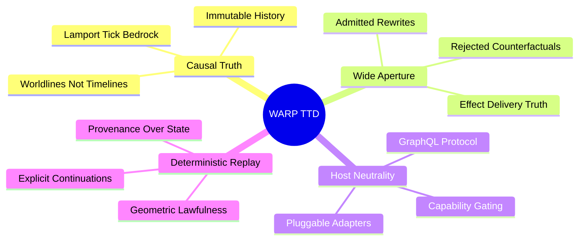

# VISION

WARP TTD is an industrial-grade time-travel debugger where causal truth, observer geometry, and wide-aperture inspection are unified.

## Core Tenets

### 1. History is the System of Record
Traditional debuggers inspect state; WARP TTD inspects history. A worldline is a causal chain of patches with deterministic materialization. We debug the cone of influence, not just the resulting scalar.

### 2. Wide-Aperture Observation
An observer is a structural five-tuple (Projection, Basis, State, Update, Emission). TTD surfaces what survives each layer of observation, ensuring that task-relevant distinctions are never collapsed.

### 3. Capability-Gated Control
TTD observes facts honestly and, when the host declares the capability, drives explicit controls: pause, step, seek, and strand fork. Control is an emergent property of the host-adapter contract.

### 4. Counterfactuals are First-Class
Rejected rewrites are not noise; they are counterfactuals—what *could* have happened. TTD surfaces these alternatives to explore degeneracy and understand the decision boundaries of the substrate.

### 5. Multi-Host Portability
The same debugger serves heterogeneous hosts (git-warp, Echo). The protocol is the sovereign boundary, ensuring that systems engineering expertise is portable across causal runtimes.

---
**The goal is inevitably. Every continuation from the past is explicit, capability-gated, and provenance-bearing.**
