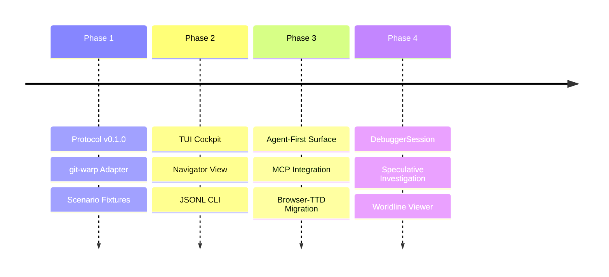

# BEARING

Current direction and active tensions. Historical ship data is in `CHANGELOG.md`.

## Active Gravity

### 1. Agent-First Sovereignty
- Treating CLI `--json` as the canonical agent-facing surface.
- Promoting MCP from speculative experiment to an explicit delivery adapter.
- Ensuring TUI capabilities follow explicit CLI/MCP/session nouns rather than inventing ad-hoc behavior.

### 2. Neighborhood & Site Catalog
- Refinement of the `NeighborhoodFocusSummary` to share focus across disparate debugger pages.
- Hardening site-driven worldline cursor recomputation for consistent navigation.

### 3. DebuggerSession Maturity
- Implementation of the `DebuggerSession` investigation object to track speculative result handles and investigator context.
- Scaling the window-based read model to handle high-density causal worldlines.

## Tensions

- **TUI-Lead Inertia**: Breaking the habit of implementing new inspection features in the TUI before the structured CLI/MCP surface.
- **Protocol Drift**: Keeping the Wesley-compiled schema perfectly synchronized with local host-adapter implementation details.
- **Speculative Complexity**: Managing the investigator's cognitive load when branching and braiding multiple counterfactual strands.

## Next Target

The immediate focus is the **MCP Delivery Adapter** to ensure WARP TTD is a tool-native participant in the agentic workstation. See [`docs/method/backlog/up-next/DELIVERY_mcp-agent-surface.md`](./method/backlog/up-next/DELIVERY_mcp-agent-surface.md).
