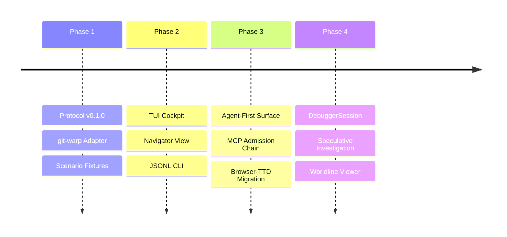

# BEARING

Current direction and active tensions. Long-horizon orientation is in
`ROADMAP.md`; historical ship data is in `CHANGELOG.md`.

## Active Gravity

### 1. Agent-Native / Agent-First

- WARP TTD should be the primary way for LLMs to inspect and interact with
  Continuum apps.
- New debugger facts and lawful interactions land first as MCP tools, CLI
  `--json` / JSONL, generated protocol artifacts, or deterministic read models.
- TUI and browser views render those agent-visible facts after the structured
  surface exists; they are not the first proof of a feature.
- The agent surface must keep absence, authority, admission, mutation, and
  evidence posture explicit instead of inferring optimistic runtime truth.

### 2. Continuum-Compatible Target Debugging

- WARP TTD should debug Continuum-compatible targets through descriptor,
  capability, and evidence-posture contracts, not through hard-coded app names.
- `jedit`, a live Echo app, and `graft`, a live git-warp app, remain the two
  concrete debugger witness targets.
- Proving the same host-neutral session, CLI, and MCP vocabulary can inspect
  those witnesses without becoming either app's domain model or either
  substrate's runtime.
- Keeping host-specific richness behind explicit `AdapterCapability` support:
  Echo pressures lawful optic admission and witness posture; git-warp pressures
  causal history, receipts, lanes, and materialized readings.
- Keeping runtime-boundary evidence posture explicit: configured adapters and
  translated substrate facts must not be upgraded into native Continuum
  witnesshood by inference.

### 3. Admission-Chain Read Model

- Treating the landed MCP surface as transport and inspection over
  `DebuggerSession`, host adapter facts, readings, and admission-chain posture.
- Promoting the admission-chain read model as the next protocol target, so
  artifact registration, handles, grant posture, admission tickets, witnesses,
  receipts, and reading envelopes become distinct facts instead of blobs.
- Keeping MCP out of authority issuance, grant construction, runtime admission,
  mutation, and local strand creation.

### 4. Neighborhood & Site Catalog

- Refinement of the `NeighborhoodFocusSummary` to share focus across disparate
  debugger pages.
- Hardening site-driven worldline cursor recomputation for consistent navigation.

### 5. DebuggerSession Maturity

- Implementation of the `DebuggerSession` investigation object to track
  speculative result handles and investigator context.
- Scaling the window-based read model to handle high-density causal worldlines.
- Exposing read-only session, worldline, reading, `AdapterCapability`, and
  admission-chain facts before adding speculative lifecycle controls.

### 6. Optic Admission Role Clarity

- Treat Wesley-compiled artifacts and registration descriptors as inputs to the
  admission-chain read model, not as debugger-owned authority.
- Echo owns runtime-local handles, admission, obstruction, access
  instrumentation, witnesses, receipts, and readings.
- Authority layers issue `CapabilityGrant` and `CapabilityPresentation`
  objects; applications hide handles, basis references, and runtime coordinates
  behind adapters.
- WARP TTD should inspect these facts through protocol/read-model surfaces
  without issuing authority or mutating host state.

### 7. Debugger / Shared-Family Boundary

- WARP TTD owns debugger-native investigation surfaces: sessions, playback,
  frame windows, posture wrappers, pins, summaries, CLI JSONL, and MCP result
  envelopes.
- Continuum, Echo, Wesley, and authority-family artifacts own shared facts such
  as `ReadingEnvelope`, `ObserverPlan`, `OpticRegistrationDescriptor`,
  `CapabilityGrant`, `CapabilityPresentation`, `AdmissionTicket`, and
  `LawWitness`.
- Host substrate details remain adapter residue unless WARP TTD deliberately
  projects them into debugger summaries with visible evidence posture.

### 8. Echo WAL Evidence Boundary

- Echo owns WAL truth: segment format, append authority, commit-marker
  validation, recovery, truncation, runtime admission, and scheduler decisions.
- WARP TTD may become WAL-evidence-aware only through Echo-projected causal
  commit evidence, recovery certificates, and durability posture supplied by an
  adapter or generated shared-family artifact.
- WARP TTD must not parse raw Echo WAL segments, truncate WAL tails, validate
  commit markers, recover Echo runtime state, or mark recovery clean.
- The debugger concept is `READ_CAUSAL_COMMIT_EVIDENCE`, not `READ_WAL`.
- Missing durable commit evidence must be explicit absence or obstruction, not
  inferred from a present receipt.
- This boundary is future-facing. The immediate `0032` Echo adapter probe still
  remains a read-only bridge/probe posture, not a WAL evidence surface.

## Tensions

- **TUI-Lead Inertia**: Breaking the habit of implementing new inspection
  features in the TUI before the structured CLI/MCP surface.
- **Protocol Drift**: Keeping the Wesley-compiled schema perfectly synchronized
  with local host-adapter implementation details.
- **Speculative Complexity**: Managing the investigator's cognitive load when
  branching and braiding multiple counterfactual strands. Strand work is
  blocked until the debugger can represent the admission-chain facts that make
  fork-like actions lawful instead of local UI mutation.

## Next Target

The product goal is **Continuum-Compatible Target Debugging**: WARP TTD debugs
targets that expose Continuum-compatible inspection contracts. `jedit`, a live
Echo app, and `graft`, a live git-warp app, are default witness targets, not
special debugger concepts. The **Continuum Target Discovery Contract**,
**Continuum Causal Debugger Design Thinking**, and **Vendor-Neutral Continuum
Runtime Hello Handshake** cycles are now landed. The next correction is
[#78 Continuum runtime discovery command and local registry](https://github.com/flyingrobots/warp-ttd/issues/78):
WARP TTD needs deterministic local discovery and registry facts before endpoint
consent/auth, debugger capability discovery, or live runtime connection harden.

MCP is not authority, admission, grant issuance, or mutation. The read-model
target is
[`docs/design/0024-admission-chain-read-model/admission-chain-read-model.md`](./design/0024-admission-chain-read-model/admission-chain-read-model.md).
The originating backlog remains
[`docs/method/backlog/up-next/PROTO_admission-chain-inspector.md`](./method/backlog/up-next/PROTO_admission-chain-inspector.md)
until the live Echo facts land.
The live app delivery target is
[`docs/method/backlog/up-next/DELIVERY_dual-live-app-debugging.md`](./method/backlog/up-next/DELIVERY_dual-live-app-debugging.md).
The debugger/shared-family boundary packet is
[`docs/design/0026-debugger-native-shared-family-boundary/debugger-native-shared-family-boundary.md`](./design/0026-debugger-native-shared-family-boundary/debugger-native-shared-family-boundary.md).
The future Echo causal commit evidence boundary is
[`docs/design/0042-echo-causal-commit-evidence-read-model/echo-causal-commit-evidence-read-model.md`](./design/0042-echo-causal-commit-evidence-read-model/echo-causal-commit-evidence-read-model.md),
tracked by
[`docs/method/backlog/up-next/PROTO_echo-causal-commit-evidence-read-model.md`](./method/backlog/up-next/PROTO_echo-causal-commit-evidence-read-model.md).
The landed generated-family ingress seam is now the Manual-backed path for
bringing shared-family payload posture into WARP TTD:
[`docs/manual/001-generated-family-ingress-seam.md`](./manual/001-generated-family-ingress-seam.md),
paired with
[`docs/design/0027-generated-family-ingress-seam/generated-family-ingress-seam.md`](./design/0027-generated-family-ingress-seam/generated-family-ingress-seam.md).
The first host-published family fact path is also Manual-backed:
[`docs/manual/002-host-published-family-facts.md`](./manual/002-host-published-family-facts.md),
paired with
[`docs/design/0028-host-published-family-facts/host-published-family-facts.md`](./design/0028-host-published-family-facts/host-published-family-facts.md).
The live Echo intake path is now Manual-backed:
[`docs/manual/003-live-echo-family-intake.md`](./manual/003-live-echo-family-intake.md),
paired with
[`docs/design/0029-live-echo-family-intake/live-echo-family-intake.md`](./design/0029-live-echo-family-intake/live-echo-family-intake.md).
The generated-family consumption boundary is also Manual-backed:
[`docs/manual/004-generated-family-consumption.md`](./manual/004-generated-family-consumption.md),
paired with
[`docs/design/0030-generated-family-consumption/generated-family-consumption.md`](./design/0030-generated-family-consumption/generated-family-consumption.md).
The first jedit target-session smoke is Manual-backed:
[`docs/manual/005-jedit-echo-smoke.md`](./manual/005-jedit-echo-smoke.md),
paired with
[`docs/design/0031-jedit-echo-smoke/jedit-echo-smoke.md`](./design/0031-jedit-echo-smoke/jedit-echo-smoke.md).
The Echo adapter probe boundary is Manual-backed:
[`docs/manual/006-echo-adapter-probe-boundary.md`](./manual/006-echo-adapter-probe-boundary.md),
paired with
[`docs/design/0032-echo-adapter-probe-boundary/echo-adapter-probe-boundary.md`](./design/0032-echo-adapter-probe-boundary/echo-adapter-probe-boundary.md).
The Wesley-generated Echo family consumer is Manual-backed and landed:
[`docs/manual/007-wesley-generated-echo-family-consumer.md`](./manual/007-wesley-generated-echo-family-consumer.md),
paired with
[`docs/design/0033-wesley-generated-echo-family-consumer/wesley-generated-echo-family-consumer.md`](./design/0033-wesley-generated-echo-family-consumer/wesley-generated-echo-family-consumer.md).
It teaches the Echo path to report manifest-declared generated Continuum Echo
inspect artifacts when available while preserving `LOCAL_MIRROR_FALLBACK` for
fixtures, git-warp, and missing generated packages.
The Continuum target discovery contract is Manual-backed and landed:
[`docs/manual/008-continuum-target-discovery-contract.md`](./manual/008-continuum-target-discovery-contract.md),
paired with
[`docs/design/0076-continuum-target-discovery-contract/continuum-target-discovery-contract.md`](./design/0076-continuum-target-discovery-contract/continuum-target-discovery-contract.md).
It makes app identity, runtime vendor, and substrate reported facts instead of
target-dispatch boundaries.
The first executable smoke surface is `npm run targets -- --json`, which
reports read-only posture for configured Continuum-compatible targets without
attaching or mutating.
The paired session smoke surface is `npm run target-session -- --json`, which
now reports both jedit obstruction and graft session posture. Both surfaces
include `jedit.echoAdapterProbe`, which distinguishes missing root, absent
bridge, supported bridge, unsupported ABI, and obstructed descriptor without
claiming an open Echo session.
The landed evidence-posture boundary is
[`docs/design/0021-runtime-boundary-evidence-posture/runtime-boundary-evidence-posture.md`](./design/0021-runtime-boundary-evidence-posture/runtime-boundary-evidence-posture.md).
The landed synthesis cycle
[`#81 Continuum causal debugger design thinking and post-0076 housekeeping`](https://github.com/flyingrobots/warp-ttd/issues/81)
defines what debugging means when Continuum gives WARP TTD deterministic
replay, counterfactuals, causal evidence, readings, witnesses, and structured
agent surfaces. The paired design and Manual chapter are
[`docs/design/0081-continuum-causal-debugger-design-thinking/continuum-causal-debugger-design-thinking.md`](./design/0081-continuum-causal-debugger-design-thinking/continuum-causal-debugger-design-thinking.md)
and
[`docs/manual/009-continuum-causal-debugger-design-thinking.md`](./manual/009-continuum-causal-debugger-design-thinking.md).
Its follow-on implementation epics are
[#82](https://github.com/flyingrobots/warp-ttd/issues/82),
[#83](https://github.com/flyingrobots/warp-ttd/issues/83),
[#84](https://github.com/flyingrobots/warp-ttd/issues/84),
[#85](https://github.com/flyingrobots/warp-ttd/issues/85), and
[#86](https://github.com/flyingrobots/warp-ttd/issues/86).
The landed runtime hello cycle is
[`#80 Vendor-neutral Continuum runtime hello handshake`](https://github.com/flyingrobots/warp-ttd/issues/80),
paired with
[`docs/design/0080-vendor-neutral-continuum-runtime-hello-handshake/vendor-neutral-continuum-runtime-hello-handshake.md`](./design/0080-vendor-neutral-continuum-runtime-hello-handshake/vendor-neutral-continuum-runtime-hello-handshake.md).
It defines `continuum.debug.hello.v1` as the next shared contract before local
registry discovery, endpoint consent/auth, or debugger capability discovery.
The first implementation surface is `npm run runtime-hello -- --json` plus MCP
`warp_ttd.inspect_runtime_hello`; both report `ContinuumRuntimeHelloInspection`
records with explicit hello posture, evidence posture, native witnesshood, and
structured reasons without issuing authority, admitting, or mutating a target.

## Next Slice Queue

As of 2026-06-04, the next execution queue continues from the landed
Manual-backed `0080-vendor-neutral-continuum-runtime-hello-handshake` cycle.
Each slice should follow the cycle loop in `METHOD.md`: design packet, failing
tests, implementation, Manual chapter or Manual update, retro/follow-on debt,
validation, and PR.

1. **0078 Continuum Runtime Discovery Command And Local Registry**
   - Add an explicit local registry/discovery command after the neutral hello
     contract exists.
   - Keep discovery deterministic and consent-aware; no ambient network
     scanning without a separate consent/auth design.
   - Prove registered runtimes through CLI JSON and MCP.

1. **0079 Runtime Endpoint Consent And Auth Posture**
   - Harden endpoint connection policy, redaction, token posture, and retry
     rules before live endpoint discovery grows.
   - Report consent/auth requirements as explicit posture facts.
   - Keep secrets out of JSONL, MCP, logs, screenshots, retros, and witnesses.

1. **0082 Debugger Capability Discovery Read Model**
   - Report which causal-debugger features a selected target supports before an
     agent or human attempts them.
   - Include replay, causal query, breakpoint, counterfactual branch, branch
     comparison, evidence ledger, report export, and admitted-control posture.
   - Unsupported, obstructed, rights-limited, budget-limited, redacted, and
     translated-substrate cases need machine-readable reasons.

1. **0083 Causal Query And Breakpoint Contract**
   - Define `CausalQuery` forms for why, why-not, causal slice, first cause,
     absence, and invariant search.
   - Define `BreakpointSpec` forms for temporal, source, data, effect,
     admission, reading, witness, absence, invariant, causal, and
     counterfactual divergence predicates.
   - Breakpoint hits must cite replay basis, coordinate, predicate, inspected
     facts, posture, and retry/disable/export options.

1. **0084 Counterfactual Branch Workbench And Worldline Comparison**
   - Model debugger-local `CounterfactualBranch` records with basis,
     intervention, assumptions, evaluator posture, divergence coordinate, and
     changed/unchanged/obstructed/redacted facts.
   - Compare actual against counterfactual and recorded run against recorded run.
   - Never present a counterfactual branch as actual history.

1. **0085 Evidence Ledger And Investigation Report Export**
   - Preserve receipts, witnesses, admission results, reading envelopes, source
     refs, redactions, rights limits, budget limits, and obstructions.
   - Export Markdown plus JSON evidence bundles for issues, PRs, and agent
     review.
   - Keep replay/report sharing explicit and redaction-aware.

1. **0086 Human Causal Debugger Workspace Over Agent-Readable Facts**
   - Design the Evidence Timeline, Fact Inspector, and Inquiry Workbench after
     the structured CLI/MCP/read-model facts exist.
   - Accessibility, keyboard navigation, screen-reader summaries, directionality,
     and no visual-only truth are part of the contract.
   - The rendered workspace composes agent-visible facts; it does not define
     hidden debugger truth.

1. **0034 Continuum Neighborhood Core Host Facts**
   - Move neighborhood intake from target-scope manifest posture toward actual
     adapter/session facts for any Continuum-compatible target that exposes the
     capability.
   - First live payload: `NeighborhoodCoreSummary`.
   - CLI and MCP must expose source refs and evidence posture without upgrading
     translated substrate evidence into native Continuum witnesshood.

1. **0035 Jedit Reintegration Detail And Receipt Shell**
   - Add Echo-published `ReintegrationDetailSummary` and optional
     `ReceiptShellSummary` intake.
   - Preserve the three-layer order: neighborhood core first, seam detail
     second, explanatory receipt shell last.
   - Receipt shell must never redefine neighborhood core.

1. **0036 Admission Registration And Handle Facts**
   - Add real Echo/jedit admission-chain facts for artifact registration and
     runtime handle posture.
   - Represent artifact hash, `OpticRegistrationDescriptor`, admission
     requirements digest, and Echo-owned `OpticArtifactHandle` distinctly.
   - Keep grant, ticket, and witness facts `ABSENT` or `OBSTRUCTED` until Echo
     exposes them.

## Echo And Jedit Dependency Boundary

The queue is intentionally staged so WARP TTD can land honest inspection
contracts before Echo or `jedit` are ready to publish every live fact.

- `0032` and `0033` can begin mostly in WARP TTD. They may still report
  `UNAVAILABLE`, `ABSENT`, or `OBSTRUCTED` until Echo and `jedit` expose the
  required runtime surfaces.
- `0034` through `0038` require Echo-side support to become fully present live
  facts. WARP TTD can define inspection contracts, posture handling, CLI, MCP,
  fixtures, and Manual chapters, but Echo owns runtime handles, admission,
  obstruction, access instrumentation, witnesses, receipts, and readings.
- `jedit` changes should stay integration-shaped: publish app/session identity,
  register the relevant optic artifacts, and expose one or more useful reading
  surfaces through Echo. `jedit` should not become a source of debugger
  ontology or editor-domain semantics inside WARP TTD.
- `0039` is mostly WARP TTD plus live `graft` / git-warp parity work.
- `0040` may need Wesley and generated shared-family artifact coordination, but
  should not require `jedit` editor-domain changes.
- `0041` can start with existing WARP TTD read models, but live fidelity
  improves as the Echo-published facts from `0034` through `0038` become
  available.

The healthy execution order is:

1. Land WARP TTD support first with explicit absence and obstruction posture.
1. Add companion Echo changes that publish the runtime facts.
1. Add narrow `jedit` wiring only where needed to publish or register those
   facts.
1. Return to WARP TTD and flip live acceptance from obstructed smoke to present
   host-published facts.

Strand and speculative lifecycle work remains blocked until the
admission-chain facts above are inspectable as distinct facts instead of local
UI mutation.
