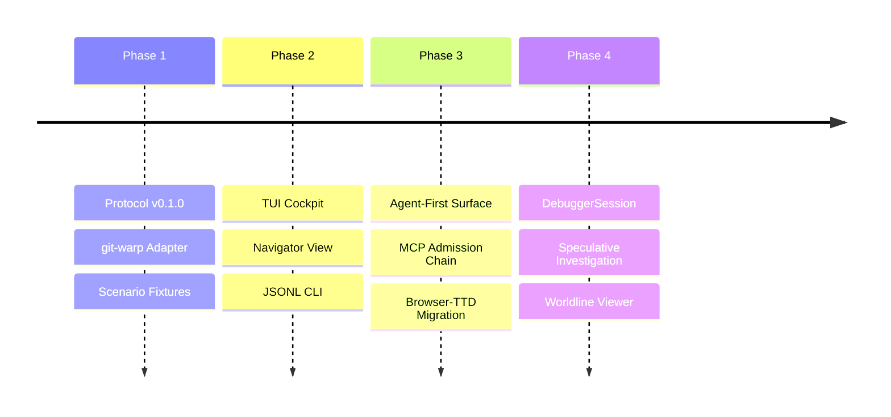

# BEARING

Current direction and active tensions. Historical ship data is in `CHANGELOG.md`.

## Active Gravity

### 1. Agent-Native / Agent-First

- WARP TTD should be the primary way for LLMs to inspect and interact with
  Continuum apps.
- New debugger facts and lawful interactions land first as MCP tools, CLI
  `--json` / JSONL, generated protocol artifacts, or deterministic read models.
- TUI and browser views render those agent-visible facts after the structured
  surface exists; they are not the first proof of a feature.
- The agent surface must keep absence, authority, admission, mutation, and
  evidence posture explicit instead of inferring optimistic runtime truth.

### 2. Dual Live App Debugging

- Making `jedit`, a live Echo app, and `graft`, a live git-warp app, the two
  concrete debugger acceptance targets.
- Proving the same host-neutral session, CLI, and MCP vocabulary can inspect
  both apps without becoming either app's domain model.
- Keeping host-specific richness behind explicit `AdapterCapability` support:
  Echo pressures lawful optic admission and witness posture; git-warp pressures
  causal history, receipts, lanes, and materialized readings.
- Keeping runtime-boundary evidence posture explicit: configured adapters and
  translated substrate facts must not be upgraded into native Continuum
  witnesshood by inference.

### 3. Admission-Chain Read Model

- Treating the landed MCP surface as transport and inspection over
  `DebuggerSession`, host adapter facts, readings, and admission-chain posture.
- Promoting the admission-chain read model as the next protocol target, so
  artifact registration, handles, grant posture, admission tickets, witnesses,
  receipts, and reading envelopes become distinct facts instead of blobs.
- Keeping MCP out of authority issuance, grant construction, runtime admission,
  mutation, and local strand creation.

### 4. Neighborhood & Site Catalog

- Refinement of the `NeighborhoodFocusSummary` to share focus across disparate debugger pages.
- Hardening site-driven worldline cursor recomputation for consistent navigation.

### 5. DebuggerSession Maturity

- Implementation of the `DebuggerSession` investigation object to track speculative result handles and investigator context.
- Scaling the window-based read model to handle high-density causal worldlines.
- Exposing read-only session, worldline, reading, `AdapterCapability`, and
  admission-chain facts before adding speculative lifecycle controls.

### 6. Optic Admission Role Clarity

- Treat Wesley-compiled artifacts and registration descriptors as inputs to the
  admission-chain read model, not as debugger-owned authority.
- Echo owns runtime-local handles, admission, obstruction, access
  instrumentation, witnesses, receipts, and readings.
- Authority layers issue `CapabilityGrant` and `CapabilityPresentation` objects; applications hide
  handles, basis references, and runtime coordinates behind adapters.
- WARP TTD should inspect these facts through protocol/read-model surfaces
  without issuing authority or mutating host state.

### 7. Debugger / Shared-Family Boundary

- WARP TTD owns debugger-native investigation surfaces: sessions, playback,
  frame windows, posture wrappers, pins, summaries, CLI JSONL, and MCP result
  envelopes.
- Continuum, Echo, Wesley, and authority-family artifacts own shared facts such
  as `ReadingEnvelope`, `ObserverPlan`, `OpticRegistrationDescriptor`,
  `CapabilityGrant`, `CapabilityPresentation`, `AdmissionTicket`, and
  `LawWitness`.
- Host substrate details remain adapter residue unless WARP TTD deliberately
  projects them into debugger summaries with visible evidence posture.

### 8. Echo WAL Evidence Boundary

- Echo owns WAL truth: segment format, append authority, commit-marker
  validation, recovery, truncation, runtime admission, and scheduler decisions.
- WARP TTD may become WAL-evidence-aware only through Echo-projected causal
  commit evidence, recovery certificates, and durability posture supplied by an
  adapter or generated shared-family artifact.
- WARP TTD must not parse raw Echo WAL segments, truncate WAL tails, validate
  commit markers, recover Echo runtime state, or mark recovery clean.
- The debugger concept is `READ_CAUSAL_COMMIT_EVIDENCE`, not `READ_WAL`.
- Missing durable commit evidence must be explicit absence or obstruction, not
  inferred from a present receipt.
- This boundary is future-facing. The immediate `0032` Echo adapter probe still
  remains a read-only bridge/probe posture, not a WAL evidence surface.

## Tensions

- **TUI-Lead Inertia**: Breaking the habit of implementing new inspection
  features in the TUI before the structured CLI/MCP surface.
- **Protocol Drift**: Keeping the Wesley-compiled schema perfectly synchronized
  with local host-adapter implementation details.
- **Speculative Complexity**: Managing the investigator's cognitive load when
  branching and braiding multiple counterfactual strands. Strand work is
  blocked until the debugger can represent the admission-chain facts that make
  fork-like actions lawful instead of local UI mutation.

## Next Target

The product goal is **Dual Live App Debugging**: WARP TTD debugs `jedit`, a
live Echo app, and `graft`, a live git-warp app. The immediate protocol
focus is still the **Admission-Chain Read Model**: protocol and read model
representation for artifact registration, registration descriptors, Echo-owned
handles, grant posture, `CapabilityPresentation` posture, admission tickets,
obstructions, witnesses, receipts, and reading envelopes.

MCP is not authority, admission, grant issuance, or mutation. The read-model
target is
[`docs/design/0024-admission-chain-read-model/admission-chain-read-model.md`](./design/0024-admission-chain-read-model/admission-chain-read-model.md).
The originating backlog remains
[`docs/method/backlog/up-next/PROTO_admission-chain-inspector.md`](./method/backlog/up-next/PROTO_admission-chain-inspector.md)
until the live Echo facts land.
The live app delivery target is
[`docs/method/backlog/up-next/DELIVERY_dual-live-app-debugging.md`](./method/backlog/up-next/DELIVERY_dual-live-app-debugging.md).
The debugger/shared-family boundary packet is
[`docs/design/0026-debugger-native-shared-family-boundary/debugger-native-shared-family-boundary.md`](./design/0026-debugger-native-shared-family-boundary/debugger-native-shared-family-boundary.md).
The future Echo causal commit evidence boundary is
[`docs/design/0042-echo-causal-commit-evidence-read-model/echo-causal-commit-evidence-read-model.md`](./design/0042-echo-causal-commit-evidence-read-model/echo-causal-commit-evidence-read-model.md),
tracked by
[`docs/method/backlog/up-next/PROTO_echo-causal-commit-evidence-read-model.md`](./method/backlog/up-next/PROTO_echo-causal-commit-evidence-read-model.md).
The landed generated-family ingress seam is now the Manual-backed path for
bringing shared-family payload posture into WARP TTD:
[`docs/manual/001-generated-family-ingress-seam.md`](./manual/001-generated-family-ingress-seam.md),
paired with
[`docs/design/0027-generated-family-ingress-seam/generated-family-ingress-seam.md`](./design/0027-generated-family-ingress-seam/generated-family-ingress-seam.md).
The first host-published family fact path is also Manual-backed:
[`docs/manual/002-host-published-family-facts.md`](./manual/002-host-published-family-facts.md),
paired with
[`docs/design/0028-host-published-family-facts/host-published-family-facts.md`](./design/0028-host-published-family-facts/host-published-family-facts.md).
The live Echo intake path is now Manual-backed:
[`docs/manual/003-live-echo-family-intake.md`](./manual/003-live-echo-family-intake.md),
paired with
[`docs/design/0029-live-echo-family-intake/live-echo-family-intake.md`](./design/0029-live-echo-family-intake/live-echo-family-intake.md).
The generated-family consumption boundary is also Manual-backed:
[`docs/manual/004-generated-family-consumption.md`](./manual/004-generated-family-consumption.md),
paired with
[`docs/design/0030-generated-family-consumption/generated-family-consumption.md`](./design/0030-generated-family-consumption/generated-family-consumption.md).
The first jedit target-session smoke is Manual-backed:
[`docs/manual/005-jedit-echo-smoke.md`](./manual/005-jedit-echo-smoke.md),
paired with
[`docs/design/0031-jedit-echo-smoke/jedit-echo-smoke.md`](./design/0031-jedit-echo-smoke/jedit-echo-smoke.md).
The Echo adapter probe boundary is Manual-backed:
[`docs/manual/006-echo-adapter-probe-boundary.md`](./manual/006-echo-adapter-probe-boundary.md),
paired with
[`docs/design/0032-echo-adapter-probe-boundary/echo-adapter-probe-boundary.md`](./design/0032-echo-adapter-probe-boundary/echo-adapter-probe-boundary.md).
The next pressure is teaching the Echo path to consume Wesley-generated shared
family artifacts when available, now that `jedit` has a separate adapter probe
posture to hang that work from.
The first executable smoke surface is `npm run targets -- --json`, which
reports read-only posture for both live targets without attaching or mutating.
The paired session smoke surface is `npm run target-session -- --json`, which
now reports both jedit obstruction and graft session posture. Both surfaces
include `jedit.echoAdapterProbe`, which distinguishes missing root, absent
bridge, supported bridge, unsupported ABI, and obstructed descriptor without
claiming an open Echo session.
The active evidence-posture cycle is
[`docs/design/0021-runtime-boundary-evidence-posture/runtime-boundary-evidence-posture.md`](./design/0021-runtime-boundary-evidence-posture/runtime-boundary-evidence-posture.md).

## Next Ten Slice Queue

As of 2026-05-25, the next execution queue continues from the landed
Manual-backed `0032-echo-adapter-probe-boundary` cycle. Each slice should
follow the cycle loop in `METHOD.md`: design packet, failing tests,
implementation, Manual chapter or Manual update, retro/follow-on debt,
validation, and PR.

1. **0033 Wesley-Generated Echo Family Consumer**
   - Teach the Echo path to consume Wesley-generated Continuum/Echo proof-family
     TypeScript artifacts when they are available.
   - Keep `LOCAL_MIRROR_FALLBACK` explicit for git-warp, fixtures, and missing
     generated packages.
   - Advance
     [`PROTO_wesley-generated-echo-family-consumption.md`](./method/backlog/up-next/PROTO_wesley-generated-echo-family-consumption.md).

2. **0034 Jedit Neighborhood Core Host Facts**
   - Move `jedit` neighborhood intake from target-scope manifest posture toward
     actual Echo adapter/session facts.
   - First live payload: `NeighborhoodCoreSummary`.
   - CLI and MCP must expose source refs and evidence posture without upgrading
     translated substrate evidence into native Continuum witnesshood.

3. **0035 Jedit Reintegration Detail And Receipt Shell**
   - Add Echo-published `ReintegrationDetailSummary` and optional
     `ReceiptShellSummary` intake.
   - Preserve the three-layer order: neighborhood core first, seam detail
     second, explanatory receipt shell last.
   - Receipt shell must never redefine neighborhood core.

4. **0036 Admission Registration And Handle Facts**
   - Add real Echo/jedit admission-chain facts for artifact registration and
     runtime handle posture.
   - Represent artifact hash, `OpticRegistrationDescriptor`, admission
     requirements digest, and Echo-owned `OpticArtifactHandle` distinctly.
   - Keep grant, ticket, and witness facts `ABSENT` or `OBSTRUCTED` until Echo
     exposes them.

5. **0037 Grant, Presentation, Ticket, Witness Posture**
   - Extend Echo inspection to report `CapabilityGrant`,
     `CapabilityPresentation`, `AdmissionTicket`, and `LawWitness` posture.
   - The read model must distinguish no grant, invalid or obstructed grant, no
     ticket, obstructed admission, and present witness.
   - Non-goals remain strict: no grant issuance, no presentation construction,
     no runtime admission, no mutation.

6. **0038 ReadingEnvelope Intake And Materialized Reading Smoke**
   - Add the first Echo `ReadingEnvelope` inspection path.
   - The agent surface must name `basisRef`, `observerPlanRef`,
     `readingEnvelopeRef`, `readingPosture`, witness or receipt backing,
     runtime source, aperture, and budget posture.
   - This starts the materialized reading inspector by treating graph-shaped
     payloads as readings, not substrate truth.

7. **0039 Graft Live Parity Hardening**
   - Pressure-test `graft` as a real live git-warp target, not only a synthetic
     fixture path.
   - Keep the same target, session, CLI, and MCP vocabulary used for `jedit`.
   - Echo-specific admission facts should remain explicit absence or
     non-applicable posture for git-warp targets.

8. **0040 Generated Protocol Authority Cutover, Second Cut**
   - Promote stabilized admission-chain, session-family, and reading facts into
     authored schema / Wesley-generated artifacts where they belong.
   - Reduce `src/protocol.ts` toward debugger-local wrappers and compatibility
     helpers instead of a peer contract authority.
   - Advance
     [`PROTO_generated-protocol-authority-cutover.md`](./method/backlog/up-next/PROTO_generated-protocol-authority-cutover.md).

9. **0041 Neighborhood-Scoped Worldline And Core Reading Agent Surface**
    - Start the core-view arc through structured surfaces before TUI/browser
      rendering.
    - Default worldline inspection should be scoped to the current local
      Kairotic neighborhood instead of dumping every known lane.
    - Minimal materialized-reading inspection should preserve basis and witness
      posture.

10. **0042 Echo Causal Commit Evidence Read Model**
    - Do not start this until Echo exposes stable WAL-backed causal commit
      evidence or fixtures are needed to lock the read-model contract.
    - Add `READ_CAUSAL_COMMIT_EVIDENCE`, not `READ_WAL`.
    - Project Echo-provided commit anchors, recovery certificates, durability
      mode, recovery posture, and obstruction posture through CLI JSON and MCP
      before TUI.
    - Non-goals: no raw WAL parsing, no WAL recovery, no tail truncation, no
      Echo runtime mutation, and no jedit editor nouns in the debugger model.

## Immediate Slice Plan: 0033 Wesley-Generated Echo Family Consumer

The next cycle should be `0033-wesley-generated-echo-family-consumer`. Its
purpose is to teach the Echo path to consume Wesley-generated Continuum/Echo
proof-family TypeScript artifacts when they are available while preserving the
current `LOCAL_MIRROR_FALLBACK` truth for fixtures, git-warp, and missing
generated packages.

The new `jedit.echoAdapterProbe` boundary gives this slice a real Echo path to
attach to without conflating adapter readiness, family payload publication, and
session open.

## Echo And Jedit Dependency Boundary

The queue is intentionally staged so WARP TTD can land honest inspection
contracts before Echo or `jedit` are ready to publish every live fact.

- `0032` and `0033` can begin mostly in WARP TTD. They may still report
  `UNAVAILABLE`, `ABSENT`, or `OBSTRUCTED` until Echo and `jedit` expose the
  required runtime surfaces.
- `0034` through `0038` require Echo-side support to become fully present live
  facts. WARP TTD can define inspection contracts, posture handling, CLI, MCP,
  fixtures, and Manual chapters, but Echo owns runtime handles, admission,
  obstruction, access instrumentation, witnesses, receipts, and readings.
- `jedit` changes should stay integration-shaped: publish app/session identity,
  register the relevant optic artifacts, and expose one or more useful reading
  surfaces through Echo. `jedit` should not become a source of debugger
  ontology or editor-domain semantics inside WARP TTD.
- `0039` is mostly WARP TTD plus live `graft` / git-warp parity work.
- `0040` may need Wesley and generated shared-family artifact coordination, but
  should not require `jedit` editor-domain changes.
- `0041` can start with existing WARP TTD read models, but live fidelity
  improves as the Echo-published facts from `0034` through `0038` become
  available.

The healthy execution order is:

1. Land WARP TTD support first with explicit absence and obstruction posture.
2. Add companion Echo changes that publish the runtime facts.
3. Add narrow `jedit` wiring only where needed to publish or register those
   facts.
4. Return to WARP TTD and flip live acceptance from obstructed smoke to present
   host-published facts.

Strand and speculative lifecycle work remains blocked until the
admission-chain facts above are inspectable as distinct facts instead of local
UI mutation.
