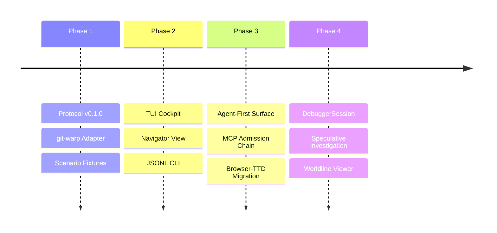

# BEARING

Current direction and active tensions. Historical ship data is in `CHANGELOG.md`.

## Active Gravity

### 1. Agent-Native / Agent-First

- WARP TTD should be the primary way for LLMs to inspect and interact with
  Continuum apps.
- New debugger facts and lawful interactions land first as MCP tools, CLI
  `--json` / JSONL, generated protocol artifacts, or deterministic read models.
- TUI and browser views render those agent-visible facts after the structured
  surface exists; they are not the first proof of a feature.
- The agent surface must keep absence, authority, admission, mutation, and
  evidence posture explicit instead of inferring optimistic runtime truth.

### 2. Dual Live App Debugging

- Making `jedit`, a live Echo app, and `graft`, a live git-warp app, the two
  concrete debugger acceptance targets.
- Proving the same host-neutral session, CLI, and MCP vocabulary can inspect
  both apps without becoming either app's domain model.
- Keeping host-specific richness behind explicit `AdapterCapability` support:
  Echo pressures lawful optic admission and witness posture; git-warp pressures
  causal history, receipts, lanes, and materialized readings.
- Keeping runtime-boundary evidence posture explicit: configured adapters and
  translated substrate facts must not be upgraded into native Continuum
  witnesshood by inference.

### 3. Admission-Chain Read Model

- Treating the landed MCP surface as transport and inspection over
  `DebuggerSession`, host adapter facts, readings, and admission-chain posture.
- Promoting the admission-chain read model as the next protocol target, so
  artifact registration, handles, grant posture, admission tickets, witnesses,
  receipts, and reading envelopes become distinct facts instead of blobs.
- Keeping MCP out of authority issuance, grant construction, runtime admission,
  mutation, and local strand creation.

### 4. Neighborhood & Site Catalog

- Refinement of the `NeighborhoodFocusSummary` to share focus across disparate debugger pages.
- Hardening site-driven worldline cursor recomputation for consistent navigation.

### 5. DebuggerSession Maturity

- Implementation of the `DebuggerSession` investigation object to track speculative result handles and investigator context.
- Scaling the window-based read model to handle high-density causal worldlines.
- Exposing read-only session, worldline, reading, `AdapterCapability`, and
  admission-chain facts before adding speculative lifecycle controls.

### 6. Optic Admission Role Clarity

- Treat Wesley-compiled artifacts and registration descriptors as inputs to the
  admission-chain read model, not as debugger-owned authority.
- Echo owns runtime-local handles, admission, obstruction, access
  instrumentation, witnesses, receipts, and readings.
- Authority layers issue `CapabilityGrant` and `CapabilityPresentation` objects; applications hide
  handles, basis references, and runtime coordinates behind adapters.
- WARP TTD should inspect these facts through protocol/read-model surfaces
  without issuing authority or mutating host state.

### 7. Debugger / Shared-Family Boundary

- WARP TTD owns debugger-native investigation surfaces: sessions, playback,
  frame windows, posture wrappers, pins, summaries, CLI JSONL, and MCP result
  envelopes.
- Continuum, Echo, Wesley, and authority-family artifacts own shared facts such
  as `ReadingEnvelope`, `ObserverPlan`, `OpticRegistrationDescriptor`,
  `CapabilityGrant`, `CapabilityPresentation`, `AdmissionTicket`, and
  `LawWitness`.
- Host substrate details remain adapter residue unless WARP TTD deliberately
  projects them into debugger summaries with visible evidence posture.

## Tensions

- **TUI-Lead Inertia**: Breaking the habit of implementing new inspection
  features in the TUI before the structured CLI/MCP surface.
- **Protocol Drift**: Keeping the Wesley-compiled schema perfectly synchronized
  with local host-adapter implementation details.
- **Speculative Complexity**: Managing the investigator's cognitive load when
  branching and braiding multiple counterfactual strands. Strand work is
  blocked until the debugger can represent the admission-chain facts that make
  fork-like actions lawful instead of local UI mutation.

## Next Target

The product goal is **Dual Live App Debugging**: WARP TTD debugs `jedit`, a
live Echo app, and `graft`, a live git-warp app. The immediate protocol
focus is still the **Admission-Chain Read Model**: protocol and read model
representation for artifact registration, registration descriptors, Echo-owned
handles, grant posture, `CapabilityPresentation` posture, admission tickets,
obstructions, witnesses, receipts, and reading envelopes.

MCP is not authority, admission, grant issuance, or mutation. The read-model
target is
[`docs/design/0024-admission-chain-read-model/admission-chain-read-model.md`](./design/0024-admission-chain-read-model/admission-chain-read-model.md).
The originating backlog remains
[`docs/method/backlog/up-next/PROTO_admission-chain-inspector.md`](./method/backlog/up-next/PROTO_admission-chain-inspector.md)
until the live Echo facts land.
The live app delivery target is
[`docs/method/backlog/up-next/DELIVERY_dual-live-app-debugging.md`](./method/backlog/up-next/DELIVERY_dual-live-app-debugging.md).
The debugger/shared-family boundary packet is
[`docs/design/0026-debugger-native-shared-family-boundary/debugger-native-shared-family-boundary.md`](./design/0026-debugger-native-shared-family-boundary/debugger-native-shared-family-boundary.md).
The landed generated-family ingress seam is now the Manual-backed path for
bringing shared-family payload posture into WARP TTD:
[`docs/manual/001-generated-family-ingress-seam.md`](./manual/001-generated-family-ingress-seam.md),
paired with
[`docs/design/0027-generated-family-ingress-seam/generated-family-ingress-seam.md`](./design/0027-generated-family-ingress-seam/generated-family-ingress-seam.md).
The first host-published family fact path is also Manual-backed:
[`docs/manual/002-host-published-family-facts.md`](./manual/002-host-published-family-facts.md),
paired with
[`docs/design/0028-host-published-family-facts/host-published-family-facts.md`](./design/0028-host-published-family-facts/host-published-family-facts.md).
The live Echo intake path is now Manual-backed:
[`docs/manual/003-live-echo-family-intake.md`](./manual/003-live-echo-family-intake.md),
paired with
[`docs/design/0029-live-echo-family-intake/live-echo-family-intake.md`](./design/0029-live-echo-family-intake/live-echo-family-intake.md).
The generated-family consumption boundary is also Manual-backed:
[`docs/manual/004-generated-family-consumption.md`](./manual/004-generated-family-consumption.md),
paired with
[`docs/design/0030-generated-family-consumption/generated-family-consumption.md`](./design/0030-generated-family-consumption/generated-family-consumption.md).
The first jedit target-session smoke is Manual-backed:
[`docs/manual/005-jedit-echo-smoke.md`](./manual/005-jedit-echo-smoke.md),
paired with
[`docs/design/0031-jedit-echo-smoke/jedit-echo-smoke.md`](./design/0031-jedit-echo-smoke/jedit-echo-smoke.md).
The next pressure is replacing the jedit intake manifest with a real Echo
adapter path for neighborhood, reading, admission, and authority payloads as
those families become available.
The first executable smoke surface is `npm run targets -- --json`, which
reports read-only posture for both live targets without attaching or mutating.
The paired session smoke surface is `npm run target-session -- --json`, which
now reports both jedit obstruction and graft session posture.
The active evidence-posture cycle is
[`docs/design/0021-runtime-boundary-evidence-posture/runtime-boundary-evidence-posture.md`](./design/0021-runtime-boundary-evidence-posture/runtime-boundary-evidence-posture.md).
