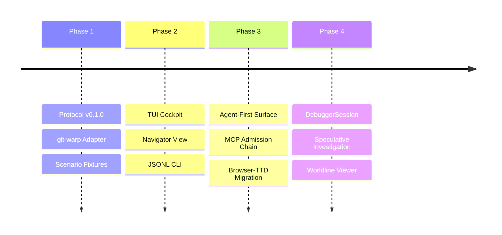

# BEARING

Current direction and active tensions. Historical ship data is in `CHANGELOG.md`.

## Active Gravity

### 1. Agent-Native / Agent-First

- WARP TTD should be the primary way for LLMs to inspect and interact with
  Continuum apps.
- New debugger facts and lawful interactions land first as MCP tools, CLI
  `--json` / JSONL, generated protocol artifacts, or deterministic read models.
- TUI and browser views render those agent-visible facts after the structured
  surface exists; they are not the first proof of a feature.
- The agent surface must keep absence, authority, admission, mutation, and
  evidence posture explicit instead of inferring optimistic runtime truth.

### 2. Dual Live App Debugging

- Making `jedit`, a live Echo app, and `graft`, a live git-warp app, the two
  concrete debugger acceptance targets.
- Proving the same host-neutral session, CLI, and MCP vocabulary can inspect
  both apps without becoming either app's domain model.
- Keeping host-specific richness behind explicit `AdapterCapability` support:
  Echo pressures lawful optic admission and witness posture; git-warp pressures
  causal history, receipts, lanes, and materialized readings.
- Keeping runtime-boundary evidence posture explicit: configured adapters and
  translated substrate facts must not be upgraded into native Continuum
  witnesshood by inference.

### 3. Admission-Chain Read Model

- Treating the landed MCP surface as transport and inspection over
  `DebuggerSession`, host adapter facts, readings, and admission-chain posture.
- Promoting the admission-chain read model as the next protocol target, so
  artifact registration, handles, grant posture, admission tickets, witnesses,
  receipts, and reading envelopes become distinct facts instead of blobs.
- Keeping MCP out of authority issuance, grant construction, runtime admission,
  mutation, and local strand creation.

### 4. Neighborhood & Site Catalog

- Refinement of the `NeighborhoodFocusSummary` to share focus across disparate debugger pages.
- Hardening site-driven worldline cursor recomputation for consistent navigation.

### 5. DebuggerSession Maturity

- Implementation of the `DebuggerSession` investigation object to track speculative result handles and investigator context.
- Scaling the window-based read model to handle high-density causal worldlines.
- Exposing read-only session, worldline, reading, `AdapterCapability`, and
  admission-chain facts before adding speculative lifecycle controls.

## Tensions

- **TUI-Lead Inertia**: Breaking the habit of implementing new inspection
  features in the TUI before the structured CLI/MCP surface.
- **Protocol Drift**: Keeping the Wesley-compiled schema perfectly synchronized
  with local host-adapter implementation details.
- **Speculative Complexity**: Managing the investigator's cognitive load when
  branching and braiding multiple counterfactual strands. Strand work is
  blocked until the debugger can represent the admission-chain facts that make
  fork-like actions lawful instead of local UI mutation.

## Next Target

The product goal is **Dual Live App Debugging**: WARP TTD debugs `jedit`, a
live Echo app, and `graft`, a live git-warp app. The immediate protocol focus
is still the **Admission-Chain Read Model**: protocol and read model
representation for artifact registration, registration descriptors, Echo-owned
handles, grant posture, `CapabilityPresentation` posture, admission tickets,
obstructions, witnesses, receipts, and reading envelopes.

MCP is not authority, admission, grant issuance, or mutation. The read-model
target is
[`docs/design/0024-admission-chain-read-model/admission-chain-read-model.md`](./design/0024-admission-chain-read-model/admission-chain-read-model.md).
The originating backlog remains
[`docs/method/backlog/up-next/PROTO_admission-chain-inspector.md`](./method/backlog/up-next/PROTO_admission-chain-inspector.md)
until the live Echo facts land.
The live app delivery target is
[`docs/method/backlog/up-next/DELIVERY_dual-live-app-debugging.md`](./method/backlog/up-next/DELIVERY_dual-live-app-debugging.md).
The first executable smoke surface is `npm run targets -- --json`, which
reports read-only posture for both live targets without attaching or mutating.
The active evidence-posture cycle is
[`docs/design/0021-runtime-boundary-evidence-posture/runtime-boundary-evidence-posture.md`](./design/0021-runtime-boundary-evidence-posture/runtime-boundary-evidence-posture.md).
