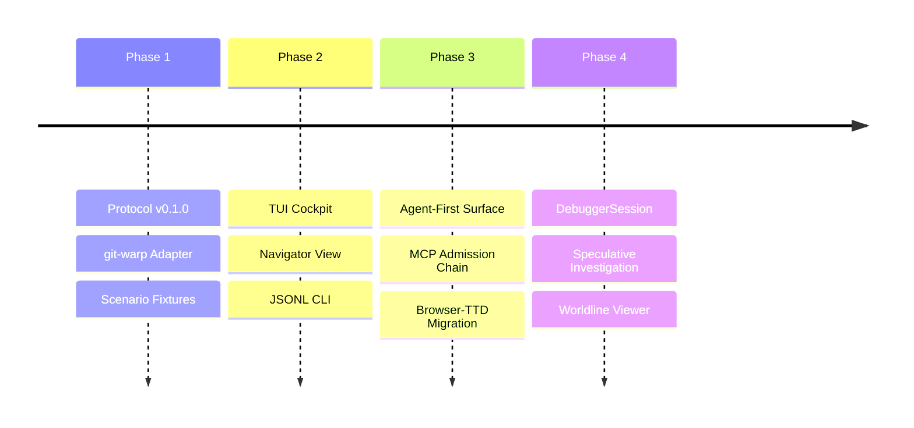

# BEARING

Current direction and active tensions. Historical ship data is in `CHANGELOG.md`.

## Active Gravity

### 1. Admission-Chain Read Model

- Treating the landed MCP surface as transport and inspection over
  `DebuggerSession`, host adapter facts, readings, and admission-chain posture.
- Promoting the admission-chain read model as the next protocol target, so
  artifact registration, handles, grant posture, admission tickets, witnesses,
  receipts, and reading envelopes become distinct facts instead of blobs.
- Keeping MCP out of authority issuance, grant construction, runtime admission,
  mutation, and local strand creation.

### 2. Neighborhood & Site Catalog

- Refinement of the `NeighborhoodFocusSummary` to share focus across disparate debugger pages.
- Hardening site-driven worldline cursor recomputation for consistent navigation.

### 3. DebuggerSession Maturity

- Implementation of the `DebuggerSession` investigation object to track speculative result handles and investigator context.
- Scaling the window-based read model to handle high-density causal worldlines.
- Exposing read-only session, worldline, reading, adapter capability, and
  admission-chain facts before adding speculative lifecycle controls.

## Tensions

- **TUI-Lead Inertia**: Breaking the habit of implementing new inspection
  features in the TUI before the structured CLI/MCP surface.
- **Protocol Drift**: Keeping the Wesley-compiled schema perfectly synchronized
  with local host-adapter implementation details.
- **Speculative Complexity**: Managing the investigator's cognitive load when
  branching and braiding multiple counterfactual strands. Strand work is
  blocked until the debugger can represent the admission-chain facts that make
  fork-like actions lawful instead of local UI mutation.

## Next Target

The immediate focus is the **Admission-Chain Read Model**: protocol and read
model representation for artifact registration, registration descriptors,
Echo-owned handles, grant posture, capability presentations, admission tickets,
obstructions, witnesses, receipts, and reading envelopes.

MCP is not authority, admission, grant issuance, or mutation. The read-model
target is
`docs/method/backlog/up-next/PROTO_admission-chain-inspector.md`
([open backlog](./method/backlog/up-next/PROTO_admission-chain-inspector.md)).
