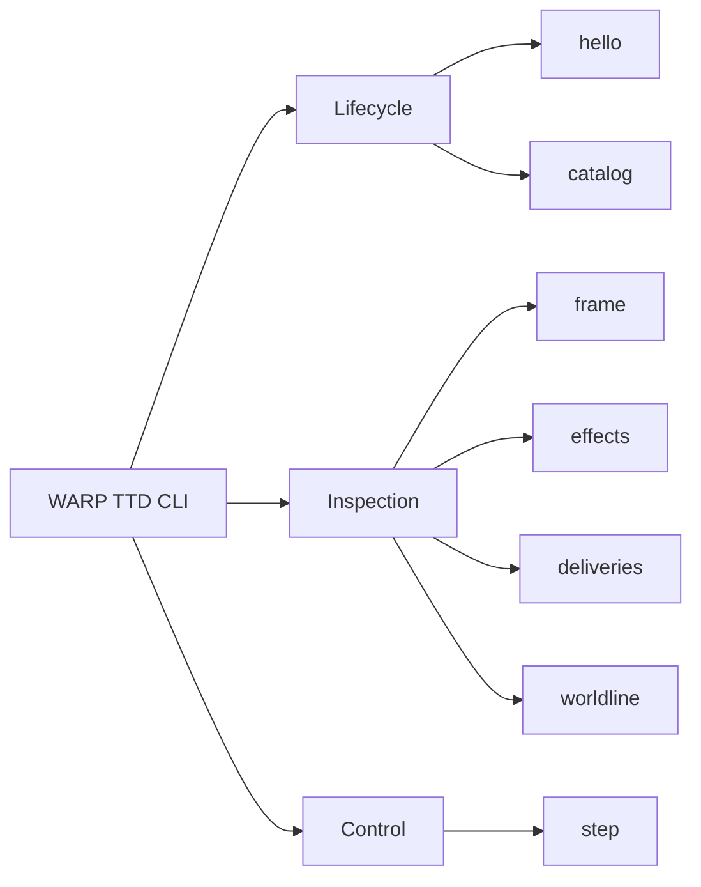

# CLI

The WARP TTD CLI is the canonical agent-facing surface for structured debugger access.



## Agent Contract

For agent use, `--json` is the primary contract. Every command emits a versioned, machine-readable JSONL envelope.

- **Handshake**: Handshake with a host to negotiate capabilities.
  ```bash
  npm run hello -- --json
  ```
- **Inspect**: Read the current playback frame and receipts.
  ```bash
  npm run frame -- --json
  ```
- **Step**: Advance the playback head by one tick.
  ```bash
  npm run step -- --json
  ```

## Relationship to the TUI

The TUI is a delivery adapter over the same `DebuggerSession` core. It follows the explicit capabilities proven by the CLI surface. New inspection logic must land in the CLI before the TUI depends on it.

---
**The goal is structured truth. Human-only text must not appear on stdout in `--json` mode.**
