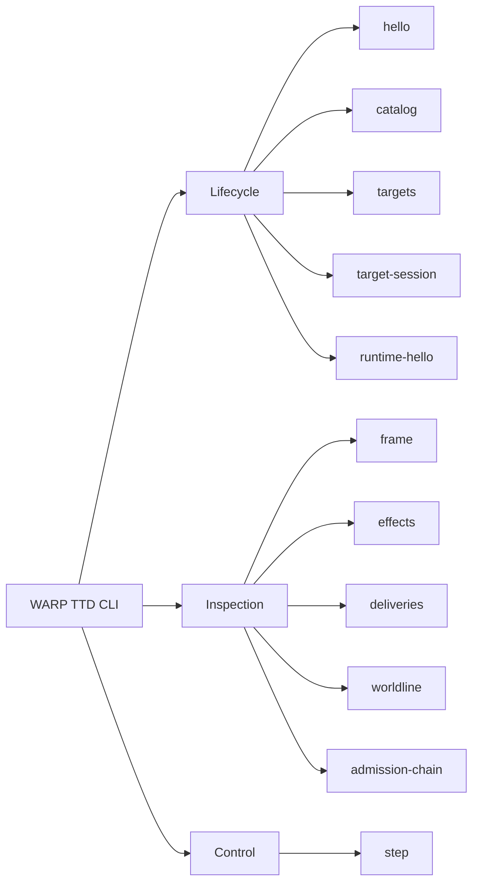

# CLI

The WARP TTD CLI is the canonical shell-native agent surface for structured
debugger access.



## Agent Contract

For agent use, `--json` is the primary contract. Every command emits a versioned, machine-readable JSONL envelope.
MCP is the preferred LLM-facing integration surface, while CLI `--json` remains
the deterministic audit, scripting, and local recovery interface. New debugger
facts should be usable by agents here before they become human-only TUI affordances.

- **Handshake**: Handshake with a host to inspect adapter capabilities.

  ```bash
  npm run hello -- --json
  ```

- **Live Targets**: Inspect configured Continuum-compatible targets without
  attaching, admitting, or mutating.

  ```bash
  npm run targets -- --json
  ```

- **Live Target Session**: Open configured live targets read-only and emit
  session facts when an adapter is available.

  ```bash
  npm run target-session -- --json
  ```

- **Runtime Hello**: Inspect configured Continuum-compatible targets for the
  read-only runtime hello posture.

  ```bash
  npm run runtime-hello -- --json
  ```

- **Inspect**: Read the current playback frame and receipts.

  ```bash
  npm run frame -- --json
  ```

- **Admission Chain**: Read the versioned admission-chain posture model without
  granting, admitting, presenting authority, or mutating.

  ```bash
  npm run admission-chain -- --json
  ```

- **Step**: Advance the playback head by one tick.

  ```bash
  npm run step -- --json
  ```

## Relationship to the TUI

The TUI is a delivery adapter over the same `DebuggerSession` core. It follows the explicit adapter capabilities proven by the CLI surface. New inspection logic must land in the CLI before the TUI depends on it.

## Continuum Target Discovery

`targets --json` reports configured Continuum-compatible debug targets. Target
identity, app label, runtime vendor, and substrate are facts in the output; they
are not WARP TTD app-layer dispatch boundaries.

The default witnesses are:

- `jedit`: local Echo-compatible witness.
- `graft`: local git-warp-compatible witness.

The command is read-only. It reports target-root posture, adapter readiness, and
runtime-boundary evidence posture; it does not open a runtime, issue authority,
admit invocations, create strands, or mutate any target. Missing
admission-chain facts are reported as unavailable instead of inferred.

Each target includes descriptor-derived fields:

- `target`
- `targetLabel`
- `connectionMode`
- `appKind`
- `rootPosture`
- `adapterPosture`
- `capabilities`
- `runtimeBoundaryEvidence`

For `jedit`, the command also reports `echoAdapterProbe`, a read-only probe of
the root-local Echo adapter descriptor:

```text
<jedit root>/.warp-ttd/echo-adapter-probe.json
```

The probe distinguishes a missing root, absent bridge, supported bridge,
unsupported ABI, and obstructed descriptor. A supported bridge changes
`adapterPosture` to `CONFIGURED`, but it does not open an Echo session,
perform admission, issue authority, or mutate `jedit`.

`runtimeBoundaryEvidence` is a nested fact:

```ts
{
  posture: "UNAVAILABLE" | "TRANSLATED_SUBSTRATE" | "CONTINUUM_NATIVE";
  nativeContinuumWitness: boolean;
  substrate?: string;
  evidenceKind?: string;
}
```

`graft` currently reports `TRANSLATED_SUBSTRATE` with
`nativeContinuumWitness: false` because git-warp adapter facts are not native
Continuum witnesshood. `jedit` reports `UNAVAILABLE` until Echo/jedit publish
native Continuum runtime-boundary evidence.

By default, the command looks for sibling checkouts at `../jedit` and
`../graft`. Override those paths with:

```bash
WARP_TTD_JEDIT_ROOT=/path/to/jedit \
WARP_TTD_GRAFT_ROOT=/path/to/graft \
  npm run targets -- --json
```

For early descriptor-driven integration and tests, replace the default target
list with `WARP_TTD_TARGETS_JSON`:

```bash
WARP_TTD_TARGETS_JSON='[
  {
    "id": "vendor-demo",
    "label": "Vendor demo runtime",
    "appKind": "Continuum-compatible app",
    "connection": {
      "mode": "descriptor-only",
      "reason": "Vendor runtime handshake is not implemented in this slice."
    }
  }
]' npm run targets -- --json
```

`descriptor-only` targets are reported as registered but unsupported for runtime
handshake inspection in this slice. Unknown connection modes become visible
`descriptor-only` records with `adapterPosture: "UNSUPPORTED"`. Malformed
entries and duplicate ids become visible `descriptor-only` records with
`adapterPosture: "OBSTRUCTED"` and a reason string. Env-configured `git-warp`
descriptors must include `graphName`; otherwise they are obstructed instead of
borrowing the default graft graph name.

`target-session --json` keeps the same read-only boundary but opens configured
targets through their adapter when possible. The first supported live session
is the default `graft` witness, using the `graft-ast` git-warp graph. If the
root is missing, the graph cannot be opened, or the descriptor has no runtime
handshake yet, the command emits `sessionPosture: "OBSTRUCTED"` with a reason
instead of mutating or inferring facts.

For `jedit`, `target-session --json` includes the same `echoAdapterProbe` and
`sessionFamilyIntake` objects, but still reports `sessionPosture:
"OBSTRUCTED"` until the Echo host adapter session path exists.

## Continuum Runtime Hello

`runtime-hello --json` reports `ContinuumRuntimeHelloInspection` envelopes for
the same configured target list as `targets --json`. It is read-only and does
not open a runtime control channel, issue authority, admit runtime work,
present credentials, create strands, or mutate host state.

Each inspection includes:

- `schemaVersion`
- `target`
- `targetLabel`
- `connectionMode`
- `hostKind`
- `appKind`
- `readOnly`
- `helloPosture`
- `evidencePosture`
- `nativeContinuumWitness`
- `hello`, when a compatibility hello payload is present
- `reason`, when the hello is absent, unsupported, obstructed, rights-limited,
  or redacted
- `reasons`
- `retryHint`, when a deterministic next action exists

`helloPosture` uses the vendor-neutral posture set:

```ts
"PRESENT" | "ABSENT" | "UNAVAILABLE" | "UNSUPPORTED" | "OBSTRUCTED" | "RIGHTS_LIMITED" | "REDACTED"
```

`evidencePosture` separates compatibility from native witnesshood:

```ts
"CONTINUUM_NATIVE" | "TRANSLATED_SUBSTRATE" | "LOCAL_MIRROR_FALLBACK" | "UNAVAILABLE"
```

The default `graft` witness currently reports `helloPosture: "PRESENT"` with a
hand-authored `continuum.debug.hello.v1` compatibility payload projected from
git-warp adapter facts. That payload keeps `nativeContinuumWitness: false` and
`evidencePosture: "TRANSLATED_SUBSTRATE"`.

The default `jedit` witness currently reports `helloPosture: "ABSENT"` because
Echo has not published a native runtime hello producer yet. Descriptor-only
targets report `UNSUPPORTED` unless their descriptor is malformed or unsafe, in
which case they report `OBSTRUCTED` with the descriptor reason.

---
**The goal is structured truth. Human-only text must not appear on stdout in `--json` mode.**
