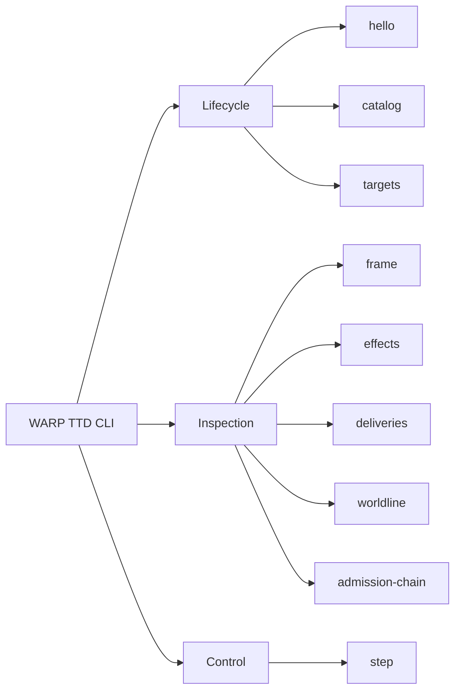

# CLI

The WARP TTD CLI is the canonical shell-native agent surface for structured
debugger access.



## Agent Contract

For agent use, `--json` is the primary contract. Every command emits a versioned, machine-readable JSONL envelope.
MCP is the preferred LLM-facing integration surface, while CLI `--json` remains
the deterministic audit, scripting, and local recovery interface. New debugger
facts should be usable by agents here before they become human-only TUI affordances.

- **Handshake**: Handshake with a host to inspect adapter capabilities.
  ```bash
  npm run hello -- --json
  ```
- **Live Targets**: Inspect the named live app targets without attaching,
  admitting, or mutating.
  ```bash
  npm run targets -- --json
  ```
- **Inspect**: Read the current playback frame and receipts.
  ```bash
  npm run frame -- --json
  ```
- **Admission Chain**: Read the versioned admission-chain posture model without
  granting, admitting, presenting authority, or mutating.
  ```bash
  npm run admission-chain -- --json
  ```
- **Step**: Advance the playback head by one tick.
  ```bash
  npm run step -- --json
  ```

## Relationship to the TUI

The TUI is a delivery adapter over the same `DebuggerSession` core. It follows the explicit adapter capabilities proven by the CLI surface. New inspection logic must land in the CLI before the TUI depends on it.

## Live Target Discovery

`targets --json` reports the two current live app targets:

- `jedit`: live Echo app.
- `graft`: live git-warp app.

The command is read-only. It reports target-root posture, adapter readiness, and
runtime-boundary evidence posture; it does not open a runtime, issue authority,
admit invocations, create strands, or mutate either app. Missing
admission-chain facts are reported as unavailable instead of inferred.

`runtimeBoundaryEvidence` is a nested fact:

```ts
{
  posture: "UNAVAILABLE" | "TRANSLATED_SUBSTRATE" | "CONTINUUM_NATIVE";
  nativeContinuumWitness: boolean;
  substrate?: string;
  evidenceKind?: string;
}
```

`graft` currently reports `TRANSLATED_SUBSTRATE` with
`nativeContinuumWitness: false` because git-warp adapter facts are not native
Continuum witnesshood. `jedit` reports `UNAVAILABLE` until Echo/jedit publish
native Continuum runtime-boundary evidence.

By default, the command looks for sibling checkouts at `../jedit` and
`../graft`. Override those paths with:

```bash
WARP_TTD_JEDIT_ROOT=/path/to/jedit \
WARP_TTD_GRAFT_ROOT=/path/to/graft \
  npm run targets -- --json
```

---
**The goal is structured truth. Human-only text must not appear on stdout in `--json` mode.**
