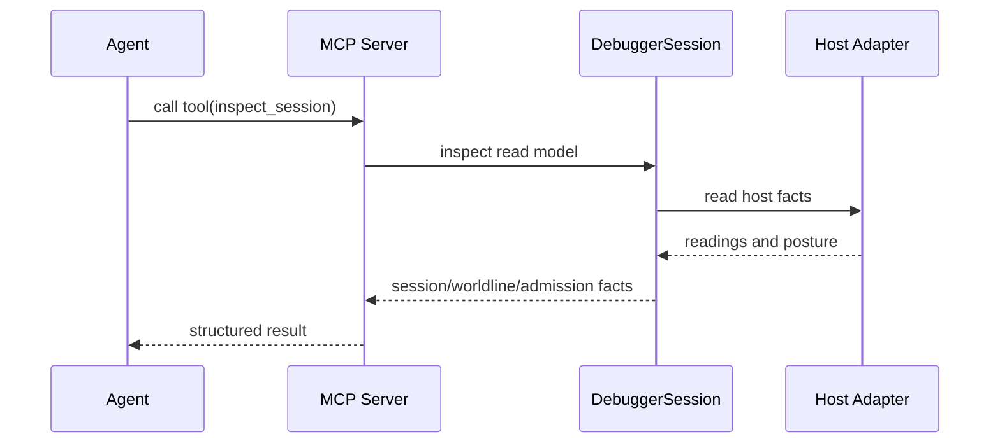

# MCP

> **Status: planned.** This surface is not yet implemented. See [backlog item](./method/backlog/asap/DELIVERY_mcp-admission-chain-surface.md).

WARP TTD is a tool-native participant in the agentic workstation via the Model
Context Protocol (MCP).

## Scope

The MCP surface exposes structured debugger facts as tools. It is a thin,
read-only projection over the `DebuggerSession`, the host adapter boundary, and
the host-neutral protocol bedrock.

MCP is transport and inspection. It does not issue authority, construct grants,
perform admission, mutate host state, or create local strands.

## Tool Groups

- **Inspection**: `hello`, `session`, `catalog`, `frame`, `worldline`,
  `effects`, `deliveries`, `readings`.
- **Capabilities**: adapter support reported as `AdapterCapability` facts.
- **Admission Chain**: registered artifact facts, requirement posture, grant
  posture, admission ticket or obstruction posture, witness facts, receipt
  facts, and reading envelope facts when present.

## Design Rules

- **Shared Core**: MCP must reuse the `DebuggerSession` logic. No second
  debugger stack.
- **Ontology Parity**: Use the same worldline, provenance, receipt, reading,
  and admission-chain nouns as the CLI and authored schema.
- **Machine-Readable**: Every result must be parseable by an agent without
  ad-hoc TUI formatting.
- **Read-Only First**: Initial MCP work exposes absent, present, and obstructed
  facts. It does not add strand creation, grant issuance, admission, or
  mutation paths.

---
**The goal is tool-native inspection. TUI work follows explicit MCP capability,
not the other way around.**
