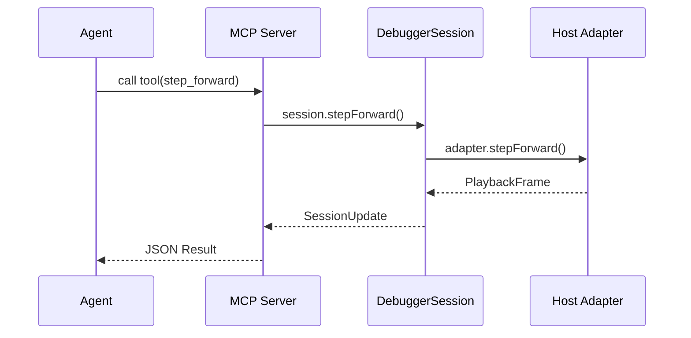

# MCP

> **Status: planned.** This surface is not yet implemented. See [backlog item](./method/backlog/up-next/DELIVERY_mcp-agent-surface.md).

WARP TTD is a tool-native participant in the agentic workstation via the Model Context Protocol (MCP).

## Scope

The MCP surface exposes structured debugger operations as tools. It is a thin projection over the `DebuggerSession` and the host-neutral protocol bedrock.

## Tool Groups

- **Inspection**: `hello`, `catalog`, `frame`, `worldline`, `effects`, `deliveries`.
- **Control**: `step_forward`, `step_backward`, `seek_to_frame`.
- **Context**: `session`, `context`.

## Design Rules

- **Shared Core**: MCP must reuse the `DebuggerSession` logic. No second debugger stack.
- **Ontology Parity**: Use the same worldline/provenance/receipt nouns as the CLI.
- **Machine-Readable**: Every result must be parseable by an agent without ad-hoc TUI formatting.

---
**The goal is tool-native debugging. TUI work follows explicit MCP capability, not the other way around.**
