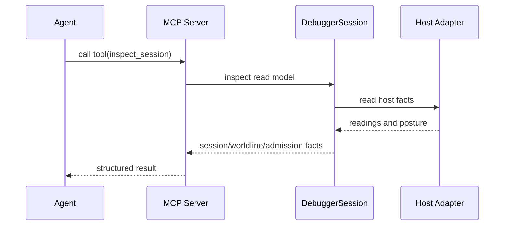

# MCP

> **Status: initial read-only stdio surface implemented.** See
> [cycle 0019](./design/0019-mcp-admission-chain-surface/mcp-admission-chain-surface.md)
> and [completed backlog item](./method/graveyard/DELIVERY_mcp-admission-chain-surface.md).
> Agent parity is designed in
> [cycle 0022](./design/0022-mcp-agent-parity/mcp-agent-parity.md).

WARP TTD is a tool-native participant in the agentic workstation via the Model
Context Protocol (MCP).

## Agent-Native Contract

MCP is the preferred LLM-facing interface for WARP TTD inspection of Continuum
apps, and it is the first place new structured debugger facts should become
available. CLI `--json` remains the deterministic shell and audit surface; TUI
and browser views are downstream renderers over the same facts.

TUI and browser views must not be the first or only implementation of a debugger
feature. If an LLM agent cannot inspect the feature without screen-scraping
human UI output, the feature is incomplete.

Interaction through MCP must still be lawful: read-only inspection remains the
default, and any future control path must be explicit about authority,
admission, mutation, ticketing, witnesses, receipts, and reading posture.



## Scope

The MCP surface exposes structured debugger facts as tools. It is a thin,
read-only projection over the `DebuggerSession`, the host adapter boundary, and
the host-neutral protocol bedrock.

MCP is transport and inspection. It does not issue authority, construct grants,
perform admission, mutate host state, or create local strands.

## Tool Groups

- **Inspection**: `warp_ttd.inspect_session`,
  `warp_ttd.inspect_adapter_capabilities`, `warp_ttd.inspect_readings`, and
  `warp_ttd.inspect_live_targets`, and `warp_ttd.inspect_runtime_hello`.
- **Capabilities**: adapter support reported as `AdapterCapability` facts.
- **Admission Chain**: `warp_ttd.inspect_admission_chain` reports registered
  artifact facts, requirement posture, grant posture, admission ticket or
  obstruction posture, witness facts, receipt facts, and reading envelope facts
  when present.
- **Live Targets**: `warp_ttd.inspect_live_targets` reports the same read-only
  descriptor-backed target posture as `targets --json`, including target id,
  target label, connection mode, capabilities, and runtime-boundary evidence
  posture. The default `jedit` witness also reports `echoAdapterProbe`, which
  distinguishes missing root, absent bridge, supported bridge, unsupported ABI,
  and obstructed descriptor. Adapter readiness is not upgraded into Continuum
  evidence availability or an open runtime session. Descriptor-only targets are
  reported as registered but unsupported for runtime handshake inspection in
  this slice. Unknown connection modes, malformed entries, and duplicate ids
  stay visible as unsupported or obstructed descriptor-only target records.
- **Runtime Hello**: `warp_ttd.inspect_runtime_hello` reports the same
  `ContinuumRuntimeHelloInspection` read model as `runtime-hello --json`.
  Agents get target id, connection mode, hello posture, evidence posture,
  native witnesshood, structured reasons, retry hints, and a
  `continuum.debug.hello.v1` payload when present. `graft` is currently a
  translated-substrate compatibility hello with `nativeContinuumWitness: false`;
  `jedit` is explicit `ABSENT` until Echo publishes a native runtime hello
  producer.

## Running

```bash
npm run mcp
```

The initial server uses stdio transport and the fixture-backed host adapter. It
is intentionally read-only.

## Design Rules

- **Shared Core**: MCP must reuse the `DebuggerSession` logic. No second
  debugger stack.
- **Ontology Parity**: Use the same worldline, provenance, receipt, reading,
  and admission-chain nouns as the CLI and authored schema.
- **Machine-Readable**: Every result must be parseable by an agent without
  ad-hoc TUI formatting.
- **Read-Only First**: Initial MCP work exposes absent, present, and obstructed
  facts. It does not add strand creation, grant issuance, admission, or
  mutation paths.
- **Honest Absence**: Missing Echo/Wesley admission-chain facts are returned as
  explicit `ABSENT` posture until host adapters provide them.
- **Evidence Honesty**: Translated substrate evidence is not native Continuum
  witnesshood. A tool must not report `CONTINUUM_NATIVE` unless
  `nativeContinuumWitness` is true.
- **Target Generality**: App names, runtime vendor names, and substrate names
  are reported facts, not MCP tool dispatch boundaries. Agents should inspect
  target capabilities and posture rather than infer compatibility from labels.

---
**The goal is tool-native inspection. TUI work follows the explicit MCP
structured surface, not the other way around.**
