# WARP TTD Technical Teardown

Date: 2026-05-25

This document explains WARP TTD from the point where execution begins, then
works outward through the main successful paths. It assumes no prior knowledge
of WARP TTD, WARP, causal runtimes, the Model Context Protocol, or the internal
codebase.

## 1. Orientation

WARP TTD is a time-travel debugger for systems that can describe their history
as causal facts. Instead of only inspecting "the current value" of a program, it
inspects how that value came to exist: lanes, frames, ticks, receipts, effects,
delivery observations, and evidence posture.

The repository is intentionally agent-first. Its most important surfaces are
structured CLI JSONL and MCP tool results. The terminal UI is a human renderer
over the same session and adapter concepts, not a separate source of debugger
truth.

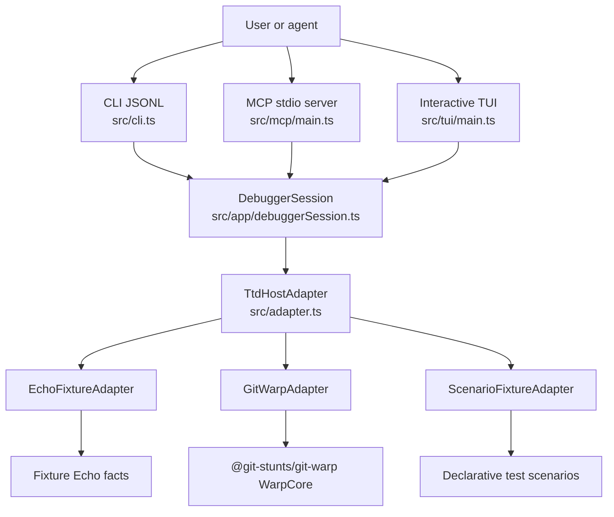
```mermaid
flowchart TD
    User["User or agent"] --> CLI["CLI JSONL<br/>src/cli.ts"]
    User --> MCP["MCP stdio server<br/>src/mcp/main.ts"]
    User --> TUI["Interactive TUI<br/>src/tui/main.ts"]

    CLI --> Session["DebuggerSession<br/>src/app/debuggerSession.ts"]
    MCP --> Session
    TUI --> Session

    Session --> Port["TtdHostAdapter<br/>src/adapter.ts"]
    Port --> EchoFixture["EchoFixtureAdapter"]
    Port --> GitWarp["GitWarpAdapter"]
    Port --> Scenario["ScenarioFixtureAdapter"]

    EchoFixture --> EchoFacts["Fixture Echo facts"]
    GitWarp --> WarpCore["@git-stunts/git-warp WarpCore"]
    Scenario --> Declarative["Declarative test scenarios"]
```

## 2. Basic Concepts

Before tracing execution, the core vocabulary needs to be established.

| Concept | Meaning in this codebase |
| :--- | :--- |
| Host | The system being debugged. Current host kinds are `ECHO` and `GIT_WARP`. |
| Adapter | A bridge that converts host-specific facts into WARP TTD protocol facts. |
| Lane | A visible causal path. A lane can be a canonical `WORLDLINE` or a speculative `STRAND`. |
| Worldline | The durable causal chain being observed. |
| Strand | A speculative or child lane rooted in a worldline. |
| Tick | A non-negative causal coordinate. git-warp uses Lamport ticks. |
| Frame | The debugger's view of all relevant lanes at one playback index. |
| Playback head | A movable debugger cursor over frames. |
| Receipt | Evidence that a writer attempted rewrites and that some were admitted, rejected, or counterfactual. |
| Effect emission | An outbound effect candidate produced by the host. |
| Delivery observation | What happened to an effect candidate at a sink: delivered, suppressed, failed, or skipped. |
| Execution context | Whether the session is live, replay, or debug inspection. |
| Generated-family fact | A wrapper that says whether an external semantic payload is present, absent, or obstructed, and who owns it. |
| Admission chain | A read model that lists the facts needed for lawful invocation: basis, registration, handles, grants, tickets, witnesses, receipts, and readings. |

The simplest mental model is this:

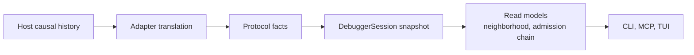
```mermaid
flowchart LR
    History["Host causal history"] --> Adapter["Adapter translation"]
    Adapter --> Protocol["Protocol facts"]
    Protocol --> Session["DebuggerSession snapshot"]
    Session --> ReadModels["Read models<br/>neighborhood, admission chain"]
    ReadModels --> Surfaces["CLI, MCP, TUI"]
```

The key design choice is that WARP TTD does not silently claim ownership of all
facts it displays. A debugger-native fact, a Continuum/Echo shared-family fact,
and a git-warp substrate fact are all labeled differently.

## 3. Exact Entry Points

The runnable entry points are declared in `package.json`. Node runs TypeScript
directly with `--experimental-strip-types`.

| Command | Entry file | Purpose |
| :--- | :--- | :--- |
| `npm run hello -- --json` | `src/cli.ts` | CLI handshake |
| `npm run frame -- --json` | `src/cli.ts` | CLI frame inspection |
| `npm run admission-chain -- --json` | `src/cli.ts` | CLI admission-chain inspection |
| `npm run targets -- --json` | `src/cli.ts` | CLI live target posture |
| `npm run target-session -- --json` | `src/cli.ts` | CLI live session inspection |
| `npm run tui` | `src/tui/main.ts` | Human terminal debugger |
| `npm run mcp` | `src/mcp/main.ts` | Agent MCP server |

The primary agent-first entry point is `src/cli.ts`, so the teardown starts
there.

## 4. CLI Entry Point: `src/cli.ts`

The file ends with a top-level `try` block:

```ts
try {
  await main();
} catch (err) {
  ...
  process.exitCode = 1;
}
```

That is the exact execution point for commands such as:

```bash
npm run frame -- --json
```

The top-level flow is:

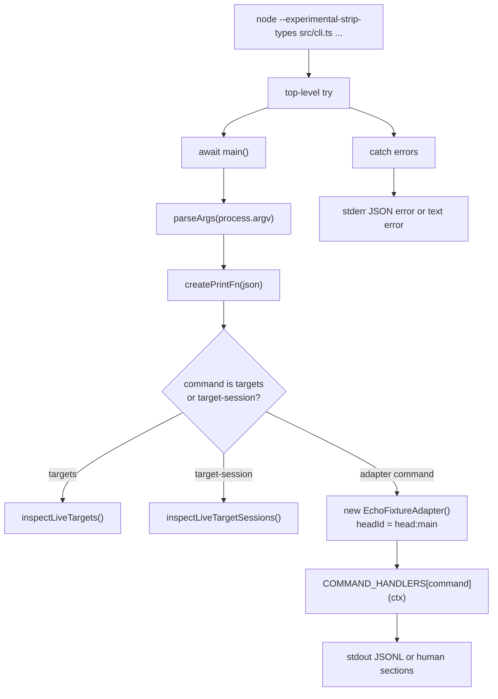
```mermaid
flowchart TD
    Start["node --experimental-strip-types src/cli.ts ..."] --> Try["top-level try"]
    Try --> Main["await main()"]
    Main --> Parse["parseArgs(process.argv)"]
    Parse --> Print["createPrintFn(json)"]
    Print --> TargetDecision{"command is targets<br/>or target-session?"}
    TargetDecision -->|targets| Targets["inspectLiveTargets()"]
    TargetDecision -->|target-session| TargetSession["inspectLiveTargetSessions()"]
    TargetDecision -->|adapter command| FixtureCtx["new EchoFixtureAdapter()<br/>headId = head:main"]
    FixtureCtx --> Handler["COMMAND_HANDLERS[command](ctx)"]
    Handler --> Done["stdout JSONL or human sections"]
    Try --> Catch["catch errors"]
    Catch --> Stderr["stderr JSON error or text error"]
```

### 4.1 Argument Parsing

`parseArgs(argv)` is intentionally small and strict.

It:

1. Drops `node` and script path using `argv.slice(2)`.
2. Checks whether `--json` appears.
3. Treats non-flag arguments as positional command names.
4. Rejects any flag other than `--json`.
5. Rejects more than one positional command.
6. Defaults to `demo` when no command is supplied.
7. Validates the command against `VALID_COMMANDS`.

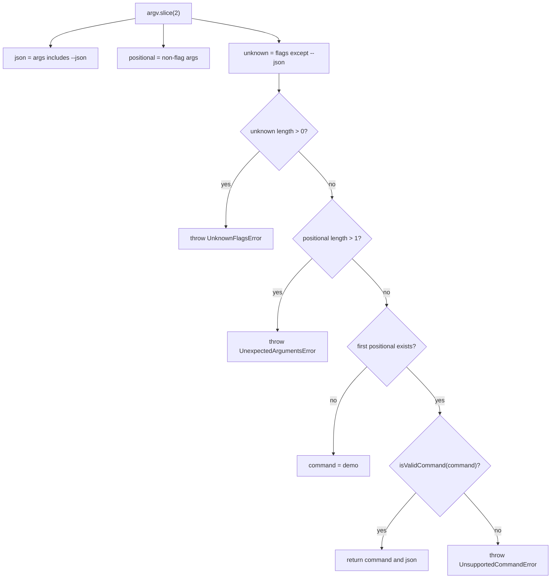
```mermaid
flowchart TD
    Args["argv.slice(2)"] --> Json["json = args includes --json"]
    Args --> Positional["positional = non-flag args"]
    Args --> Unknown["unknown = flags except --json"]
    Unknown --> HasUnknown{"unknown length > 0?"}
    HasUnknown -->|yes| UnknownError["throw UnknownFlagsError"]
    HasUnknown -->|no| PosCount{"positional length > 1?"}
    PosCount -->|yes| Unexpected["throw UnexpectedArgumentsError"]
    PosCount -->|no| Command{"first positional exists?"}
    Command -->|no| Demo["command = demo"]
    Command -->|yes| Valid{"isValidCommand(command)?"}
    Valid -->|yes| Return["return command and json"]
    Valid -->|no| Unsupported["throw UnsupportedCommandError"]
```

This matters because `--json` is a contract surface. The tests assert that JSON
mode does not leak human-readable text to stdout.

### 4.2 Output Envelopes

The CLI has two output modes:

| Mode | Function | Shape |
| :--- | :--- | :--- |
| Human | `printSection()` | Markdown-ish section header plus pretty JSON |
| Agent JSONL | `printJsonl()` | One JSON object per line |

In JSONL mode, each line is shaped as:

```json
{"envelope":"HostHello","data":{...}}
```

When an event needs an extra semantic label, it becomes:

```json
{"envelope":"PlaybackHeadSnapshot","data":{...},"label":"before"}
```

This envelope design is small but important. It lets agents stream and parse
heterogeneous debugger facts without guessing which TypeScript type a JSON
object represents.

## 5. Golden Path A: `hello --json`

The simplest successful path is the host handshake.

```bash
npm run hello -- --json
```

Execution path:

1. `main()` parses `command = "hello"` and `json = true`.
2. It creates `EchoFixtureAdapter`.
3. It sets `headId` to `head:main`.
4. It calls `handleHello(ctx)`.
5. `handleHello` awaits `ctx.adapter.hello()`.
6. The returned `HostHello` is printed as one JSONL envelope.

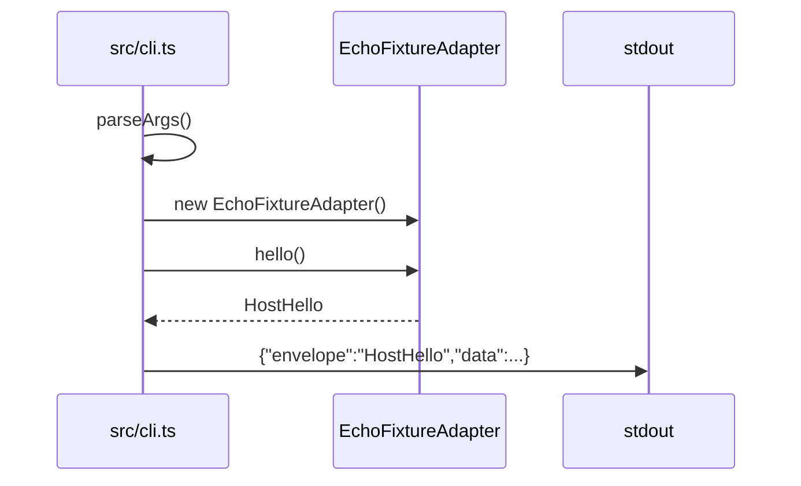
```mermaid
sequenceDiagram
    participant CLI as src/cli.ts
    participant Adapter as EchoFixtureAdapter
    participant Out as stdout

    CLI->>CLI: parseArgs()
    CLI->>Adapter: new EchoFixtureAdapter()
    CLI->>Adapter: hello()
    Adapter-->>CLI: HostHello
    CLI->>Out: {"envelope":"HostHello","data":...}
```

The fixture handshake declares:

- `hostKind: "ECHO"`
- `hostVersion: "0.0.0-fixture"`
- `protocolVersion: "0.7.0"`
- `schemaId: "ttd-protocol-fixture-v1"`
- capabilities such as `READ_FRAME`, `READ_RECEIPTS`,
  `READ_EFFECT_EMISSIONS`, `READ_SESSION_FAMILY_FACTS`, and playback controls.

The capability list is not ornamental. `DebuggerSession` later uses it to
decide which adapter methods may be called.

## 6. Golden Path B: `frame --json`

The frame command inspects the current playback location.

```bash
npm run frame -- --json
```

Execution path:

1. `main()` builds the fixture context.
2. `COMMAND_HANDLERS.frame` resolves to `handleFrame`.
3. `handleFrame` prints the playback head.
4. `handleFrame` prints the current frame.
5. `handleFrame` prints any receipts at that frame.

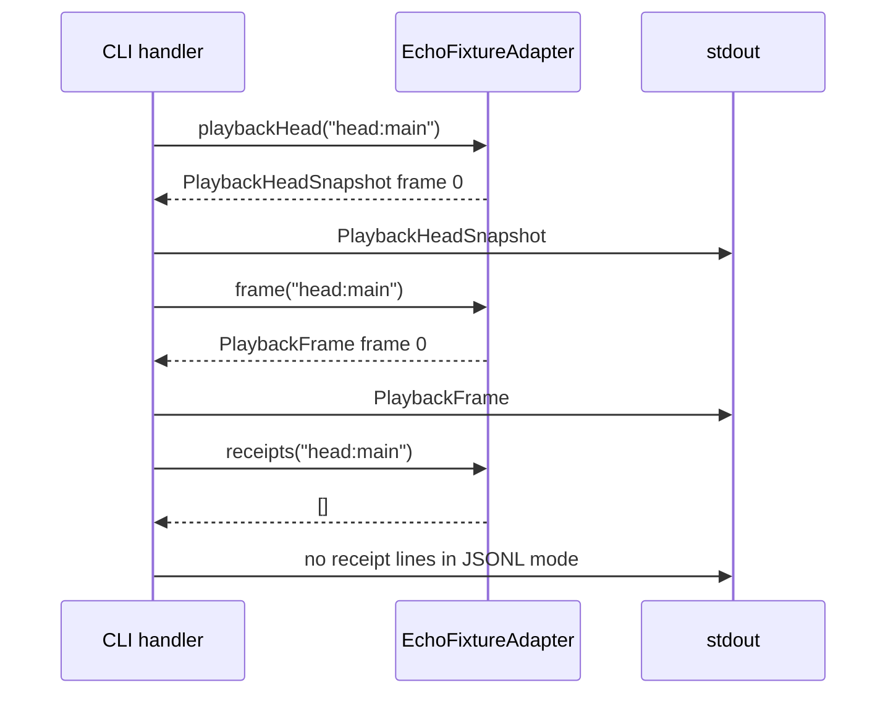
```mermaid
sequenceDiagram
    participant CLI as CLI handler
    participant Adapter as EchoFixtureAdapter
    participant Out as stdout

    CLI->>Adapter: playbackHead("head:main")
    Adapter-->>CLI: PlaybackHeadSnapshot frame 0
    CLI->>Out: PlaybackHeadSnapshot

    CLI->>Adapter: frame("head:main")
    Adapter-->>CLI: PlaybackFrame frame 0
    CLI->>Out: PlaybackFrame

    CLI->>Adapter: receipts("head:main")
    Adapter-->>CLI: []
    CLI->>Out: no receipt lines in JSONL mode
```

At startup, the Echo fixture head is at frame `0`, so receipts are empty. Frame
`0` is the genesis-like view: lanes exist, but no rewrite has advanced the
history yet.

### 6.1 The Fixture Data

`EchoFixtureAdapter` contains static protocol facts plus one mutable part: a
private `#heads` map. The static fixture has:

- two lanes:
  - `wl:main`, a canonical `WORLDLINE`
  - `ws:sandbox`, a writable `STRAND` whose parent is `wl:main`
- one playback head:
  - `head:main`
- three frames:
  - frame `0`: both lanes at tick `0`
  - frame `1`: `wl:main` advances to tick `1`
  - frame `2`: `ws:sandbox` advances to tick `1`
- receipts:
  - frame `1`: canonical worldline receipt
  - frame `2`: sandbox receipt with rejection and counterfactual
- effect emissions and delivery observations:
  - frame `1`: diagnostic effect delivered to local sinks
  - frame `2`: notification effect, with network delivery suppressed in replay

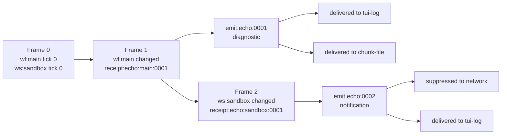
```mermaid
flowchart LR
    F0["Frame 0<br/>wl:main tick 0<br/>ws:sandbox tick 0"] --> F1["Frame 1<br/>wl:main changed<br/>receipt:echo:main:0001"]
    F1 --> F2["Frame 2<br/>ws:sandbox changed<br/>receipt:echo:sandbox:0001"]

    F1 --> E1["emit:echo:0001<br/>diagnostic"]
    E1 --> D1["delivered to tui-log"]
    E1 --> D2["delivered to chunk-file"]

    F2 --> E2["emit:echo:0002<br/>notification"]
    E2 --> D3["suppressed to network"]
    E2 --> D4["delivered to tui-log"]
```

Every getter clones data with `structuredClone`. That prevents callers from
mutating fixture internals accidentally.

## 7. Golden Path C: `step --json`

The step command is the first path that mutates debugger playback state. It
does not mutate the host application. It moves the playback head inside the
adapter.

```bash
npm run step -- --json
```

Execution path in JSON mode:

1. Print `PlaybackHeadSnapshot` with label `before`.
2. Call `adapter.stepForward(headId)`.
3. Print returned `PlaybackFrame` with label `stepped`.
4. Print `PlaybackHeadSnapshot` with label `after`.
5. Print receipts at the new head position.

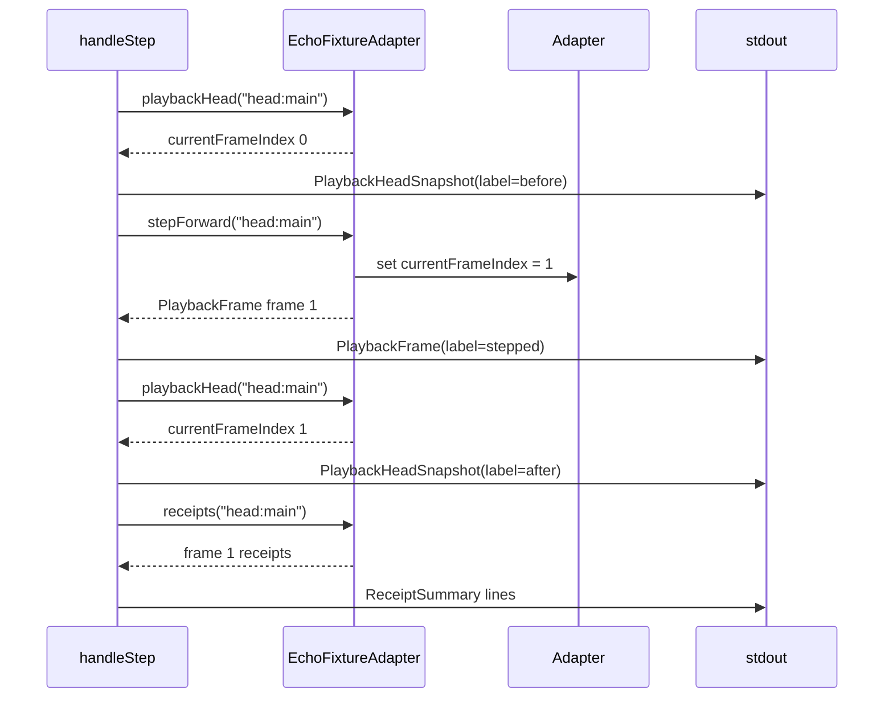
```mermaid
sequenceDiagram
    participant CLI as handleStep
    participant Adapter as EchoFixtureAdapter
    participant Head as Adapter #heads map
    participant Out as stdout

    CLI->>Adapter: playbackHead("head:main")
    Adapter-->>CLI: currentFrameIndex 0
    CLI->>Out: PlaybackHeadSnapshot(label=before)

    CLI->>Adapter: stepForward("head:main")
    Adapter->>Head: set currentFrameIndex = 1
    Adapter-->>CLI: PlaybackFrame frame 1
    CLI->>Out: PlaybackFrame(label=stepped)

    CLI->>Adapter: playbackHead("head:main")
    Adapter-->>CLI: currentFrameIndex 1
    CLI->>Out: PlaybackHeadSnapshot(label=after)

    CLI->>Adapter: receipts("head:main")
    Adapter-->>CLI: frame 1 receipts
    CLI->>Out: ReceiptSummary lines
```

In `EchoFixtureAdapter.stepForward`, the new frame index is clamped:

```ts
const nextIndex = Math.min(head.currentFrameIndex + 1, frames.length - 1);
```

So stepping past the end keeps the head at the final frame. `stepBackward` does
the symmetric clamp at `0`. `seekToFrame` clamps to `[0, frames.length - 1]`.

The design implication is deliberate: playback controls are total and stable for
the fixture. Invalid frame lookup still throws `FrameResolutionError`, but
normal controls do not create out-of-range state.

## 8. The Protocol Boundary

The authored protocol source is `schemas/warp-ttd-protocol.graphql`.
`src/protocol.ts` is a local mirror for application code, not the sovereign
contract.

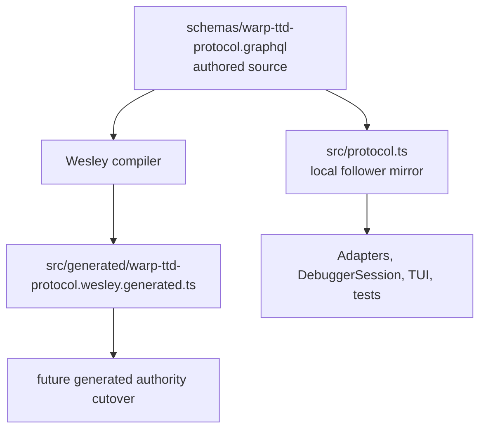
```mermaid
flowchart TD
    Schema["schemas/warp-ttd-protocol.graphql<br/>authored source"] --> Wesley["Wesley compiler"]
    Wesley --> Generated["src/generated/warp-ttd-protocol.wesley.generated.ts"]
    Schema --> Mirror["src/protocol.ts<br/>local follower mirror"]
    Mirror --> App["Adapters, DebuggerSession, TUI, tests"]
    Generated --> Future["future generated authority cutover"]
```

The schema defines:

- host identity: `HostKind`, `HostHello`
- lane catalog: `LaneRef`, `LaneCatalog`
- playback: `Coordinate`, `PlaybackHeadSnapshot`, `LaneFrameView`,
  `PlaybackFrame`
- evidence: `WriterRef`, `ReceiptSummary`
- effects: `EffectEmissionSummary`, `DeliveryObservationSummary`,
  `ExecutionContext`
- adapter capabilities
- readonly query operations
- playback control mutations
- invariants such as non-negative ticks and delivery observations linking to
  emissions

The current protocol version is `0.7.0`, which adds read-only session family
fact support through `READ_SESSION_FAMILY_FACTS`.

### 8.1 Core Type Relationships

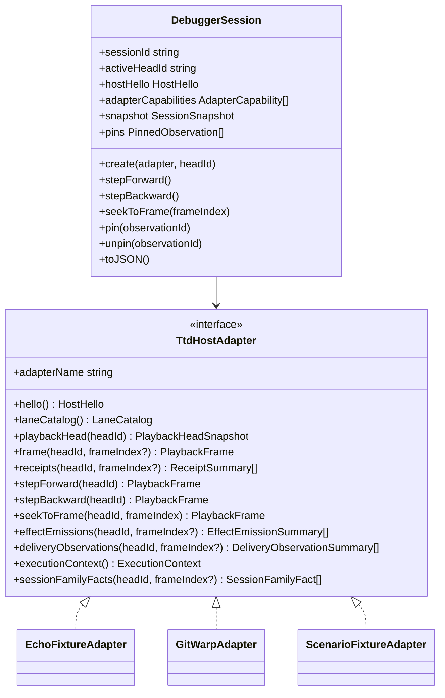
```mermaid
classDiagram
    class TtdHostAdapter {
      <<interface>>
      +adapterName string
      +hello() HostHello
      +laneCatalog() LaneCatalog
      +playbackHead(headId) PlaybackHeadSnapshot
      +frame(headId, frameIndex?) PlaybackFrame
      +receipts(headId, frameIndex?) ReceiptSummary[]
      +stepForward(headId) PlaybackFrame
      +stepBackward(headId) PlaybackFrame
      +seekToFrame(headId, frameIndex) PlaybackFrame
      +effectEmissions(headId, frameIndex?) EffectEmissionSummary[]
      +deliveryObservations(headId, frameIndex?) DeliveryObservationSummary[]
      +executionContext() ExecutionContext
      +sessionFamilyFacts(headId, frameIndex?) SessionFamilyFact[]
    }

    class DebuggerSession {
      +sessionId string
      +activeHeadId string
      +hostHello HostHello
      +adapterCapabilities AdapterCapability[]
      +snapshot SessionSnapshot
      +pins PinnedObservation[]
      +create(adapter, headId)
      +stepForward()
      +stepBackward()
      +seekToFrame(frameIndex)
      +pin(observationId)
      +unpin(observationId)
      +toJSON()
    }

    class EchoFixtureAdapter
    class GitWarpAdapter
    class ScenarioFixtureAdapter

    TtdHostAdapter <|.. EchoFixtureAdapter
    TtdHostAdapter <|.. GitWarpAdapter
    TtdHostAdapter <|.. ScenarioFixtureAdapter
    DebuggerSession --> TtdHostAdapter
```

## 9. Golden Path D: `session --json`

The `session` command moves from direct adapter calls to the application core.

```bash
npm run session -- --json
```

Execution path:

1. `handleSession` calls `DebuggerSession.create(adapter, headId)`.
2. `DebuggerSession.create` calls `adapter.hello()`.
3. It caches the declared capabilities.
4. It calls `fetchSnapshot(adapter, headId, capabilities)`.
5. It constructs a `DebuggerSession`.
6. CLI prints `session.toJSON()` as `SerializedSession`.

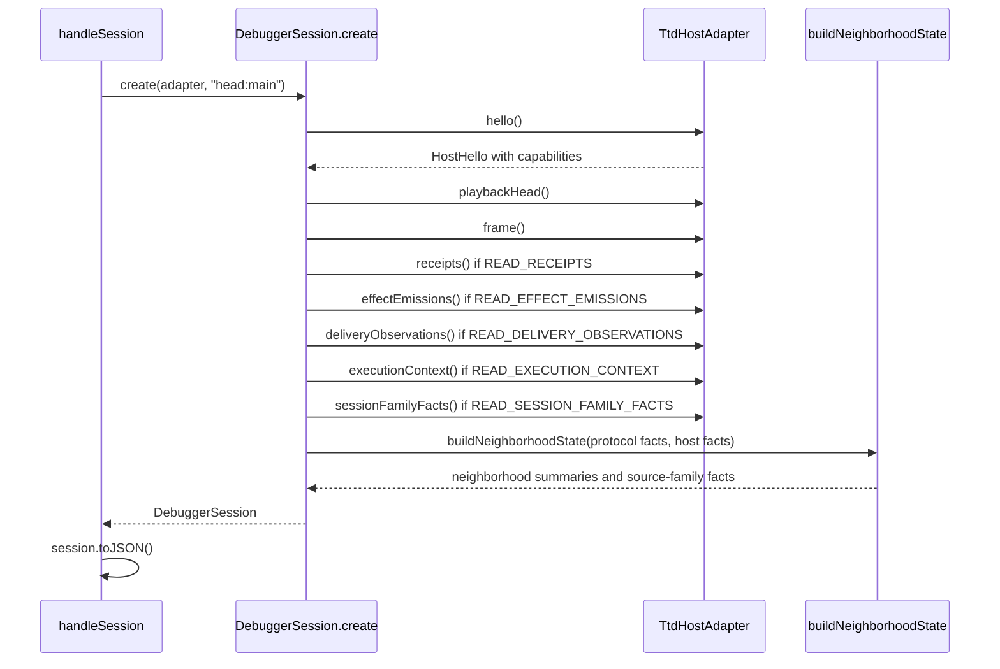
```mermaid
sequenceDiagram
    participant CLI as handleSession
    participant Session as DebuggerSession.create
    participant Adapter as TtdHostAdapter
    participant Assembler as buildNeighborhoodState

    CLI->>Session: create(adapter, "head:main")
    Session->>Adapter: hello()
    Adapter-->>Session: HostHello with capabilities
    Session->>Adapter: playbackHead()
    Session->>Adapter: frame()
    Session->>Adapter: receipts() if READ_RECEIPTS
    Session->>Adapter: effectEmissions() if READ_EFFECT_EMISSIONS
    Session->>Adapter: deliveryObservations() if READ_DELIVERY_OBSERVATIONS
    Session->>Adapter: executionContext() if READ_EXECUTION_CONTEXT
    Session->>Adapter: sessionFamilyFacts() if READ_SESSION_FAMILY_FACTS
    Session->>Assembler: buildNeighborhoodState(protocol facts, host facts)
    Assembler-->>Session: neighborhood summaries and source-family facts
    Session-->>CLI: DebuggerSession
    CLI->>CLI: session.toJSON()
```

### 9.1 Why `DebuggerSession` Exists

The adapter knows how to read a host. The session knows how to conduct an
investigation.

`DebuggerSession` owns:

- a generated `sessionId`
- the active playback head id
- cached `HostHello`
- cached adapter capabilities from the initial handshake
- the current snapshot
- pinned observations

It does not own host execution. Its navigation methods call adapter controls,
then refresh the snapshot.

### 9.2 Capability-Gated Snapshot Fetching

The session never assumes an adapter supports every optional read. It checks
the capabilities captured from the initial handshake.

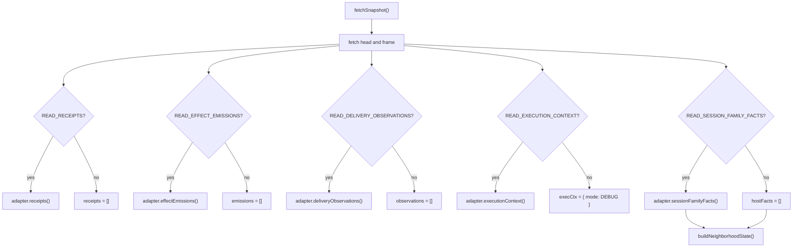
```mermaid
flowchart TD
    Snapshot["fetchSnapshot()"] --> Core["fetch head and frame"]
    Core --> Receipts{"READ_RECEIPTS?"}
    Receipts -->|yes| ReadReceipts["adapter.receipts()"]
    Receipts -->|no| EmptyReceipts["receipts = []"]
    Core --> Effects{"READ_EFFECT_EMISSIONS?"}
    Effects -->|yes| ReadEffects["adapter.effectEmissions()"]
    Effects -->|no| EmptyEffects["emissions = []"]
    Core --> Deliveries{"READ_DELIVERY_OBSERVATIONS?"}
    Deliveries -->|yes| ReadDeliveries["adapter.deliveryObservations()"]
    Deliveries -->|no| EmptyDeliveries["observations = []"]
    Core --> Exec{"READ_EXECUTION_CONTEXT?"}
    Exec -->|yes| ReadExec["adapter.executionContext()"]
    Exec -->|no| DebugDefault["execCtx = { mode: DEBUG }"]
    Core --> Families{"READ_SESSION_FAMILY_FACTS?"}
    Families -->|yes| HostFacts["adapter.sessionFamilyFacts()"]
    Families -->|no| NoHostFacts["hostFacts = []"]
    HostFacts --> Neighborhood["buildNeighborhoodState()"]
    NoHostFacts --> Neighborhood
```

This is a major safety feature. A sparse adapter can omit optional capabilities,
and the session will not call unsupported methods. The tests prove this by
using an adapter that throws if unsupported methods are called.

### 9.3 Cached Handshake

The session intentionally does not call `hello()` again during navigation.
Tests use a `TransientHelloAdapter` that fails after the first hello; session
navigation still works. This makes the initial handshake the stable capability
contract for the session.

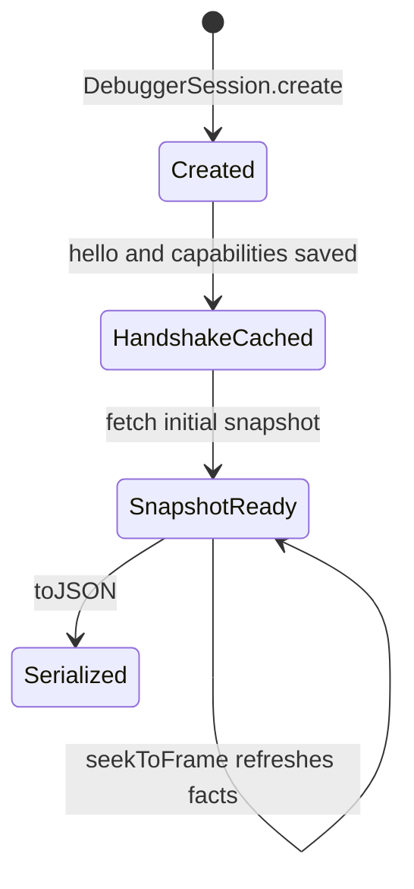
```mermaid
stateDiagram-v2
    [*] --> Created: DebuggerSession.create
    Created --> HandshakeCached: hello and capabilities saved
    HandshakeCached --> SnapshotReady: fetch initial snapshot
    SnapshotReady --> SnapshotReady: stepForward refreshes facts
    SnapshotReady --> SnapshotReady: stepBackward refreshes facts
    SnapshotReady --> SnapshotReady: seekToFrame refreshes facts
    SnapshotReady --> Serialized: toJSON
```

## 10. Neighborhood Read Model

The neighborhood read model turns raw frame evidence into a focused debugger
view.

The session snapshot includes:

- `neighborhoodCore`
- `neighborhoodSites`
- `reintegrationDetail`
- `receiptShell`
- `sessionFamilyFacts`

These are built by `src/app/neighborhoodAssembler.ts`.

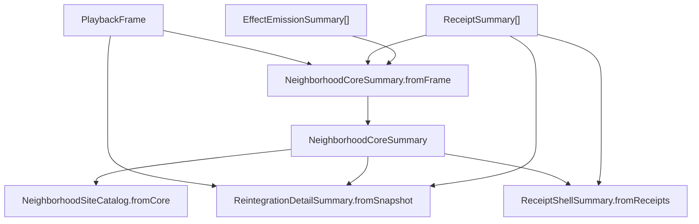
```mermaid
flowchart TD
    Frame["PlaybackFrame"] --> CoreFactory["NeighborhoodCoreSummary.fromFrame"]
    Receipts["ReceiptSummary[]"] --> CoreFactory
    Emissions["EffectEmissionSummary[]"] --> CoreFactory
    CoreFactory --> Core["NeighborhoodCoreSummary"]
    Core --> Sites["NeighborhoodSiteCatalog.fromCore"]
    Frame --> Detail["ReintegrationDetailSummary.fromSnapshot"]
    Core --> Detail
    Receipts --> Detail
    Core --> Shell["ReceiptShellSummary.fromReceipts"]
    Receipts --> Shell
```

### 10.1 Host-Published First, Local Fallback Second

The assembler does not blindly derive local summaries if the host provided
published facts. For each field:

1. Look for a `HOST_PUBLISHED` fact with the exact field and coordinate target.
2. If found, hydrate it into the local summary class.
3. If hydration succeeds, use the host fact.
4. If hydration fails, mark the host fact as `OBSTRUCTED` and use local
   fallback for display.
5. If no host fact exists, derive a local fallback and label it
   `LOCAL_FALLBACK`.

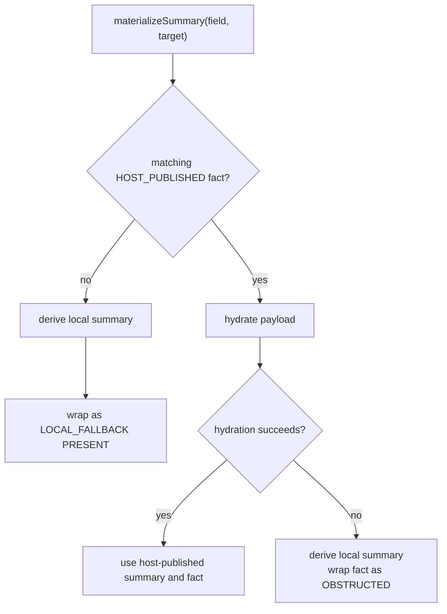
```mermaid
flowchart TD
    Start["materializeSummary(field, target)"] --> Find{"matching HOST_PUBLISHED fact?"}
    Find -->|no| Local["derive local summary"]
    Local --> LocalFact["wrap as LOCAL_FALLBACK PRESENT"]
    Find -->|yes| Hydrate["hydrate payload"]
    Hydrate --> Success{"hydration succeeds?"}
    Success -->|yes| Host["use host-published summary and fact"]
    Success -->|no| Obstructed["derive local summary<br/>wrap fact as OBSTRUCTED"]
```

That gives the UI something useful to render while preserving evidence honesty.
The local fallback is not disguised as native host truth.

### 10.2 Neighborhood Core

`NeighborhoodCoreSummary.fromFrame` derives:

- the primary lane from the first lane in the frame
- participating lanes from changed lanes, receipt lanes, and emission lanes
- alternatives from receipts with `counterfactualCount > 0`
- outcome:
  - `OBSTRUCTED` if any receipt has rejected rewrites
  - `PENDING` if there are alternatives without rejection
  - `LAWFUL` otherwise
- a compact summary string

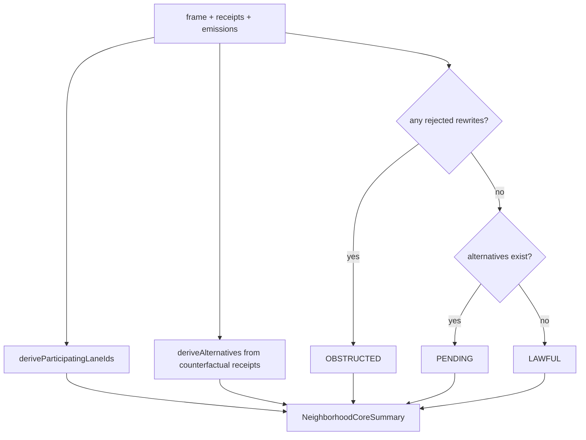
```mermaid
flowchart TD
    Inputs["frame + receipts + emissions"] --> Participating["deriveParticipatingLaneIds"]
    Inputs --> Alternatives["deriveAlternatives from counterfactual receipts"]
    Inputs --> Outcome{"any rejected rewrites?"}
    Outcome -->|yes| Obstructed["OBSTRUCTED"]
    Outcome -->|no| AltCheck{"alternatives exist?"}
    AltCheck -->|yes| Pending["PENDING"]
    AltCheck -->|no| Lawful["LAWFUL"]
    Participating --> Core["NeighborhoodCoreSummary"]
    Alternatives --> Core
    Obstructed --> Core
    Pending --> Core
    Lawful --> Core
```

### 10.3 Site Catalog

`NeighborhoodSiteCatalog.fromCore` turns the core into navigable sites:

- one primary site
- one alternative site for each counterfactual alternative

The catalog normalizes selection. If a selected site id is null or invalid, it
falls back to the active primary site. This lets the inspector and worldline
views maintain focus without crashing when frames change.

### 10.4 Reintegration Detail

`ReintegrationDetailSummary.fromSnapshot` derives:

- seam anchors for primary and participating lanes
- rewrite admission obligations for each receipt
- counterfactual review obligations when needed
- evidence handles pointing back to receipt digests

This layer answers: "What must line up for this local neighborhood to be
compatible with the surrounding causal history?"

### 10.5 Receipt Shell

`ReceiptShellSummary.fromReceipts` summarizes the receipt set:

- receipt ids
- candidate count, computed from admitted + rejected + counterfactual counts
- rejected count
- whether any blocking relation exists

It is a compact evidence shell around the neighborhood. It does not replace the
core neighborhood model.

## 11. Golden Path E: `admission-chain --json`

The admission-chain command exposes a versioned agent read model:

```bash
npm run admission-chain -- --json
```

Execution path:

1. Create `DebuggerSession`.
2. Call `buildAdmissionChainReadModel(session)`.
3. Print `AdmissionChainReadModel`.

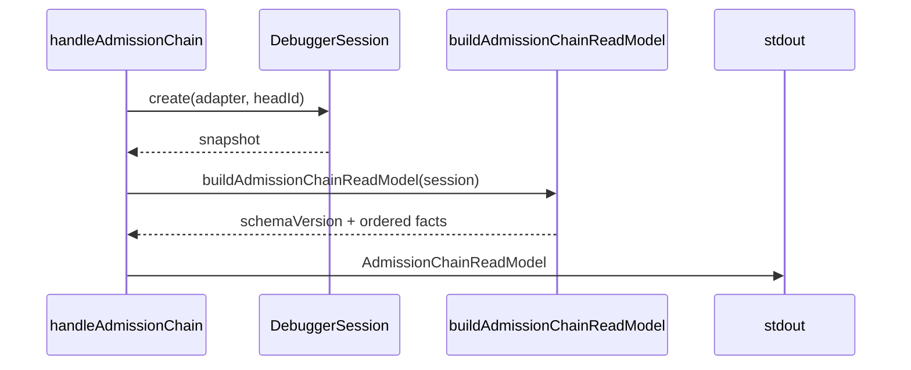
```mermaid
sequenceDiagram
    participant CLI as handleAdmissionChain
    participant Session as DebuggerSession
    participant Builder as buildAdmissionChainReadModel
    participant Out as stdout

    CLI->>Session: create(adapter, headId)
    Session-->>CLI: snapshot
    CLI->>Builder: buildAdmissionChainReadModel(session)
    Builder-->>CLI: schemaVersion + ordered facts
    CLI->>Out: AdmissionChainReadModel
```

### 11.1 Canonical Fact Order

The read model uses this order:

1. `basis`
2. `artifactRegistration`
3. `opticArtifactHandle`
4. `opticAdmissionRequirements`
5. `capabilityGrant`
6. `capabilityPresentation`
7. `admissionTicket`
8. `lawWitness`
9. `receipts`
10. `reading`


```mermaid
flowchart LR
    Basis["basis"] --> Registration["artifactRegistration"]
    Registration --> Handle["opticArtifactHandle"]
    Handle --> Requirements["opticAdmissionRequirements"]
    Requirements --> Grant["capabilityGrant"]
    Grant --> Presentation["capabilityPresentation"]
    Presentation --> Ticket["admissionTicket"]
    Ticket --> Witness["lawWitness"]
    Witness --> Receipts["receipts"]
    Receipts --> Reading["reading"]
```

Each item has two layers:

- `value`: the admission fact itself, with posture `PRESENT`, `ABSENT`, or
  `OBSTRUCTED`
- `sourceFamily`: the generated-family posture wrapper describing ownership,
  origin, scope, target, and payload or reason

This makes absence first-class. Missing `CapabilityGrant` is not omitted; it is
explicitly `ABSENT` with a reason.

### 11.2 What Is Present Today

For the fixture at frame `0`:

- `basis` is present because the session has a current head and frame.
- Echo-specific registration, handle, grant, ticket, and witness facts are
  absent because the adapter does not provide them yet.
- `receipts` is absent at frame `0`.
- `reading` is present as a local debugger reading inspection.
- reading budget posture is absent because the host does not provide it.

The generated-family sources encode ownership:

| Field | Source family |
| :--- | :--- |
| `basis` | `warp-ttd-protocol` |
| `receipts` | `warp-ttd-protocol` |
| `reading` | `continuum` |
| `capabilityGrant` | `authority` |
| `artifactRegistration`, `opticArtifactHandle`, `admissionTicket`, `lawWitness` | `echo` |

This is one of the most important architectural features in the project. The
debugger can tell an agent what it does not know without fabricating authority.

## 12. Generated-Family Ingress

`src/app/generatedFamilyIngress.ts` defines a small data shape:

```ts
type GeneratedFamilyPosture = "ABSENT" | "PRESENT" | "OBSTRUCTED";
type GeneratedFamilyOrigin =
  | "GENERATED_PAYLOAD"
  | "HOST_PUBLISHED"
  | "TRANSLATED_SUBSTRATE"
  | "LOCAL_FALLBACK"
  | "UNAVAILABLE";
```

That gives WARP TTD a general way to carry payload posture.

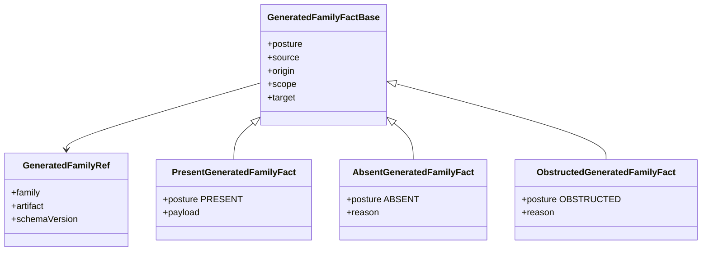
```mermaid
classDiagram
    class GeneratedFamilyRef {
      +family
      +artifact
      +schemaVersion
    }

    class GeneratedFamilyFactBase {
      +posture
      +source
      +origin
      +scope
      +target
    }

    class PresentGeneratedFamilyFact {
      +posture PRESENT
      +payload
    }

    class AbsentGeneratedFamilyFact {
      +posture ABSENT
      +reason
    }

    class ObstructedGeneratedFamilyFact {
      +posture OBSTRUCTED
      +reason
    }

    GeneratedFamilyFactBase --> GeneratedFamilyRef
    GeneratedFamilyFactBase <|-- PresentGeneratedFamilyFact
    GeneratedFamilyFactBase <|-- AbsentGeneratedFamilyFact
    GeneratedFamilyFactBase <|-- ObstructedGeneratedFamilyFact
```

The seam is intentionally not a validator for every external family. It is a
posture wrapper. It says where a fact came from and whether it can be trusted as
present, unavailable, or obstructed.

## 13. Live Target Golden Path: `targets --json`

The `targets` command does not use `EchoFixtureAdapter`. It inspects configured
live app roots without attaching to them.

```bash
npm run targets -- --json
```

Execution path:

1. `main()` sees command `targets`.
2. It calls `handleTargets`.
3. `handleTargets` calls `inspectLiveTargets()`.
4. The result is printed as one `LiveTargetInspection` JSONL line per target.

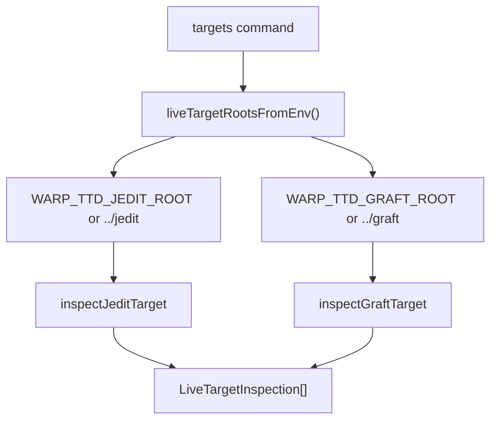
```mermaid
flowchart TD
    Targets["targets command"] --> Roots["liveTargetRootsFromEnv()"]
    Roots --> JeditRoot["WARP_TTD_JEDIT_ROOT or ../jedit"]
    Roots --> GraftRoot["WARP_TTD_GRAFT_ROOT or ../graft"]
    JeditRoot --> Jedit["inspectJeditTarget"]
    GraftRoot --> Graft["inspectGraftTarget"]
    Jedit --> Output["LiveTargetInspection[]"]
    Graft --> Output
```

The two target names are fixed today:

| Target | Host kind | Current posture |
| :--- | :--- | :--- |
| `jedit` | `ECHO` | root and manifest inspected read-only; live adapter unavailable |
| `graft` | `GIT_WARP` | adapter configured; evidence is translated git-warp substrate |

### 13.1 `jedit`

`jedit` is a live Echo app target. Today WARP TTD does not attach to Echo. It
inspects a manifest path:

```text
.warp-ttd/live-echo-family-facts.json
```

`inspectLiveEchoFamilyIntake` checks:

- whether the root exists
- whether the manifest exists
- whether the manifest parses
- whether `publishedFields` is an array of known session family fields

The expected fields are:

- `neighborhoodCore`
- `reintegrationDetail`
- `receiptShell`

If the manifest is missing, fields become absent. If malformed, fields become
obstructed. If a field is listed, it becomes present as a target-scoped
host-published fact.

```mermaid
flowchart TD
    Jedit["jedit target"] --> Root{"root exists?"}
    Root -->|no| MissingRoot["rootPosture MISSING<br/>manifest MISSING"]
    Root -->|yes| Manifest{"manifest exists?"}
    Manifest -->|no| MissingManifest["manifestPosture MISSING<br/>intake UNAVAILABLE"]
    Manifest -->|yes| Parse["read and parse JSON"]
    Parse --> Valid{"publishedFields valid?"}
    Valid -->|yes| Present["matching fields PRESENT"]
    Valid -->|no| Obstructed["all expected fields OBSTRUCTED"]
```

### 13.2 `graft`

`graft` is a live git-warp app target. The target inspection reports:

- adapter posture `CONFIGURED`
- graph name `graft-ast`
- runtime boundary evidence posture `TRANSLATED_SUBSTRATE`
- `nativeContinuumWitness: false`

That last part is crucial. A git-warp index can be useful evidence without being
native Continuum witnesshood.

## 14. Live Session Golden Path: `target-session --json`

The `target-session` command goes one level deeper. It still stays read-only,
but it tries to open configured live targets where supported.

```bash
npm run target-session -- --json
```

Execution path:

```mermaid
sequenceDiagram
    participant CLI as handleTargetSession
    participant Inspector as inspectLiveTargetSessions
    participant Targets as inspectLiveTargets
    participant Registry as resolveAdapter
    participant Session as DebuggerSession

    CLI->>Inspector: inspectLiveTargetSessions()
    Inspector->>Targets: inspectLiveTargets(roots)
    Targets-->>Inspector: jedit and graft posture
    Inspector->>Inspector: jedit => OBSTRUCTED, no live adapter
    Inspector->>Registry: resolveAdapter(git-warp root, graphName)
    Registry-->>Inspector: GitWarpAdapter + defaultHeadId
    Inspector->>Session: DebuggerSession.create(adapter, defaultHeadId)
    Session-->>Inspector: read-only session
    Inspector-->>CLI: LiveTargetSessionInspection[]
```

If the graft root is missing, the command reports obstruction with a reason. If
opening WarpCore or creating the session throws, it also reports obstruction
instead of mutating or guessing.

## 15. Adapter Registry

`src/app/adapterRegistry.ts` is the composition seam. It is the only app-layer
module that imports concrete adapters and host infrastructure.

```mermaid
flowchart TD
    Config["AdapterConfig"] --> Kind{"kind"}
    Kind -->|"echo-fixture"| Echo["dynamic import EchoFixtureAdapter"]
    Kind -->|"scenario"| Scenario["dynamic import scenario factories"]
    Kind -->|"git-warp"| GitWarp["dynamic import GitWarpAdapter<br/>@git-stunts/git-warp<br/>@git-stunts/plumbing"]
    GitWarp --> Open["WarpCore.open(...)"]
    Open --> Create["GitWarpAdapter.create(graph)"]
    Echo --> Resolved["ResolvedAdapter"]
    Scenario --> Resolved
    Create --> Resolved
```

For git-warp, the registry:

1. Creates default Git plumbing rooted at the target repo path.
2. Opens a WarpCore graph with `GitGraphAdapter`.
3. Uses writer id `ttd-observer`.
4. Uses `WebCryptoAdapter`.
5. Wraps the graph in `GitWarpAdapter`.
6. Returns default head id `head:default`.

This keeps delivery surfaces from knowing how to construct a git-warp graph.

## 16. GitWarpAdapter Deep Dive

`GitWarpAdapter` bridges real git-warp history into WARP TTD protocol shapes.

### 16.1 Frame Indexing

At creation:

1. It calls `graph.materialize({ receipts: true })`.
2. It groups returned `TickReceipt` objects by Lamport tick.
3. It sorts unique ticks ascending.
4. It creates an `IndexedFrame[]`.
5. It builds a lane catalog from the live worldline and graph strands.

```mermaid
flowchart TD
    Create["GitWarpAdapter.create(graph)"] --> Materialize["graph.materialize({ receipts: true })"]
    Materialize --> Receipts["TickReceipt[]"]
    Receipts --> Group["group by receipt.lamport"]
    Group --> Sort["sort ticks ascending"]
    Sort --> FrameIndex["IndexedFrame[]<br/>tick + receipts"]
    Create --> Strands["graph.listStrands()"]
    Strands --> Lanes["live worldline lane + strand lanes"]
    FrameIndex --> Adapter["new GitWarpAdapter"]
    Lanes --> Adapter
```

Frame `0` is synthetic genesis. Real indexed frames are offset by one:

| Debugger frame | Meaning |
| :--- | :--- |
| `0` | synthetic empty genesis view |
| `1` | receipts at first unique Lamport tick |
| `2` | receipts at second unique Lamport tick |

That offset appears in helpers such as `resolveIndexedFrameForResolvedIndex`,
which maps debugger frame `N` to `frameIndex[N - 1]`.

### 16.2 Lane Catalog

The adapter always creates:

- `wl:live`, a non-writable `WORLDLINE`
- one `STRAND` lane for each `graph.listStrands()` entry

Strands are converted to lanes with ids like:

```text
ws:<strandId>
```

Their parent is `wl:live`, and their writable posture follows
`strand.overlay.writable`.

### 16.3 Playback Head

The adapter initializes a mutable `#headStates` map with one head:

- `head:default`
- current frame `0`
- tracked lanes from the catalog
- writable lanes from the catalog
- paused `true`

Playback controls update only this map.

### 16.4 Frame Construction

`frame(headId, frameIndex?)` resolves the frame index from the explicit argument
or the head's current frame. It then calls private `#buildFrame`.

```mermaid
flowchart TD
    Frame["frame(headId, frameIndex?)"] --> Head["requireHead"]
    Head --> Resolve["resolveRequestedFrameIndex"]
    Resolve --> Genesis{"resolved index == 0?"}
    Genesis -->|yes| BuildGenesis["buildGenesisFrame"]
    Genesis -->|no| Indexed["resolveIndexedFrameForResolvedIndex"]
    Indexed --> Prev["resolveInputTick"]
    Prev --> Lanes["map lanes to LaneFrameView"]
    Lanes --> Changed["WORLDLINE changed if indexed.tick != previousTick"]
    Changed --> Digest["first receipt patchSha as btrDigest when changed"]
```

Only the live worldline lane is marked changed based on Lamport tick movement.
Strand lane visibility currently comes from catalog membership, not per-strand
receipt movement in this adapter.

### 16.5 Receipt Summaries

`receipts()` maps each git-warp `TickReceipt` to a protocol `ReceiptSummary`.
It counts operation results:

| git-warp op result | WARP TTD count |
| :--- | :--- |
| `applied` | admitted |
| `superseded` | rejected |
| `redundant` | counterfactual |

```mermaid
flowchart TD
    TickReceipt["TickReceipt"] --> Count["countOps"]
    Count --> Applied["applied -> admittedRewriteCount"]
    Count --> Superseded["superseded -> rejectedRewriteCount"]
    Count --> Redundant["redundant -> counterfactualCount"]
    TickReceipt --> Summary["toReceiptSummary"]
    Applied --> Summary
    Superseded --> Summary
    Redundant --> Summary
    Summary --> Receipt["ReceiptSummary"]
```

The digest is the patch SHA. The writer is converted into a `WriterRef` with
worldline id `wl:live`.

### 16.6 Effect Extraction

git-warp effects are inferred from graph nodes added by receipts. The extractor
looks for applied `NodeAdd` operations whose target starts with:

```text
@warp/effect:
```

Then it rematerializes the graph at the requested tick ceiling and reads node
properties to find the effect kind.

```mermaid
sequenceDiagram
    participant Adapter as GitWarpAdapter
    participant Extractor as extractGitWarpEffectEmissions
    participant Graph as WarpCoreLike

    Adapter->>Extractor: indexed frame and graph
    Extractor->>Extractor: collect applied NodeAdd effect nodes
    Extractor->>Graph: materialize({ ceiling: indexedFrame.tick })
    Graph-->>Extractor: historical materialization
    Extractor->>Graph: getNodeProps(effectNodeId)
    Graph-->>Extractor: props with kind
    Extractor-->>Adapter: EffectEmissionSummary[]
```

The code comment calls out a sharp edge: rematerializing at a ceiling mutates
shared graph state, so callers must serialize concurrent calls per graph
instance to avoid ceiling cross-contamination. That is an unusually honest and
useful implementation note. It identifies a real concurrency hazard at the
adapter boundary.

## 17. Scenario Fixture Adapter

`ScenarioFixtureAdapter` is a declarative adapter generator. It is not tied to a
real substrate. It lets tests and the TUI exercise edge cases:

- live effects
- replay suppression
- multi-writer conflicts
- complex worldline with hundreds of ticks, multiple worldlines, strands, and
  conflict zones

```mermaid
flowchart TD
    Scenario["Scenario object"] --> Lanes["buildLanes"]
    Scenario --> Frames["populateFrameData"]
    Frames --> Receipts["ReceiptSummary maps"]
    Frames --> Emissions["EffectEmissionSummary maps"]
    Frames --> Observations["DeliveryObservationSummary maps"]
    Lanes --> Adapter["TtdHostAdapter object"]
    Receipts --> Adapter
    Emissions --> Adapter
    Observations --> Adapter
```

The scenario builder is valuable because it tests the debugger as a debugger,
not as a git-warp special case.

## 18. TUI Entry Point: `src/tui/main.ts`

The TUI entry point ends with:

```ts
run(mainApp).then(
  () => process.exit(0),
  onFatal,
);
```

The app is built with `@flyingrobots/bijou-tui`. It registers four pages:

1. Connect
2. Navigator
3. Worldline
4. Neighborhood inspector

```mermaid
flowchart TD
    Run["run(mainApp)"] --> Init["mainApp.init"]
    Init --> Framed["framedApp.init"]
    Init --> Pulse["33ms pulse command"]
    Framed --> Pages["connect, navigator, worldline, inspector"]
    Pulse --> Update["mainApp.update"]
    Pages --> Update
    Update --> View["mainApp.view -> framedApp.view"]
```

### 18.1 TUI Shell Responsibilities

The TUI shell in `src/tui/main.ts` is not where adapter logic lives. It:

- registers pages
- adds a global `q` binding
- adds an animation pulse
- detects quit messages
- detects `worldline-loaded`
- tracks whether session context changed
- synchronizes session and neighborhood focus across pages

```mermaid
sequenceDiagram
    participant Page as Active page
    participant Shell as src/tui/main.ts
    participant Sync as sessionSync.ts
    participant Frame as framedApp

    Page->>Shell: message
    Shell->>Shell: capture previous session ctx and worldline focus
    Shell->>Frame: framedApp.update(message, model)
    Frame-->>Shell: next model + commands
    Shell->>Sync: syncSession if session changed
    Shell->>Sync: otherwise sync frame and neighborhood focus
    Sync-->>Shell: synchronized model + commands
```

### 18.2 Connect Page

The connect page owns session creation. It lets the user choose:

- Echo fixture
- git-warp local repository
- scenario: live effects
- scenario: replay suppression
- scenario: multi-writer conflicts
- scenario: complex worldline

For git-warp, it prompts for repository path and graph name.

Successful connect flow:

```mermaid
sequenceDiagram
    participant User
    participant Connect as connectPage
    participant Registry as resolveAdapter
    participant Session as DebuggerSession
    participant Shell as TUI shell

    User->>Connect: select adapter
    Connect->>Registry: resolveAdapter(config)
    Registry-->>Connect: adapter + defaultHeadId
    Connect->>Session: DebuggerSession.create(adapter, defaultHeadId)
    Connect->>Session: seekToFrame(Number.MAX_SAFE_INTEGER)
    Connect->>Registry: adapter.laneCatalog()
    Connect-->>Shell: session-ready(ctx, generation)
    Shell->>Shell: propagate session context to pages
```

The `generation` field prevents stale async connection attempts from overwriting
newer selections.

The connect page seeks to the maximum frame immediately after session creation.
That means human users start at the frontier, not genesis.

### 18.3 Navigator Page

The navigator page renders the current session snapshot and lets the user:

- step forward
- step backward
- jump to a frame
- pin the first delivery observation at the current frame
- unpin the last pin

The commands call `DebuggerSession` methods, not adapter methods directly.

```mermaid
flowchart TD
    Key["n, p, g, P, u"] --> NavUpdate["navigator update"]
    NavUpdate --> Step{"navigation action?"}
    Step -->|step forward| SessionFwd["session.stepForward()"]
    Step -->|step backward| SessionBack["session.stepBackward()"]
    Step -->|jump| SessionSeek["session.seekToFrame(frameIndex)"]
    Step -->|pin| Pin["session.pin(observationId)"]
    Step -->|unpin| Unpin["session.unpin(observationId)"]
    SessionFwd --> Snapshot["snapshot-updated"]
    SessionBack --> Snapshot
    SessionSeek --> Snapshot
```

`renderNavigator` is pure rendering logic. It builds:

- a position bar
- lane lines
- receipt rows
- effect and delivery rows
- pin lines
- status and jump prompt

It uses adapter capabilities to decide whether receipts and effects are
supported.

### 18.4 Worldline Page

The worldline page renders history, not just the current frame. Its data is
loaded by a shell-level command in `sessionSync.ts`:

1. Seek adapter to `Number.MAX_SAFE_INTEGER` to discover max frame.
2. Iterate from `0` to max frame.
3. Fetch each frame and its receipts.
4. Emit `worldline-loaded`.

```mermaid
sequenceDiagram
    participant Sync as sessionSync
    participant Adapter as session.adapter
    participant Shell as TUI shell
    participant Worldline as worldlinePage

    Sync->>Adapter: seekToFrame(headId, Number.MAX_SAFE_INTEGER)
    Adapter-->>Sync: max frame after clamping
    loop i = 0..maxFrame
        Sync->>Adapter: frame(headId, i)
        Sync->>Adapter: receipts(headId, i)
    end
    Sync-->>Shell: worldline-loaded(frames, sessionId)
    Shell->>Worldline: apply frames
```

`buildTickRows` converts frames to rows and sorts newest first. Rows include:

- frame index
- primary lane id
- tick
- digest
- writers
- conflict flag
- strand ids
- active lane ids

The graph gutter renderer assigns stable columns to lanes: worldlines first,
then strands. It renders active and pass-through lane glyphs and shows fork
ranges when a strand first appears.

```mermaid
flowchart TD
    Frames["FrameData[]"] --> Rows["buildTickRows newest first"]
    Catalog["LaneRef[]"] --> Columns["assignColumns worldlines then strands"]
    Rows --> Forks["detectForks"]
    Rows --> Alive["collectAliveLanes"]
    Rows --> Activity["buildRowActivity"]
    Columns --> Gutter["buildGraphGutterCells"]
    Forks --> Gutter
    Alive --> Gutter
    Activity --> Gutter
    Gutter --> Surface["renderWorldline Surface"]
```

The page also supports a split view:

- left pane: lane tree
- right pane: filtered timeline for the selected lane

For narrow terminals, it renders only the selected lane timeline.

### 18.5 Neighborhood Inspector Page

The inspector page is the human view over the neighborhood read models. It
renders:

- site list
- selected neighborhood focus
- context info
- reintegration detail if present
- receipt shell if receipts exist

It uses `NeighborhoodFocusSummary.fromSelection` to derive the currently
selected focus from:

- `NeighborhoodCoreSummary`
- `NeighborhoodSiteCatalog`
- selected site id

```mermaid
flowchart TD
    Core["NeighborhoodCoreSummary"] --> Catalog["NeighborhoodSiteCatalog"]
    Catalog --> Selected["selected site"]
    Selected --> Focus["NeighborhoodFocusSummary"]
    Core --> Focus
    Focus --> Inspector["Neighborhood inspector surface"]
    Detail["ReintegrationDetailSummary"] --> Inspector
    Shell["ReceiptShellSummary"] --> Inspector
```

### 18.6 Cross-Page Synchronization

`sessionSync.ts` keeps pages coherent.

It:

- propagates session context from Connect to Navigator, Worldline, and
  Inspector
- resets worldline state when a new session arrives
- loads frame history for the worldline
- synchronizes inspector site selection when the worldline lane selection
  changes
- synchronizes worldline focus when inspector site selection or current frame
  changes

```mermaid
stateDiagram-v2
    [*] --> Disconnected
    Disconnected --> SessionReady: connect page emits session-ready
    SessionReady --> Propagate: syncSession
    Propagate --> LoadWorldline: makeWorldlineLoadCmd
    LoadWorldline --> FocusSynced: worldline-loaded
    FocusSynced --> FocusSynced: lane selection changes
    FocusSynced --> FocusSynced: site selection changes
    FocusSynced --> FocusSynced: frame changes
    FocusSynced --> Disconnected: disconnect
```

This is a strong TUI design. Pages can remain focused on their local models
while the shell handles global coherence.

## 19. MCP Entry Point: `src/mcp/main.ts`

The MCP entry point is:

```ts
await main();
```

inside the same top-level error wrapper pattern as the CLI.

`main()`:

1. Creates an MCP admission-chain server with `EchoFixtureAdapter`.
2. Uses `head:main`.
3. Connects the server to stdio transport.

```mermaid
flowchart TD
    Start["npm run mcp"] --> Main["src/mcp/main.ts main()"]
    Main --> Server["createMcpAdmissionChainServer"]
    Server --> Adapter["new EchoFixtureAdapter"]
    Server --> Head["headId head:main"]
    Main --> Transport["new StdioServerTransport"]
    Transport --> Connect["server.connect(transport)"]
```

### 19.1 MCP Tool Registration

The server registers five tools:

- `warp_ttd.inspect_session`
- `warp_ttd.inspect_adapter_capabilities`
- `warp_ttd.inspect_readings`
- `warp_ttd.inspect_admission_chain`
- `warp_ttd.inspect_live_targets`

Each tool is annotated:

- `readOnlyHint: true`
- `destructiveHint: false`
- `idempotentHint: true`
- `openWorldHint: false`

```mermaid
classDiagram
    class McpServer
    class ReadOnlyToolRegistration {
      +name
      +title
      +description
      +callback()
    }
    class DebuggerSession
    class AdmissionChainReadModel
    class ReadingInspection
    class LiveTargetsInspection

    McpServer --> ReadOnlyToolRegistration
    ReadOnlyToolRegistration --> DebuggerSession
    DebuggerSession --> AdmissionChainReadModel
    DebuggerSession --> ReadingInspection
    ReadOnlyToolRegistration --> LiveTargetsInspection
```

### 19.2 Lazy Session Resolver

The MCP server creates a session resolver with two private variables:

- `session`
- `sessionPromise`

On first tool call, it initializes a `DebuggerSession`. Concurrent first calls
share the same promise.

```mermaid
sequenceDiagram
    participant ToolA as Tool call A
    participant ToolB as Tool call B
    participant Resolver as getSession()
    participant Session as DebuggerSession.create

    ToolA->>Resolver: getSession()
    Resolver->>Session: create()
    ToolB->>Resolver: getSession()
    Resolver-->>ToolB: existing sessionPromise
    Session-->>Resolver: session
    Resolver-->>ToolA: session
    Resolver-->>ToolB: same session
```

The tests prove this by using a slow hello adapter and asserting only one hello
call occurs.

### 19.3 Tool Result Shape

MCP results include both:

- `structuredContent`: the actual object
- text content: `JSON.stringify(data)`

That makes the tools useful for MCP clients that understand structured content
and for clients that only show text payloads.

## 20. Error Handling

The codebase uses named custom errors from `src/errors.ts`:

- `UnknownHeadError`
- `FrameOutOfRangeError`
- `FrameResolutionError`
- `InternalIndexError`
- `NoFramesConfiguredError`
- `UnsupportedCommandError`
- `UnexpectedArgumentsError`
- `UnknownFlagsError`
- `UnknownAdapterKindError`

```mermaid
flowchart TD
    ErrorSite["throw named error"] --> TopLevel{"surface"}
    TopLevel -->|CLI JSON| JsonErr["stderr JSON<br/>{ error: message }"]
    TopLevel -->|CLI human| TextErr["stderr text message"]
    TopLevel -->|MCP main| McpErr["stderr text message"]
    TopLevel -->|TUI fatal| Fatal["Fatal: message<br/>process.exit(1)"]
```

The adapters also prefer explicit error classes for bad heads, missing frames,
and unsupported adapter kinds. This makes failures inspectable and testable.

## 21. Test Architecture

Tests are the executable spec for this repository. The package script runs a
large set of focused Node test files.

The most important test groups are:

| Test file | What it pins |
| :--- | :--- |
| `test/protocolContract.spec.ts` | exact protocol envelope shapes and version |
| `test/cliJson.spec.ts` | JSONL envelope behavior and live target posture |
| `test/debuggerSession.spec.ts` | session lifecycle, capability gating, pins, serialization |
| `test/mcpAdmissionChainSurface.spec.ts` | MCP read-only tools and admission-chain parity |
| `test/gitWarpAdapter.spec.ts` | git-warp adapter behavior |
| `test/neighborhood*.spec.ts` | neighborhood, focus, site catalog, shell, detail models |
| `test/worldline*.spec.ts` | worldline layout, rendering, split view, session sync |

```mermaid
flowchart TD
    Tests["npm test"] --> Protocol["Protocol shape tests"]
    Tests --> CLI["CLI JSONL contract tests"]
    Tests --> Session["DebuggerSession tests"]
    Tests --> MCP["MCP surface tests"]
    Tests --> TUI["TUI layout and sync tests"]
    Tests --> AppModels["Neighborhood and family ingress tests"]
    Tests --> Adapters["Fixture and adapter tests"]
```

A recurring pattern in tests is to create intentionally hostile adapters:

- adapters that throw if unsupported optional methods are called
- adapters that fail on a second `hello()`
- adapters whose control methods throw when MCP tools should be read-only

Those tests enforce architectural boundaries, not just output snapshots.

## 22. End-to-End Payload Lifecycle

The full successful path for an agent asking for the admission chain looks like
this:

```mermaid
sequenceDiagram
    participant Agent
    participant CLI as CLI or MCP
    participant Session as DebuggerSession
    participant Adapter as TtdHostAdapter
    participant Neighborhood as neighborhoodAssembler
    participant Admission as admissionChainReadModel

    Agent->>CLI: request admission-chain
    CLI->>Session: create(adapter, headId)
    Session->>Adapter: hello()
    Adapter-->>Session: HostHello capabilities
    Session->>Adapter: playbackHead()
    Session->>Adapter: frame()
    Session->>Adapter: receipts() if capable
    Session->>Adapter: emissions/observations/context if capable
    Session->>Adapter: sessionFamilyFacts() if capable
    Session->>Neighborhood: materialize summaries
    Neighborhood-->>Session: core, sites, detail, shell, facts
    CLI->>Admission: buildAdmissionChainReadModel(session)
    Admission-->>CLI: versioned ordered facts
    CLI-->>Agent: structured JSON
```

The final payload is not just a dump of adapter data. It is a layered product:

1. Host facts are translated by the adapter.
2. Session capabilities decide which facts are lawful to request.
3. Neighborhood models derive or hydrate focused investigation summaries.
4. Generated-family wrappers label payload ownership and evidence posture.
5. The admission-chain model orders those facts for agents and renderers.

## 23. Architectural Highlights

### 23.1 Hexagonal Structure Is Real in the Critical Path

The core does not import git-warp directly. Delivery surfaces depend on
`DebuggerSession` and adapter resolution, not concrete substrates. Concrete host
knowledge is concentrated in adapters and the adapter registry.

### 23.2 Capabilities Are Operational, Not Decorative

Adapter capabilities directly control which methods the session will call.
This lets sparse adapters participate without implementing fake methods.

### 23.3 Absence Is a First-Class Fact

Missing registration, grant, ticket, witness, and budget facts are explicit
`ABSENT` facts. That is a strong agent-facing design because it prevents
optimistic inference.

### 23.4 Host-Published Facts Win, But Fallback Is Labeled

The neighborhood assembler prefers host-published family facts, but it can
derive local summaries when facts are unavailable or malformed. It labels
fallback and obstruction explicitly.

### 23.5 MCP Is Strictly Read-Only

MCP tools inspect session, capabilities, readings, admission chain, and live
targets. They do not step, seek, fork, grant, present authority, admit
invocations, or mutate host state.

### 23.6 The TUI Is a Renderer, Not a Second Debugger

The TUI pages operate over `DebuggerSession` and derived read models. Cross-page
sync is centralized in the shell and `sessionSync.ts`.

### 23.7 git-warp Frame Indexing Is Simple and Useful

Grouping receipts by Lamport tick gives a stable frame index. The synthetic
frame `0` makes genesis explicit and keeps real receipt frames one-indexed.

### 23.8 The Effect Model Keeps Three Layers Separate

The protocol separates:

1. effect emission
2. delivery observation
3. execution context

This prevents replay-safe suppression from being confused with an effect never
having existed.

## 24. Current Boundaries and Limitations

The current code intentionally does not do several things:

- It does not issue authority grants.
- It does not construct capability presentations.
- It does not perform Echo runtime admission.
- It does not mutate live `jedit`.
- It does not parse raw Echo WAL segments.
- It does not treat git-warp translated substrate evidence as native Continuum
  witnesshood.
- It does not create strands through MCP or the current CLI surfaces.
- It does not fully replace `src/protocol.ts` with generated Wesley artifacts.

These are not omissions by accident. They are stated boundaries in the design
docs and are enforced by current CLI/MCP behavior.

```mermaid
flowchart TD
    ReadOnly["Current allowed behavior"] --> Inspect["Inspect session facts"]
    ReadOnly --> Report["Report absence and obstruction"]
    ReadOnly --> Navigate["Move debugger playback head where adapter supports it"]
    ReadOnly --> Render["Render TUI views"]

    Forbidden["Current non-goals"] --> Grants["Issue grants"]
    Forbidden --> Presentations["Construct presentations"]
    Forbidden --> Admission["Perform runtime admission"]
    Forbidden --> Mutation["Mutate host apps"]
    Forbidden --> WAL["Parse or recover raw Echo WAL"]
    Forbidden --> Strands["Create local strands"]
```

## 25. How to Read the Code Next

For a new maintainer, the best reading order is:

1. `package.json` for runnable surfaces.
2. `src/cli.ts` for the agent-first execution path.
3. `src/adapter.ts` for the host adapter port.
4. `src/app/debuggerSession.ts` for the application core.
5. `src/adapters/echoFixtureAdapter.ts` for the smallest complete adapter.
6. `src/app/neighborhoodAssembler.ts` and summary classes for read-model
   construction.
7. `src/app/admissionChainReadModel.ts` for the current protocol focus.
8. `src/app/liveTargetInspection.ts` and
   `src/app/liveTargetSessionInspection.ts` for live target posture.
9. `src/adapters/gitWarpAdapter.ts` for the real git-warp bridge.
10. `src/mcp/admissionChainSurface.ts` for tool-native agent inspection.
11. `src/tui/main.ts` and `src/tui/sessionSync.ts` for human rendering and
    cross-page synchronization.
12. The tests matching each module.

```mermaid
flowchart TD
    Pkg["package.json"] --> CLI["src/cli.ts"]
    CLI --> Port["src/adapter.ts"]
    Port --> Session["src/app/debuggerSession.ts"]
    Session --> Fixture["EchoFixtureAdapter"]
    Session --> Neighborhood["neighborhoodAssembler + summaries"]
    Neighborhood --> Admission["admissionChainReadModel"]
    Admission --> LiveTargets["liveTargetInspection + liveTargetSessionInspection"]
    LiveTargets --> GitWarp["GitWarpAdapter"]
    Admission --> MCP["mcp/admissionChainSurface"]
    Session --> TUI["tui/main + sessionSync"]
    TUI --> Tests["matching tests"]
```

## 26. Summary

WARP TTD is best understood as a layered inspection system:

1. Entry surfaces accept user or agent requests.
2. Adapter ports translate host-specific causal substrates into protocol facts.
3. `DebuggerSession` turns those facts into a stable investigation snapshot.
4. Neighborhood and admission-chain read models add focused interpretation and
   evidence posture.
5. CLI, MCP, and TUI render those facts for different audiences.

The novel part is not merely time travel. It is evidence honesty. The system
does not just show "what happened"; it also tells the consumer which family owns
each fact, whether a fact is present, absent, obstructed, host-published,
translated substrate evidence, or local fallback. That is why the same debugger
can inspect fixture data, git-warp graphs, live target posture, and future Echo
admission facts without pretending they all come from the same authority.
