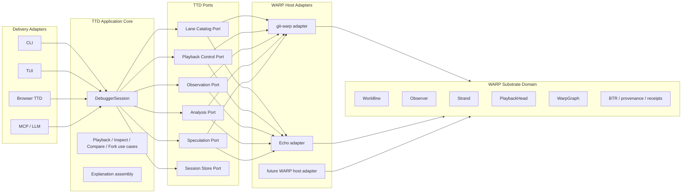

# RFC: Human-Centered, Hexagonal Architecture for WARP TTD

**Status:** DESIGN
**Date:** 2026-03-26
**Scope:** Cross-host Time Travel Debugger model for WARP systems

---

## Purpose

This note defines TTD as a human-facing debugger product with a host-agnostic
core.

The substrate remains responsible for causal truth:

- worldlines
- immutable `WarpGraph` snapshots
- observers
- strands
- BTRs
- replay/materialization

The debugger is responsible for human tasks over that truth:

- inspect
- explain
- compare
- scrub
- fork for "what-if" exploration

This separation is what allows one debugger architecture to serve multiple
WARP hosts without each host inventing a private debugger ontology.

---

## IBM Design Thinking Framing

TTD is a DX system. That means the design should begin with sponsor users and
their jobs, not with transport or storage mechanics.

### Sponsor Users

#### 1. Application Developer

Needs to answer:

- what did the application see at this moment?
- what changed between these moments?
- why did this outcome occur?

This user should not need to reconstruct BTR or provenance mechanics by hand.

#### 2. Substrate Maintainer

Needs to answer:

- did replay reconstruct the correct state?
- did a tick admit or reject the right rewrites?
- are receipts, counterfactuals, and hashes internally consistent?
- did an observer lose information or merely filter it?

This user needs substrate-honest debugging, not a UI that invents fake time.

#### 3. Systems Designer / Policy Author

Needs to reason about:

- observer apertures
- authority boundaries
- intent visibility
- fork/collapse behavior
- conflict surfacing

This user needs multiple legitimate observer views over the same history.

### Pains

The debugger becomes untrustworthy when it blurs:

- substrate time and human playback time
- observation and mutation
- lane-local causality and scene-level coordination
- raw facts and human explanation
- portable debugger truth and host-specific UI state

### Hills

#### Hill 1: One Playback Story

When a developer opens TTD on a WARP system, they can use one playback surface
to step through the scene and understand what changed, what was visible, and
why it happened, without first learning the internal lane graph.

#### Hill 2: Same Debugger, Different Host

When a maintainer debugs either git-warp or Echo, they can use the same
debugger concepts and mostly the same debugger core through host adapters
rather than host-specific reinvention.

#### Hill 3: Observation Before Speculation

When a user wants to continue from the past, the debugger makes the boundary
explicit: historical observation is read-only, and "try from here" creates a
fork or strand.

### Non-Goals

This design does not require:

- a single global substrate clock
- one universal UI
- a debugger embedded inside every host repo
- flattening all panels into one observer

---

## Core Architectural Insight

The debugger should not be modeled as a worldline.

The debugger should not be modeled as a mutable observer either.

The clean split is:

- `PlaybackHead` is a substrate-facing coordination primitive over lanes
- `DebuggerSession` is a human/task-oriented debugger object

`PlaybackHead` belongs near the substrate because application runtimes may also
use it to coordinate frame advancement.

`DebuggerSession` belongs above the substrate because it contains human-facing
state such as:

- selected playback head
- watched entities
- chosen observers/apertures
- bookmarks
- breakpoints
- panel layout
- explanation preferences

---

## Hexagonal Architecture

The architecture should separate:

1. substrate truth
2. debugger application/use-case logic
3. delivery/presentation adapters
4. host/runtime adapters

---

## Why PlaybackHead Is Not TTD

Humans want one scrubber and one stepper.

The substrate may contain:

- many worldlines
- many strands
- multiple observers
- overlapping writable authorities

So the correct model is:

- `PlaybackHead` coordinates a set of lanes into composite frames
- `DebuggerSession` decides how a human inspects those frames

`PlaybackHead` answers:

- which lanes are in scope?
- which lanes are writable?
- what is the current composite frame?
- what happens when we advance once?

`DebuggerSession` answers:

- what is selected?
- which observer/lens is each panel using?
- which explanations are pinned?
- are we observing or speculating?

---

## Panels As Observer Families

Observer Geometry gives a useful discipline here: debugger panels should be
modeled as different observer families over the same history.

For example:

- a state inspector is a state-heavy observer
- a provenance panel is a provenance-heavy observer
- a conflict panel is an intent/conflict observer
- an access-controlled app panel is an aperture-restricted observer

The debugger should therefore coordinate multiple observer-relative views
rather than pretending there is one universal "debug truth panel."

---

## Proposed Ports

### `LaneCatalogPort`

Enumerates:

- worldlines
- strands
- ancestry/braid relations
- available playback heads
- readable versus writable lanes

### `PlaybackControlPort`

Supports:

- create/load/select playback head
- inspect current composite frame
- seek frame
- step forward/backward
- pause/play
- detect writable authority overlap hazards

### `ObservationPort`

Supports:

- materialize immutable snapshots at a lane coordinate
- create observer-relative reads
- inspect visible state under a chosen aperture

### `AnalysisPort`

Supports:

- provenance queries
- receipt inspection
- counterfactual inspection
- footprint/conflict explanations
- coordinate comparisons

### `SpeculationPort`

Optional, capability-gated support for:

- fork from coordinate
- create strand
- enqueue intents
- tick strand

### `SessionStorePort`

Persists human/session state such as:

- bookmarks
- watched entities
- named playback heads
- panel configurations
- saved comparisons

---

## Consequences

This architecture implies:

- substrate repos should own causal truth and thin operational adapters
- `PlaybackHead` is worth keeping as a substrate-facing noun
- `DebuggerSession` should be its own debugger/application noun
- a host-neutral TTD core is realistic if it talks to capability ports
- a browser, CLI, TUI, or MCP surface can all sit on the same debugger core

---

## Next Design Questions

1. What is the canonical composite-frame ordering for a `PlaybackHead`?
2. Which parts of `DebuggerSession` are portable enough to standardize?
3. What is the minimal cross-host TTD capability protocol?
4. Which first implementation target should prove the split?
