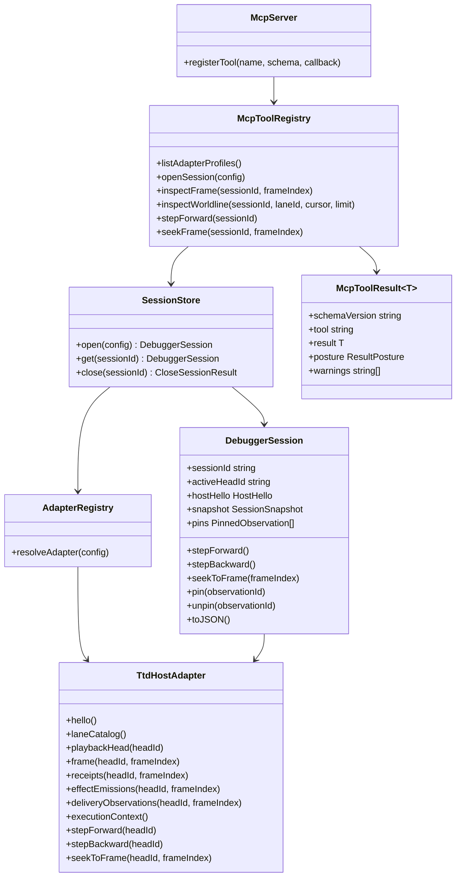
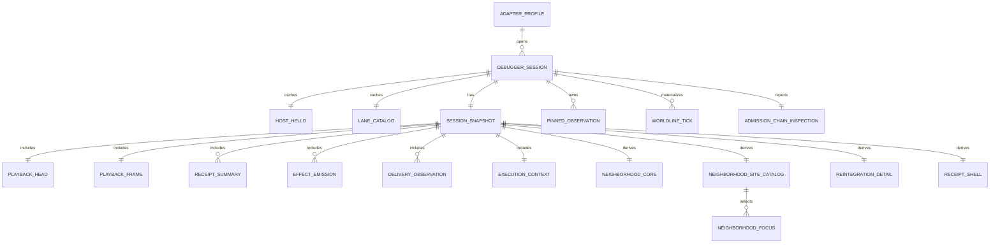
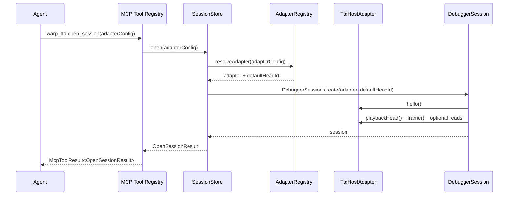
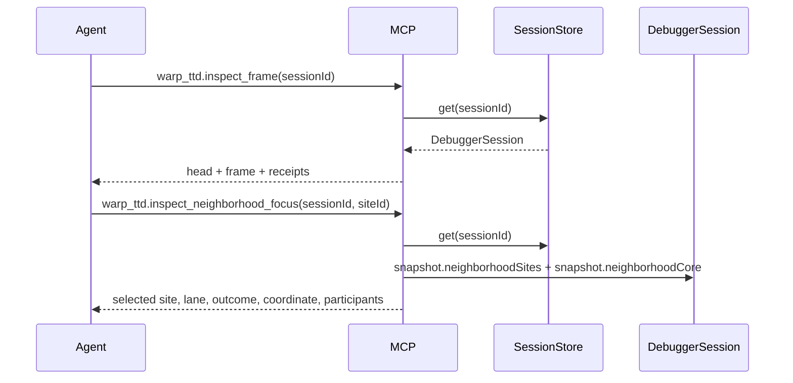
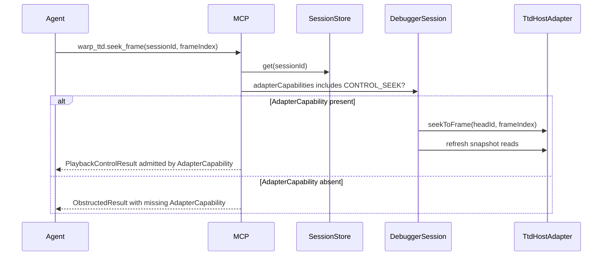
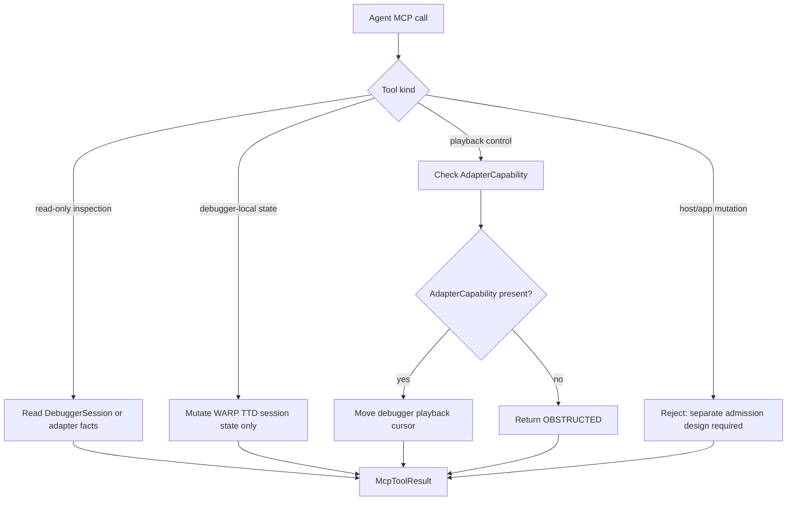

# MCP Agent Parity

**Cycle:** 0022-mcp-agent-parity
**Legend:** DELIVERY
**Type:** design-first feature cycle

## Sponsor Human

Operator wants WARP TTD to be agent-native and agent-first. The TUI is useful,
but LLMs should not have to screen-scrape terminal panes or shell out to CLI
commands to inspect Continuum apps.

## Sponsor Agent

LLM agent debugging `jedit`, a live Echo app, and `graft`, a live git-warp app.
Needs MCP tools that expose the same debugger facts and safe debugger actions as
CLI/TUI, with deterministic JSON outputs and explicit absence,
AdapterCapability support, authority, admission, mutation, and evidence posture.

## Hill

WARP TTD exposes an MCP API with semantic parity against the current CLI and TUI:

- CLI `--json` facts are available as targeted MCP tools.
- TUI read models are available as structured MCP facts.
- Debugger-local state changes, such as pins, are explicit MCP state changes.
- Playback control, such as step and seek, is gated by AdapterCapability and
  distinguished from host/application mutation.
- Host/application mutation, grant issuance, admission, and strand creation stay
  out of scope until a separate admitted-control design exists.

Parity means semantic parity, not visual parity. MCP does not copy panes,
keybindings, graph gutters, modal prompts, or terminal rendering.

## What's Missing

The current MCP surface is a narrow read-only seed:

| Surface | Current MCP Status | Missing Parity |
| :--- | :--- | :--- |
| Session lifecycle | One singleton `EchoFixtureAdapter` session | Open/list/close sessions and choose adapter profile. |
| Adapter selection | Hard-coded fixture | Echo fixture, git-warp repo, scenario fixtures, and live target profiles. |
| CLI host reads | Partially embedded in `inspect_adapter_capabilities` | Explicit host, catalog, head, frame, receipts, effects, deliveries, context tools. |
| CLI worldline read | Missing | Paged worldline/tick history with lane filter. |
| TUI navigator read model | Partially present through serialized session | Targeted snapshot, pins, receipts, emissions, and delivery observations. |
| TUI worldline read model | Missing | Lane tree, selected lane/tick, and worldline focus facts. |
| TUI neighborhood inspector | Missing as first-class MCP facts | Neighborhood core, sites, focus, reintegration detail, and receipt shell. |
| Debugger-local pins | Serialized only | Inspect/add/remove pin tools. |
| Playback controls | Missing by doctrine | Step forward, step backward, seek frame, AdapterCapability-gated and non-host-mutating. |
| Output schemas | Implicit TypeScript shapes | Versioned JSON Schema for every MCP output. |

## What This Adds

The parity API is grouped into four bands.

### Band 1: Session Lifecycle

- `warp_ttd.list_adapter_profiles`
- `warp_ttd.open_session`
- `warp_ttd.inspect_sessions`
- `warp_ttd.close_session`

### Band 2: CLI Read Parity

- `warp_ttd.inspect_host`
- `warp_ttd.inspect_lane_catalog`
- `warp_ttd.inspect_playback_head`
- `warp_ttd.inspect_frame`
- `warp_ttd.inspect_receipts`
- `warp_ttd.inspect_effect_emissions`
- `warp_ttd.inspect_delivery_observations`
- `warp_ttd.inspect_execution_context`
- `warp_ttd.inspect_worldline`
- `warp_ttd.inspect_live_targets`

### Band 3: TUI Read-Model Parity

- `warp_ttd.inspect_session`
- `warp_ttd.inspect_adapter_capabilities`
- `warp_ttd.inspect_readings`
- `warp_ttd.inspect_admission_chain`
- `warp_ttd.inspect_neighborhood_core`
- `warp_ttd.inspect_neighborhood_sites`
- `warp_ttd.inspect_neighborhood_focus`
- `warp_ttd.inspect_reintegration_detail`
- `warp_ttd.inspect_receipt_shell`
- `warp_ttd.inspect_worldline_focus`

### Band 4: Debugger-Local State And Playback Control

- `warp_ttd.inspect_pins`
- `warp_ttd.pin_observation`
- `warp_ttd.unpin_observation`
- `warp_ttd.step_forward`
- `warp_ttd.step_backward`
- `warp_ttd.seek_frame`

Pin tools mutate only WARP TTD debugger-local state. Playback tools move the
debugger playback cursor through adapter-supported control methods. They do not
issue authority, perform Echo admission, create strands, or mutate live
application state.

## Mermaid Class Diagram



## Entity Relationship Diagram



## Flow Diagrams

### Open Session



### Read Current Frame And Neighborhood



### Debugger Playback Control



### Admission Boundary



## MCP API

All tools return `structuredContent` matching `McpToolResult<T>` and include the
same object as JSON text content for MCP clients that do not yet read
`structuredContent`.

All examples omit unchanged nested protocol fields for readability. The schema
section below defines the full versioned output contract.

### Common Inputs

`SessionSelector`:

```json
{
  "sessionId": "sess_01"
}
```

`FrameSelector`:

```json
{
  "sessionId": "sess_01",
  "frameIndex": 4
}
```

When `frameIndex` is omitted, tools inspect the session's current frame.

### `warp_ttd.list_adapter_profiles`

Lists adapter profiles an agent may pass to `open_session`.

Kind: read-only.

Input:

```json
{}
```

Output schema: `AdapterProfilesResult`.

Example output:

```json
{
  "schemaVersion": "warp-ttd.mcp.v1",
  "tool": "warp_ttd.list_adapter_profiles",
  "posture": "OK",
  "result": {
    "profiles": [
      { "profileId": "echo-fixture", "kind": "echo-fixture", "requires": [] },
      { "profileId": "scenario:complex-worldline", "kind": "scenario", "scenario": "complex-worldline", "requires": [] },
      { "profileId": "git-warp", "kind": "git-warp", "requires": ["repoPath", "graphName"] }
    ]
  },
  "warnings": []
}
```

### `warp_ttd.open_session`

Opens a debugger session through the adapter registry.

Kind: debugger session lifecycle.

Input:

```json
{
  "adapterConfig": {
    "kind": "scenario",
    "scenario": "complex-worldline"
  }
}
```

Output schema: `OpenSessionResult`.

Example output:

```json
{
  "schemaVersion": "warp-ttd.mcp.v1",
  "tool": "warp_ttd.open_session",
  "posture": "OK",
  "result": {
    "sessionId": "sess_01",
    "activeHeadId": "head:default",
    "adapterProfile": { "kind": "scenario", "scenario": "complex-worldline" },
    "hostHello": {
      "hostKind": "ECHO",
      "hostVersion": "fixture",
      "protocolVersion": "0.6.0",
      "schemaId": "warp-ttd-protocol",
      "capabilities": ["READ_HELLO", "READ_LANE_CATALOG", "READ_FRAME"]
    },
    "laneCatalog": { "lanes": [] },
    "snapshot": { "head": {}, "frame": {}, "receipts": [], "emissions": [], "observations": [] }
  },
  "warnings": []
}
```

### `warp_ttd.inspect_sessions`

Lists open MCP debugger sessions.

Kind: read-only.

Input:

```json
{}
```

Output schema: `SessionsResult`.

Example output:

```json
{
  "schemaVersion": "warp-ttd.mcp.v1",
  "tool": "warp_ttd.inspect_sessions",
  "posture": "OK",
  "result": {
    "sessions": [
      { "sessionId": "sess_01", "activeHeadId": "head:default", "adapterKind": "scenario" }
    ]
  },
  "warnings": []
}
```

### `warp_ttd.close_session`

Closes debugger-local session state. It does not mutate the host app.

Kind: debugger session lifecycle.

Input:

```json
{
  "sessionId": "sess_01"
}
```

Output schema: `CloseSessionResult`.

Example output:

```json
{
  "schemaVersion": "warp-ttd.mcp.v1",
  "tool": "warp_ttd.close_session",
  "posture": "OK",
  "result": {
    "sessionId": "sess_01",
    "closed": true
  },
  "warnings": []
}
```

### `warp_ttd.inspect_host`

Returns cached `HostHello` for the session.

Kind: read-only.

Input:

```json
{
  "sessionId": "sess_01"
}
```

Output schema: `HostResult`.

Example output:

```json
{
  "schemaVersion": "warp-ttd.mcp.v1",
  "tool": "warp_ttd.inspect_host",
  "posture": "OK",
  "result": {
    "hostHello": {
      "hostKind": "GIT_WARP",
      "hostVersion": "16.0.0",
      "protocolVersion": "0.6.0",
      "schemaId": "warp-ttd-protocol",
      "capabilities": ["READ_HELLO", "READ_LANE_CATALOG"]
    }
  },
  "warnings": []
}
```

### `warp_ttd.inspect_adapter_capabilities`

Returns `HostHello` plus the cached AdapterCapability list.

Kind: read-only.

Input:

```json
{
  "sessionId": "sess_01"
}
```

Output schema: `AdapterCapabilitiesResult`.

Example output:

```json
{
  "schemaVersion": "warp-ttd.mcp.v1",
  "tool": "warp_ttd.inspect_adapter_capabilities",
  "posture": "OK",
  "result": {
    "hostHello": { "hostKind": "ECHO", "capabilities": ["READ_FRAME"] },
    "capabilities": ["READ_FRAME"]
  },
  "warnings": []
}
```

### `warp_ttd.inspect_lane_catalog`

Returns the session's lane catalog.

Kind: read-only.

Input:

```json
{
  "sessionId": "sess_01"
}
```

Output schema: `LaneCatalogResult`.

Example output:

```json
{
  "schemaVersion": "warp-ttd.mcp.v1",
  "tool": "warp_ttd.inspect_lane_catalog",
  "posture": "OK",
  "result": {
    "laneCatalog": {
      "lanes": [
        {
          "id": "wl:main",
          "kind": "WORLDLINE",
          "worldlineId": "wl:main",
          "writable": false,
          "description": "Main worldline"
        }
      ]
    }
  },
  "warnings": []
}
```

### `warp_ttd.inspect_playback_head`

Returns the active playback head.

Kind: read-only.

Input:

```json
{
  "sessionId": "sess_01"
}
```

Output schema: `PlaybackHeadResult`.

Example output:

```json
{
  "schemaVersion": "warp-ttd.mcp.v1",
  "tool": "warp_ttd.inspect_playback_head",
  "posture": "OK",
  "result": {
    "head": {
      "headId": "head:main",
      "label": "main",
      "currentFrameIndex": 4,
      "trackedLaneIds": ["wl:main"],
      "writableLaneIds": [],
      "paused": true
    }
  },
  "warnings": []
}
```

### `warp_ttd.inspect_frame`

Returns a frame, current head, and receipt summaries for that frame.

Kind: read-only.

Input:

```json
{
  "sessionId": "sess_01",
  "frameIndex": 4
}
```

Output schema: `FrameResult`.

Example output:

```json
{
  "schemaVersion": "warp-ttd.mcp.v1",
  "tool": "warp_ttd.inspect_frame",
  "posture": "OK",
  "result": {
    "head": { "headId": "head:main", "currentFrameIndex": 4 },
    "frame": {
      "headId": "head:main",
      "frameIndex": 4,
      "lanes": [
        {
          "laneId": "wl:main",
          "worldlineId": "wl:main",
          "coordinate": { "laneId": "wl:main", "worldlineId": "wl:main", "tick": 4 },
          "changed": true,
          "btrDigest": "abc1234"
        }
      ]
    },
    "receipts": []
  },
  "warnings": []
}
```

### `warp_ttd.inspect_receipts`

Returns receipt summaries for the selected frame.

Kind: read-only.

Input:

```json
{
  "sessionId": "sess_01",
  "frameIndex": 4
}
```

Output schema: `ReceiptsResult`.

Example output:

```json
{
  "schemaVersion": "warp-ttd.mcp.v1",
  "tool": "warp_ttd.inspect_receipts",
  "posture": "OK",
  "result": {
    "frameIndex": 4,
    "receipts": [
      {
        "receiptId": "receipt:4",
        "headId": "head:main",
        "frameIndex": 4,
        "laneId": "wl:main",
        "worldlineId": "wl:main",
        "inputTick": 3,
        "outputTick": 4,
        "admittedRewriteCount": 1,
        "rejectedRewriteCount": 0,
        "counterfactualCount": 0,
        "digest": "abc1234",
        "summary": "Admitted rewrite"
      }
    ]
  },
  "warnings": []
}
```

### `warp_ttd.inspect_effect_emissions`

Returns effect emissions for the selected frame.

Kind: read-only.

Input:

```json
{
  "sessionId": "sess_01",
  "frameIndex": 4
}
```

Output schema: `EffectEmissionsResult`.

Example output:

```json
{
  "schemaVersion": "warp-ttd.mcp.v1",
  "tool": "warp_ttd.inspect_effect_emissions",
  "posture": "OK",
  "result": {
    "frameIndex": 4,
    "emissions": [
      {
        "emissionId": "emission:4",
        "headId": "head:main",
        "frameIndex": 4,
        "laneId": "wl:main",
        "worldlineId": "wl:main",
        "coordinate": { "laneId": "wl:main", "worldlineId": "wl:main", "tick": 4 },
        "effectKind": "network.send",
        "producerWriter": { "writerId": "alice", "worldlineId": "wl:main" },
        "summary": "Network send requested"
      }
    ]
  },
  "warnings": []
}
```

### `warp_ttd.inspect_delivery_observations`

Returns delivery observations for the selected frame.

Kind: read-only.

Input:

```json
{
  "sessionId": "sess_01",
  "frameIndex": 4
}
```

Output schema: `DeliveryObservationsResult`.

Example output:

```json
{
  "schemaVersion": "warp-ttd.mcp.v1",
  "tool": "warp_ttd.inspect_delivery_observations",
  "posture": "OK",
  "result": {
    "frameIndex": 4,
    "observations": [
      {
        "observationId": "delivery:4",
        "emissionId": "emission:4",
        "headId": "head:main",
        "frameIndex": 4,
        "sinkId": "sink:network",
        "outcome": "SUPPRESSED",
        "reason": "Replay mode",
        "executionMode": "REPLAY",
        "summary": "Suppressed network send"
      }
    ]
  },
  "warnings": []
}
```

### `warp_ttd.inspect_execution_context`

Returns execution context for the session.

Kind: read-only.

Input:

```json
{
  "sessionId": "sess_01"
}
```

Output schema: `ExecutionContextResult`.

Example output:

```json
{
  "schemaVersion": "warp-ttd.mcp.v1",
  "tool": "warp_ttd.inspect_execution_context",
  "posture": "OK",
  "result": {
    "executionContext": {
      "mode": "REPLAY",
      "sessionId": "host-session:1",
      "observerId": "observer:agent",
      "apertureId": "aperture:debug"
    }
  },
  "warnings": []
}
```

### `warp_ttd.inspect_session`

Returns the full serialized debugger session.

Kind: read-only.

Input:

```json
{
  "sessionId": "sess_01"
}
```

Output schema: `SessionResult`.

Example output:

```json
{
  "schemaVersion": "warp-ttd.mcp.v1",
  "tool": "warp_ttd.inspect_session",
  "posture": "OK",
  "result": {
    "session": {
      "sessionId": "sess_01",
      "activeHeadId": "head:main",
      "snapshot": {},
      "pins": []
    }
  },
  "warnings": []
}
```

### `warp_ttd.inspect_worldline`

Returns paged worldline tick rows. This is the MCP equivalent of
`worldline --json` and the TUI worldline page's read model.

Kind: read-only.

Input:

```json
{
  "sessionId": "sess_01",
  "laneId": "wl:main",
  "limit": 50,
  "cursor": null,
  "order": "NEWEST_FIRST"
}
```

Output schema: `WorldlineResult`.

Example output:

```json
{
  "schemaVersion": "warp-ttd.mcp.v1",
  "tool": "warp_ttd.inspect_worldline",
  "posture": "OK",
  "result": {
    "laneId": "wl:main",
    "order": "NEWEST_FIRST",
    "nextCursor": "frame:149",
    "ticks": [
      {
        "frameIndex": 150,
        "laneId": "wl:main",
        "tick": 150,
        "digest": "def4567",
        "writers": ["alice@wl:main"],
        "strandIds": [],
        "hasConflict": false
      }
    ]
  },
  "warnings": []
}
```

### `warp_ttd.inspect_live_targets`

Returns read-only posture for known live app targets.

Kind: read-only.

Input:

```json
{}
```

Output schema: `LiveTargetsResult`.

Example output:

```json
{
  "schemaVersion": "warp-ttd.mcp.v1",
  "tool": "warp_ttd.inspect_live_targets",
  "posture": "OK",
  "result": {
    "targets": [
      {
        "targetId": "graft",
        "runtimeBoundaryEvidence": {
          "posture": "TRANSLATED_SUBSTRATE",
          "nativeContinuumWitness": false,
          "substrate": "git-warp",
          "evidenceKind": "warp-index"
        }
      }
    ]
  },
  "warnings": []
}
```

### `warp_ttd.inspect_readings`

Returns basis and reading posture for the current session snapshot.

Kind: read-only.

Input:

```json
{
  "sessionId": "sess_01"
}
```

Output schema: `ReadingsResult`.

Example output:

```json
{
  "schemaVersion": "warp-ttd.mcp.v1",
  "tool": "warp_ttd.inspect_readings",
  "posture": "OK",
  "result": {
    "reading": {
      "basisRef": "head:main@frame:4",
      "observerPlanRef": null,
      "readingEnvelopeRef": null,
      "readingPosture": "PRESENT",
      "witnessRef": null,
      "receiptRefs": ["receipt:4"],
      "runtimeSource": "REPLAY",
      "aperture": "aperture:debug",
      "budgetPosture": { "posture": "ABSENT", "reason": "Host adapter did not provide budget posture." },
      "headId": "head:main",
      "frameIndex": 4,
      "laneIds": ["wl:main"],
      "neighborhoodSiteId": "site:4",
      "neighborhoodOutcome": "ADMITTED"
    }
  },
  "warnings": []
}
```

### `warp_ttd.inspect_admission_chain`

Returns admission-chain posture. Missing runtime facts remain explicit `ABSENT`
posture until a host adapter provides them.

Kind: read-only.

Input:

```json
{
  "sessionId": "sess_01"
}
```

Output schema: `AdmissionChainResult`.

Example output:

```json
{
  "schemaVersion": "warp-ttd.mcp.v1",
  "tool": "warp_ttd.inspect_admission_chain",
  "posture": "OK",
  "result": {
    "basis": {
      "posture": "PRESENT",
      "value": { "basisRef": "head:main@frame:4", "headId": "head:main", "frameIndex": 4 }
    },
    "artifactRegistration": { "posture": "ABSENT", "reason": "Host adapter did not provide registered artifact facts." },
    "opticArtifactHandle": { "posture": "ABSENT", "reason": "Host adapter did not provide an Echo-owned optic artifact handle." },
    "opticAdmissionRequirements": { "posture": "ABSENT", "reason": "Host adapter did not provide optic admission requirements." },
    "capabilityGrant": { "posture": "ABSENT", "reason": "Host adapter did not provide capability grant posture." },
    "capabilityPresentation": { "posture": "ABSENT", "reason": "Host adapter did not provide capability presentation posture." },
    "admissionTicket": { "posture": "ABSENT", "reason": "Host adapter did not provide admission ticket or obstruction posture." },
    "lawWitness": { "posture": "ABSENT", "reason": "Host adapter did not provide law witness posture." },
    "receipts": { "posture": "PRESENT", "value": { "count": 1, "receiptIds": ["receipt:4"] } },
    "reading": { "posture": "PRESENT", "value": {} }
  },
  "warnings": []
}
```

### `warp_ttd.inspect_neighborhood_core`

Returns the current `NeighborhoodCoreSummary`.

Kind: read-only.

Input:

```json
{
  "sessionId": "sess_01"
}
```

Output schema: `NeighborhoodCoreResult`.

Example output:

```json
{
  "schemaVersion": "warp-ttd.mcp.v1",
  "tool": "warp_ttd.inspect_neighborhood_core",
  "posture": "OK",
  "result": {
    "neighborhoodCore": {
      "siteId": "site:4",
      "summary": "1 participating lane",
      "outcome": "ADMITTED",
      "coordinate": { "laneId": "wl:main", "worldlineId": "wl:main", "tick": 4 },
      "primaryLaneId": "wl:main",
      "primaryWorldlineId": "wl:main",
      "participatingLaneIds": ["wl:main"],
      "alternatives": []
    }
  },
  "warnings": []
}
```

### `warp_ttd.inspect_neighborhood_sites`

Returns the site catalog used by the TUI inspector rail.

Kind: read-only.

Input:

```json
{
  "sessionId": "sess_01"
}
```

Output schema: `NeighborhoodSitesResult`.

Example output:

```json
{
  "schemaVersion": "warp-ttd.mcp.v1",
  "tool": "warp_ttd.inspect_neighborhood_sites",
  "posture": "OK",
  "result": {
    "sites": [
      { "siteId": "site:4", "label": "Primary", "outcome": "ADMITTED", "laneId": "wl:main", "worldlineId": "wl:main" }
    ],
    "defaultSiteId": "site:4"
  },
  "warnings": []
}
```

### `warp_ttd.inspect_neighborhood_focus`

Returns the selected neighborhood focus for a site or lane.

Kind: read-only.

Input:

```json
{
  "sessionId": "sess_01",
  "siteId": "site:4"
}
```

Output schema: `NeighborhoodFocusResult`.

Example output:

```json
{
  "schemaVersion": "warp-ttd.mcp.v1",
  "tool": "warp_ttd.inspect_neighborhood_focus",
  "posture": "OK",
  "result": {
    "focus": {
      "siteId": "site:4",
      "kind": "PRIMARY",
      "outcome": "ADMITTED",
      "label": "Primary",
      "summary": "Current causal site",
      "coordinate": { "laneId": "wl:main", "worldlineId": "wl:main", "tick": 4 },
      "selectedLaneId": "wl:main",
      "selectedWorldlineId": "wl:main",
      "primaryLaneId": "wl:main",
      "primaryWorldlineId": "wl:main",
      "participatingLaneIds": ["wl:main"]
    }
  },
  "warnings": []
}
```

### `warp_ttd.inspect_reintegration_detail`

Returns reintegration detail for the current neighborhood site.

Kind: read-only.

Input:

```json
{
  "sessionId": "sess_01"
}
```

Output schema: `ReintegrationDetailResult`.

Example output:

```json
{
  "schemaVersion": "warp-ttd.mcp.v1",
  "tool": "warp_ttd.inspect_reintegration_detail",
  "posture": "OK",
  "result": {
    "reintegrationDetail": {
      "siteId": "site:4",
      "summary": "1 anchor, 1 obligation",
      "anchors": [],
      "obligations": [],
      "evidence": []
    }
  },
  "warnings": []
}
```

### `warp_ttd.inspect_receipt_shell`

Returns receipt shell facts for the current neighborhood site.

Kind: read-only.

Input:

```json
{
  "sessionId": "sess_01"
}
```

Output schema: `ReceiptShellResult`.

Example output:

```json
{
  "schemaVersion": "warp-ttd.mcp.v1",
  "tool": "warp_ttd.inspect_receipt_shell",
  "posture": "OK",
  "result": {
    "receiptShell": {
      "siteId": "site:4",
      "summary": "1 candidate, 0 rejected",
      "receiptIds": ["receipt:4"],
      "candidateCount": 1,
      "rejectedCount": 0,
      "hasBlockingRelation": false
    }
  },
  "warnings": []
}
```

### `warp_ttd.inspect_worldline_focus`

Returns the TUI-equivalent worldline focus derived from selected site, lane, and
current frame.

Kind: read-only.

Input:

```json
{
  "sessionId": "sess_01",
  "siteId": "site:4"
}
```

Output schema: `WorldlineFocusResult`.

Example output:

```json
{
  "schemaVersion": "warp-ttd.mcp.v1",
  "tool": "warp_ttd.inspect_worldline_focus",
  "posture": "OK",
  "result": {
    "focus": {
      "frameIndex": 4,
      "selectedSiteId": "site:4",
      "selectedLaneId": "wl:main",
      "laneCursor": 0,
      "cursor": 0
    }
  },
  "warnings": []
}
```

### `warp_ttd.inspect_pins`

Returns debugger-local pinned observations.

Kind: read-only.

Input:

```json
{
  "sessionId": "sess_01"
}
```

Output schema: `PinsResult`.

Example output:

```json
{
  "schemaVersion": "warp-ttd.mcp.v1",
  "tool": "warp_ttd.inspect_pins",
  "posture": "OK",
  "result": {
    "pins": []
  },
  "warnings": []
}
```

### `warp_ttd.pin_observation`

Pins a delivery observation into debugger-local state.

Kind: debugger-local state mutation. Not host mutation.

Input:

```json
{
  "sessionId": "sess_01",
  "observationId": "delivery:4"
}
```

Output schema: `PinObservationResult`.

Example output:

```json
{
  "schemaVersion": "warp-ttd.mcp.v1",
  "tool": "warp_ttd.pin_observation",
  "posture": "OK",
  "result": {
    "sessionId": "sess_01",
    "pinned": true,
    "pin": {
      "pinnedAt": 4,
      "observation": { "observationId": "delivery:4" },
      "emission": { "emissionId": "emission:4" }
    }
  },
  "warnings": []
}
```

### `warp_ttd.unpin_observation`

Removes a debugger-local pin.

Kind: debugger-local state mutation. Not host mutation.

Input:

```json
{
  "sessionId": "sess_01",
  "observationId": "delivery:4"
}
```

Output schema: `UnpinObservationResult`.

Example output:

```json
{
  "schemaVersion": "warp-ttd.mcp.v1",
  "tool": "warp_ttd.unpin_observation",
  "posture": "OK",
  "result": {
    "sessionId": "sess_01",
    "unpinned": true
  },
  "warnings": []
}
```

### `warp_ttd.step_forward`

Moves the debugger playback cursor forward by one frame.

Kind: playback control. Requires `CONTROL_STEP_FORWARD`.

Input:

```json
{
  "sessionId": "sess_01"
}
```

Output schema: `PlaybackControlResult`.

Example output:

```json
{
  "schemaVersion": "warp-ttd.mcp.v1",
  "tool": "warp_ttd.step_forward",
  "posture": "OK",
  "result": {
    "sessionId": "sess_01",
    "action": "STEP_FORWARD",
    "admittedByAdapterCapability": true,
    "before": { "headId": "head:main", "frameIndex": 4 },
    "after": { "headId": "head:main", "frameIndex": 5 },
    "snapshot": {}
  },
  "warnings": []
}
```

### `warp_ttd.step_backward`

Moves the debugger playback cursor backward by one frame.

Kind: playback control. Requires `CONTROL_STEP_BACKWARD`.

Input:

```json
{
  "sessionId": "sess_01"
}
```

Output schema: `PlaybackControlResult`.

Example output:

```json
{
  "schemaVersion": "warp-ttd.mcp.v1",
  "tool": "warp_ttd.step_backward",
  "posture": "OK",
  "result": {
    "sessionId": "sess_01",
    "action": "STEP_BACKWARD",
    "admittedByAdapterCapability": true,
    "before": { "headId": "head:main", "frameIndex": 5 },
    "after": { "headId": "head:main", "frameIndex": 4 },
    "snapshot": {}
  },
  "warnings": []
}
```

### `warp_ttd.seek_frame`

Moves the debugger playback cursor to an exact frame.

Kind: playback control. Requires `CONTROL_SEEK`.

Input:

```json
{
  "sessionId": "sess_01",
  "frameIndex": 4
}
```

Output schema: `PlaybackControlResult`.

Example output:

```json
{
  "schemaVersion": "warp-ttd.mcp.v1",
  "tool": "warp_ttd.seek_frame",
  "posture": "OK",
  "result": {
    "sessionId": "sess_01",
    "action": "SEEK_FRAME",
    "admittedByAdapterCapability": true,
    "before": { "headId": "head:main", "frameIndex": 1 },
    "after": { "headId": "head:main", "frameIndex": 4 },
    "snapshot": {}
  },
  "warnings": []
}
```

If AdapterCapability is missing, output uses the common obstruction shape:

```json
{
  "schemaVersion": "warp-ttd.mcp.v1",
  "tool": "warp_ttd.seek_frame",
  "posture": "OBSTRUCTED",
  "result": {
    "reason": "Adapter does not advertise CONTROL_SEEK.",
    "missingAdapterCapability": "CONTROL_SEEK"
  },
  "warnings": []
}
```

## Versioned JSON Schemas

All MCP outputs use schema version `warp-ttd.mcp.v1`.

The JSON Schemas below are the command-output contract. They intentionally refer
to shared protocol schemas by name. The implementation can initially host these
schemas in docs, then promote them into generated artifacts once the MCP surface
stabilizes.

### Common Envelope

```json
{
  "$id": "https://warp-ttd.local/schemas/mcp/v1/McpToolResult.schema.json",
  "$schema": "https://json-schema.org/draft/2020-12/schema",
  "title": "McpToolResult",
  "type": "object",
  "required": ["schemaVersion", "tool", "posture", "result", "warnings"],
  "properties": {
    "schemaVersion": { "const": "warp-ttd.mcp.v1" },
    "tool": { "type": "string", "pattern": "^warp_ttd\\.[a-z0-9_]+$" },
    "posture": { "$ref": "#/$defs/ResultPosture" },
    "result": { "type": "object" },
    "warnings": { "type": "array", "items": { "type": "string" } }
  },
  "$defs": {
    "ResultPosture": {
      "type": "string",
      "enum": ["OK", "ABSENT", "OBSTRUCTED", "ERROR"]
    },
    "AdmissionFactPosture": {
      "type": "string",
      "enum": ["ABSENT", "PRESENT", "OBSTRUCTED"]
    },
    "AdmissionFact": {
      "type": "object",
      "required": ["posture"],
      "properties": {
        "posture": { "$ref": "#/$defs/AdmissionFactPosture" },
        "reason": { "type": "string" },
        "value": {}
      },
      "additionalProperties": false
    },
    "AdapterConfig": {
      "oneOf": [
        {
          "type": "object",
          "required": ["kind"],
          "properties": { "kind": { "const": "echo-fixture" } },
          "additionalProperties": false
        },
        {
          "type": "object",
          "required": ["kind", "scenario"],
          "properties": {
            "kind": { "const": "scenario" },
            "scenario": {
              "type": "string",
              "enum": ["live-with-effects", "replay-with-suppression", "multi-writer-conflicts", "complex-worldline"]
            }
          },
          "additionalProperties": false
        },
        {
          "type": "object",
          "required": ["kind", "repoPath", "graphName"],
          "properties": {
            "kind": { "const": "git-warp" },
            "repoPath": { "type": "string" },
            "graphName": { "type": "string" }
          },
          "additionalProperties": false
        }
      ]
    },
    "SessionSummary": {
      "type": "object",
      "required": ["sessionId", "activeHeadId", "adapterKind"],
      "properties": {
        "sessionId": { "type": "string" },
        "activeHeadId": { "type": "string" },
        "adapterKind": { "type": "string" }
      },
      "additionalProperties": true
    },
    "ProtocolObject": {
      "type": "object",
      "additionalProperties": true
    }
  }
}
```

### Output Result Schemas

Every tool-specific result is embedded as `McpToolResult.result`.

```json
{
  "$id": "https://warp-ttd.local/schemas/mcp/v1/AdapterProfilesResult.schema.json",
  "$schema": "https://json-schema.org/draft/2020-12/schema",
  "title": "AdapterProfilesResult",
  "type": "object",
  "required": ["profiles"],
  "properties": {
    "profiles": {
      "type": "array",
      "items": {
        "type": "object",
        "required": ["profileId", "kind", "requires"],
        "properties": {
          "profileId": { "type": "string" },
          "kind": { "type": "string", "enum": ["echo-fixture", "scenario", "git-warp", "live-target"] },
          "scenario": { "type": "string" },
          "targetId": { "type": "string" },
          "requires": { "type": "array", "items": { "type": "string" } }
        },
        "additionalProperties": false
      }
    }
  },
  "additionalProperties": false
}
```

```json
{
  "$id": "https://warp-ttd.local/schemas/mcp/v1/OpenSessionResult.schema.json",
  "$schema": "https://json-schema.org/draft/2020-12/schema",
  "title": "OpenSessionResult",
  "type": "object",
  "required": ["sessionId", "activeHeadId", "adapterProfile", "hostHello", "laneCatalog", "snapshot"],
  "properties": {
    "sessionId": { "type": "string" },
    "activeHeadId": { "type": "string" },
    "adapterProfile": { "$ref": "McpToolResult.schema.json#/$defs/AdapterConfig" },
    "hostHello": { "$ref": "McpToolResult.schema.json#/$defs/ProtocolObject" },
    "laneCatalog": { "$ref": "McpToolResult.schema.json#/$defs/ProtocolObject" },
    "snapshot": { "$ref": "McpToolResult.schema.json#/$defs/ProtocolObject" }
  },
  "additionalProperties": false
}
```

```json
{
  "$id": "https://warp-ttd.local/schemas/mcp/v1/SessionsResult.schema.json",
  "$schema": "https://json-schema.org/draft/2020-12/schema",
  "title": "SessionsResult",
  "type": "object",
  "required": ["sessions"],
  "properties": {
    "sessions": {
      "type": "array",
      "items": { "$ref": "McpToolResult.schema.json#/$defs/SessionSummary" }
    }
  },
  "additionalProperties": false
}
```

```json
{
  "$id": "https://warp-ttd.local/schemas/mcp/v1/CloseSessionResult.schema.json",
  "$schema": "https://json-schema.org/draft/2020-12/schema",
  "title": "CloseSessionResult",
  "type": "object",
  "required": ["sessionId", "closed"],
  "properties": {
    "sessionId": { "type": "string" },
    "closed": { "type": "boolean" }
  },
  "additionalProperties": false
}
```

```json
{
  "$id": "https://warp-ttd.local/schemas/mcp/v1/HostResult.schema.json",
  "$schema": "https://json-schema.org/draft/2020-12/schema",
  "title": "HostResult",
  "type": "object",
  "required": ["hostHello"],
  "properties": {
    "hostHello": { "$ref": "McpToolResult.schema.json#/$defs/ProtocolObject" }
  },
  "additionalProperties": false
}
```

```json
{
  "$id": "https://warp-ttd.local/schemas/mcp/v1/AdapterCapabilitiesResult.schema.json",
  "$schema": "https://json-schema.org/draft/2020-12/schema",
  "title": "AdapterCapabilitiesResult",
  "type": "object",
  "required": ["hostHello", "capabilities"],
  "properties": {
    "hostHello": { "$ref": "McpToolResult.schema.json#/$defs/ProtocolObject" },
    "capabilities": { "type": "array", "items": { "type": "string" } }
  },
  "additionalProperties": false
}
```

```json
{
  "$id": "https://warp-ttd.local/schemas/mcp/v1/LaneCatalogResult.schema.json",
  "$schema": "https://json-schema.org/draft/2020-12/schema",
  "title": "LaneCatalogResult",
  "type": "object",
  "required": ["laneCatalog"],
  "properties": {
    "laneCatalog": { "$ref": "McpToolResult.schema.json#/$defs/ProtocolObject" }
  },
  "additionalProperties": false
}
```

```json
{
  "$id": "https://warp-ttd.local/schemas/mcp/v1/PlaybackHeadResult.schema.json",
  "$schema": "https://json-schema.org/draft/2020-12/schema",
  "title": "PlaybackHeadResult",
  "type": "object",
  "required": ["head"],
  "properties": {
    "head": { "$ref": "McpToolResult.schema.json#/$defs/ProtocolObject" }
  },
  "additionalProperties": false
}
```

```json
{
  "$id": "https://warp-ttd.local/schemas/mcp/v1/FrameResult.schema.json",
  "$schema": "https://json-schema.org/draft/2020-12/schema",
  "title": "FrameResult",
  "type": "object",
  "required": ["head", "frame", "receipts"],
  "properties": {
    "head": { "$ref": "McpToolResult.schema.json#/$defs/ProtocolObject" },
    "frame": { "$ref": "McpToolResult.schema.json#/$defs/ProtocolObject" },
    "receipts": { "type": "array", "items": { "$ref": "McpToolResult.schema.json#/$defs/ProtocolObject" } }
  },
  "additionalProperties": false
}
```

```json
{
  "$id": "https://warp-ttd.local/schemas/mcp/v1/ReceiptsResult.schema.json",
  "$schema": "https://json-schema.org/draft/2020-12/schema",
  "title": "ReceiptsResult",
  "type": "object",
  "required": ["frameIndex", "receipts"],
  "properties": {
    "frameIndex": { "type": "integer", "minimum": 0 },
    "receipts": { "type": "array", "items": { "$ref": "McpToolResult.schema.json#/$defs/ProtocolObject" } }
  },
  "additionalProperties": false
}
```

```json
{
  "$id": "https://warp-ttd.local/schemas/mcp/v1/EffectEmissionsResult.schema.json",
  "$schema": "https://json-schema.org/draft/2020-12/schema",
  "title": "EffectEmissionsResult",
  "type": "object",
  "required": ["frameIndex", "emissions"],
  "properties": {
    "frameIndex": { "type": "integer", "minimum": 0 },
    "emissions": { "type": "array", "items": { "$ref": "McpToolResult.schema.json#/$defs/ProtocolObject" } }
  },
  "additionalProperties": false
}
```

```json
{
  "$id": "https://warp-ttd.local/schemas/mcp/v1/DeliveryObservationsResult.schema.json",
  "$schema": "https://json-schema.org/draft/2020-12/schema",
  "title": "DeliveryObservationsResult",
  "type": "object",
  "required": ["frameIndex", "observations"],
  "properties": {
    "frameIndex": { "type": "integer", "minimum": 0 },
    "observations": { "type": "array", "items": { "$ref": "McpToolResult.schema.json#/$defs/ProtocolObject" } }
  },
  "additionalProperties": false
}
```

```json
{
  "$id": "https://warp-ttd.local/schemas/mcp/v1/ExecutionContextResult.schema.json",
  "$schema": "https://json-schema.org/draft/2020-12/schema",
  "title": "ExecutionContextResult",
  "type": "object",
  "required": ["executionContext"],
  "properties": {
    "executionContext": { "$ref": "McpToolResult.schema.json#/$defs/ProtocolObject" }
  },
  "additionalProperties": false
}
```

```json
{
  "$id": "https://warp-ttd.local/schemas/mcp/v1/SessionResult.schema.json",
  "$schema": "https://json-schema.org/draft/2020-12/schema",
  "title": "SessionResult",
  "type": "object",
  "required": ["session"],
  "properties": {
    "session": { "$ref": "McpToolResult.schema.json#/$defs/ProtocolObject" }
  },
  "additionalProperties": false
}
```

```json
{
  "$id": "https://warp-ttd.local/schemas/mcp/v1/WorldlineResult.schema.json",
  "$schema": "https://json-schema.org/draft/2020-12/schema",
  "title": "WorldlineResult",
  "type": "object",
  "required": ["order", "ticks"],
  "properties": {
    "laneId": { "type": ["string", "null"] },
    "order": { "type": "string", "enum": ["NEWEST_FIRST", "OLDEST_FIRST"] },
    "nextCursor": { "type": ["string", "null"] },
    "ticks": {
      "type": "array",
      "items": {
        "type": "object",
        "required": ["frameIndex", "digest", "writers", "strandIds", "hasConflict"],
        "properties": {
          "frameIndex": { "type": "integer", "minimum": 0 },
          "laneId": { "type": "string" },
          "tick": { "type": "integer", "minimum": 0 },
          "digest": { "type": "string" },
          "writers": { "type": "array", "items": { "type": "string" } },
          "strandIds": { "type": "array", "items": { "type": "string" } },
          "hasConflict": { "type": "boolean" }
        },
        "additionalProperties": true
      }
    }
  },
  "additionalProperties": false
}
```

```json
{
  "$id": "https://warp-ttd.local/schemas/mcp/v1/LiveTargetsResult.schema.json",
  "$schema": "https://json-schema.org/draft/2020-12/schema",
  "title": "LiveTargetsResult",
  "type": "object",
  "required": ["targets"],
  "properties": {
    "targets": { "type": "array", "items": { "$ref": "McpToolResult.schema.json#/$defs/ProtocolObject" } }
  },
  "additionalProperties": false
}
```

```json
{
  "$id": "https://warp-ttd.local/schemas/mcp/v1/ReadingsResult.schema.json",
  "$schema": "https://json-schema.org/draft/2020-12/schema",
  "title": "ReadingsResult",
  "type": "object",
  "required": ["reading"],
  "properties": {
    "reading": { "$ref": "McpToolResult.schema.json#/$defs/ProtocolObject" }
  },
  "additionalProperties": false
}
```

```json
{
  "$id": "https://warp-ttd.local/schemas/mcp/v1/AdmissionChainResult.schema.json",
  "$schema": "https://json-schema.org/draft/2020-12/schema",
  "title": "AdmissionChainResult",
  "type": "object",
  "required": [
    "basis",
    "artifactRegistration",
    "opticArtifactHandle",
    "opticAdmissionRequirements",
    "capabilityGrant",
    "capabilityPresentation",
    "admissionTicket",
    "lawWitness",
    "receipts",
    "reading"
  ],
  "properties": {
    "basis": { "$ref": "McpToolResult.schema.json#/$defs/AdmissionFact" },
    "artifactRegistration": { "$ref": "McpToolResult.schema.json#/$defs/AdmissionFact" },
    "opticArtifactHandle": { "$ref": "McpToolResult.schema.json#/$defs/AdmissionFact" },
    "opticAdmissionRequirements": { "$ref": "McpToolResult.schema.json#/$defs/AdmissionFact" },
    "capabilityGrant": { "$ref": "McpToolResult.schema.json#/$defs/AdmissionFact" },
    "capabilityPresentation": { "$ref": "McpToolResult.schema.json#/$defs/AdmissionFact" },
    "admissionTicket": { "$ref": "McpToolResult.schema.json#/$defs/AdmissionFact" },
    "lawWitness": { "$ref": "McpToolResult.schema.json#/$defs/AdmissionFact" },
    "receipts": { "$ref": "McpToolResult.schema.json#/$defs/AdmissionFact" },
    "reading": { "$ref": "McpToolResult.schema.json#/$defs/AdmissionFact" }
  },
  "additionalProperties": false
}
```

```json
{
  "$id": "https://warp-ttd.local/schemas/mcp/v1/NeighborhoodCoreResult.schema.json",
  "$schema": "https://json-schema.org/draft/2020-12/schema",
  "title": "NeighborhoodCoreResult",
  "type": "object",
  "required": ["neighborhoodCore"],
  "properties": {
    "neighborhoodCore": { "$ref": "McpToolResult.schema.json#/$defs/ProtocolObject" }
  },
  "additionalProperties": false
}
```

```json
{
  "$id": "https://warp-ttd.local/schemas/mcp/v1/NeighborhoodSitesResult.schema.json",
  "$schema": "https://json-schema.org/draft/2020-12/schema",
  "title": "NeighborhoodSitesResult",
  "type": "object",
  "required": ["sites", "defaultSiteId"],
  "properties": {
    "sites": { "type": "array", "items": { "$ref": "McpToolResult.schema.json#/$defs/ProtocolObject" } },
    "defaultSiteId": { "type": "string" }
  },
  "additionalProperties": false
}
```

```json
{
  "$id": "https://warp-ttd.local/schemas/mcp/v1/NeighborhoodFocusResult.schema.json",
  "$schema": "https://json-schema.org/draft/2020-12/schema",
  "title": "NeighborhoodFocusResult",
  "type": "object",
  "required": ["focus"],
  "properties": {
    "focus": { "$ref": "McpToolResult.schema.json#/$defs/ProtocolObject" }
  },
  "additionalProperties": false
}
```

```json
{
  "$id": "https://warp-ttd.local/schemas/mcp/v1/ReintegrationDetailResult.schema.json",
  "$schema": "https://json-schema.org/draft/2020-12/schema",
  "title": "ReintegrationDetailResult",
  "type": "object",
  "required": ["reintegrationDetail"],
  "properties": {
    "reintegrationDetail": { "$ref": "McpToolResult.schema.json#/$defs/ProtocolObject" }
  },
  "additionalProperties": false
}
```

```json
{
  "$id": "https://warp-ttd.local/schemas/mcp/v1/ReceiptShellResult.schema.json",
  "$schema": "https://json-schema.org/draft/2020-12/schema",
  "title": "ReceiptShellResult",
  "type": "object",
  "required": ["receiptShell"],
  "properties": {
    "receiptShell": { "$ref": "McpToolResult.schema.json#/$defs/ProtocolObject" }
  },
  "additionalProperties": false
}
```

```json
{
  "$id": "https://warp-ttd.local/schemas/mcp/v1/WorldlineFocusResult.schema.json",
  "$schema": "https://json-schema.org/draft/2020-12/schema",
  "title": "WorldlineFocusResult",
  "type": "object",
  "required": ["focus"],
  "properties": {
    "focus": {
      "type": "object",
      "required": ["frameIndex", "selectedSiteId", "selectedLaneId", "laneCursor", "cursor"],
      "properties": {
        "frameIndex": { "type": "integer", "minimum": 0 },
        "selectedSiteId": { "type": ["string", "null"] },
        "selectedLaneId": { "type": ["string", "null"] },
        "laneCursor": { "type": "integer", "minimum": 0 },
        "cursor": { "type": "integer", "minimum": 0 }
      },
      "additionalProperties": false
    }
  },
  "additionalProperties": false
}
```

```json
{
  "$id": "https://warp-ttd.local/schemas/mcp/v1/PinsResult.schema.json",
  "$schema": "https://json-schema.org/draft/2020-12/schema",
  "title": "PinsResult",
  "type": "object",
  "required": ["pins"],
  "properties": {
    "pins": { "type": "array", "items": { "$ref": "McpToolResult.schema.json#/$defs/ProtocolObject" } }
  },
  "additionalProperties": false
}
```

```json
{
  "$id": "https://warp-ttd.local/schemas/mcp/v1/PinObservationResult.schema.json",
  "$schema": "https://json-schema.org/draft/2020-12/schema",
  "title": "PinObservationResult",
  "type": "object",
  "required": ["sessionId", "pinned"],
  "properties": {
    "sessionId": { "type": "string" },
    "pinned": { "type": "boolean" },
    "pin": { "$ref": "McpToolResult.schema.json#/$defs/ProtocolObject" }
  },
  "additionalProperties": false
}
```

```json
{
  "$id": "https://warp-ttd.local/schemas/mcp/v1/UnpinObservationResult.schema.json",
  "$schema": "https://json-schema.org/draft/2020-12/schema",
  "title": "UnpinObservationResult",
  "type": "object",
  "required": ["sessionId", "unpinned"],
  "properties": {
    "sessionId": { "type": "string" },
    "unpinned": { "type": "boolean" }
  },
  "additionalProperties": false
}
```

```json
{
  "$id": "https://warp-ttd.local/schemas/mcp/v1/PlaybackControlResult.schema.json",
  "$schema": "https://json-schema.org/draft/2020-12/schema",
  "title": "PlaybackControlResult",
  "type": "object",
  "required": ["sessionId", "action", "admittedByAdapterCapability", "before", "after", "snapshot"],
  "properties": {
    "sessionId": { "type": "string" },
    "action": { "type": "string", "enum": ["STEP_FORWARD", "STEP_BACKWARD", "SEEK_FRAME"] },
    "admittedByAdapterCapability": { "type": "boolean" },
    "before": {
      "type": "object",
      "required": ["headId", "frameIndex"],
      "properties": {
        "headId": { "type": "string" },
        "frameIndex": { "type": "integer", "minimum": 0 }
      },
      "additionalProperties": false
    },
    "after": {
      "type": "object",
      "required": ["headId", "frameIndex"],
      "properties": {
        "headId": { "type": "string" },
        "frameIndex": { "type": "integer", "minimum": 0 }
      },
      "additionalProperties": false
    },
    "snapshot": { "$ref": "McpToolResult.schema.json#/$defs/ProtocolObject" }
  },
  "additionalProperties": false
}
```

```json
{
  "$id": "https://warp-ttd.local/schemas/mcp/v1/ObstructedResult.schema.json",
  "$schema": "https://json-schema.org/draft/2020-12/schema",
  "title": "ObstructedResult",
  "type": "object",
  "required": ["reason"],
  "properties": {
    "reason": { "type": "string" },
    "missingAdapterCapability": { "type": "string" },
    "sessionId": { "type": "string" }
  },
  "additionalProperties": false
}
```

## Tool Annotation Policy

| Tool Class | `readOnlyHint` | `destructiveHint` | `idempotentHint` | Notes |
| :--- | :--- | :--- | :--- | :--- |
| Inspection tools | `true` | `false` | `true` | No session or host mutation. |
| Session lifecycle open/close | `false` | `false` | `false` | Mutates MCP server session store only. |
| Pin/unpin | `false` | `false` | `false` | Mutates debugger-local pins only. |
| Playback control | `false` | `false` | `false` | Moves debugger playback cursor only after AdapterCapability check. |
| Host/application mutation | not registered | not registered | not registered | Requires future admission design. |

## Implementation Slices

1. **Session lifecycle**
   - Add `SessionStore`.
   - Reuse `resolveAdapter`.
   - Add `list_adapter_profiles`, `open_session`, `inspect_sessions`, and
     `close_session`.
   - Keep the current fixture behavior as default when no explicit session is
     open.

2. **CLI read parity**
   - Add host, catalog, head, frame, receipts, effects, deliveries, context, and
     worldline tools.
   - Add tests comparing fixture MCP output to CLI `--json` output.
   - Add pagination for `inspect_worldline`.

3. **TUI read-model parity**
   - Add neighborhood, reintegration, receipt shell, and worldline focus tools.
   - Reuse existing app-layer summary objects instead of parsing TUI text.

4. **Debugger-local state and playback control**
   - Add pins first.
   - Add step/back/seek with AdapterCapability checks.
   - Return structured `OBSTRUCTED` results when an AdapterCapability is missing.

## Playback Questions

1. Can an agent open the same adapter profiles the TUI can choose?
2. Can an agent obtain every CLI `--json` fact through an MCP tool?
3. Can an agent inspect worldline rows with pagination and lane filtering?
4. Can an agent inspect neighborhood focus, reintegration detail, and receipt
   shell facts without reading TUI text?
5. Can an agent pin and unpin observations without mutating the host app?
6. Do playback controls refuse to run when the AdapterCapability is absent?
7. Do playback controls identify themselves as debugger playback control, not
   host/application mutation?
8. Does every MCP tool output include `schemaVersion: "warp-ttd.mcp.v1"`?
9. Does every MCP tool output conform to a named JSON Schema?
10. Does the API preserve the admission boundary: no grants, no Echo admission,
    no strand creation, no host/app mutation?

## Non-Goals

- No grant issuance.
- No capability presentation construction.
- No Echo runtime admission.
- No strand creation.
- No host or application mutation.
- No TUI rendering over MCP.
- No unbounded worldline dumps.
- No upgrading adapter readiness into native Continuum witnesshood.

## Acceptance Checklist

- `npm run mcp` exposes the session lifecycle tools.
- Every current CLI `--json` command has a matching MCP inspection tool or a
  documented exception.
- The TUI navigator, worldline, and neighborhood inspector read models are
  available as structured MCP outputs.
- Pin/unpin tools mutate only debugger-local session state.
- Step/back/seek tools check `AdapterCapability` before calling the adapter.
- All tool outputs carry `schemaVersion: "warp-ttd.mcp.v1"`.
- Tests assert schemas, tool annotations, and parity against fixture CLI output.
