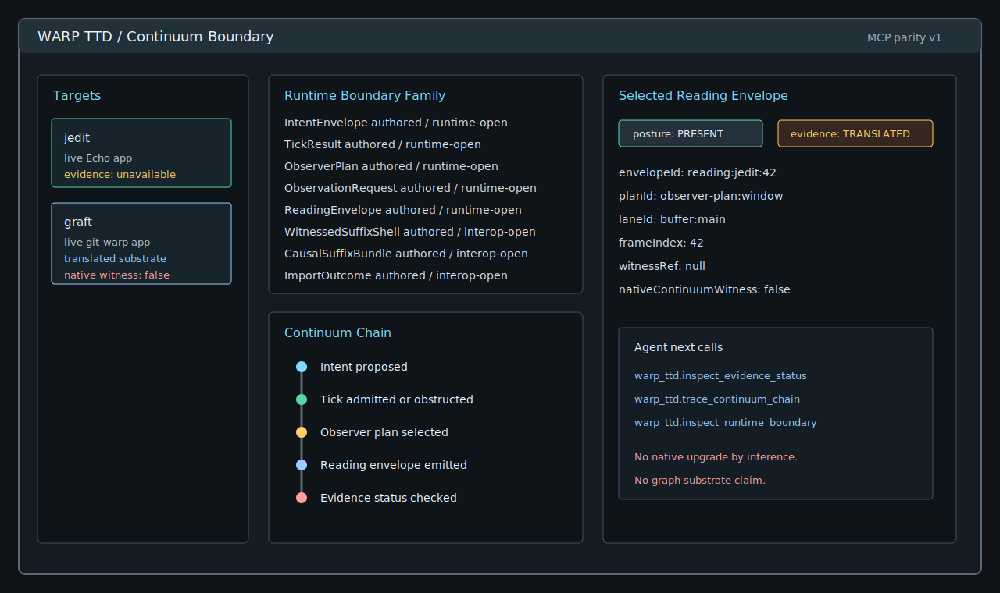
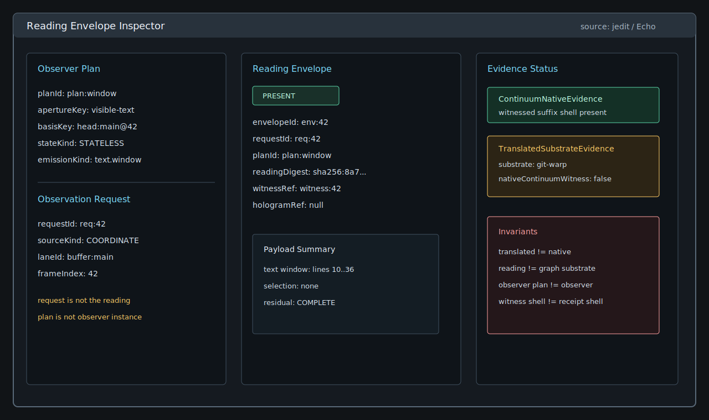
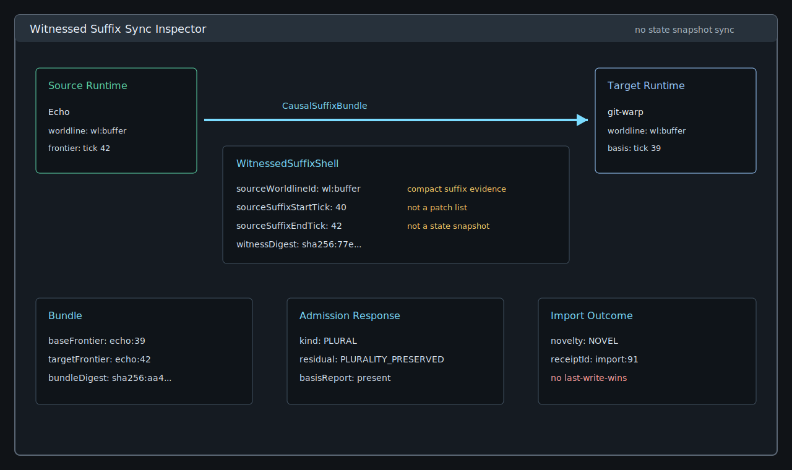
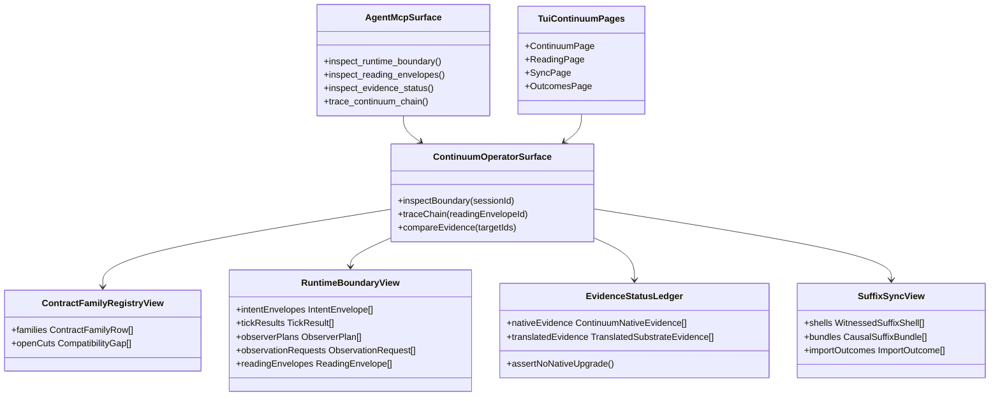
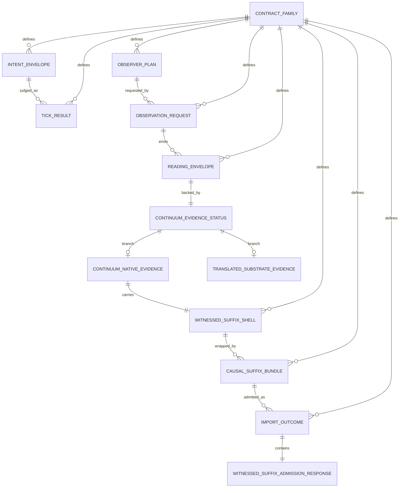
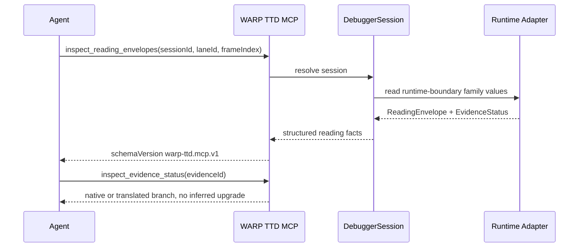
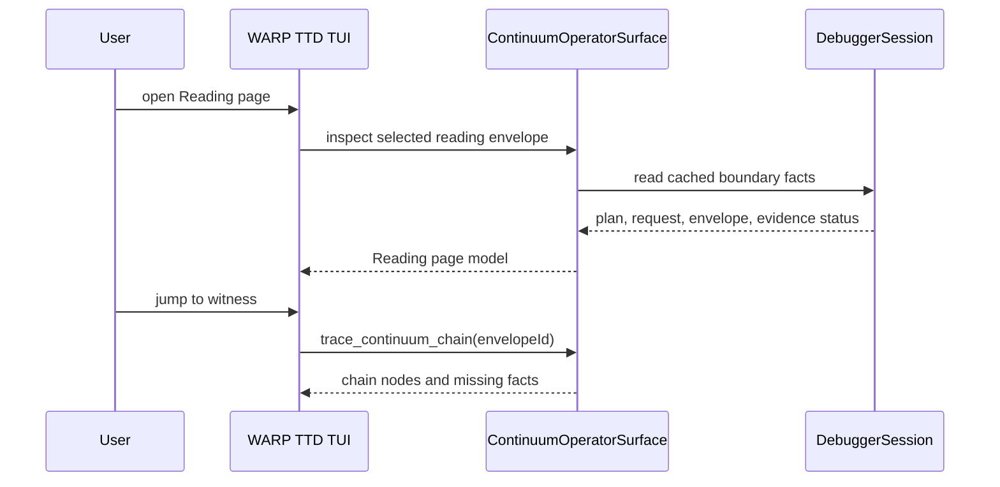
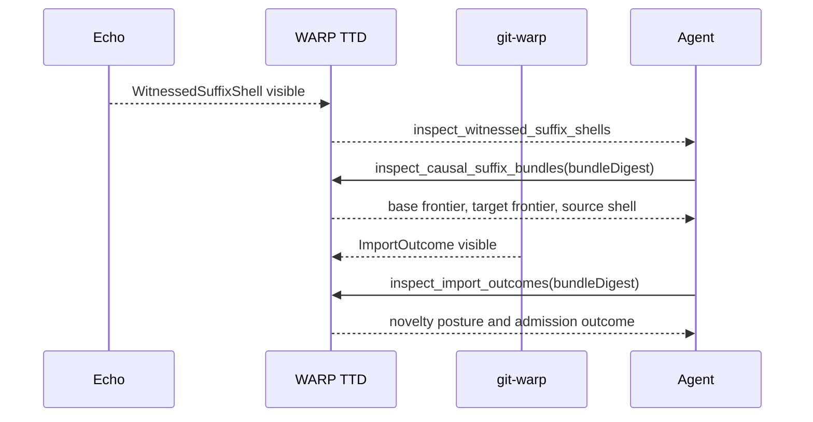
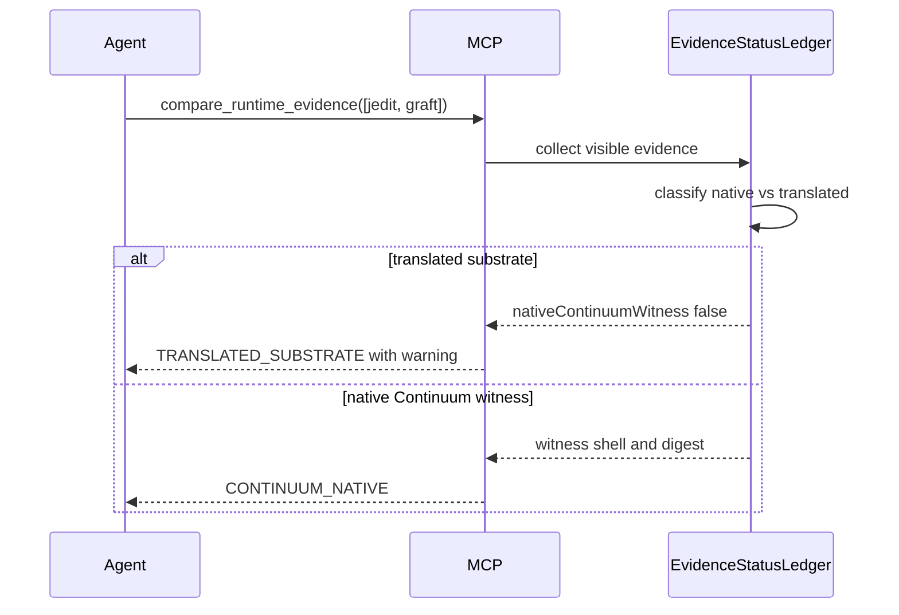

# Continuum Operator Surface

**Cycle:** 0023-continuum-operator-surface
**Legend:** DELIVERY
**Type:** design-first feature cycle

## Sponsor Human

Operator wants WARP TTD to catch up with Continuum's current ontology without
turning into a runtime, compiler, authority issuer, or graph substrate viewer.
The near-future product should help debug `jedit`, `graft`, Echo, and `git-warp`
through the shared Continuum boundary language.

## Sponsor Agent

LLM agent using WARP TTD as the primary way to inspect Continuum apps. The agent
needs stable MCP tools that answer:

- What authored family is this value from?
- Is the value native Continuum evidence or translated substrate evidence?
- What observer plan/request produced this reading?
- What admission result, witness, shell, receipt, or import outcome backs it?
- Where is the boundary between debugger projection and runtime truth?

## Continuum Takeaways

The latest Continuum doctrine changes the WARP TTD roadmap in a concrete way.

1. There is no canonical materialized graph. A graph-shaped value is a
   materialized reading over witnessed causal history.
2. Continuum owns shared coordination truth, not runtime truth. WARP TTD consumes
   shared family artifacts and runtime emissions; it does not author runtime
   truth.
3. The next shared runtime-boundary family is the spine WARP TTD should inspect:
   `IntentEnvelope`, `TickResult`, `ObserverPlan`, `ObservationRequest`,
   `ReadingEnvelope`, `ContinuumEvidenceStatus`, `WitnessedSuffixShell`,
   `CausalSuffixBundle`, and `ImportOutcome`.
4. Evidence status is first-class. `TranslatedSubstrateEvidence` is useful, but
   it must not be upgraded to `ContinuumNativeEvidence` by inference.
5. Sync between sibling runtimes is witnessed causal suffix exchange, not state
   snapshot replication.
6. Admission remains the common kernel: derived, plural, conflict, obstruction,
   staged, or admitted outcomes must stay visible as outcomes, not collapse into
   booleans.
7. The debugger may choose an observer-relative projection. That is not canonical
   runtime collapse unless the runtime published such a collapse with witness.

## Near-Future Additions

### 1. Continuum Boundary Explorer

Add a view over the contract-family registry and generated/runtime posture.

It should show:

- family key and version
- authored home
- shared nouns
- Wesley profile/witness status
- runtime status
- primary consumers
- evidence status
- open compatibility cut

This lets agents and humans see whether WARP TTD is looking at authored schema,
fixture evidence, translated substrate evidence, or native runtime evidence.

### 2. Runtime Boundary Chain Inspector

Add a chain view that joins:

```text
IntentEnvelope
  -> TickResult
  -> ObserverPlan
  -> ObservationRequest
  -> ReadingEnvelope
  -> ContinuumEvidenceStatus
  -> witness / receipt / shell refs
```

For `jedit`, this becomes the text-runtime path from authored intent to admitted
tick to observer-relative reading. For `graft`, this becomes the structural
observer path where git-warp substrate facts may be translated evidence until
native Continuum publication exists.

### 3. Reading Envelope Inspector

The current materialized reading framing needs a sharper inspector for:

- observer plan identity
- observation request identity
- lane and coordinate
- reading digest
- residual posture
- evidence status branch
- witness reference
- hologram reference when present
- whether the reading is native, translated, obstructed, rights-limited, or
  budget-limited

This is the direct product response to "there is no graph." The inspector shows
what produced the reading and what evidence backs it.

### 4. Evidence Status Ledger

Add a ledger that collects every evidence-bearing fact visible in the current
session:

- `ContinuumNativeEvidence`
- `TranslatedSubstrateEvidence`
- runtime-boundary evidence posture
- witness refs
- evidence digests
- substrate and evidence kind
- `nativeContinuumWitness`

This becomes the audit surface for the "no native upgrade by inference" rule.

### 5. Witnessed Suffix Sync Inspector

Add an inspector for sibling-runtime exchange:

```text
WitnessedSuffixShell
  -> CausalSuffixBundle
  -> WitnessedSuffixAdmissionResponse
  -> ImportOutcome
```

The view must make clear that the exchanged object is a witnessed causal suffix,
not a materialized graph snapshot or patch list.

### 6. Outcome And Obstruction Matrix

Add a compact outcome matrix over admission and import results:

- `DERIVED`
- `PLURAL`
- `CONFLICT`
- `OBSTRUCTION`
- `ADMITTED`
- `STAGED`
- `OBSTRUCTED`

The matrix should answer why an operation or import is not just "allowed" or
"denied": it may be plural, staged, obstructed by rights, obstructed by budget,
or conflict-bearing.

### 7. Agent Playbooks

Add MCP playbook outputs for common investigations:

- "Why is this reading not native Continuum evidence?"
- "Trace this app-facing reading back to its intent and tick result."
- "Compare jedit and graft evidence posture."
- "Show all imported suffix bundles touching this lane."
- "Show every obstruction in the current basis."

Playbooks should be read-only summaries assembled from structured facts. They
must not hide the underlying nouns.

## Agent MCP Surface

These are near-future additions on top of the MCP parity plan.

| MCP Tool | Purpose | Host Mutation? |
| :--- | :--- | :--- |
| `warp_ttd.inspect_contract_family_registry` | Read shared family ownership, witness status, and open cuts. | No |
| `warp_ttd.inspect_runtime_boundary` | Return visible runtime-boundary facts for a session. | No |
| `warp_ttd.inspect_intent_envelopes` | Inspect set-side intent carriers by lane or operation. | No |
| `warp_ttd.inspect_tick_results` | Inspect immediate admission results for a lane/frame. | No |
| `warp_ttd.inspect_observer_plans` | Inspect get-side observer plan facts. | No |
| `warp_ttd.inspect_observation_requests` | Inspect observation requests by plan, lane, or source kind. | No |
| `warp_ttd.inspect_reading_envelopes` | Inspect reading envelopes and residual posture. | No |
| `warp_ttd.inspect_evidence_status` | Inspect native or translated evidence branch details. | No |
| `warp_ttd.inspect_witnessed_suffix_shells` | Inspect suffix shell evidence by source worldline. | No |
| `warp_ttd.inspect_causal_suffix_bundles` | Inspect bundle identity, base frontier, target frontier, and source shell. | No |
| `warp_ttd.inspect_import_outcomes` | Inspect distributed suffix admission/import outcomes. | No |
| `warp_ttd.compare_runtime_evidence` | Compare evidence posture across jedit/graft/Echo/git-warp targets. | No |
| `warp_ttd.trace_continuum_chain` | Trace an app-facing reading or receipt back through boundary nouns. | No |

All tools return `schemaVersion: "warp-ttd.mcp.v1"` until the MCP family itself
is promoted into Continuum-owned schemas. Tool results should carry:

```ts
type ContinuumInspectionResult<T> = {
  schemaVersion: "warp-ttd.mcp.v1";
  tool: string;
  posture: "OK" | "ABSENT" | "OBSTRUCTED" | "ERROR";
  continuumFamily?: string;
  evidenceStatus?: "CONTINUUM_NATIVE" | "TRANSLATED_SUBSTRATE" | "UNAVAILABLE";
  nativeContinuumWitness?: boolean;
  result: T;
  warnings: readonly string[];
};
```

### Example: Evidence Status

Call:

```json
{
  "tool": "warp_ttd.inspect_evidence_status",
  "arguments": {
    "sessionId": "sess_01",
    "evidenceId": "evidence:graft:abc"
  }
}
```

Result:

```json
{
  "schemaVersion": "warp-ttd.mcp.v1",
  "tool": "warp_ttd.inspect_evidence_status",
  "posture": "OK",
  "continuumFamily": "runtime-boundary-family",
  "evidenceStatus": "TRANSLATED_SUBSTRATE",
  "nativeContinuumWitness": false,
  "result": {
    "evidenceId": "evidence:graft:abc",
    "substrate": "git-warp",
    "evidenceKind": "warp-index",
    "evidenceDigest": "sha256:abc",
    "summary": "Translated git-warp index evidence; not native Continuum witnesshood."
  },
  "warnings": [
    "Translated substrate evidence must not be treated as ContinuumNativeEvidence."
  ]
}
```

### Example: Trace Continuum Chain

Call:

```json
{
  "tool": "warp_ttd.trace_continuum_chain",
  "arguments": {
    "sessionId": "sess_01",
    "readingEnvelopeId": "env:jedit:42"
  }
}
```

Result:

```json
{
  "schemaVersion": "warp-ttd.mcp.v1",
  "tool": "warp_ttd.trace_continuum_chain",
  "posture": "OK",
  "continuumFamily": "runtime-boundary-family",
  "evidenceStatus": "CONTINUUM_NATIVE",
  "nativeContinuumWitness": true,
  "result": {
    "chain": [
      { "kind": "IntentEnvelope", "id": "intent:jedit:replace-range" },
      { "kind": "TickResult", "id": "tick:jedit:42", "outcomeKind": "DERIVED" },
      { "kind": "ObserverPlan", "id": "plan:text-window" },
      { "kind": "ObservationRequest", "id": "request:text-window:42" },
      { "kind": "ReadingEnvelope", "id": "env:jedit:42" },
      { "kind": "ContinuumNativeEvidence", "id": "evidence:jedit:42" },
      { "kind": "WitnessedSuffixShell", "id": "shell:jedit:42" }
    ]
  },
  "warnings": []
}
```

### Example: Import Outcome

Call:

```json
{
  "tool": "warp_ttd.inspect_import_outcomes",
  "arguments": {
    "sessionId": "sess_01",
    "bundleDigest": "sha256:aa4"
  }
}
```

Result:

```json
{
  "schemaVersion": "warp-ttd.mcp.v1",
  "tool": "warp_ttd.inspect_import_outcomes",
  "posture": "OK",
  "continuumFamily": "runtime-boundary-family",
  "evidenceStatus": "CONTINUUM_NATIVE",
  "nativeContinuumWitness": true,
  "result": {
    "outcomes": [
      {
        "outcomeId": "import:91",
        "bundleDigest": "sha256:aa4",
        "targetRuntimeId": "git-warp",
        "targetWorldlineId": "wl:buffer",
        "noveltyPosture": "NOVEL",
        "admission": {
          "kind": "PLURAL",
          "residualPosture": "PLURALITY_PRESERVED"
        },
        "receiptId": "receipt:import:91"
      }
    ]
  },
  "warnings": []
}
```

## TUI Surface

The TUI should become an operator cockpit over the same MCP/read-model facts. It
should not invent a second truth surface.

### Page: Continuum

Purpose:

- show live targets and evidence status
- show current contract-family registry rows
- show current runtime-boundary chain summary
- highlight open cuts and absent facts

Primary panes:

- Targets
- Runtime Boundary Family
- Continuum Chain
- Selected Reading Envelope

### Page: Reading

Purpose:

- inspect `ObserverPlan`
- inspect `ObservationRequest`
- inspect `ReadingEnvelope`
- inspect `ContinuumEvidenceStatus`
- show invariants that are currently satisfied or obstructed

Primary panes:

- Observer Plan
- Observation Request
- Reading Envelope
- Evidence Status

### Page: Sync

Purpose:

- inspect witnessed suffix shells
- inspect causal suffix bundles
- inspect import outcomes
- distinguish import admission from state synchronization

Primary panes:

- Source Runtime
- Target Runtime
- Witnessed Suffix Shell
- Causal Suffix Bundle
- Admission Response
- Import Outcome

### Page: Outcomes

Purpose:

- show derived/plural/conflict/obstruction posture by frame, lane, and runtime
- let an operator jump from an outcome to its chain, reading, witness, or bundle

This page can come after the first three because it composes facts they expose.

## Mock TUI Layouts







## Mermaid Class Diagram



## Entity Relationship Diagram



## Sequence Diagrams

### Agent Inspects Reading Evidence



### TUI Navigates From Reading To Witness



### Sibling Runtime Suffix Import



### Evidence Upgrade Refusal



## Implementation Order

1. Add data-only `ContinuumOperatorSurface` app module that reads from existing
   session snapshots plus adapter-provided optional runtime-boundary facts.
2. Add MCP tools for evidence status and chain tracing first:
   - `warp_ttd.inspect_evidence_status`
   - `warp_ttd.trace_continuum_chain`
   - `warp_ttd.compare_runtime_evidence`
3. Add runtime-boundary family tools:
   - `warp_ttd.inspect_runtime_boundary`
   - `warp_ttd.inspect_reading_envelopes`
   - `warp_ttd.inspect_tick_results`
   - `warp_ttd.inspect_observer_plans`
4. Add TUI `Continuum` and `Reading` pages as renderers over the same app module.
5. Add suffix sync tools and `Sync` page only after fixture data exists:
   - `warp_ttd.inspect_witnessed_suffix_shells`
   - `warp_ttd.inspect_causal_suffix_bundles`
   - `warp_ttd.inspect_import_outcomes`

## Playback Questions

1. Can an agent ask why a reading is not native Continuum evidence and receive a
   structured answer?
2. Can an agent trace a reading envelope back through plan, request, tick result,
   and witness/shell refs?
3. Can the TUI show the same evidence branch and warning as MCP?
4. Can WARP TTD show `graft` translated evidence without claiming native
   Continuum witnesshood?
5. Can WARP TTD show `jedit` native evidence only after Echo/jedit actually
   emits Continuum-native evidence?
6. Can suffix sync be inspected without describing it as graph sync?
7. Can plural/conflict/obstruction outcomes remain visible and navigable?

## Non-Goals

- No grant issuance.
- No Echo admission implementation.
- No suffix import execution.
- No strand creation.
- No graph substrate viewer.
- No hand-authored replacement for Continuum-owned schemas.
- No native witness claim for translated git-warp/Graft evidence.
