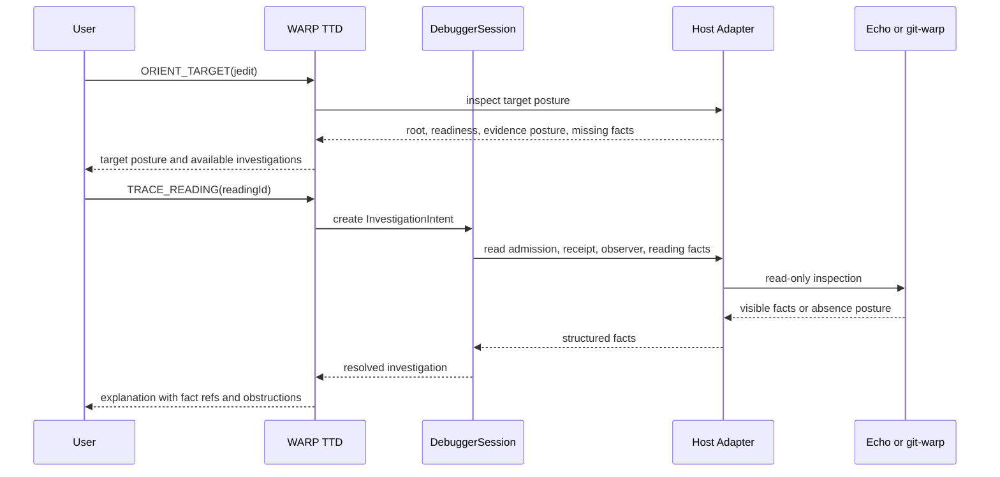

# WARP App Debugging Intents

**Cycle:** 0025-warp-app-debugging-intents
**Legend:** DELIVERY
**Type:** design-first feature cycle

## Sponsor Human

Operator debugging a WARP application such as `jedit` on Echo or `graft` on
git-warp. Needs the debugger to feel like an honest causal cockpit: every view
names what moment, observer, basis, evidence posture, and admission posture it
is showing.

## Sponsor Agent

LLM agent using WARP TTD through MCP. Needs stable investigation verbs that
turn debugging questions into structured, deterministic reads before any TUI
gesture becomes the only way to perform the work.

## Answer

Yes, WARP TTD needs its own small set of debugger-native intents to debug Echo
applications and other WARP apps. They should be called
`InvestigationIntent`s, not Echo app intents.

The distinction is the important part:

- Echo `IntentEnvelope` is a runtime/app fact. It may represent an app-facing
  proposed change, observation request, or admitted tick input.
- WARP TTD `InvestigationIntent` is a debugger-session fact. It represents what
  the operator or agent wants to learn, compare, trace, replay, pin, or explain.
- WARP TTD may inspect Echo `IntentEnvelope`s and correlate them with tick
  results, witnesses, receipts, and readings.
- WARP TTD must not author Echo app intents, issue grants, present authority,
  perform runtime admission, mutate host state, or create strands unless a later
  admitted-control design explicitly adds that path.

So the debugger does need intents, but they are investigation intents over
evidence, not app intents over application state.

## Hill

Debugging a WARP app feels like asking precise causal questions against a live
history:

1. Choose the app target.
2. See what the debugger can and cannot lawfully inspect.
3. Pick a moment, lane, reading, receipt, effect, obstruction, or app-facing
   operation.
4. Ask "what happened?", "why?", "what did this observer see?", "what authority
   and admission facts backed it?", "what changed?", or "what differs from that
   other lane?".
5. Receive an answer that names the coordinate, basis, observer, evidence
   posture, admission posture, receipts, witnesses, and missing facts.

The user should never have to guess whether they are looking at native
Continuum evidence, translated substrate evidence, a fixture, a missing Echo
fact, or a TUI-only rendering.

## Product Feel

WARP app debugging should feel less like stepping through hidden process memory
and more like working with a flight recorder for a causal system.

- The first screen or first MCP response orients the user: target, host, root,
  adapter readiness, evidence posture, available reads, unsupported reads, and
  whether the surface is live, replay, or fixture-backed.
- Time is navigable, but every visible moment is coordinate-backed. Frame,
  lane, worldline, strand, and tick stay distinct.
- Every app-facing value is traceable backward to the observation request or
  runtime input that produced it, then forward to receipts, effects, deliveries,
  readings, witnesses, or obstructions.
- Missing information is visible as an absence posture. The debugger should
  say "Echo did not expose a law witness" instead of showing an empty panel.
- Human views are explanatory and fast, but the same facts are available to
  agents through MCP and CLI JSON.
- Playback control changes only the debugger cursor unless a later design adds
  admitted host control. It should never surprise-mutate the app.

## Investigation Intent Model

An `InvestigationIntent` is local debugger state:

```ts
type InvestigationIntent = {
  schemaVersion: "warp-ttd.investigation-intent.v1";
  intentId: string;
  kind: InvestigationIntentKind;
  target: DebuggerTargetRef;
  basis?: DebuggerBasisRef;
  observer?: ObserverRef;
  question: string;
  hostMutation: false;
  admissionRequired: false;
  createdBy: "human" | "agent";
};
```

The first version is deliberately read-mostly. It may move debugger-local focus
or pins, and it may request adapter-supported playback cursor movement, but it
does not change host application state.

## Core Intents

| Intent | User question | First structured surface |
| :--- | :--- | :--- |
| `ORIENT_TARGET` | What is this app, and what can WARP TTD inspect right now? | `targets --json`, `warp_ttd.inspect_live_targets` |
| `OPEN_SESSION` | Start an inspection session against this target. | `warp_ttd.open_session` |
| `INSPECT_MOMENT` | What is visible at this frame, lane, or tick? | `frame --json`, `warp_ttd.inspect_frame` |
| `TRACE_READING` | What produced this app-facing reading? | `warp_ttd.trace_continuum_chain` |
| `INSPECT_ADMISSION` | What artifact, handle, grant posture, ticket, witness, receipt, or reading facts exist? | `admission-chain --json`, `warp_ttd.inspect_admission_chain` |
| `EXPLAIN_OUTCOME` | Why was this operation admitted, rejected, obstructed, plural, or conflict-bearing? | `warp_ttd.explain_outcome` |
| `COMPARE_COORDINATES` | What changed between these two coordinates or lanes? | `warp_ttd.compare_coordinates` |
| `INSPECT_EFFECTS` | What external effect candidates and delivery observations happened? | `warp_ttd.inspect_effect_emissions`, `warp_ttd.inspect_delivery_observations` |
| `INSPECT_EVIDENCE` | Is this native Continuum evidence, translated substrate evidence, or unavailable? | `warp_ttd.inspect_evidence_status` |
| `PIN_FINDING` | Keep this fact in the investigation trail. | `warp_ttd.pin_observation` |
| `PLAYBACK_CURSOR` | Move the debugger view to a different frame. | `step --json`, `warp_ttd.seek_frame` |
| `REQUEST_SPECULATION` | Can I explore a lawful what-if from here? | Future admitted-control design only |

The names are debugger verbs, not Echo commands. They can target Echo facts,
git-warp facts, or shared Continuum facts through the same investigation
vocabulary.

## What The User Can Do

### Orient

The user can point WARP TTD at a known app target and see:

- target name and host family
- app root and whether it exists
- adapter readiness
- session mode
- available adapter support
- runtime-boundary evidence posture
- admission-chain posture
- current missing facts

For an agent, this is `warp_ttd.inspect_live_targets` or
`targets --json`. For a human, the TUI target screen renders the same result.

### Inspect

The user can inspect the current moment:

- current playback head
- frame index
- lane coordinates
- app-facing readings
- receipts
- effect emissions
- delivery observations
- execution context
- neighborhood focus when present

Every inspected value should carry a coordinate or explain why it is
session-level rather than coordinate-level.

### Trace

The user can select a reading, receipt, effect, obstruction, or app-facing
operation and trace it through the relevant chain:

```text
InvestigationIntent
  -> target and basis
  -> Echo IntentEnvelope or substrate operation when present
  -> TickResult or receipt
  -> admission-chain facts
  -> ObserverPlan or observation request
  -> ReadingEnvelope or materialized reading
  -> evidence posture and witness refs
```

For Echo, this is where app intent, admission, witness, and reading facts become
inspectable without WARP TTD becoming Echo. For git-warp, the same trace may be
through substrate receipts, causal history, and translated readings.

### Explain

The user can ask for an explanation without losing the underlying facts. An
explanation is an assembled read model with a summary, not a replacement for the
chain.

The explanation should answer:

- what was the basis?
- which observer or aperture was used?
- what changed?
- which law, receipt, witness, or substrate fact backs the result?
- which facts are absent or obstructed?
- what is the confidence/evidence posture?

### Compare

The user can compare:

- two frames on one lane
- two lanes at related coordinates
- a worldline and a strand
- two readings produced by different observer plans
- `jedit` and `graft` evidence posture for a shared debugging question

The comparison must distinguish changed app state, changed observer aperture,
changed evidence posture, and changed admission posture.

### Playback

The user can move the debugger playback cursor:

- step forward
- step backward when supported
- seek to a frame when supported
- preserve pinned findings while moving

Playback is local debugger control over view position. It does not imply app
mutation. If the adapter cannot support a movement, the result is an explicit
obstruction.

### Pin And Report

The user can pin important facts, assemble a small investigation trail, and
export or summarize it. Pinned facts should preserve their original coordinate,
evidence posture, and source tool so later explanations do not drift.

### Request What-If Later

The user can ask whether a lawful what-if is possible from a coordinate, but
the first version only reports feasibility and blockers. Creating strands,
presenting authority, or submitting app/runtime intents requires a separate
admitted-control design.

## Human Surface

The human TUI/browser surface should be a renderer over the same facts, with
five primary work areas:

1. **Target Bar**: target, host, mode, adapter readiness, evidence posture.
2. **Worldline Navigator**: playback cursor, lanes, ticks, receipts, pins.
3. **Reading Inspector**: app-facing reading, observer, basis, digest, residual
   posture.
4. **Admission Chain**: artifact, handle, grant posture, ticket, witness,
   receipt, reading.
5. **Investigation Trail**: active `InvestigationIntent`s, pinned facts,
   comparison results, unresolved obstructions.

The TUI may make these feel natural with selection, panes, and shortcuts, but
it must not hide facts that agents cannot inspect structurally.

## Agent Surface

The agent surface should expose the same workflow as targeted MCP tools and
CLI JSON commands:

```text
orient -> open -> inspect -> trace -> explain -> compare -> pin -> report
```

Near-future MCP additions implied by this cycle:

| MCP Tool | Purpose | Host Mutation? |
| :--- | :--- | :--- |
| `warp_ttd.create_investigation_intent` | Record a debugger-local investigation goal. | No |
| `warp_ttd.inspect_investigation_intents` | List active local investigation goals and their status. | No |
| `warp_ttd.resolve_investigation_intent` | Assemble the best available structured answer from current facts. | No |
| `warp_ttd.explain_outcome` | Explain an admission, obstruction, receipt, or reading outcome while preserving fact refs. | No |
| `warp_ttd.compare_coordinates` | Compare coordinate-backed readings or frames. | No |
| `warp_ttd.export_investigation_trail` | Emit pinned facts and conclusions as a structured report. | No |

These tools mutate only debugger-local session state when they record or pin an
investigation goal. They do not mutate Echo, git-warp, or any WARP app.

## Sequence



## Implementation Order

1. Define `InvestigationIntent` as a debugger-local read model and test its
   non-host-mutating boundary.
2. Add MCP/CLI inspection for active investigation intents before adding TUI
   affordances.
3. Implement `resolve_investigation_intent` for `ORIENT_TARGET`,
   `INSPECT_MOMENT`, `TRACE_READING`, and `INSPECT_ADMISSION` by composing
   existing live-target, session, reading, and admission-chain facts.
4. Add `EXPLAIN_OUTCOME` and `COMPARE_COORDINATES` only after the trace result
   can preserve fact refs.
5. Add TUI investigation-trail rendering once the structured facts are stable.
6. Leave `REQUEST_SPECULATION` as blocked until admission-chain facts and
   admitted-control design exist.

## Playback Questions

1. Can WARP TTD distinguish debugger `InvestigationIntent`s from Echo
   `IntentEnvelope`s?
2. Can an agent create or inspect an investigation intent without causing host
   mutation?
3. Can an agent resolve "trace this reading" into a structured chain that names
   basis, observer, evidence posture, admission posture, receipts, witnesses,
   and missing facts?
4. Can a human use the TUI to follow the same chain without relying on
   TUI-only facts?
5. Can playback cursor movement remain debugger-local and report obstruction
   when adapter support is unavailable?
6. Can WARP TTD compare two coordinate-backed moments without flattening frame,
   lane, worldline, strand, and tick vocabulary?
7. Can WARP TTD refuse to turn a what-if request into strand creation until a
   later admitted-control design exists?

## Non-Goals

- No Echo `IntentEnvelope` authoring.
- No grant issuance.
- No `CapabilityPresentation` construction.
- No Echo runtime admission.
- No app mutation.
- No strand creation.
- No TUI-only investigation behavior.
- No graph substrate viewer that bypasses observer, evidence, and admission
  posture.
