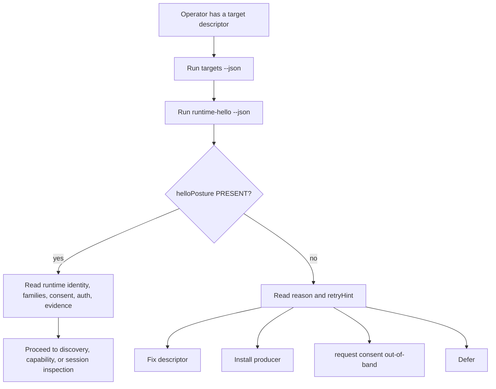

# Vendor-Neutral Continuum Runtime Hello Handshake

## Linked Issue

- [Issue #80](https://github.com/flyingrobots/warp-ttd/issues/80)

## Decision Summary

WARP TTD should define and consume a vendor-neutral
`continuum.debug.hello.v1` handshake before it deepens runtime discovery,
endpoint connection, or debugger capability inspection. The handshake is a
read-only Continuum compatibility declaration: a runtime reports identity,
protocol versions, supported shared families, debugger-facing capability
posture, evidence posture, consent posture, auth posture, redaction posture,
and obstruction reasons without granting authority, performing admission,
mutating host state, or requiring WARP TTD to branch on app names or vendor
names. Continuum owns the shared semantic contract; WARP TTD owns the debugger
read model, CLI/MCP inspection surface, and honest obstruction behavior.

## Sponsored Human

A runtime integrator wants WARP TTD to recognize any Continuum-compatible
runtime by asking one small hello question so that new vendors can become
debuggable without submitting WARP TTD patches, without pretending to be
`jedit`, Echo, `graft`, or git-warp.

## Sponsored Agent

An agent needs a deterministic runtime hello contract and inspection surface so
it can decide whether a target is Continuum-compatible, which protocol families
and debugger operations are inspectable, and why a connection is blocked,
without inferring capability from app names, private adapter code, filesystem
layout, or visual debugger state.

## Hill

By the end of the implementation cycle that follows this design, an agent can
run a runtime hello inspection through CLI JSON or MCP against configured
Continuum-compatible targets and receive `continuum.debug.hello.v1` posture
facts for native, translated, unsupported, and obstructed runtimes, and the repo
proves it with behavior tests over actual CLI/MCP/API output.

## Current Truth

- WARP TTD already reports configured live targets through descriptor-derived
  `LiveTargetInspection` records. Those records carry `connectionMode`,
  `hostKind`, `appKind`, root posture, adapter posture, admission-chain
  posture, runtime-boundary evidence posture, capabilities, and reason strings:
  [src/app/liveTargetInspection.ts#104:f7a205cf2368abb76940ec290f216641ac7e6f57](https://github.com/flyingrobots/warp-ttd/blob/f7a205cf2368abb76940ec290f216641ac7e6f57/src/app/liveTargetInspection.ts#L104).
- The default target descriptors still name `jedit` and `graft` as local
  witnesses, even though they are intended to be facts rather than debugger
  concepts:
  [src/app/liveTargetInspection.ts#157:f7a205cf2368abb76940ec290f216641ac7e6f57](https://github.com/flyingrobots/warp-ttd/blob/f7a205cf2368abb76940ec290f216641ac7e6f57/src/app/liveTargetInspection.ts#L157).
- The current Echo-root inspection path reports unavailable native Continuum
  evidence and says adapter/session publication remain explicit posture facts:
  [src/app/liveTargetInspection.ts#252:f7a205cf2368abb76940ec290f216641ac7e6f57](https://github.com/flyingrobots/warp-ttd/blob/f7a205cf2368abb76940ec290f216641ac7e6f57/src/app/liveTargetInspection.ts#L252).
- The current git-warp path reports translated substrate evidence and keeps
  `nativeContinuumWitness: false`:
  [src/app/liveTargetInspection.ts#276:f7a205cf2368abb76940ec290f216641ac7e6f57](https://github.com/flyingrobots/warp-ttd/blob/f7a205cf2368abb76940ec290f216641ac7e6f57/src/app/liveTargetInspection.ts#L276).
- Descriptor-only targets are visible, but their reason string says runtime
  handshake discovery is not implemented:
  [src/app/liveTargetInspection.ts#301:f7a205cf2368abb76940ec290f216641ac7e6f57](https://github.com/flyingrobots/warp-ttd/blob/f7a205cf2368abb76940ec290f216641ac7e6f57/src/app/liveTargetInspection.ts#L301).
- Live target session inspection has host-specific union branches for Echo,
  git-warp, and descriptor-only targets:
  [src/app/liveTargetSessionInspection.ts#19:f7a205cf2368abb76940ec290f216641ac7e6f57](https://github.com/flyingrobots/warp-ttd/blob/f7a205cf2368abb76940ec290f216641ac7e6f57/src/app/liveTargetSessionInspection.ts#L19).
- The CLI exposes `targets`, `target-session`, and `admission-chain`, but no
  runtime hello command:
  [src/cli.ts#14:f7a205cf2368abb76940ec290f216641ac7e6f57](https://github.com/flyingrobots/warp-ttd/blob/f7a205cf2368abb76940ec290f216641ac7e6f57/src/cli.ts#L14).
- CLI dispatch currently treats `targets` and `target-session` as special
  read-only commands outside the fixture adapter command set:
  [src/cli.ts#260:f7a205cf2368abb76940ec290f216641ac7e6f57](https://github.com/flyingrobots/warp-ttd/blob/f7a205cf2368abb76940ec290f216641ac7e6f57/src/cli.ts#L260).
- MCP exposes `warp_ttd.inspect_live_targets`, but no runtime hello tool:
  [src/mcp/admissionChainSurface.ts#28:f7a205cf2368abb76940ec290f216641ac7e6f57](https://github.com/flyingrobots/warp-ttd/blob/f7a205cf2368abb76940ec290f216641ac7e6f57/src/mcp/admissionChainSurface.ts#L28).
- MCP live target inspection returns the existing `inspectLiveTargets()` result
  without runtime hello facts:
  [src/mcp/admissionChainSurface.ts#85:f7a205cf2368abb76940ec290f216641ac7e6f57](https://github.com/flyingrobots/warp-ttd/blob/f7a205cf2368abb76940ec290f216641ac7e6f57/src/mcp/admissionChainSurface.ts#L85).
- Continuum declares that shared contract families are authored in the
  Continuum repo, and that Echo, git-warp, and WARP TTD should consume
  generated artifacts instead of re-authoring the same contracts:
  [schemas/README.md#3:01e0735b3887c06e94f11023df8c12143f30d0bb](https://github.com/flyingrobots/continuum/blob/01e0735b3887c06e94f11023df8c12143f30d0bb/schemas/README.md#L3),
  [schemas/README.md#42:01e0735b3887c06e94f11023df8c12143f30d0bb](https://github.com/flyingrobots/continuum/blob/01e0735b3887c06e94f11023df8c12143f30d0bb/schemas/README.md#L42).
- Continuum's registry already marks `runtime-boundary-family` as the active
  authored family for `IntentEnvelope`, `TickResult`, `ObserverPlan`,
  `ObservationRequest`, `ReadingEnvelope`, and `ContinuumEvidenceStatus`:
  [docs/contract-family-registry.md#56:01e0735b3887c06e94f11023df8c12143f30d0bb](https://github.com/flyingrobots/continuum/blob/01e0735b3887c06e94f11023df8c12143f30d0bb/docs/contract-family-registry.md#L56).
- Continuum explicitly says adapters, debuggers, and clients must not become a
  permanent normalization swamp for incompatible host stories:
  [docs/invariants/CONTINUUM.md#94:01e0735b3887c06e94f11023df8c12143f30d0bb](https://github.com/flyingrobots/continuum/blob/01e0735b3887c06e94f11023df8c12143f30d0bb/docs/invariants/CONTINUUM.md#L94).

## Research Notes

The current WARP TTD target layer has the right posture vocabulary but not the
runtime-level compatibility question. `LiveTargetInspection` can say a target
is configured, translated, descriptor-only, obstructed, or read-only, but it
cannot yet say which Continuum debug protocol a runtime itself speaks. That
means discovery and capability work would have to keep leaning on adapter mode
and target defaults. The Continuum repo already gives the ownership rule: if
the hello semantics are shared across runtimes and tools, the semantic contract
belongs in Continuum. WARP TTD should therefore avoid inventing a permanent
private hello schema that vendors must reverse engineer.

## Problem

WARP TTD can enumerate configured targets, but it cannot ask a runtime to
identify itself as a Continuum-compatible debugger target. This leaves a gap
between descriptor discovery and causal debugger capability discovery. If the
next discovery or capability cycle proceeds without a neutral hello, WARP TTD
will keep smuggling runtime identity through `connection.mode`, default witness
names, local root layout, and adapter-specific branches. That would make vendor
runtime support look like app support, and it would force agents to guess
whether a target is unsupported, obstructed, unauthenticated, unconsented,
translated, redacted, or truly Continuum-native.

## Scope

This cycle includes:

- A design for the shared `continuum.debug.hello.v1` contract.
- The WARP TTD read model that wraps hello success, absence, unsupported, and
  obstruction posture.
- The future CLI JSON surface `runtime-hello --json`.
- The future MCP surface `warp_ttd.inspect_runtime_hello`.
- The rule for summarizing hello posture inside `targets --json` and
  `target-session --json` without breaking existing consumers.
- The first native runtime witness plan for Echo.
- The translated-substrate witness plan for git-warp/graft.
- The human CLI and agent DX shape.
- A five-slice delivery plan: research, technical design, UX design, design
  document, and validation/GitHub wiring.

## Non-Goals

This cycle does not include:

- Implementing runtime hello behavior.
- Adding WebSocket, HTTP, stdio, background daemon, or ambient network
  discovery.
- Defining endpoint registry storage; that belongs to issue `#78`.
- Defining token exchange, credential storage, or auth retries; that belongs to
  issue `#79`.
- Defining causal debugger feature support in full; that belongs to issue
  `#82`.
- Issuing `CapabilityGrant` or `CapabilityPresentation` objects.
- Performing runtime admission.
- Mutating Echo, git-warp, `jedit`, `graft`, or vendor runtime state.
- Treating translated substrate facts as native Continuum witnesshood.

## Agent-First Surface

The first structured implementation surface should be a runtime hello read
model exposed through both CLI JSON and MCP:

```sh
npm run runtime-hello -- --json
```

```text
warp_ttd.inspect_runtime_hello
```

These surfaces return one `ContinuumRuntimeHelloInspection` per configured
target. They are read-only and deterministic. They do not connect through a new
transport unless a later discovery/endpoint design explicitly adds that
transport.

## Agent Interface

This design cycle changes no runtime interface directly. It standardizes these
future interfaces:

- `continuum.debug.hello.v1`: Continuum-authored contract family or profile.
  Agents use it as the shared runtime declaration consumed by WARP TTD, Echo,
  git-warp, and vendor runtimes.
- `ContinuumRuntimeHello`: generated/shared payload type. It carries runtime
  identity, protocol versions, supported families, capability posture,
  consent/auth posture, evidence posture, redaction posture, and obstruction
  reasons.
- `ContinuumRuntimeHelloInspection`: WARP TTD read model. It wraps target-scoped
  hello posture, source, payload, and machine-readable reasons.
- `runtime-hello --json`: CLI JSON/JSONL surface for scriptable inspection of
  hello facts across configured targets.
- `warp_ttd.inspect_runtime_hello`: MCP read-only tool for agent-native hello
  inspection without shelling out.
- `LiveTargetInspection.runtimeHello`: optional summary field. Existing target
  enumeration can expose hello posture without breaking consumers.
- `LiveTargetSessionInspection.runtimeHello`: optional summary field. Session
  posture can include whether runtime hello is present, unavailable, or
  obstructed.

Machine-readable error and posture fields must use stable strings, not prose
parsing. The first vocabulary is:

```ts
type RuntimeHelloPosture =
  | "PRESENT"
  | "ABSENT"
  | "UNAVAILABLE"
  | "UNSUPPORTED"
  | "OBSTRUCTED"
  | "RIGHTS_LIMITED"
  | "REDACTED";

type RuntimeHelloEvidencePosture =
  | "CONTINUUM_NATIVE"
  | "TRANSLATED_SUBSTRATE"
  | "LOCAL_MIRROR_FALLBACK"
  | "UNAVAILABLE";
```

## Agent DX

An agent should be able to follow this workflow without guessing:

1. Run `targets --json` or `warp_ttd.inspect_live_targets` to list configured
   targets.
2. Run `runtime-hello --json` or `warp_ttd.inspect_runtime_hello` to inspect
   the target's Continuum compatibility declaration.
3. Check `helloPosture`.
4. If `helloPosture` is `PRESENT`, inspect `hello.schemaVersion`,
   `runtime.runtimeKind`, `protocol.supportedFamilies`, `capabilities`, and
   `posture`.
5. If `helloPosture` is not `PRESENT`, read `reason`, `reasons`, and
   `retryHint` to decide whether to fix a descriptor, request consent, provide
   credentials, install a runtime-side producer, or fall back to translated
   substrate inspection.
6. Preserve the hello payload and source refs in the evidence ledger for later
   capability, breakpoint, or counterfactual work.

Failures should be narrow:

- malformed descriptor: `OBSTRUCTED`, deterministic reason
- unknown connection mode: `UNSUPPORTED`, deterministic reason
- missing runtime producer: `ABSENT`, deterministic reason
- runtime says consent is required: `RIGHTS_LIMITED`, consent posture field
- runtime redacts details: `REDACTED`, redaction posture field
- adapter produces only git-warp-compatible facts: `PRESENT` or `UNAVAILABLE`
  with `TRANSLATED_SUBSTRATE`, never native witnesshood

## Runtime / API / Protocol Contract

The shared contract is `continuum.debug.hello.v1`.

Proposed logical shape:

```ts
interface ContinuumRuntimeHello {
  schemaVersion: "continuum.debug.hello.v1";
  runtime: {
    runtimeId: string;
    runtimeKind: string;
    runtimeVendor?: string;
    runtimeVersion?: string;
    instanceId?: string;
    displayName?: string;
  };
  protocol: {
    debugHelloVersion: "1";
    continuumVersion?: string;
    supportedFamilies: readonly ContinuumSupportedFamily[];
  };
  capabilities: readonly ContinuumRuntimeCapability[];
  posture: {
    availability: "PRESENT" | "DEGRADED" | "UNAVAILABLE";
    evidence: RuntimeHelloEvidencePosture;
    nativeContinuumWitness: boolean;
    consent: "NOT_REQUIRED" | "REQUIRED" | "GRANTED" | "DENIED" | "UNKNOWN";
    auth: "NOT_REQUIRED" | "REQUIRED" | "PRESENT" | "MISSING" | "INVALID" | "UNKNOWN";
    redaction: "NONE" | "PARTIAL" | "FULL";
    mutation: "NOT_SUPPORTED";
    authority: "NOT_ISSUED";
    admission: "NOT_PERFORMED";
  };
  sourceRefs: readonly ContinuumHelloSourceRef[];
  reasons: readonly ContinuumHelloReason[];
}

interface ContinuumSupportedFamily {
  registryKey: string;
  version: string;
  role: "PRODUCER" | "CONSUMER" | "TRANSLATOR";
  posture: "PRESENT" | "ABSENT" | "UNSUPPORTED" | "OBSTRUCTED";
  reason?: string;
}

interface ContinuumRuntimeCapability {
  id: string;
  posture: "PRESENT" | "ABSENT" | "UNSUPPORTED" | "OBSTRUCTED" | "RIGHTS_LIMITED";
  evidencePosture: RuntimeHelloEvidencePosture;
  reason?: string;
}
```

WARP TTD wraps that payload in a debugger-local inspection:

```ts
interface ContinuumRuntimeHelloInspection {
  target: string;
  targetLabel?: string;
  connectionMode: string;
  hostKind: string;
  readOnly: true;
  helloPosture: RuntimeHelloPosture;
  evidencePosture: RuntimeHelloEvidencePosture;
  nativeContinuumWitness: boolean;
  hello?: ContinuumRuntimeHello;
  reason?: string;
  reasons: readonly ContinuumHelloReason[];
  retryHint?: string;
}
```

`reason` is present for actionable non-present or degraded outcomes. `PRESENT`
records should rely on structured fields and may leave `reason` absent rather
than inventing success prose. `retryHint` is reserved for lower modes that can
actually be retried or narrowed.

The contract deliberately separates:

- runtime identity facts from debugger dispatch
- supported family facts from runtime implementation details
- evidence posture from compatibility posture
- consent/auth posture from actual credential exchange
- capability declaration from authority issuance

## Evidence / Authority / Mutation Boundary

WARP TTD may inspect a runtime hello declaration and report the declaration as
evidence. It must not infer native Continuum witnesshood from a present hello
unless the hello carries a native evidence posture and the runtime-side
producer is part of the Continuum-owned contract. It must not issue grants,
construct capability presentations, admit runtime work, step a live runtime,
write target state, or upgrade translated substrate facts into native facts.

`continuum.debug.hello.v1` is compatible with future authority-bearing
protocols, but it never carries authority itself. It is a door sign, not a key.

## Posture Matrix

### Hello Posture Matrix

- `PRESENT`: runtime hello was read and parsed. Agents inspect payload fields and
  source refs.
- `ABSENT`: target is reachable or configured but publishes no hello. Agents
  continue with descriptor posture or ask the runtime owner to add a producer.
- `UNAVAILABLE`: WARP TTD cannot attempt hello in the current environment.
  Agents check root, command, endpoint, or later discovery setup.
- `UNSUPPORTED`: target mode cannot provide hello in this cycle. Agents use
  descriptor-only posture and do not infer runtime compatibility.
- `OBSTRUCTED`: input or runtime response is malformed or unsafe to trust.
  Agents fix the descriptor or runtime response before proceeding.
- `RIGHTS_LIMITED`: runtime requires consent or auth before full hello. Agents
  do not retry with secrets unless the endpoint/auth design applies.
- `REDACTED`: runtime intentionally hid fields. Agents preserve redaction facts
  and do not guess missing values.

### Evidence Posture Matrix

- `CONTINUUM_NATIVE`: runtime claims native Continuum boundary witnesshood.
  Agents accept it only when source refs and producer contract support it.
- `TRANSLATED_SUBSTRATE`: adapter translated substrate facts into compatible
  shape. Agents use it as compatibility evidence, not native witnesshood.
- `LOCAL_MIRROR_FALLBACK`: WARP TTD fixture/local mirror filled a shape. Agents
  treat it as valid for tests and demos, not runtime truth.
- `UNAVAILABLE`: no evidence source is currently inspectable. Agents keep the
  target visible and report the obstruction or absence reason.

## Host / Target Applicability

- Echo runtime: first native producer. Echo reports runtime identity, supported
  Continuum families, native evidence posture when it has a real producer, and
  explicit absence for unpublished facts.
- git-warp / graft: first translated-substrate witness. WARP TTD may produce a
  compatibility hello from adapter facts, but `nativeContinuumWitness` stays
  `false` unless git-warp later implements native Continuum hello.
- descriptor-only target: returned as `UNSUPPORTED`, `ABSENT`, or `OBSTRUCTED`
  with deterministic reason.
- vendor runtime: can implement the Continuum-owned contract and become
  inspectable without WARP TTD knowing vendor-specific app names.
- missing host: returns `UNAVAILABLE` or `OBSTRUCTED`; it does not disappear
  from output.

`jedit` remains a local Echo-app witness only. It should not define the hello
schema, own debugger ontology, or become a special target class.

## Data / State Model

- `ContinuumRuntimeHello`
  - Source of truth: runtime producer or adapter translation.
  - Derived state: WARP TTD hello summary.
  - Invalid state: missing `schemaVersion`, non-deterministic ids, or
    contradictory evidence posture.
  - Reset behavior: re-read target hello.
- `ContinuumRuntimeHelloInspection`
  - Source of truth: WARP TTD read model.
  - Derived state: CLI/MCP envelopes.
  - Invalid state: `helloPosture: PRESENT` without payload.
  - Reset behavior: re-run inspection after target or adapter fix.
- `supportedFamilies`
  - Source of truth: runtime declaration.
  - Derived state: capability discovery inputs.
  - Invalid state: family key with no version or unknown role.
  - Reset behavior: runtime fixes hello response.
- `consent` / `auth` posture
  - Source of truth: runtime declaration or adapter obstruction.
  - Derived state: retry hints.
  - Invalid state: secret values in output.
  - Reset behavior: redact and return obstruction.
- `sourceRefs`
  - Source of truth: runtime or adapter evidence refs.
  - Derived state: evidence ledger anchors.
  - Invalid state: absolute secret-bearing paths or tokens.
  - Reset behavior: redact and preserve reason.

Serialization must be deterministic: stable object keys where possible, stable
array ordering from runtime output or descriptor order, no wall-clock timestamps
unless the runtime explicitly includes a deterministic coordinate, and no
random ids generated by WARP TTD during inspection.

## Protocol / Generated Family Placement

The semantic contract belongs in Continuum because other vendors may implement
their own Continuum runtimes. WARP TTD should initially consume a generated or
hand-mirrored contract only as an implementation bridge, with a follow-on to
replace hand mirrors with Wesley-generated artifacts once the Continuum schema
is profiled.

Placement rule:

- Continuum owns `continuum.debug.hello.v1` semantics, schema, registry entry,
  and generated family posture.
- Echo owns native runtime production for Echo.
- git-warp owns native runtime production if and when it chooses to implement
  the contract.
- WARP TTD owns `ContinuumRuntimeHelloInspection`, CLI/MCP exposure, translated
  substrate wrapping, and obstruction reporting.
- App repos such as `jedit` own app-local domain facts and may expose runtime
  endpoint metadata, but they do not own the shared hello schema.

## User Experience / Product Shape

This cycle does not change a rendered TUI or browser surface, so Bijou-style
mockups are not applicable. The UX work is the command and agent workflow.

Human operator flow:



Expected non-JSON output can be compact key/value rows:

```text
jedit hello=ABSENT runtime=Echo evidence=UNAVAILABLE
  consent=UNKNOWN auth=UNKNOWN
  reason=Echo hello producer not published
graft hello=PRESENT runtime=git-warp evidence=TRANSLATED_SUBSTRATE
  consent=NOT_REQUIRED auth=NOT_REQUIRED
  reason=translated adapter hello
vendor-demo hello=OBSTRUCTED runtime=unknown evidence=UNAVAILABLE
  consent=UNKNOWN auth=UNKNOWN
  reason=invalid schemaVersion
```

Expected JSON output emits one envelope per target:

```json
{
  "envelope": "ContinuumRuntimeHelloInspection",
  "data": {
    "target": "graft",
    "helloPosture": "PRESENT",
    "evidencePosture": "TRANSLATED_SUBSTRATE",
    "nativeContinuumWitness": false,
    "readOnly": true
  }
}
```

### Lower Modes

- If a runtime cannot provide native hello, WARP TTD still reports
  descriptor-derived absence or obstruction.
- If MCP is unavailable, CLI JSON remains the deterministic lower mode.
- If a rendered UI later consumes this data, it must compose the same facts and
  must not invent visual-only capability state.
- If a runtime redacts fields, the UI shows redaction posture and does not
  substitute guessed values.

## Accessibility Posture

No new rendered surface lands in this design cycle. Future rendered surfaces
must expose target id, label, hello posture, runtime identity, evidence posture,
consent/auth posture, and reason strings as semantic facts. Color-only posture
is forbidden. Keyboard and focus behavior belongs to the later rendered
workspace cycle.

## Localization / Directionality Posture

No new visible strings land in this design cycle. Future CLI table headings and
TUI/browser labels must use existing localization machinery if they become
rendered UI. JSON field names are protocol identifiers and are not localized.
Reason strings should be stable but human-readable; machine decisions must use
posture fields, not localized prose.

## Agent Inspectability / Explainability Posture

Agents can explain every decision from structured fields:

- `schemaVersion`
- `target`
- `runtime.runtimeId`
- `runtime.runtimeKind`
- `protocol.supportedFamilies`
- `capabilities[].id`
- `capabilities[].posture`
- `posture.evidence`
- `posture.nativeContinuumWitness`
- `posture.consent`
- `posture.auth`
- `reasons[].code`
- `sourceRefs[]`

The read model should also preserve enough source refs for a PR or issue
investigation report without exposing secrets.

## Security / Redaction / Consent Posture

The hello command never asks for credentials, stores credentials, or retries
with secrets. It may report that auth is required, missing, invalid, or present
as posture. It may report that consent is required or denied. It must redact
tokens, local secret paths, raw headers, connection strings, and private
payloads. Redaction is itself a fact: agents should see that data was redacted
and why the missing field cannot be inferred.

## Determinism Contract

Determinism comes from:

- descriptor order for target iteration
- stable target ids
- stable hello `schemaVersion`
- stable posture enum values
- sorted or runtime-declared `supportedFamilies` ordering
- no wall-clock timestamps generated by WARP TTD
- no random inspection ids
- fixture inputs checked into tests

Malformed JSON, duplicate ids, unsupported modes, missing producers, and
redacted responses must produce deterministic obstruction records.

## Compatibility / Migration Contract

Existing consumers of `targets --json`, `target-session --json`, and
`warp_ttd.inspect_live_targets` must keep working. Runtime hello summaries
should be additive optional fields in existing envelopes. The new
`runtime-hello --json` and `warp_ttd.inspect_runtime_hello` surfaces carry the
complete hello payload and posture. Existing descriptor-only targets remain
visible even before they can produce hello.

The first implementation may hand-author local TypeScript mirrors only while
[Continuum issue #24](https://github.com/flyingrobots/continuum/issues/24)
lands the shared schema. That mirror expires through
[WARP TTD issue #101](https://github.com/flyingrobots/warp-ttd/issues/101)
when Wesley-generated `continuum.debug.hello.v1` artifacts are available for
WARP TTD consumption.

## Linked Invariants

- Agent-native / agent-first
- Tests are the executable spec
- Evidence posture is explicit
- No inferred authority
- Continuum owns shared semantic families
- Runtime truth wins
- WARP TTD is not a permanent normalization swamp
- App names and vendor names are reported facts, not debugger dispatch
  boundaries

## Design Alternatives Considered

### Option A: WARP TTD Private Hello Schema

Pros:

- Fastest to implement in one repo.
- No immediate Continuum or Wesley coordination.
- Can be tuned to current CLI/MCP needs.

Cons:

- Vendors would have to implement WARP TTD folklore instead of a Continuum
  contract.
- Risks creating a permanent private normalization layer.
- Violates the ownership split when the semantics are shared across runtimes
  and tools.

### Option B: Continuum-Owned Contract, WARP TTD Read Model

Pros:

- Correct ownership for a vendor-neutral runtime declaration.
- Lets Echo, git-warp, and later vendors implement the same contract.
- Keeps WARP TTD responsible for debugger ergonomics without owning runtime
  semantics.
- Creates a stable base for `#78`, `#79`, and `#82`.

Cons:

- Requires coordination with the Continuum repo.
- First implementation may need a temporary local mirror until generated
  artifacts are available.
- Adds one more explicit contract before discovery can become richer.

### Option C: Runtime-Specific Adapters Only

Pros:

- Minimal shared-protocol work.
- Each adapter can report whatever it knows today.

Cons:

- Recreates app/vendor branching.
- Does not let agents reason across runtimes.
- Makes future vendors patch WARP TTD instead of implementing a shared
  contract.

## Decision

Choose Option B. `continuum.debug.hello.v1` should be a Continuum-owned shared
contract, and WARP TTD should consume it through a debugger-local read model.
The temporary migration allowance is a hand-authored TypeScript mirror in WARP
TTD only until Continuum/Wesley generated artifacts exist. The retirement gate
is [WARP TTD issue #101](https://github.com/flyingrobots/warp-ttd/issues/101).

## Implementation Slices

- **Slice 1 - Research**: collect current WARP TTD target/session/CLI/MCP
  anchors and Continuum ownership anchors. Result: Current Truth and Research
  Notes in this design.
- **Slice 2 - Technical Design**: define `continuum.debug.hello.v1`,
  `ContinuumRuntimeHello`, `ContinuumRuntimeHelloInspection`, posture enums,
  source refs, and ownership boundaries.
- **Slice 3 - UI/UX Design**: define the CLI/MCP-first human and agent flow,
  lower modes, table shape, JSON envelope shape, accessibility posture, and
  no-rendered-mockup decision.
- **Slice 4 - Design Doc**: write this `warp-design-v1` packet and update the
  BEARING evidence ledger so `#80` becomes the active next target after `#81`.
- **Slice 5 - Validation And GitHub Wiring**: run Method/doctrine validation,
  commit, push, open a normal PR, promote issue `#80` to active work, and add
  `work-in-progress`.

## Tests To Write First

Implementation work after this design must start with non-doc proof:

- [ ] [api] `inspectRuntimeHello` returns `PRESENT`,
      `UNSUPPORTED`, `OBSTRUCTED`, and `ABSENT` records without dropping
      targets.
- [ ] [cli-json] `runtime-hello --json` emits one
      `ContinuumRuntimeHelloInspection` envelope per configured target and no
      human prose on stdout.
- [ ] [mcp] `warp_ttd.inspect_runtime_hello` returns the same read-model shape
      as CLI JSON.
- [ ] [behavior] translated git-warp/graft hello keeps
      `nativeContinuumWitness: false`.
- [ ] [behavior] Echo native hello stays `ABSENT` or `OBSTRUCTED` until an
      Echo-side producer exists, then reports native evidence only through the
      producer contract.
- [ ] [security] auth and consent data are posture fields; secrets are never
      emitted.
- [ ] [docs] Method design checks assert this packet keeps Agent Interface,
      Agent DX, evidence posture, and no-authority boundaries.

## Acceptance Criteria

The work is done when:

- [ ] A Continuum-owned hello contract or documented temporary mirror exists.
- [ ] WARP TTD has a `ContinuumRuntimeHelloInspection` read model.
- [ ] `runtime-hello --json` exposes deterministic target hello posture.
- [ ] `warp_ttd.inspect_runtime_hello` exposes equivalent MCP output.
- [ ] Existing `targets --json` and `target-session --json` consumers remain
      compatible.
- [ ] Echo native hello producer work is either landed or explicitly obstructed
      with a follow-on issue.
- [ ] git-warp/graft translated hello does not claim native Continuum
      witnesshood.
- [ ] Auth, consent, redaction, authority, admission, and mutation boundaries
      are represented as structured facts.
- [ ] Issue and PR are linked.
- [ ] CI and local validation are green.

## Validation Plan

Commands expected before PR:

```sh
npm run check:method
node --experimental-strip-types --test test/ontologyDoctrine.spec.ts test/methodDesignFormat.spec.ts
npm test
npm run test:integration
npx tsc --noEmit
npm run lint
npm run lint:check
git diff --check
```

Feature-specific future smokes:

```sh
npm run runtime-hello -- --json
npm run targets -- --json
npm run target-session -- --json
```

## Playback / Witness

For this design cycle, reviewers inspect:

```sh
npm run check:method
node --experimental-strip-types --test test/ontologyDoctrine.spec.ts test/methodDesignFormat.spec.ts
```

For the implementation cycle, reviewers should be able to run:

```sh
WARP_TTD_TARGETS_JSON='[
  {
    "id": "vendor-demo",
    "label": "Vendor demo runtime",
    "appKind": "Continuum-compatible app",
    "connection": {
      "mode": "descriptor-only",
      "reason": "No runtime hello producer yet."
    }
  }
]' npm run runtime-hello -- --json
```

Expected witness: a deterministic `ContinuumRuntimeHelloInspection` envelope
for `vendor-demo` with `helloPosture` not `PRESENT` and an actionable reason.

## Manual / Operator Contract

Manual update is not applicable for this design-only cycle. The implementation
cycle should add a Manual chapter or update the Continuum target discovery
chapter when `runtime-hello --json` and MCP hello inspection exist.

## Risks

Known risks:

- The contract could become too broad and delay discovery work.
- A temporary WARP TTD mirror could become permanent.
- Runtime identity facts could be mistaken for dispatch branches.
- Auth posture could accidentally become credential handling.
- Git-warp translated facts could be laundered into native Continuum
  witnesshood.

Mitigations:

- Keep `continuum.debug.hello.v1` small and read-only.
- Add an explicit migration window for generated artifacts.
- Test that runtime/vendor names are facts, not behavior branches.
- Keep auth as posture only until `#79`.
- Test `nativeContinuumWitness: false` for translated substrate paths.

## Follow-On Issues

- [WARP TTD #78](https://github.com/flyingrobots/warp-ttd/issues/78):
  Continuum runtime discovery command and local registry.
- [WARP TTD #79](https://github.com/flyingrobots/warp-ttd/issues/79):
  Runtime endpoint consent and auth posture.
- [WARP TTD #82](https://github.com/flyingrobots/warp-ttd/issues/82):
  Debugger capability discovery read model.
- [Continuum #24](https://github.com/flyingrobots/continuum/issues/24):
  define `continuum.debug.hello.v1` schema and generated artifacts.
- [Echo #532](https://github.com/flyingrobots/echo/issues/532):
  publish native `continuum.debug.hello.v1` runtime hello.
- [git-warp #625](https://github.com/git-stunts/git-warp/issues/625):
  decide native vs translated `continuum.debug.hello.v1` posture.
- [WARP TTD #101](https://github.com/flyingrobots/warp-ttd/issues/101):
  retire temporary WARP TTD runtime hello mirror.

## Closeout Links

- PR: [#93](https://github.com/flyingrobots/warp-ttd/pull/93)
- Ready-for-review evidence: `npm run check:method`, focused doctrine/method
  tests, `npm test`, `npm run test:integration`, `npx tsc --noEmit`,
  `npm run lint`, `npm run lint:check`, `git diff --check`, and the pre-push
  hook were green before review.
- Retro:
- Witness: focused Method/doctrine tests.
