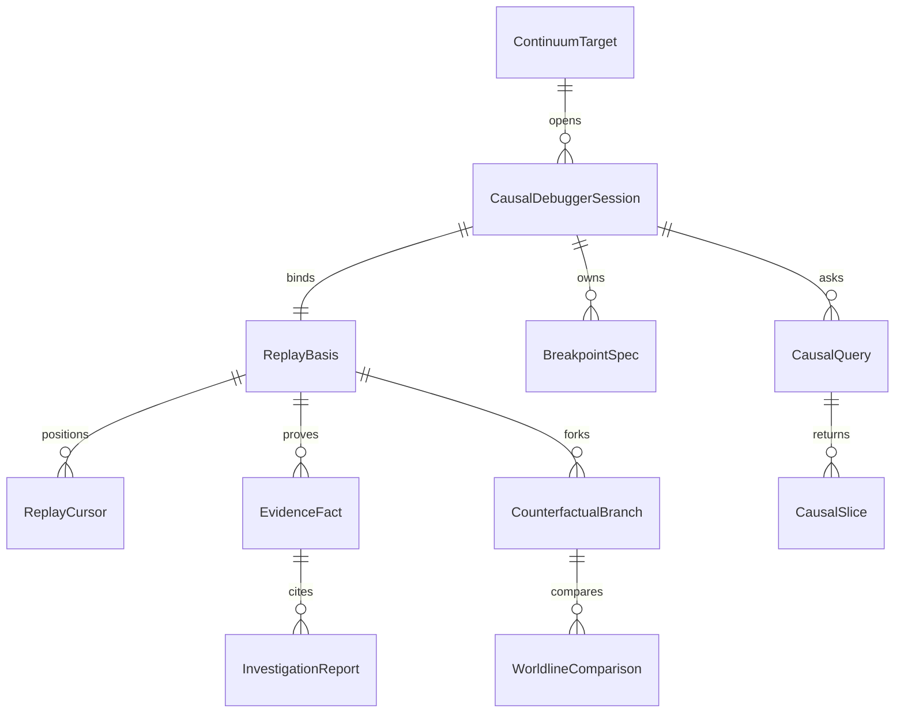
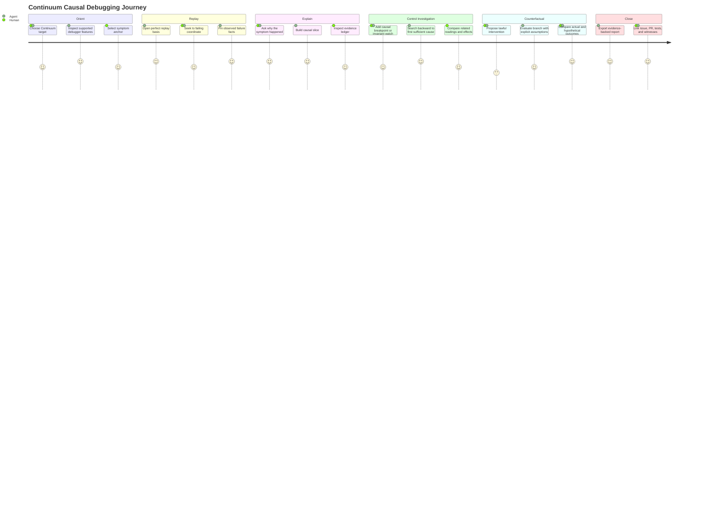
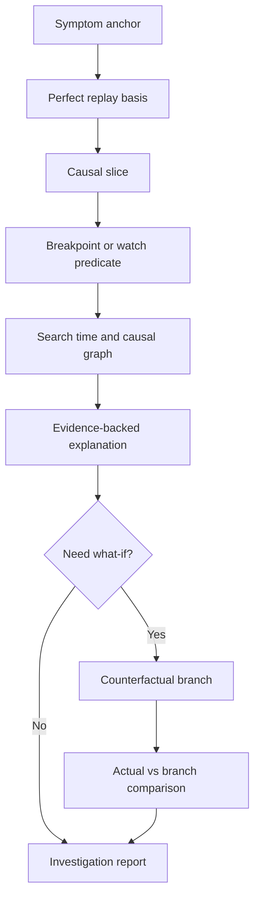
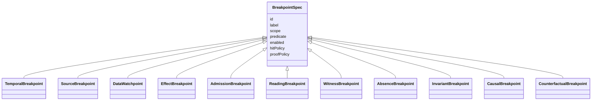

# Continuum Causal Debugger Design Thinking

## Linked Issue

- https://github.com/flyingrobots/warp-ttd/issues/81

## Decision Summary

WARP TTD should become the debugger interface over Continuum runtimes, not a
replacement for runtime replay or counterfactual evaluation. A Continuum runtime
may be able to replay and evaluate alternatives by itself; WARP TTD earns its
place by turning those runtime powers into a cross-target investigation system:
stable agent interfaces, reusable breakpoint/query specs, evidence ledgers,
branch comparisons, reports, and failure posture that humans and agents can
share. It remains familiar enough to support stepping, seeking, breakpoints,
watches, frames, stacks, effects, and reports, but the main product shape is an
evidence-backed investigation workspace where humans and agents can ask why
something happened, why it did not happen, what would change under a lawful
counterfactual, and which facts prove the answer.

## Sponsored Human

A maintainer debugging a Continuum-compatible app wants to move from a symptom
to a causal explanation and a minimal fix hypothesis so that failures in
distributed, replayable, observer-relative systems can be understood without
rerunning fragile scenarios, screen-scraping app UI, or manually reconstructing
which receipt, witness, reading, admission result, or effect mattered.

## Sponsored Agent

An agent needs stable debugger feature vocabulary, causal query contracts, and
machine-readable investigation surfaces so it can inspect replay state, set
causal breakpoints, compare counterfactual branches, and produce evidence-backed
reports, without inferring runtime truth from app names, visual timelines, or
private host state.

## Hill

By the end of this cycle, maintainers and agents can use this design and Manual
chapter to identify every major debugger feature WARP TTD is working toward,
understand how Continuum changes the user experience, and derive RED tests for
future feature cycles without asking whether WARP TTD is merely a time-travel
controller.

## Current Truth

- The project doctrine already says WARP TTD is agent-native, agent-first, and
  should expose new facts through MCP, CLI JSON/JSONL, generated artifacts, or
  deterministic read models before TUI/browser views:
  [docs/BEARING.md#15:a1fa3d1d654c13d5a7cfcd9f91b697c28e08c201](https://github.com/flyingrobots/warp-ttd/blob/a1fa3d1d654c13d5a7cfcd9f91b697c28e08c201/docs/BEARING.md#L15).
- The landed product gravity is Continuum-compatible target debugging through
  descriptor, capability, and evidence-posture contracts, not hard-coded app
  names:
  [docs/BEARING.md#26:a1fa3d1d654c13d5a7cfcd9f91b697c28e08c201](https://github.com/flyingrobots/warp-ttd/blob/a1fa3d1d654c13d5a7cfcd9f91b697c28e08c201/docs/BEARING.md#L26).
- BEARING already names speculative complexity as a product tension, but it does
  not yet define the causal-debugger user experience or feature taxonomy:
  [docs/BEARING.md#108:a1fa3d1d654c13d5a7cfcd9f91b697c28e08c201](https://github.com/flyingrobots/warp-ttd/blob/a1fa3d1d654c13d5a7cfcd9f91b697c28e08c201/docs/BEARING.md#L108).
- The current Method loop at the branch base still described draft PR cycle
  coordination, which now conflicts with the stronger repo rule that draft PRs
  are not used:
  [METHOD.md#56:a1fa3d1d654c13d5a7cfcd9f91b697c28e08c201](https://github.com/flyingrobots/warp-ttd/blob/a1fa3d1d654c13d5a7cfcd9f91b697c28e08c201/METHOD.md#L56).
- The target discovery Manual chapter already states that WARP TTD debugs
  Continuum-compatible targets, not hard-coded app names:
  [docs/manual/008-continuum-target-discovery-contract.md#8:a1fa3d1d654c13d5a7cfcd9f91b697c28e08c201](https://github.com/flyingrobots/warp-ttd/blob/a1fa3d1d654c13d5a7cfcd9f91b697c28e08c201/docs/manual/008-continuum-target-discovery-contract.md#L8).
- The current structured agent target surface is `targets --json`,
  `target-session --json`, and MCP `warp_ttd.inspect_live_targets`:
  [docs/manual/008-continuum-target-discovery-contract.md#78:a1fa3d1d654c13d5a7cfcd9f91b697c28e08c201](https://github.com/flyingrobots/warp-ttd/blob/a1fa3d1d654c13d5a7cfcd9f91b697c28e08c201/docs/manual/008-continuum-target-discovery-contract.md#L78).
- `DebuggerSession` currently supports familiar playback movement:
  `stepForward`, `stepBackward`, and `seekToFrame`:
  [src/app/debuggerSession.ts#189:a1fa3d1d654c13d5a7cfcd9f91b697c28e08c201](https://github.com/flyingrobots/warp-ttd/blob/a1fa3d1d654c13d5a7cfcd9f91b697c28e08c201/src/app/debuggerSession.ts#L189).
- The CLI already has replay-adjacent commands for frames, effects,
  deliveries, session, worldline, targets, target-session, and admission-chain:
  [src/cli.ts#14:a1fa3d1d654c13d5a7cfcd9f91b697c28e08c201](https://github.com/flyingrobots/warp-ttd/blob/a1fa3d1d654c13d5a7cfcd9f91b697c28e08c201/src/cli.ts#L14).
- The earlier Continuum operator surface design already says there is no
  canonical materialized graph and that evidence status must stay first-class:
  [docs/design/0023-continuum-operator-surface/continuum-operator-surface.md#30:a1fa3d1d654c13d5a7cfcd9f91b697c28e08c201](https://github.com/flyingrobots/warp-ttd/blob/a1fa3d1d654c13d5a7cfcd9f91b697c28e08c201/docs/design/0023-continuum-operator-surface/continuum-operator-surface.md#L30).
- The debugger/shared-family boundary says WARP TTD owns investigation, but not
  the app, authority, admission, witness, or shared semantic family:
  [docs/design/0026-debugger-native-shared-family-boundary/debugger-native-shared-family-boundary.md#36:a1fa3d1d654c13d5a7cfcd9f91b697c28e08c201](https://github.com/flyingrobots/warp-ttd/blob/a1fa3d1d654c13d5a7cfcd9f91b697c28e08c201/docs/design/0026-debugger-native-shared-family-boundary/debugger-native-shared-family-boundary.md#L36).

External reference anchors:

- Microsoft Time Travel Debugging records a process trace and replays it forward
  and backward, but explicitly keeps playback read-only: 
  <https://learn.microsoft.com/en-us/windows-hardware/drivers/debugger/time-travel-debugging-overview>
- rr is a record/replay debugger integrated with GDB reverse execution:
  <https://github.com/rr-debugger/rr>
- Replay's Runtime Replay model records the underlying runtime so the replayed
  browser runs with the same semantics and event order:
  <https://docs.replay.io/basics/time-travel/how-does-time-travel-work>

These tools anchor the conventional time-travel baseline. WARP TTD should keep
that baseline, then move beyond it through Continuum-native causal facts,
counterfactual branches, and agent-visible proof.

## Problem

WARP TTD has a growing set of target, replay, worldline, reading, admission,
evidence, and MCP surfaces, but it does not yet have one durable product model
for what the debugger should feel like when Continuum makes perfect replay and
counterfactuals available. A Continuum runtime can own replay, evaluation,
admission, witnesshood, and counterfactual execution without also being a good
debugger. Without a debugger layer, an agent or human still has to know which
runtime to ask, which evidence family to trust, how to express a breakpoint,
how to compare branches, how to preserve a reusable report, and how to tell
unsupported, obstructed, rights-limited, redacted, or budget-limited operations
apart. Without that model, future cycles can drift into a thin time controller:
rewind, seek, inspect a frame, and stop. That would miss the central Continuum
opportunity. A causal debugger should let the investigator debug causes,
evidence, absence, admission, effects, readings, and hypothetical alternatives,
not just current program state.

## Debugger Value Over Runtime Alone

WARP TTD should add value even when a Continuum runtime already provides perfect
replay and counterfactual evaluation.

| Without WARP TTD | With WARP TTD |
| :--- | :--- |
| A runtime can replay its own history. | The debugger names a reusable `ReplayBasis`, cursor, target posture, and reportable coordinate model across runtimes. |
| A runtime can evaluate a counterfactual. | The debugger records branch assumptions, divergence, changed and unchanged facts, obstruction posture, and actual-vs-branch comparison. |
| A runtime can expose facts. | The debugger normalizes fact posture, source refs, evidence refs, redaction, and target capability discovery. |
| A runtime can answer one local question. | The debugger gives agents a stable query and breakpoint language they can use across targets. |
| A runtime can show its own diagnostics. | The debugger creates shareable investigation reports with replay basis, evidence ledger, commands, and follow-on proof. |
| A human can manually inspect a target. | The debugger lets agents inspect without pixels, private app state, or vendor-specific guessing. |

The debugger therefore owns investigation ergonomics: discovery, vocabulary,
query shape, breakpoint lifecycle, comparison, persistence, reporting, and
agent/human handoff. The runtime owns execution truth.

## Scope

This cycle includes:

- Housekeeping that reconciles Method, AGENTS, templates, and the 0073 design
  with the current no-draft PR rule.
- A design-thinking feature map for WARP TTD as a Continuum causal debugger.
- A Manual chapter that names the durable debugger product doctrine.
- A comparison against conventional debuggers and current time-travel debuggers.
- A breakpoint taxonomy for replay, causal, evidence, admission, effect,
  reading, invariant, absence, and counterfactual breakpoints.
- A human and agent user journey for symptom-to-causal-explanation debugging.
- Follow-on issue anchors for implementation cycles that should turn this
  product thinking into executable surfaces.

## Non-Goals

This cycle does not include:

- Implementing new debugger runtime behavior.
- Adding runtime discovery handshakes beyond the landed descriptor contract.
- Adding WebSocket, stdio, HTTP, auth, consent, or vendor runtime protocols.
- Creating actual counterfactual branches, strand controls, or host mutations.
- Defining an admitted-control protocol for changing live runtime state.
- Building a rendered TUI/browser workspace.
- Replacing focused future design docs for individual feature cycles.
- Claiming that WARP TTD can alter actual history. Actual replay stays evidence;
  counterfactuals are labeled investigation branches.

## Agent-First Surface

The first surface in this cycle is the design/manual feature map itself. The
first future executable surface should be a structured debugger capability read
model, exposed through CLI JSON and MCP, that says which causal-debugger
features are supported by a selected target and why unavailable features are
`ABSENT`, `UNSUPPORTED`, or `OBSTRUCTED`.

Candidate future tool:

```text
warp_ttd.inspect_debugger_capabilities
```

Candidate future command:

```sh
npm run debugger-capabilities -- --json
```

These should report support for replay, causal queries, breakpoint classes,
counterfactual branch creation, branch comparison, evidence ledgers, replay
export, and admitted controls without requiring an agent to infer support from
app names or UI state.

## Agent Interface

No runtime interface changes in this docs-only cycle. The design standardizes
the future agent interface families that will make the causal debugger more
than a runtime-specific replay shell:

| Interface | Shape | Agent Use |
| :--- | :--- | :--- |
| `warp_ttd.inspect_debugger_capabilities` | MCP read tool | Discover target support for replay, causal query, breakpoints, counterfactuals, comparison, evidence ledger, report export, and admitted controls. |
| `debugger-capabilities --json` | CLI JSON/JSONL | Script capability discovery without MCP. |
| `CausalQuery` | JSON schema / exported type | Ask why, why-not, causal slice, first cause, absence, and invariant questions. |
| `BreakpointSpec` | JSON schema / exported type | Define temporal, source, data, effect, admission, reading, witness, absence, invariant, causal, and counterfactual predicates. |
| `CounterfactualBranch` | JSON schema / exported type | Track basis, intervention, assumptions, evaluator posture, divergence coordinate, and branch facts. |
| `WorldlineComparison` | JSON schema / CLI/MCP result | Compare actual vs counterfactual or recorded run vs recorded run. |
| `EvidenceLedger` | JSONL / MCP result | List receipts, witnesses, readings, admission facts, source refs, redactions, and obstructions. |
| `InvestigationReport` | Markdown plus JSON bundle | Export reproducible findings for issues, PRs, and agent handoff. |

Every interface must include stable ids, schema version, target id, replay basis
ref, actual/counterfactual posture where relevant, and machine-readable
unavailable/unsupported/obstructed reasons.

## Agent DX

The intended agent workflow is:

1. Discover targets and debugger capability posture.
2. Open or import a replay basis.
3. Anchor a symptom by coordinate, fact id, reading id, effect id, witness id,
   source ref, or report ref.
4. Ask a causal query or install a breakpoint/watch predicate.
5. Receive deterministic JSON/JSONL hits with evidence refs and posture.
6. Optionally create a labeled counterfactual branch and compare it to actual
   history.
7. Export an investigation report that another agent or reviewer can replay.

Agent DX requirements:

- no app-name dispatch as feature discovery
- no scraping rendered timelines or prose explanations
- no hidden success when a fact is absent, unsupported, obstructed, rights
  limited, budget limited, or redacted
- deterministic ids for sessions, replay bases, facts, queries, breakpoints,
  branches, comparisons, and reports
- resumable or streamable output for long searches
- examples that are copy-pasteable into MCP calls or CLI JSON tests
- RED tests written against actual agent interfaces before rendered UI

## Runtime / API / Protocol Contract

This docs-only cycle does not change runtime API. It defines the product
contract future cycles should converge on:

| Contract | Purpose | Owner |
| :--- | :--- | :--- |
| `CausalDebuggerSession` | Investigation session over a target, replay basis, cursor, pins, breakpoints, and branch registry. | WARP TTD-native |
| `ReplayBasis` | Content-addressed actual history, runtime identity, schema versions, clock assumptions, and evidence posture. | Shared between target facts and WARP TTD wrappers |
| `ReplayCursor` | Current coordinate in actual or counterfactual time. | WARP TTD-native |
| `CausalQuery` | Structured why, why-not, ancestry, dependency, absence, and invariant query. | WARP TTD-native wrapper over Continuum facts |
| `BreakpointSpec` | Predicate over coordinates, facts, causal edges, evidence, admission, effects, readings, or divergence. | WARP TTD-native |
| `CounterfactualBranch` | Debugger-local hypothetical branch with basis, intervention, assumptions, divergence point, and proof posture. | WARP TTD-native wrapper |
| `WorldlineComparison` | Deterministic diff between actual and counterfactual branches or two recorded worldlines. | WARP TTD-native |
| `EvidenceLedger` | Machine-readable list of receipts, witnesses, admission results, reading envelopes, source refs, redactions, and obstructions. | Shared-family projections plus WARP TTD posture |
| `InvestigationReport` | Reproducible explanation bundle for a human, agent, PR, or issue. | WARP TTD-native |

The contract rule is strict: future tests compile against actual software
surfaces, not against this design prose.

## Evidence / Authority / Mutation Boundary

Perfect replay is evidence, not authority. Counterfactual branches are
debugger-local hypotheses, not actual history. A branch may say "under this
intervention and these assumptions, this reading would differ," but it must not
claim the target actually executed that branch unless the runtime produced a
witnessed branch or admitted control result.

WARP TTD may:

- read replayable history, receipts, witnesses, readings, effects, deliveries,
  admission posture, evidence posture, and source refs
- create debugger-local pins, breakpoints, queries, branch handles, comparisons,
  and reports
- ask a Continuum-compatible runtime for read-only counterfactual evaluations
  when the target advertises that feature
- label every result with actual, replayed, translated, counterfactual,
  obstructed, redacted, rights-limited, or budget-limited posture

WARP TTD must not:

- mutate host state through an inspection tool
- issue `CapabilityGrant` or construct `CapabilityPresentation` by implication
- perform runtime admission unless a future admitted-control design explicitly
  says so
- treat a counterfactual result as actual history
- hide unavailable, obstructed, redacted, or rights-limited facts behind a
  successful-looking summary

## Posture Matrix

| Posture | Meaning In The Causal Debugger |
| :--- | :--- |
| `PRESENT` | The fact or feature is available for this target and replay basis. |
| `ABSENT` | The fact is known not to exist in the inspected basis. |
| `UNAVAILABLE` | The target has not exposed the needed surface. |
| `UNSUPPORTED` | The target or adapter does not support the feature class. |
| `OBSTRUCTED` | The debugger cannot safely inspect or evaluate the feature and reports a reason. |
| `REDACTED` | The fact exists but policy removed sensitive payload detail. |
| `RIGHTS_LIMITED` | The fact exists but current authority cannot inspect it. |
| `BUDGET_LIMITED` | The runtime refused or truncated evaluation because of cost limits. |
| `TRANSLATED_SUBSTRATE` | The fact is projected from a substrate such as git-warp and is not native Continuum witnesshood. |
| `COUNTERFACTUAL` | The fact belongs to a labeled hypothetical branch, not actual history. |
| `DIVERGED` | A branch differs from its basis at a known coordinate or causal edge. |

Future implementations should use exact enum casing chosen by the concrete
schema. This table names the required semantic distinctions, not final wire
names.

## Host / Target Applicability

The debugger applies to any Continuum-compatible target that can expose the
required inspection contract. `jedit` and `graft` remain witnesses because they
pressure different edges:

| Target | Product Pressure |
| :--- | :--- |
| `jedit` / Echo | Native Continuum admission, readings, witnesses, receipts, and app-facing user symptoms. |
| `graft` / git-warp | Translated substrate evidence, causal history, lanes, receipts, and materialized readings. |
| Fixtures | Deterministic RED tests and replay basis examples. |
| Vendor runtimes | Proof that WARP TTD uses advertised Continuum contracts, not app-specific knowledge. |
| Missing or descriptor-only targets | Obstruction, unsupported feature posture, and graceful feature discovery. |

No feature may require WARP TTD to know that a target is `jedit`, `graft`,
Echo, or git-warp in order to understand the debugger-level operation.

## Data / State Model

| State | Source Of Truth | Derived State | Invalid State | Reset Behavior | Serialization |
| :--- | :--- | :--- | :--- | :--- | :--- |
| Target descriptor | Registry, runtime discovery, or caller config | Capability posture | App-name dispatch as capability proof | Refresh target list | JSON |
| Replay basis | Runtime/exported trace/evidence bundle | Cursor windows, causal index | Missing basis digest | Reopen session | Content-addressed JSON |
| Actual cursor | Replay basis plus selected coordinate | Frame, readings, effects | Cursor outside basis | Seek to nearest valid coordinate or obstruct | JSON |
| Breakpoint set | Debugger session | Hit list, disabled reasons | Predicate with no declared fact scope | Clear/disable all | JSON |
| Causal query | User/agent query request | Causal slice, why/why-not answer | Query with ambiguous target fact | Reject with schema error | JSON |
| Counterfactual branch | Runtime-evaluated or debugger-local hypothesis | Divergence report, branch diff | Unlabeled hypothesis presented as actual | Drop branch handle | JSON |
| Evidence ledger | Receipts, witnesses, readings, admission, source refs | Report citations | Hidden visual-only proof | Recompute from basis | JSON/JSONL |
| Investigation report | Session snapshot plus selected proof | PR/issue/debug note | Report without basis refs | Regenerate | Markdown plus JSON |



## Protocol / Generated Family Placement

WARP TTD owns debugger-native investigation state: sessions, cursors,
breakpoint specs, pins, query envelopes, branch handles, comparison summaries,
and reports. Continuum/Echo/authority families own shared facts such as
`ReadingEnvelope`, `ObserverPlan`, `ObservationRequest`, `TickResult`,
`CapabilityGrant`, `CapabilityPresentation`, `AdmissionTicket`, `LawWitness`,
`CausalCommitEvidence`, `WitnessedSuffixShell`, `CausalSuffixBundle`, and
`ImportOutcome`.

Future cycles should follow this placement order:

1. If the value is investigation state, keep it WARP TTD-native.
2. If the value is a shared Continuum/Echo/authority fact, consume generated
   artifacts when available and wrap absence or obstruction explicitly.
3. If the value is substrate residue, keep it adapter-local or label it as
   translated substrate evidence.
4. If the operation mutates the app, issues authority, performs admission, or
   creates a real runtime branch, stop and write an admitted-control design.

## User Experience / Product Shape

A conventional debugger asks, "Where is the program now?" A time-travel debugger
adds, "Where was the program before?" A Continuum causal debugger adds, "Why is
this fact true in this worldline, what evidence proves it, and what would
change under a lawful alternative?"

The human workspace should be an investigation cockpit with three cooperating
regions:

- **Evidence Timeline**: actual replay, branch lanes, breakpoints, effects,
  receipts, admissions, readings, and divergence points.
- **Fact Inspector**: selected frame, source, reading, witness, receipt,
  admission result, causal ancestry, and redaction posture.
- **Inquiry Workbench**: why/why-not questions, causal slices, breakpoint
  builders, counterfactual interventions, branch comparisons, and report export.

The agent surface should expose the same model through JSON/MCP tools. The TUI
or browser view may be richer visually, but it cannot be the only source of
truth.





### Similar To Normal Debuggers

- Breakpoints stop inspection at meaningful coordinates.
- Watch expressions track changing values.
- Frames, call stacks, variables, effects, logs, and source locations still
  matter.
- Step, continue, rewind, seek, and run-to-position remain useful.
- Reports still need a repro, observed behavior, expected behavior, and fix
  hypothesis.

### Different From Normal Debuggers

- Time is queryable, not merely current.
- Absence can be debugged: "which expected fact never appeared by this
  coordinate?"
- Effects and admissions are facts with evidence posture, not just log lines.
- The debugger can search backward from a symptom to the first sufficient cause.
- A breakpoint can trigger on causal ancestry, evidence, admission, reading
  changes, or divergence between actual and counterfactual branches.
- A watch can compare two worldlines, not just track one scalar value.
- A report can cite replay coordinates, receipts, witnesses, and branch
  assumptions.

### Different From Existing Time-Travel Debuggers

Existing time-travel debuggers make one execution navigable. WARP TTD should make
the investigated causal structure navigable. The important addition is not
"rewind plus UI"; it is "replay plus causal facts plus lawful what-if branches."

| Feature | Conventional TTD | Continuum Causal Debugger |
| :--- | :--- | :--- |
| Replay | Navigate a recorded execution. | Navigate a replay basis with evidence posture and target capability facts. |
| Breakpoint | Stop at source/time/data event. | Stop at source/time/data, plus causal edge, admission result, reading, witness, absence, invariant, or branch divergence. |
| State | Program memory/runtime state. | Runtime facts, debugger projections, readings, receipts, witnesses, admissions, effects, and branch assumptions. |
| Query | Search trace or inspect frame. | Ask why, why not, first cause, minimal difference, and what-if. |
| Mutation | Playback is usually read-only. | Actual history is read-only; counterfactuals are labeled hypotheses; admitted controls need separate authority. |
| Collaboration | Share trace or coordinate. | Share trace, coordinate, causal slice, branch diff, evidence ledger, and report. |
| Agent use | Script debugger or scrape output. | Use stable MCP/CLI read models and schema-described facts. |

### Feature Catalog

| Feature | Human Job | Agent Contract | Difference From Conventional Debugger | First Proof Surface |
| :--- | :--- | :--- | :--- | :--- |
| Target discovery | Pick a running/debuggable Continuum app. | `inspect_live_targets` with target, vendor, capability, and posture facts. | App name is not support proof. | `targets --json`, MCP |
| Debugger capability discovery | See what this target can do. | `inspect_debugger_capabilities`. | Feature availability is structured and target-specific. | CLI JSON, MCP |
| Perfect replay basis | Reopen the exact history under investigation. | Content-addressed `ReplayBasis`. | The basis is cited in reports and branch comparisons. | JSON schema |
| Time navigation | Step, rewind, seek, run to coordinate. | `ReplayCursor` operations. | Familiar control remains but is not the whole product. | Existing session/step tests |
| Worldline view | See actual history and branch lanes. | `WorldlineTick` plus branch metadata. | Shows actual and hypothetical lanes with posture. | CLI JSON, TUI later |
| Source/frame inspector | Inspect familiar code state. | Frame, context, effect, delivery envelopes. | Source is joined to causal facts. | Existing frame/effects commands |
| Effect inspector | See emitted effects and deliveries. | Effect and delivery IDs with source refs. | Effects are queryable causal nodes. | CLI JSON |
| Admission inspector | See why operation was admitted, staged, plural, conflicted, or obstructed. | Admission facts and result posture. | Admission is not a boolean. | MCP/CLI admission-chain |
| Reading inspector | Trace user-visible or agent-visible reading to observer plan and evidence. | `ReadingEnvelope` posture. | Debugs observer-relative outputs. | Future MCP |
| Evidence ledger | Audit receipts, witnesses, source refs, redactions, and obstructions. | `EvidenceLedger` JSON/JSONL. | Proof is inspectable, not prose-only. | CLI JSONL |
| Causal slice | Show facts necessary or relevant to a symptom. | `CausalSlice` query result. | Debugs dependencies, not just frames. | MCP |
| Why query | Explain why a fact happened. | `CausalQuery { kind: "WHY" }`. | Produces evidence-backed cause chain. | MCP |
| Why-not query | Explain why an expected fact did not happen. | `CausalQuery { kind: "WHY_NOT" }`. | Absence is inspectable. | MCP |
| First-cause search | Find the earliest sufficient cause or invariant violation. | Deterministic search over causal/time index. | Replaces manual reverse stepping. | CLI/MCP |
| Temporal breakpoint | Stop at coordinate, tick, lane, or frame. | `BreakpointSpec` over coordinates. | Familiar baseline. | Session tests |
| Source breakpoint | Stop at source span or function. | Source map plus coordinate predicate. | Familiar baseline joined to replay. | CLI/MCP |
| Data watchpoint | Stop when fact/value changes. | Predicate over structured fact path. | Watches facts, not private memory only. | MCP |
| Effect breakpoint | Stop when an effect is emitted, delivered, canceled, or observed. | Predicate over effect/delivery facts. | Effects become first-class break targets. | CLI/MCP |
| Admission breakpoint | Stop on admitted, staged, plural, conflict, or obstruction posture. | Predicate over admission result. | Runtime law becomes debuggable. | MCP |
| Reading breakpoint | Stop when a reading changes, is redacted, obstructed, or loses native evidence. | Predicate over reading envelope. | Observer-relative output becomes debuggable. | MCP |
| Witness breakpoint | Stop when witness/evidence appears, disappears, downgrades, or conflicts. | Predicate over evidence ledger. | Proof posture drives control. | MCP |
| Absence breakpoint | Stop at the proof that something did not happen within a window. | Deadline/window predicate. | Non-occurrence becomes actionable. | MCP |
| Invariant breakpoint | Find first coordinate where an invariant fails. | Predicate plus search strategy. | Breakpoint can run over history. | CLI/MCP |
| Causal breakpoint | Stop when a fact becomes causally sufficient for a symptom. | Predicate over causal ancestry. | Breaks on cause, not only occurrence. | MCP |
| Counterfactual breakpoint | Stop at actual/hypothetical divergence. | Branch comparison predicate. | What-if work becomes navigable. | MCP |
| Counterfactual workbench | Try lawful interventions without mutating actual history. | `CounterfactualBranch` with assumptions and posture. | Hypotheses are first-class and labeled. | MCP |
| Branch comparison | Compare actual vs what-if or two recorded runs. | `WorldlineComparison`. | Shows minimal causal delta. | CLI/MCP |
| Provenance heatmap | Highlight high-impact causes over code/facts/time. | Ranked causal/evidence stats. | Visual summary of query results. | Render after JSON |
| Investigation report | Export an issue/PR-ready explanation. | Markdown plus JSON evidence bundle. | Report cites coordinates, facts, proofs, branches. | CLI JSON/Markdown |
| Replay export/import | Share replay basis and report safely. | Redacted evidence bundle. | Collaboration includes proof and policy. | CLI |
| Agent playbooks | Run common investigations deterministically. | Named MCP playbook tools. | Agents do not improvise fragile scripts. | MCP |

### Breakpoint Model

Breakpoints are no longer only "stop when program counter reaches X." They are
named predicates over replay basis, causal facts, and branch comparisons.



Every breakpoint hit should answer:

- Which replay basis and coordinate produced the hit?
- Which predicate matched?
- Which facts were inspected?
- Was the hit actual, translated, counterfactual, obstructed, or redacted?
- Can the user/agent retry, disable, narrow, widen, or export it?

## Accessibility Posture

The causal workspace must never encode actual vs counterfactual, present vs
absent, native vs translated, or safe vs obstructed only by color, animation, or
position. Each state needs semantic labels and agent-visible facts. Keyboard
navigation should reach target selection, timeline/branch lanes, breakpoint
list, fact inspector, query builder, branch comparison, and report export in a
stable order. Screen-reader summaries should announce the selected coordinate,
branch posture, evidence posture, active breakpoint, current query result, and
whether an action is read-only or would require admitted control.

## Localization / Directionality Posture

This cycle adds English documentation only. Future UI strings should use catalog
keys for breakpoint type labels, query verbs, posture names, error summaries,
confirmation text, and report section titles. Directionality must not be encoded
into causal diagrams as left-equals-past only; RTL users still need explicit
time labels, branch names, and coordinate text. Dynamic labels such as source
paths, branch IDs, witness refs, and digests must wrap without hiding posture
badges or action controls.

## Agent Inspectability / Explainability Posture

An agent must be able to inspect every meaningful debugger state without reading
pixels or prose. Future surfaces should expose:

- stable ids for sessions, targets, replay bases, cursors, facts, breakpoints,
  queries, branch handles, comparisons, and reports
- schema versions and target/runtime capability posture
- actual vs counterfactual posture on every branch-specific result
- coordinate refs and source refs on every hit and explanation
- evidence refs, witness refs, receipt refs, admission refs, and redaction refs
- deterministic stdout/JSONL for long-running searches
- machine-readable "why unavailable" reasons
- report bundles with both Markdown and JSON evidence

## Security / Redaction / Consent Posture

Replay and evidence bundles can contain source paths, user text, runtime data,
secrets, or policy-limited facts. Sharing a replay basis or report must be an
explicit export action with redaction posture. Counterfactual queries can reveal
sensitive alternatives, so query results must preserve rights, budget, and
redaction limits. Runtime connection, authentication, and consent are not part
of this cycle, but the design requires them before network/runtime handshakes or
admitted controls.

## Determinism Contract

Perfect replay requires deterministic basis identity. Future implementation
proof must name:

- target descriptor and runtime identity
- replay basis digest or trace/ref identity
- protocol/schema versions
- deterministic clock assumptions
- input/event ordering assumptions
- random seed posture, if any
- source ref and generated artifact versions
- redaction policy version
- query and breakpoint predicate versions

Counterfactuals must additionally name intervention, assumptions, runtime
support posture, divergence coordinate, and whether the branch was evaluated by
a runtime, fixture, model, or debugger-local approximation.

## Compatibility / Migration Contract

Existing commands such as `targets --json`, `target-session --json`, `step`,
`frame`, `effects`, `deliveries`, `session`, `worldline`, and
`admission-chain` remain valid. New causal-debugger surfaces should be additive
and schema-versioned. Existing `jedit` and `graft` witness targets remain useful
default descriptors, but no future feature may require app-specific dispatch to
prove debugger support.

## Linked Invariants

- Agent-native / agent-first.
- Tests are the executable spec.
- Design docs are not implementation proof.
- Evidence posture is explicit.
- Counterfactuals are labeled hypotheses, not actual history.
- Perfect replay is read-only evidence unless a future admitted-control design
  says otherwise.
- No inferred authority.
- No host mutation through inspection.
- Runtime truth wins.
- Debugger-native state stays separate from shared-family facts.

## Design Alternatives Considered

### Option A: Time Controller

Pros:

- Easy to understand.
- Directly extends existing step, back, seek, and worldline controls.
- Low implementation surface.

Cons:

- Misses Continuum's causal and counterfactual value.
- Leaves agents to assemble explanations from raw frame walks.
- Cannot answer why, why not, absence, evidence, or divergence questions.
- Encourages TUI-first control widgets instead of agent-readable facts.

### Option B: Conventional Debugger Plus Replay

Pros:

- Familiar breakpoint/watch/stack/source concepts.
- Easier onboarding for engineers used to IDE debuggers.
- Can reuse some existing debugger mental models.

Cons:

- Centers source execution instead of Continuum evidence.
- Treats readings, witnesses, admission, and effects as side panels.
- Does not naturally model counterfactual branches or causal sufficiency.
- Risks making app-private state more important than runtime-published facts.

### Option C: Causal Investigation Workspace

Pros:

- Keeps familiar debugger affordances while moving the center to causality and
  evidence.
- Gives agents stable contracts for the same operations humans see.
- Makes counterfactual branches explicit, inspectable, and safe.
- Supports future vendor runtimes because features hang off capability and
  evidence posture, not app names.

Cons:

- Requires more schema and UX discipline.
- Needs careful feature discovery so unsupported targets remain understandable.
- Breakpoint and query predicates must be deterministic and testable.

## Decision

Use Option C. WARP TTD should keep normal debugger controls as baseline
affordances, but organize the product around causal investigation: replay basis,
causal query, breakpoint predicates, evidence ledger, counterfactual branches,
worldline comparisons, and exportable reports. Every feature must land first as
an agent-visible structured surface, then human views can render and compose
those facts.

## Implementation Slices

- Sync to the merge target, branch from the issue title slug, write this design
  doc, commit, push, open a normal PR, and apply `work-in-progress` to the issue.
- Reconcile AGENTS, METHOD, process docs, templates, and 0073/0076 status with
  post-merge and no-draft housekeeping.
- Add Manual chapter 009 and ontology assertions for the causal-debugger feature
  taxonomy.
- Create or update GitHub follow-on issues for the major feature epics.
- Implement vendor-neutral Continuum runtime hello (#80).
- Implement runtime discovery command and local registry (#78).
- Implement endpoint consent and auth posture (#79).
- Add debugger capability discovery for replay, causal query, breakpoint,
  counterfactual, comparison, evidence ledger, and export support.
- Add causal query read model with why, why-not, causal slice, first-cause, and
  invariant-search proofs.
- Add `BreakpointSpec` schema and minimal temporal/effect/admission/reading
  breakpoint execution.
- Add counterfactual branch workbench and actual-vs-branch comparison.
- Add report export that cites replay basis, coordinates, evidence refs,
  breakpoint hits, queries, branch assumptions, and validation commands.

## Tests To Write First

- [ ] [docs] `test/ontologyDoctrine.spec.ts` proves the Manual and design packet
      name causal debugging, perfect replay, counterfactual branches, causal
      breakpoints, evidence ledgers, agent inspectability, and no host mutation.
- [ ] [docs] `npm run check:method` accepts this `warp-design-v1` docs-only
      cycle with a full-SHA Current Truth permalink.

## Acceptance Criteria

The work is done when:

- [ ] Housekeeping docs no longer describe draft PRs as repo workflow.
- [ ] 0076 is marked landed in the design ledger and Manual index.
- [ ] A new 0081 design packet defines the causal-debugger product shape.
- [ ] Manual chapter 009 preserves the durable feature taxonomy.
- [ ] Ontology/doctrine tests prove the new terms and boundaries exist.
- [ ] Issue #81 and this design doc are linked.
- [ ] Follow-on implementation issues are linked or explicitly named.
- [ ] Local validation is green.

## Validation Plan

Commands expected before PR:

```sh
npm run check:method
node --experimental-strip-types --test test/methodDesignFormat.spec.ts test/ontologyDoctrine.spec.ts
npm test
npm run test:integration
npx tsc --noEmit
npm run lint
npm run lint:check
git diff --check
```

## Playback / Witness

Reviewers can inspect:

- this design packet
- `docs/manual/009-continuum-causal-debugger-design-thinking.md`
- `docs/BEARING.md`
- `METHOD.md`
- `docs/method/process.md`
- `.github/pull_request_template.md`
- `test/ontologyDoctrine.spec.ts`

The product playback question for this cycle is: can an engineer or agent read
the new documents and write the first RED test for debugger capability
discovery, causal breakpoints, or counterfactual branch comparison without
asking whether WARP TTD is just a replay controller?

## Manual / Operator Contract

This cycle adds Manual chapter 009 because the work defines durable product
doctrine, feature taxonomy, agent/human user experience, and safety boundaries.
The design packet remains the cycle ledger; the Manual chapter is the stable
operator reading path.

## Risks

Known risks:

- The feature taxonomy can become too broad to implement coherently.
- Counterfactual language can imply mutation or alternative actual history if
  posture is weak.
- Human UI mockups could pull implementation ahead of agent-readable contracts.
- Future vendors may expose partial Continuum surfaces with uneven feature
  support.

Mitigations:

- Keep each future feature behind a capability and evidence posture.
- Require RED tests against actual CLI/MCP/API surfaces for implementation
  cycles.
- Label every hypothetical branch as counterfactual and cite its assumptions.
- Implement debugger capability discovery before advanced causal controls.
- Preserve no-host-mutation and no-inferred-authority invariants.

## Follow-On Issues

- https://github.com/flyingrobots/warp-ttd/issues/78
- https://github.com/flyingrobots/warp-ttd/issues/79
- https://github.com/flyingrobots/warp-ttd/issues/80
- https://github.com/flyingrobots/warp-ttd/issues/82
- https://github.com/flyingrobots/warp-ttd/issues/83
- https://github.com/flyingrobots/warp-ttd/issues/84
- https://github.com/flyingrobots/warp-ttd/issues/85
- https://github.com/flyingrobots/warp-ttd/issues/86
- https://github.com/flyingrobots/warp-ttd/issues/28
- https://github.com/flyingrobots/warp-ttd/issues/29
- https://github.com/flyingrobots/warp-ttd/issues/30
- https://github.com/flyingrobots/warp-ttd/issues/31

## Closeout Links

- PR: https://github.com/flyingrobots/warp-ttd/pull/87
- Ready-for-review evidence: `npm run check:method`, `npm test`,
  `npm run test:integration`, `npx tsc --noEmit`, `npm run lint`,
  `npm run lint:check`, `git diff --check`, and the pre-push hook were green.
- Retro:
- Witness: `node --experimental-strip-types --test test/methodDesignFormat.spec.ts test/ontologyDoctrine.spec.ts`
