# Topic Shelves (Landed Feature Contracts)

This directory tracks durable, test-backed contracts for existing WARP TTD behavior.

## Machine Registry (agent-first)

This registry is the definitive parse-safe entry point for dynamic agents. A context governor should read this frontmatter first and use `agent_entry_queries` as the first-action routing table.

### Recommended agent bootstrap

1. Load `shelf_graph` to understand coverage and grouping.
2. Read the target shelf entry from `shelves`.
3. Execute one `agent_entry_query` anchor before deep reading.
4. Follow `depends_on` / `used_by` for downstream checks when a change is proposed.

### Bootstrap query schema (machine-readable)

- `shelves[].agent_entry_queries[].id`: action key (`onboarding`, `edit`, `triage`, `impact`).
- `shelves[].agent_entry_queries[].intent`: concise first-step intent.
- `shelves[].agent_entry_queries[].anchor`: section anchor in the shelf README.

## High-Level Mind Map

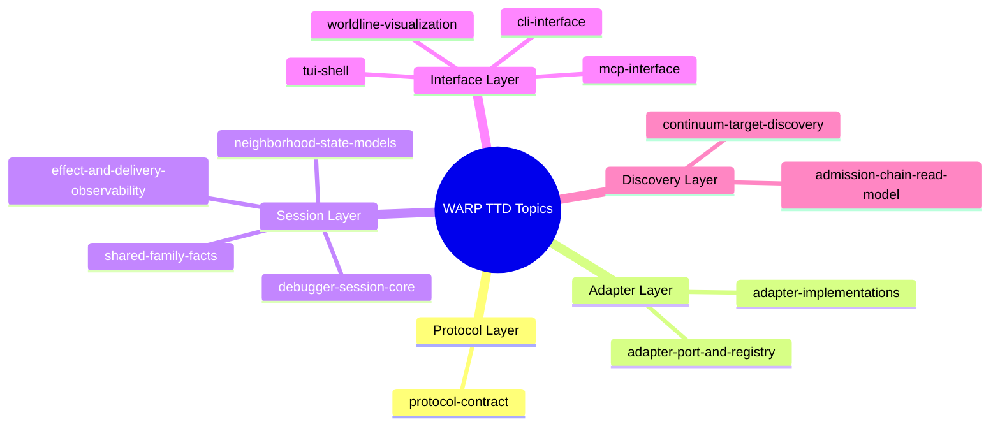

## Active Topic Shelves

### Protocol Layer

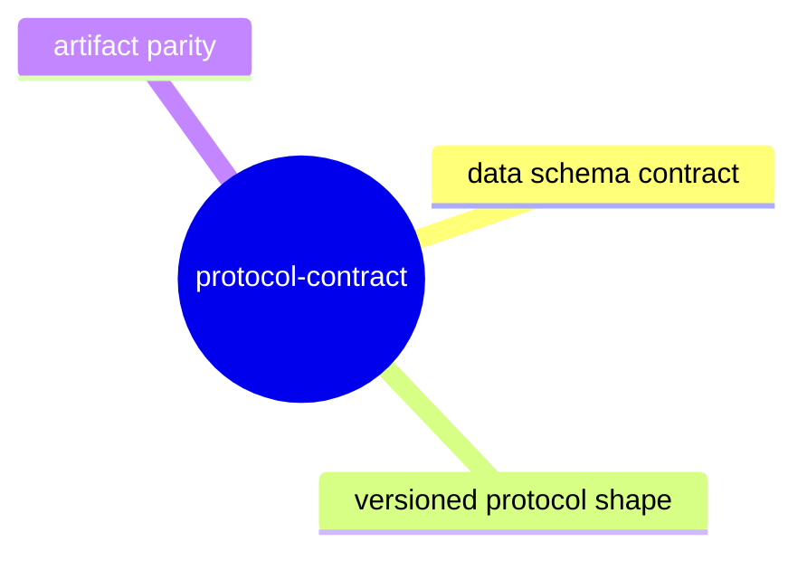

#### [protocol-contract](protocol-contract/README.md)
Protocol schema, protocol mirror, and shape/version invariants.

### Adapter Layer

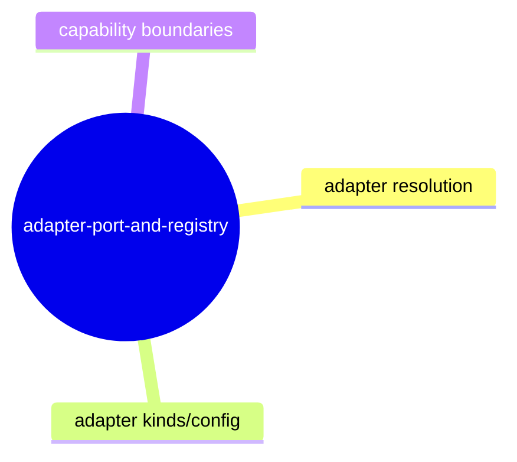

#### [adapter-port-and-registry](adapter-port-and-registry/README.md)
Host adapter port, capabilities, and adapter resolution.

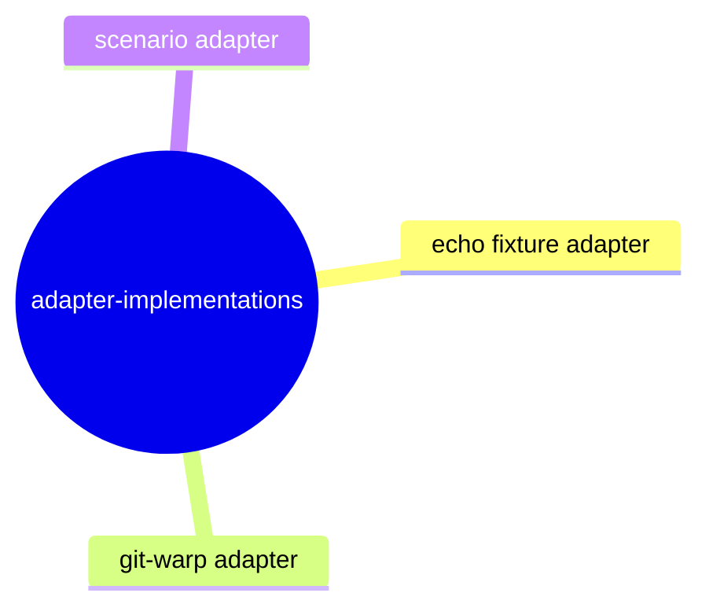

#### [adapter-implementations](adapter-implementations/README.md)
Fixture, git-warp, and scenario adapter behavior.

### Session Layer

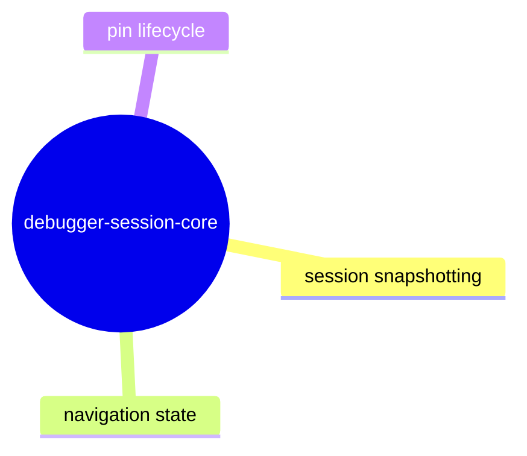

#### [debugger-session-core](debugger-session-core/README.md)
Session lifecycle, snapshot assembly, and navigation state.

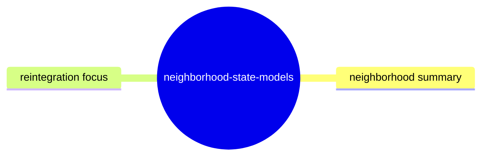

#### [neighborhood-state-models](neighborhood-state-models/README.md)
Neighborhood summaries and focus/cross-view state contracts.

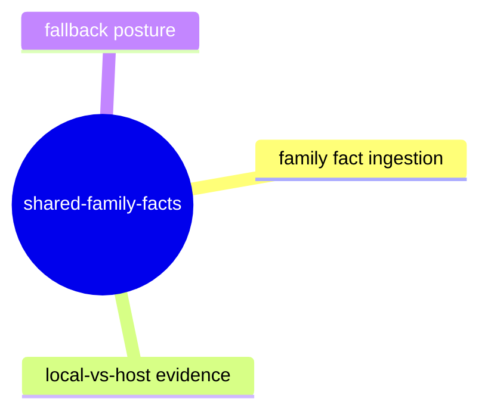

#### [shared-family-facts](shared-family-facts/README.md)
Shared-family ingress and host/manifest continuity contracts.

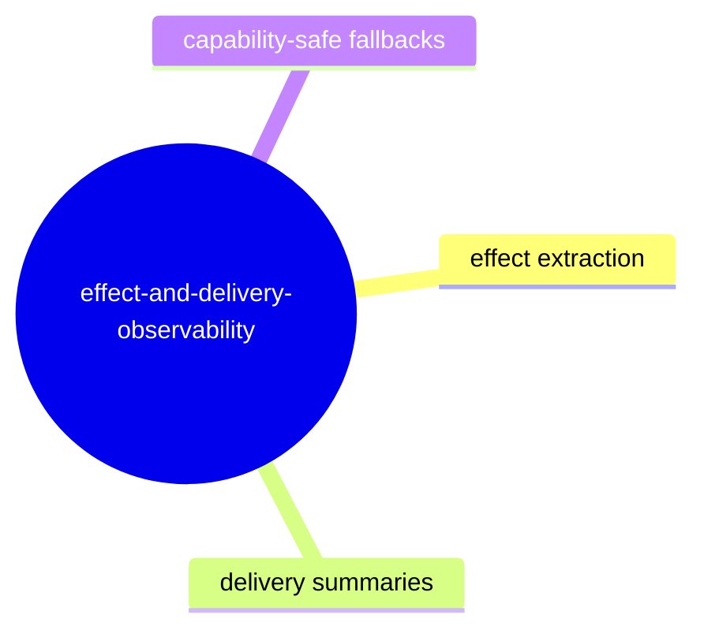

#### [effect-and-delivery-observability](effect-and-delivery-observability/README.md)
Effects, observations, and execution context.

### Interface Layer

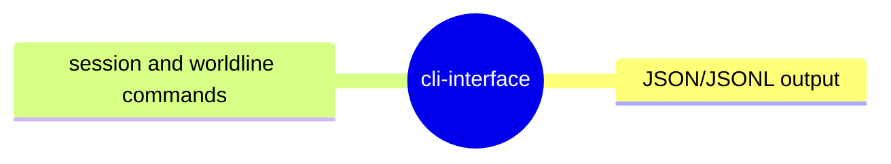

#### [cli-interface](cli-interface/README.md)
Machine-readable and human CLI workflows.

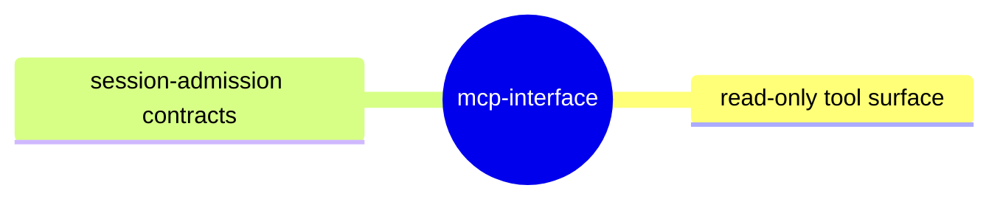

#### [mcp-interface](mcp-interface/README.md)
MCP server, read-only inspection tools, and session reuse.

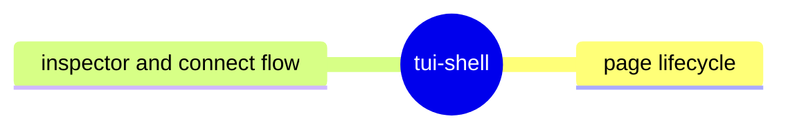

#### [tui-shell](tui-shell/README.md)
Connect and synchronization model for shell workflows.

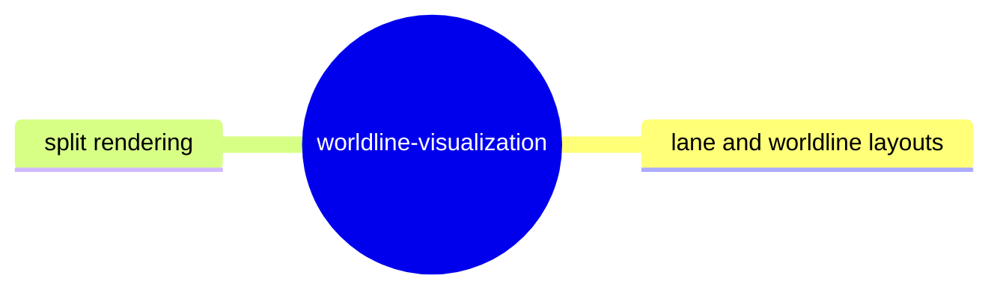

#### [worldline-visualization](worldline-visualization/README.md)
Lane layout, worldline columns, and navigation.

### Discovery Layer

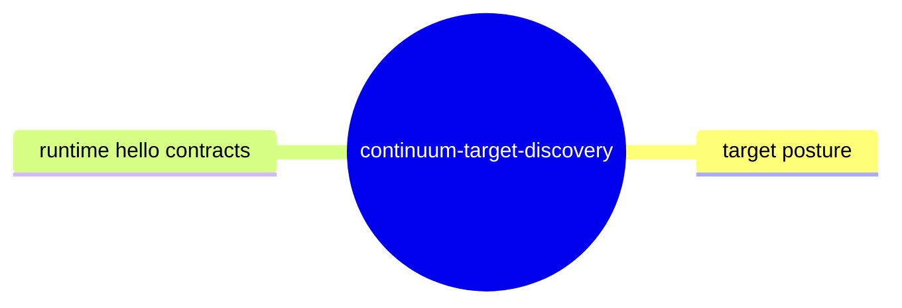

#### [continuum-target-discovery](continuum-target-discovery/README.md)
Live target descriptors, discovery posture, and runtime hello facts.

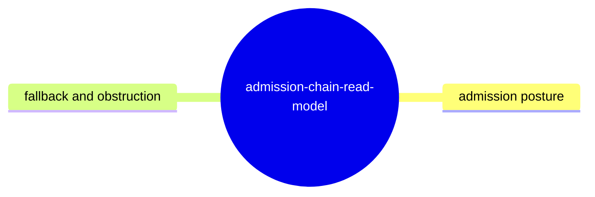

#### [admission-chain-read-model](admission-chain-read-model/README.md)
Admission-chain posture model and read inspection.

Each shelf has:
- `README.md`: current truth at HEAD.
- `test-plan.md`: executable evidence, cases, fixtures, oracles, and known gaps.

## Onboarding path for uninitiated readers

1. Start with `protocol-contract` to understand the data vocabulary.
2. Read `adapter-port-and-registry` to learn runtime boundaries.
3. Read `debugger-session-core` to understand session assembly.
4. Read `neighborhood-state-models` and `shared-family-facts` to learn derived summaries.
5. Read interface shelves (`cli-interface`, `mcp-interface`, `tui-shell`, `worldline-visualization`) to learn consumption paths.
6. Read operational shelves (`effect-and-delivery-observability`, `continuum-target-discovery`, `admission-chain-read-model`) for why posture and absence behavior matters.
7. Validate changes against linked `test-plan.md` files before editing behavior.
