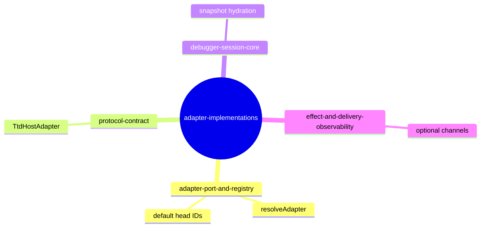
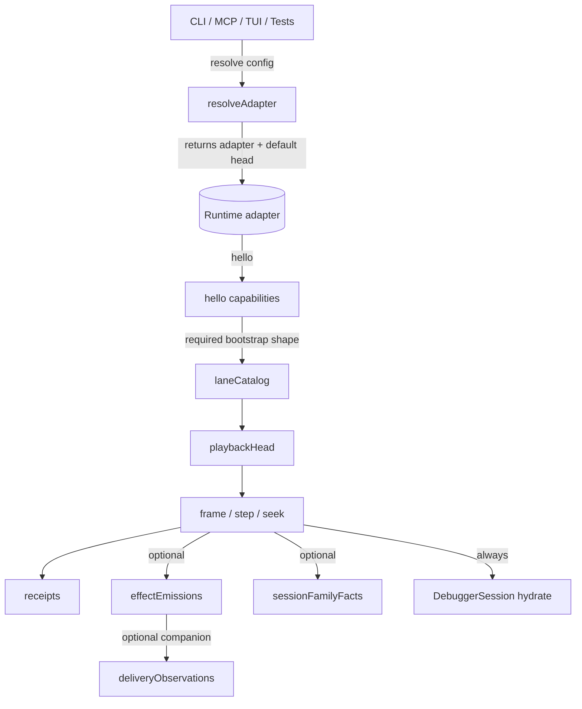
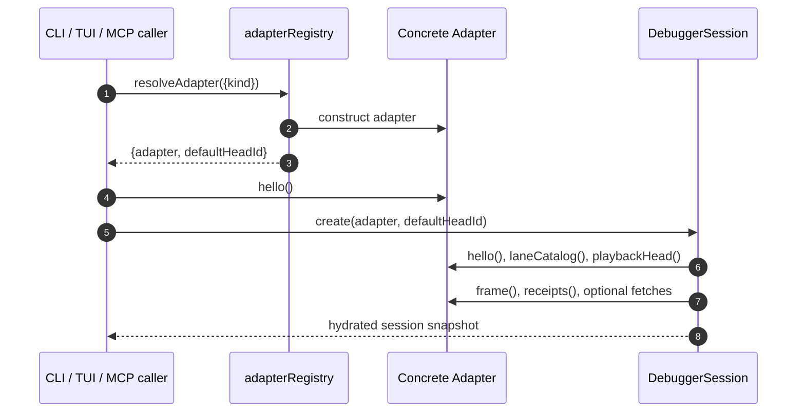
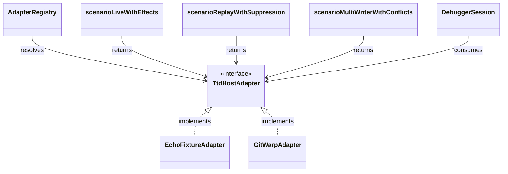
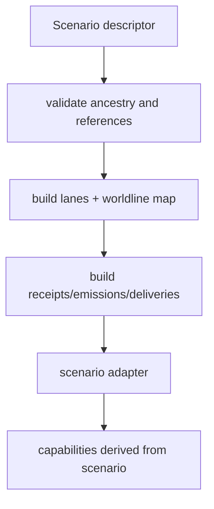
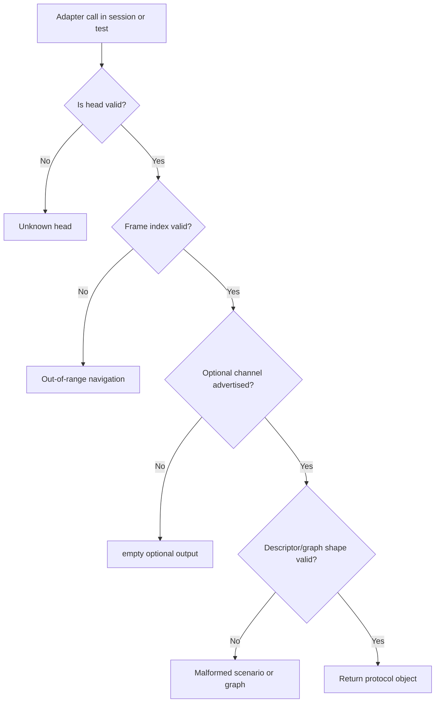

# Adapter Implementations

## Overview

Think of each adapter as a **protocol bridge**: it takes a host-specific state source and emits a normalized protocol shape that every runtime consumer can treat uniformly [C01, C02]. For a practical model, this means three families of implementations are interchangeable at the call boundary, while their internals differ in where they source frames, receipts, and optional enrichment.

After reading this shelf, you should be able to decide whether to use the deterministic fixture adapter, the history-substrate adapter, or the declarative scenario adapter, and then move confidently from intent to verification without opening a source file first [C01, C03, C04]. You will also have a concrete triage map for head mismatches, frame boundary errors, and malformed scenario graphs, plus explicit recovery paths when those failures occur in local and integration workflows [C05, C08, C09].

### Code owners

| Owner | Contact | Escalation expectation |
|---|---|---|
| James | `James <james@flyingrobots.dev>` | Route protocol-shape questions, behavior edits, and unresolved failure classification to this contact first. For urgent blockers, add an inline PR comment and open a relevant issue. |

### Related topics

| Topic | Relation | Why this relation matters |
|---|---|---|
| `protocol-contract` | Canonical type contract | Defines the `TtdHostAdapter` methods this shelf implements. |
| `adapter-port-and-registry` | Construction boundary | Resolves configured kind into a ready adapter and emits a canonical default head ID. |
| `debugger-session-core` | Runtime consumer | Builds snapshots from adapter methods and exposes them to UI/CLI pathways. |
| `effect-and-delivery-observability` | Optional channels | Relies on adapter-emitted effects and observations for observability pipelines. |
| `neighborhood-state-models` | Downstream derived summaries | Consumes session-family facts when those channels are present. |

**Figure 1 — Atlas for adapter integration points**

*Caption: a macro map of where adapter behavior enters and what assumptions downstream consumers make.*

This map shows one seam: registry construction, one shared contract, then consumer-specific interpretation of required and optional channels [C02, C03, C04].

## Reader pathways

### Reader pathway: make a contract-safe change to adapter behavior

The operating hypothesis for edits is: evidence first, then behavior. Confirm that `docs/topics/adapter-implementations/test-plan.md` contains stable requirement IDs and evidence for every behavior you are about to edit, then ensure each target requirement maps to a fixture and oracle before touching source files [C13, C14, C15]. Use this one-minute command before opening edits [C15]:

```bash
npm run test -- test/echoFixtureAdapter.spec.ts test/gitWarpAdapter.spec.ts test/scenarioFixture.spec.ts
```

Then edit in this order: first fixtures or inputs, next implementation code, and finally this shelf so truth remains synchronized with behavior [C13].

### Reader pathway: triage a runtime failure

If your run fails on adapter calls, first classify the failure against the top-level branches in the triage graph, then use the mode descriptions and matrix to choose the fastest recovery path [C05, C07, C10]. Most failures are deterministic and usually indicate head identity, frame boundary, or scenario-data drift.

### Reader pathway: assess impact before editing shared surfaces

Before changing adapter behavior, compare this shelf with `protocol-contract` and `adapter-port-and-registry` and then check `debugger-session-core`, because session consumers are where optional channels become visible [C01, C03, C04]. If your change affects `playbackHead`, `frame`, or capability output, treat it as cross-shelf by design and verify downstream expectations, not just direct adapter tests [C05].

## Adapter contract and entry flow

### A shared hypothesis for all implementations

The shared **contract hypothesis** is that all adapters implement the same required interface, but each implementation varies in optional channel coverage and how it computes those channels [C01]. Consumers can depend on the required methods and gate optional methods by capabilities rather than by concrete implementation assumptions [C02].

**Figure 2 — Shared adapter runtime path (macro view)**

*Caption: the first-call path for all adapter users, showing where optional channels diverge.*

At startup, the caller resolves an adapter and receives both an instance and a default head. `hello()` is the source of truth for channel availability. `playbackHead` and `frame` establish temporal context, while optional methods return richer payloads when declared [C03, C04].

### Registry bootstrap sequence

**Figure 3 — Adapter registration and session hydration**

*Caption: startup order in one transaction from config to hydrated session state.*

Construction is isolated in registry and session layers so downstream callers do not import concrete adapter classes directly [C03]. Snapshot updates use the same adapter object, which is why capability checks and method names are so critical at bootstrap and after each navigation action [C06].

### Class map of runtime participants

**Figure 4 — Runtime class roles**

*Caption: class-level composition for construction and consumption.*

`TtdHostAdapter` defines the required method set that all adapters expose [C01]. Two concrete adapter classes and scenario factories are selected through the registry and consumed only through the session contract, so callers should reason about behavior changes through interface behavior and capability signals [C03, C06].

## Concrete implementation families

### Echo fixture adapter

The hypothesis for `echo-fixture` is that deterministic behavior is the primary advantage: all fixture data is explicit and replayable, and assertions can be written without substrate-side ambiguity [C07]. It seeds static capabilities and a known head state, which makes it ideal for regression-heavy onboarding and failure rehearsal [C07, C08].

**Figure 5 — Echo adapter data intent**
```mermaid
flowchart TD
  FixtureState[Static fixture state object] --> Hello[hello()]
  FixtureState --> Heads[playbackHead per headId]
  Heads --> Frames[frame / receipts / step / seek]
  Frames --> Family[sessionFamilyFacts]
```
*Caption: deterministic source data and derived outputs for the echo fixture path.*

`EchoFixtureAdapter` returns full protocol channels and serializes snapshot-like data paths for reliable assertions across startup, navigation, and family facts [C07, C08].

### Git-warp adapter

The `git-warp` hypothesis is to normalize an external graph into protocol snapshots once and then serve deterministic navigation over that normalized structure [C10]. It groups patch receipts by Lamport tick, adds a synthetic frame at index 0, and serves indexed frames with boundary checks [C10, C11].

**Figure 6 — Git-warp frame model**
```mermaid
flowchart TD
  Graph[WarpCore graph] --> Materialize[materialize(receipts: true)]
  Materialize --> ReceiptIndex[group receipts by lamport]
  ReceiptIndex --> Ordered[indexed by ascending tick]
  Ordered --> Frame0[synthetic frame 0]
  Ordered --> FrameN[indexed frames]
  FrameN --> Emissions[extractGitWarpEffectEmissions]
```
*Caption: from graph receipts to adapter frame index and effect extraction.*

`GitWarpAdapter` exposes a stable default head and a constrained capability set, while optional effects are extracted from graph nodes that declare supportable effect kinds [C11, C12, C13].

### Scenario fixture adapter

The `scenario` family is descriptor-first: scenario JSON is compiled into runtime state before the adapter is used [C13]. That makes it ideal for controlled conflict and suppression scenarios, and it also makes malformed graphs fail early and loudly [C14].

**Figure 7 — Scenario construction path**

*Caption: constructor-time validation and channel derivation for scenario fixtures.*

Descriptor capabilities can include or exclude effect channels, and that choice should be treated as part of the contract for each scenario fixture [C14].

## Failure modes and remediation matrix

**Figure 8 — Failure classification flow**

*Caption: first-step decision tree for classifying adapter failures by source.*

### Failure mode 1 — Unknown head identity
**Shape:** request uses a `headId` unknown to the active adapter.  
**Signal:** hard failure before a protocol snapshot is produced.  
**Impact:** immediate request rejection; no partial navigation change.  
**Recovery:** validate against `playbackHead` and registry defaults, then rerun startup with corrected IDs [C03, C04, C06].

### Failure mode 2 — Out-of-range navigation
**Shape:** operations request a frame index outside adapter bounds.  
**Signal:** deterministic boundary error path from frame/seek methods.  
**Impact:** a single failing request; state usually remains consistent.  
**Recovery:** re-run using validated frame indices from the adapter's own index model [C10, C11].

### Failure mode 3 — Optional-channel mismatch
**Shape:** caller assumes a channel exists when `hello()` did not advertise it.  
**Signal:** empty arrays or no-op enrichment on optional methods.  
**Impact:** false alarm when consumers treat absence as failure.  
**Recovery:** treat channel absence as expected unless capability is declared and enforce capability gates upstream [C02, C03, C04].

### Failure mode 4 — Synthetic frame versus authored frame drift
**Shape:** tests or clients mix synthetic-frame and authored-frame assumptions across adapters.  
**Signal:** valid outputs that do not match expected user-facing assertions.  
**Impact:** skewed assertions without obvious crashes.  
**Recovery:** explicitly branch expectations by adapter family and confirm frame 0 conventions per family [C10, C14].

### Failure mode 5 — Malformed scenario descriptor
**Shape:** scenario lanes miss ancestry or reference unknown parents.  
**Signal:** constructor-time shape exception with parent/identity context.  
**Impact:** adapter never reaches runtime-ready state.  
**Recovery:** fix ancestry and declarations first, then re-run constructor and negative-path tests [C13, C14].

### Failure mode 6 — Unknown adapter configuration
**Shape:** runtime config requests unsupported adapter kind or unknown scenario name.  
**Signal:** registry construction stops before session creation.  
**Impact:** no runtime surface is available for the requested path.  
**Recovery:** use a supported adapter kind and rerun registry + session bootstrap [C03, C04].

### Failure mode 7 — Effect extraction returns empty output
**Shape:** git-warp receives malformed or unsupported effect nodes.  
**Signal:** fewer emissions and no hard failure in some frames.  
**Impact:** reduced observability coverage; session still hydrates.  
**Recovery:** validate effect source metadata and branch expectations by adapter capabilities [C11, C12].

**Table 1 — Failure remediation matrix**
| Failure mode | First-response action | Recovery strategy | Immediate verification check |
|---|---|---|---|
| Unknown head identity | Capture failing `headId` tuple | Validate against registry defaults and head list | Re-run adapter resolve + session startup assertions |
| Out-of-range navigation | Reproduce one minimal request | Compare against adapter index bounds | Add boundary tests for negative, min, max, and overflow |
| Optional-channel mismatch | Inspect `hello().capabilities` | Add capability gates before reading optional channels | Verify optional calls are skipped when unsupported |
| Synthetic frame mismatch | Normalize assertion against adapter family | Assert frame 0 semantics per implementation | Add family-specific frame-0 checks |
| Malformed descriptor | Reconstruct failing scenario declaration | Fix lane ancestry and lane references first | Re-run constructor tests for the fixture |
| Unknown adapter kind | Validate config `kind` and scenario name | Use supported values only | Re-run resolver tests |
| Effect extraction empty output | Inspect graph node properties | Decide whether empty output is allowed by contract | Re-run malformed effect fixture and assert expected counts |

## Appendix A: Recent Activity

Recent activity is maintained as a short operational ledger for this shelf.

**Table 2 — Recent related pull requests**
| Updated | PR | State | Why relevant |
|---|---|---|---|
| 2026-06-22 | [109](https://github.com/flyingrobots/warp-ttd/pull/109) | OPEN | Dependency maintenance PR; no direct adapter-contract impact. |
| 2026-06-22 | [105](https://github.com/flyingrobots/warp-ttd/pull/105) | MERGED | Dependency bump, no adapter contract delta. |
| 2026-06-22 | [102](https://github.com/flyingrobots/warp-ttd/pull/102) | MERGED | Runtime hello changes in dependent surfaces. |
| 2026-06-05 | [104](https://github.com/flyingrobots/warp-ttd/pull/104) | MERGED | Dependency bump, no adapter contract delta. |
| 2026-06-04 | [103](https://github.com/flyingrobots/warp-ttd/pull/103) | MERGED | Documentation strategy updates and registry maintenance. |

## Appendix B: Open GitHub issues

**Table 3 — Open issues (top priority candidates)**
| Issue | Title | Link |
|---|---|---|
| 108 | [LP-GP4-S1] Launchpad browser runtime hello target descriptor | https://github.com/flyingrobots/warp-ttd/issues/108 |
| 107 | [LP-GP4-S2] Browser replay tick history read model | https://github.com/flyingrobots/warp-ttd/issues/107 |
| 106 | [LP-GP4-S3] Rewind current visit control contract | https://github.com/flyingrobots/warp-ttd/issues/106 |
| 101 | Retire temporary WARP TTD runtime hello mirror | https://github.com/flyingrobots/warp-ttd/issues/101 |
| 100 | Cool idea: Why-not causal query surface | https://github.com/flyingrobots/warp-ttd/issues/100 |
| 99 | Cool idea: Runtime debuggability scorecard | https://github.com/flyingrobots/warp-ttd/issues/99 |
| 98 | Cool idea: Causal delta minimizer for counterfactual branches | https://github.com/flyingrobots/warp-ttd/issues/98 |
| 97 | Bad code: temporary shared-protocol mirrors can land without retirement gates | https://github.com/flyingrobots/warp-ttd/issues/97 |
| 96 | Bad code: Markdown style checks are not part of the documented validation gate | https://github.com/flyingrobots/warp-ttd/issues/96 |
| 95 | Cool idea: Continuum runtime hello conformance harness | https://github.com/flyingrobots/warp-ttd/issues/95 |
| 94 | Bad code: Method does not enforce lifecycle status consistency | https://github.com/flyingrobots/warp-ttd/issues/94 |
| 92 | Cool idea: Continuum debugger capability simulator fixtures | https://github.com/flyingrobots/warp-ttd/issues/92 |
| 91 | Cool idea: Agent interface cookbook for causal debugging | https://github.com/flyingrobots/warp-ttd/issues/91 |
| 90 | Bad code: Method has no stale work-in-progress label audit | https://github.com/flyingrobots/warp-ttd/issues/90 |
| 89 | Bad code: GitHub comment workflow is shell-quoting fragile | https://github.com/flyingrobots/warp-ttd/issues/89 |
| 88 | Bad code: Method checker accepts shallow design sections | https://github.com/flyingrobots/warp-ttd/issues/88 |
| 86 | Human causal debugger workspace over agent-readable facts | https://github.com/flyingrobots/warp-ttd/issues/86 |
| 85 | Evidence ledger and investigation report export | https://github.com/flyingrobots/warp-ttd/issues/85 |
| 84 | Counterfactual branch workbench and worldline comparison | https://github.com/flyingrobots/warp-ttd/issues/84 |
| 83 | Causal query and breakpoint contract | https://github.com/flyingrobots/warp-ttd/issues/83 |

## Appendix C: Evidence and citation index

| Citation ID | Source File | Line | Git SHA |
|---|---|---|---|
| C01 | `src/adapter.ts` | 13 | `16d6563e133ebeba4bbc928fc9235ee38af024f4` |
| C02 | `src/adapter.ts` | 15 | `16d6563e133ebeba4bbc928fc9235ee38af024f4` |
| C03 | `src/app/adapterRegistry.ts` | 26 | `16d6563e133ebeba4bbc928fc9235ee38af024f4` |
| C04 | `src/app/adapterRegistry.ts` | 29 | `16d6563e133ebeba4bbc928fc9235ee38af024f4` |
| C05 | `src/app/adapterRegistry.ts` | 87 | `16d6563e133ebeba4bbc928fc9235ee38af024f4` |
| C06 | `src/app/debuggerSession.ts` | 150 | `16d6563e133ebeba4bbc928fc9235ee38af024f4` |
| C07 | `src/adapters/echoFixtureAdapter.ts` | 45 | `16d6563e133ebeba4bbc928fc9235ee38af024f4` |
| C08 | `src/adapters/echoFixtureAdapter.ts` | 85 | `16d6563e133ebeba4bbc928fc9235ee38af024f4` |
| C09 | `src/adapters/echoFixtureAdapter.ts` | 279 | `16d6563e133ebeba4bbc928fc9235ee38af024f4` |
| C10 | `src/adapters/gitWarpAdapter.ts` | 91 | `16d6563e133ebeba4bbc928fc9235ee38af024f4` |
| C11 | `src/adapters/gitWarpAdapter.ts` | 311 | `16d6563e133ebeba4bbc928fc9235ee38af024f4` |
| C12 | `src/adapters/gitWarpAdapter.ts` | 336 | `16d6563e133ebeba4bbc928fc9235ee38af024f4` |
| C13 | `src/adapters/gitWarpAdapter.ts` | 189 | `16d6563e133ebeba4bbc928fc9235ee38af024f4` |
| C14 | `src/adapters/scenarioFixtureAdapter.ts` | 92 | `16d6563e133ebeba4bbc928fc9235ee38af024f4` |
| C15 | `src/adapters/scenarioFixtureAdapter.ts` | 130 | `16d6563e133ebeba4bbc928fc9235ee38af024f4` |
| C16 | `src/adapters/scenarioFixtureAdapter.ts` | 194 | `16d6563e133ebeba4bbc928fc9235ee38af024f4` |
| C17 | `src/adapters/scenarioFixtureAdapter.ts` | 14 | `16d6563e133ebeba4bbc928fc9235ee38af024f4` |
| C18 | `src/adapters/gitWarpEffectEmissionExtractor.ts` | 46 | `16d6563e133ebeba4bbc928fc9235ee38af024f4` |
| C19 | `src/adapters/gitWarpEffectEmissionExtractor.ts` | 113 | `16d6563e133ebeba4bbc928fc9235ee38af024f4` |
| C20 | `docs/topics/adapter-implementations/test-plan.md` | 5 | `16d6563e133ebeba4bbc928fc9235ee38af024f4` |
| C21 | `docs/topics/adapter-implementations/test-plan.md` | 12 | `16d6563e133ebeba4bbc928fc9235ee38af024f4` |
| C22 | `docs/topics/adapter-implementations/test-plan.md` | 23 | `16d6563e133ebeba4bbc928fc9235ee38af024f4` |

## Appendix D: Glossary

| Term | Meaning |
|---|---|
| **adapter** | A concrete implementation of `TtdHostAdapter` that emits protocol-defined methods and payloads. |
| **capability** | A token in `hello().capabilities` that declares which optional methods are supported. |
| **frame** | The unit of playback snapshoting, indexed by each adapter’s internal model. |
| **head** | The mutable cursor used to select where frame and read operations resolve. |
| **delivery observation** | The outcome record for one effect emission in the target environment. |
| **synthetic frame** | A baseline frame intentionally included as initial playback state. |
| **session-family facts** | Optional neighborhood and reintegration-derived artifacts for downstream shelves. |
