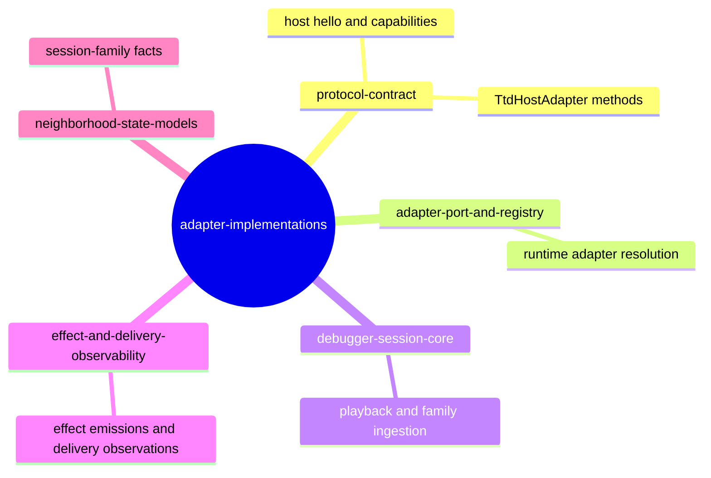

# Adapter Implementations

## Overview

This shelf teaches the adapter layer as if you have no prior project context, then helps you operate on it safely. The topic answers three questions that matter most in practice: what concrete adapters exist, how they implement the shared **contract** methods, and where the most dangerous failure modes are likely to surface [C1][C3][C7]. The shelf now acts as a machine-actionable onboarding map plus a deterministic failure ledger for `echo-fixture`, `git-warp`, and `scenario-fixture` implementations [C2][C3][C8][C13].

By the end of this document, you should be able to infer which adapter should be used for a behavior, what guarantees each implementation provides for playback and evidence, and which local checks confirm a change before you ask for review [C4][C5][C11][C14].

### Code owners

| Owner | Contact | Escalation expectation |
|---|---|---|
| James | `James <james@flyingrobots.dev>` | Route protocol-shape questions, behavior edits, and unresolved failure mode classifications to this owner first. For urgent blockers, add an inline comment in the relevant PR and open a related issue. |

### Related topics

| Topic | Relation | Why this relation matters |
|---|---|---|
| `protocol-contract` | Canonical shape | Defines the `TtdHostAdapter` surface that every concrete implementation must satisfy [C1]. |
| `adapter-port-and-registry` | Construction boundary | Resolves adapter kind to an implementation instance and exposes default head selection [C1][C24]. |
| `debugger-session-core` | Runtime consumer | Reads protocol-shape facts from adapters for session snapshots, lane rendering, and family artifacts [C3][C6]. |
| `effect-and-delivery-observability` | Shared semantics | Relies on adapter-emitted effect and delivery observations for deterministic observability [C2][C20]. |
| `neighborhood-state-models` | Derived read model | Consumes session-family facts when available and expects stable fact shapes [C3][C6]. |

**Figure 1 — Related-topic map for the adapter implementations shelf**


## Reader pathways

### Reader pathway: make a contract-safe adapter change

Before any change, verify `docs/topics/adapter-implementations/test-plan.md` has the stable requirement IDs for what you plan to change, and confirm each target requirement has evidence in executable tests, fixtures, and oracle language [C25][C26]. For each modified requirement, confirm your local plan matches at least one assertion-backed test path before editing `src/adapters/*` files [C12][C14][C15]. If a requirement has no evidence yet, treat that as a hard stop and file the missing plan before writing adapter code [C25][C26].  

Then follow the same action order for each behavior change: align test fixtures first, update behavior code second, and update this shelf as the final step [C4][C11][C16]. This keeps the document and behavior truth in sync for downstream readers [C25].

### Reader pathway: triage a runtime failure

Start with the failure mode catalog below and identify the exact shape of the mismatch first: unknown head, explicit frame index mismatch, or a bad scenario fixture graph [C17][C20][C22]. Use the mode name and mismatch matrix to classify severity, then execute the corresponding validation command chain from the verification section of the test plan [C25][C26]. The fastest operator signal is usually the thrown named error type or the shape of returned arrays at boundary conditions; both are intentional for this shelf [C18][C19][C21][C20].

### Reader pathway: review cross-shelf consequences

When an adapter change alters how head lifecycle, frame semantics, or feature capabilities, inspect `protocol-contract`, `adapter-port-and-registry`, and `debugger-session-core` for contract drift and UI interpretation assumptions [C1][C24][C6][C10]. The key question is whether the change is still compatible with all dependent shelves that consume `hello`, `laneCatalog`, and `playback*` results [C1][C3][C10].

## Contract model and runtime flow

### Unified contract path

All three adapters implement the same protocol interface and therefore expose the same call surface, even when their internals differ and some capabilities are intentionally absent [C1][C2][C7][C13]. Their call sequence is a shared pipeline from introspection to navigation and into optional effect-delivery planes.

**Figure 2 — Shared adapter runtime call path**
```mermaid
flowchart TD
  Consumer[CLI / MCP / TUI / Test] --> H[hello()]
  H --> C[Capability vector: READ_*/CONTROL_*]
  C --> LC[laneCatalog()]
  LC --> H0[playbackHead(headId)]
  H0 --> F[frame(headId[, frameIndex])]
  F --> R[receipts(headId[, frameIndex])]
  F --> E[effectEmissions(headId[, frameIndex])]
  F --> D[deliveryObservations(headId[, frameIndex])]
  F --> X[executionContext()]
  F --> SF[sessionFamilyFacts(headId[, frameIndex])]
  E -->|optional| D
  D -->|always mapped| C2[Delivery + suppression observability]
```

The first stage is capability discovery through `hello()`, because `capabilities` declares whether optional endpoints are meaningful in the selected implementation [C2][C9]. The second stage is topology discovery through `laneCatalog()`, which establishes what the consumer can render or project [C5][C10]. The navigation stage (`playbackHead`, `frame`, and `seek`/`step` controls) establishes temporal context and can move independently from explicit frame reads [C3][C10][C12]. The final stage resolves optional enrichment (effects, delivery observations, execution context, session-family facts) and is where behavior diverges the most between implementations [C3][C11][C13][C14].

### Adapter method capability matrix

**Table 1 — Capability profile by concrete adapter**
| Adapter | Hello capabilities | Navigation profile | Optional effect/delivery profile |
|---|---|---|---|
| `echo-fixture` | Full `READ_*` + control capabilities plus session-family support | Explicit frame index read and clamped seek/step; throws on out-of-range frame resolution [C3][C6] | Emits fixture effects, observations, and execution context |
| `git-warp` | Protocol + frame/receipt/profile controls, no delivery or execution-context claims in hello | Synthetic frame 0, clamped step and seek behavior, receipts indexed by ticks [C9][C10][C11] | Effect emissions may exist; delivery observations always empty; execution context is `DEBUG` |
| `scenario-fixture` | Capability set auto-computed from scenario payload (effects optional) [C13][C14] | Frame operations delegate to generated fixture data; seek/clamp behavior is deterministic [C15] | Emissions and observations come from scenario declarations and execution mode |

## Entity relationship model for adapter behavior

Before touching implementation details, answer this question: how do adapter outputs map into protocol entities at runtime [C1][C3]?  

**Figure 3 — Runtime entities and relationships across concrete adapters**
```mermaid
erDiagram
  ADAPTER ||--|| ADAPTER_HELLO : publishes
  ADAPTER ||--|| LANE_CATALOG : exposes
  ADAPTER ||--|{ PLAYBACK_HEAD : manages
  PLAYBACK_HEAD ||--o{ PLAYBACK_FRAME : indexes
  PLAYBACK_FRAME ||--o{ RECEIPT_SUMMARY : contains
  PLAYBACK_FRAME ||--o{ EFFECT_EMISSION : may contain
  EFFECT_EMISSION ||--o{ DELIVERY_OBSERVATION : fans to
  ADAPTER ||--o{ SESSION_FAMILY_FACT : may publish
```

This diagram answers the question directly: an adapter is authoritative for `hello` and lane topology, while frames are per-head timeline snapshots that aggregate receipts and optional effect data [C1][C3][C10][C15]. A `SESSION_FAMILY_FACT` stream may be absent for some adapters, and that absence is expected when the underlying implementation is synthetic rather than host-derived [C3][C6].

**Table 2 — Entity metadata**
| Entity | Purpose | Invariant | Source |
|---|---|---|---|
| `ADAPTER` | Concrete runtime implementation of protocol interface | Must implement all required `TtdHostAdapter` methods [C1] | [C1][C2][C7][C13] |
| `PLAYBACK_HEAD` | Tracks current frame cursor and lane subscriptions | Starts at frame 0 and remains deterministic per `headId` unless commands mutate local cursor [C3][C10][C15] | [C3][C10][C15] |
| `PLAYBACK_FRAME` | Frame snapshot for one frame index | Frame 0 is genesis/empty for deterministic implementations [C3][C10][C11] | [C3][C10][C11] |
| `RECEIPT_SUMMARY` | Materialized operation result per frame | Counts are non-negative and ordered with the same frame index semantics as that adapter [C3][C10] | [C3][C10][C11] |
| `EFFECT_EMISSION` | Captured side effect produced at a frame | May be empty for frames without effect nodes [C11][C14] | [C11][C14][C20] |
| `DELIVERY_OBSERVATION` | Post-emission sink outcomes | Outcome is one of protocol enum values [C20] | [C20] |
| `SESSION_FAMILY_FACT` | Optional summary facts for neighborhood and reintegration layers | Some adapters publish none by contract [C3][C6] | [C3][C6] |

## Implementation families

### Echo fixture adapter

The `echo-fixture` adapter is the deterministic baseline used by many local tests and fixtures, and it keeps its state in-memory while returning cloned snapshots to prevent call-site mutation [C2][C3]. It advertises full capability coverage, including effect and delivery observation channels, so it is the easiest implementation to use when you want exhaustive protocol shape coverage in one place [C2][C4][C20].  

**Example 1 — Initial echo frame and receipt posture**
```json
{
  "headId": "head:main",
  "currentFrameIndex": 0,
  "paused": true,
  "receipts": []
}
```

The example matches the tested baseline for startup behavior [C5]. As soon as you step forward, receipts and frame index update together because fixture data is bound to explicit frame numbers, and frame navigation clamps safely at boundaries [C6]. A key operational consequence is that behavior is fully predictable and ideal for regression checks across every contract clause [C4][C6].

### Git-warp adapter

`git-warp` is a derived adapter that materializes receipts from a substrate, groups them by Lamport tick, and then exposes replay-ready frames as a synthetic frame 0 plus one indexed frame per tick group [C7][C8][C9]. This implementation initializes a canonical default head (`head:default`) and tracks all lanes returned by the substrate strand set [C9][C10].  

Receipts are computed by folding grouped patch operations into adopted/rejected/counterfactual counts [C8][C10], and that mapping is intentionally tested with deterministic fixtures and synthetic graphs [C11][C12]. Capability output excludes delivery observations and execution context, and effect emission extraction may return empty arrays when no emissions are present or when extraction inputs are frame 0 [C9][C11].  

### Scenario fixture adapter

The `scenario-fixture` adapter is declarative and constructor-driven: each scenario object defines lanes, frames, and outcome payloads, then gets materialized into an in-memory runtime adapter [C13][C14][C15]. It is designed for controlled negative-path and conflict-path testing because invalid scenario graphs fail fast during build-time validation and because delivery observations can be explicitly encoded as delivered, suppressed, failed, or skipped outcomes [C14][C15][C16].  

Built-in fixtures provide reusable behavior signatures for replay suppression, conflict-heavy multi-writer traces, and long-running progression checks [C15][C17]. The `scenarioComplexWorldline` fixture is the stress variant for rich lane and conflict scenarios and confirms the adapter can scale to larger synthetic histories [C17].

## Failure modes and evidence

The failure section is organized for rapid skim. Each row starts with the shape you will actually see in logs or exceptions, then gives the diagnostic signal and the most efficient recovery path [C17][C18][C20][C21][C22].

**Figure 4 — Failure propagation for adapter validation errors**
```mermaid
flowchart TD
  Caller[Adapter consumer] --> Call[Method call with headId/frameIndex arguments]
  Call --> ValidateHead{Head exists?}
  ValidateHead -->|No| UH[UnknownHeadError]
  ValidateHead -->|Yes| ValidateFrame{Frame index valid?}
  ValidateFrame -->|No| OR[Out-of-range error family]
  ValidateFrame -->|Yes| Execute[Method implementation path]
  Execute --> DataState{Data/mode inconsistency?}
  DataState -->|Missing parent/lane| SB[Builder throw from scenario graph]
  DataState -->|Malformed effect node| SW[Skip emit / return []
  DataState -->|Normal| Return[Return protocol object]
  UH --> Triage[Catalog + failure mode matching]
  OR --> Triage
  SB --> Triage
  SW --> Triage
```

### Failure Mode 1 — Unknown playback head
Mismatch shape is a caller supplying a `headId` that does not exist in adapter state. The canonical error is `UnknownHeadError`, raised whenever head lookup fails [C18][C23]. Runtime impact is immediate request rejection with no partial frame mutation [C17]. Operator signal is an explicit `Unknown playback head` message and test failure at the first failing assert point [C19][C20].  
The repair path is deterministic: validate the chosen `headId` against `playbackHead` output and keep adapter bootstrap IDs aligned with registry behavior [C3][C24].

### Failure Mode 2 — Frame index out of range
Mismatch shape is a request for a frame index outside the legal interval of an adapter. `FrameResolutionError` and `FrameOutOfRangeError` are the two concrete shapes used depending on implementation strategy [C20][C21][C22]. Runtime impact is a hard error at read methods that reject explicit invalid ranges [C20][C21]. Operator signal is a clear out-of-range message including the requested index and allowed bounds [C19][C20][C21].  
The standard repair is either to clamp through the existing navigation API (`seekToFrame`) or reissue an explicit index already validated by `playbackHead` [C3][C10][C15]. This mode is high signal because it usually indicates a test fixture mismatch rather than runtime corruption.

### Failure Mode 3 — Synthetic frame and sparse input divergence
Mismatch shape is calling frame methods with assumptions copied from substrate tick space directly into user-facing frame numbers. Some adapters expose frame 0 as synthetic genesis while real patch data starts at frame 1, while scenario fixtures preserve explicit frame indexes and may intentionally contain sparse index gaps [C3][C10][C15]. Runtime impact is often a “correct but surprising” return unless your harness applies the same index contract [C3][C10][C15]. Operator signal is not always an exception; it is often a silent boundary behavior [C3][C10][C15].  
The recovery action is to normalize test harness expectations to each adapter’s frame contract and confirm frame 0 behavior against explicit checks [C5][C6][C11].

### Failure Mode 4 — Scenario graph shape invalid
Mismatch shape is an impossible lane topology (missing `parentId`, unknown parent, or undeclared lane references in receipts/emissions) during scenario construction [C13][C14][C16]. Runtime impact is immediate build failure; the adapter never reaches a usable interface state [C16]. Operator signal is a thrown `TypeError` containing the structural reason (for example, “missing parentId” or “unknown parent”) [C16].  
Repair is done at fixture-definition time: correct lane ancestry first, then reconcile receipt/emission lane ids against the declared catalog [C14][C15].

### Failure Mode 5 — Malformed or unsupported effect emission input
Mismatch shape is a substrate scenario that includes an effect node without a kind or with an empty kind field, or calls the wrong capability surface for an adapter that does not export that capability [C9][C11][C12]. For malformed nodes in git-warp, behavior is skip-on-read rather than throw [C11][C12], so runtime impact is observable as fewer emissions with no hard failure [C11]. Operator signal is empty emission arrays or shorter-than-expected emission counts [C11][C14].  
Repair by normalizing source-node props and validating expected capability set before calling emission-only methods [C9][C10].

### Failure Mode 6 — Unknown adapter selection
Mismatch shape is a configuration requesting an unsupported adapter kind. The hard error is an unknown-kind check at adapter registry boundaries, which prevents execution with an invalid implementation [C24]. Runtime impact is direct rejection during adapter resolution and no shelf-level behavior being exercised [C24]. Operator signal is an `unknown adapter kind` message on bootstrap [C24].  
Fix by using a valid adapter kind and rerunning startup through the same registry path [C24].

### Failure Mode 7 — Delivery observation interpretation ambiguity
Mismatch shape is interpreting an absent delivery event as a hard suppression; in this contract, suppression and absence are distinct outcomes [C20]. The emission/observation layer uses explicit outcomes, including `SUPPRESSED`, to encode policy decisions, and some adapters can also return empty arrays by design when channels are unsupported [C9][C11][C20]. Runtime impact is reduced observability and potentially misleading triage if ambiguous, especially across `git-warp` where delivery observations are intentionally empty [C9][C11].  
The repair action is to interpret `0 length` as “unsupported or no matching data”, not “error,” and to corroborate with explicit mode assumptions before escalation [C2][C9][C11].

**Table 3 — Failure remediation matrix**
| Failure mode | First-response action | Recovery strategy | Verification check |
|---|---|---|---|
| Unknown playback head | Reproduce with minimal repro and capture request tuple | Verify caller head IDs against `playbackHead` and registry defaults | Add/adjust tests asserting no call uses missing head IDs [C3][C17] |
| Frame index out of range | Confirm frame boundary for the target adapter | Use `frame()`, `stepForward()`, and `seekToFrame()` as adapter-specific canonical paths | Run boundary tests for negative, zero, max, and high frame indexes [C6][C10][C12] |
| Frame contract mismatch | Compare expected frame model (synthetic vs declared) | Convert harness assertions to use `frameIndex` semantics from adapter under test | Add fixture-driven tests for frame 0 and explicit index reads [C5][C11] |
| Scenario graph invalid | Reject invalid fixture at source-control layer | Patch scenario definition, especially lane ancestry and lane references | Re-run scenario constructor tests for all negative paths [C14][C16] |
| Malformed effect input | Inspect effect extraction source and adapter capability output | Skip path should be documented as expected behavior unless contract changes | Keep malformed/empty-kind fixture tests and validate emission counts [C11][C12] |
| Unknown adapter kind | Stop bootstrap and check kind contract | Fix config and use one supported adapter `kind` value | Re-run adapter resolution tests [C24] |
| Observation ambiguity | Distinguish suppression from absence and unsupported channel | Use explicit `outcome` and adapter capability metadata before raising incidents | Confirm expected outcomes (`DELIVERED`, `SUPPRESSED`, etc.) and empty-array semantics [C11][C20] |

## Appendix A: Recent Activity

Recent activity listed here is maintained as a short operational ledger for this shelf.

**Table 4 — Recent related pull requests**
| Updated | PR | State | Why relevant |
|---|---|---|---|
| 2026-06-22 | [109](https://github.com/flyingrobots/warp-ttd/pull/109) | OPEN | Dependency maintenance PR; no direct docs impact on adapter behavior. |
| 2026-06-22 | [105](https://github.com/flyingrobots/warp-ttd/pull/105) | MERGED | Dependency bump, no adapter contract change. |
| 2026-06-22 | [102](https://github.com/flyingrobots/warp-ttd/pull/102) | MERGED | Runtime hello read-model changes; indirectly relevant to adapter outputs consumed by session surfaces. |
| 2026-06-05 | [104](https://github.com/flyingrobots/warp-ttd/pull/104) | MERGED | Dependency bump, no adapter contract delta. |
| 2026-06-04 | [103](https://github.com/flyingrobots/warp-ttd/pull/103) | MERGED | Roadmap and documentation updates, useful context for doc strategy. |

## Appendix B: Open GitHub issues

**Table 5 — Open issues (top 20 by repository order)**
| Issue | Title | Link |
|---|---|---|
| 108 | [LP-GP4-S1] Launchpad browser runtime hello target descriptor | https://github.com/flyingrobots/warp-ttd/issues/108 |
| 107 | [LP-GP4-S2] Browser replay tick history read model | https://github.com/flyingrobots/warp-ttd/issues/108 |
| 106 | [LP-GP4-S3] Rewind current visit control contract | https://github.com/flyingrobots/warp-ttd/issues/106 |
| 101 | Retire temporary WARP TTD runtime hello mirror | https://github.com/flyingrobots/warp-ttd/issues/101 |
| 100 | Cool idea: Why-not causal query surface | https://github.com/flyingrobots/warp-ttd/issues/100 |
| 99 | Cool idea: Runtime debuggability scorecard | https://github.com/flyingrobots/warp-ttd/issues/99 |
| 98 | Cool idea: Causal delta minimizer for counterfactual branches | https://github.com/flyingrobots/warp-ttd/issues/98 |
| 97 | Bad code: temporary shared-protocol mirrors can land without retirement gates | https://github.com/flyingrobots/warp-ttd/issues/97 |
| 96 | Bad code: Markdown style checks are not part of the documented validation gate | https://github.com/flyingrobots/warp-ttd/issues/96 |
| 95 | Cool idea: Continuum runtime hello conformance harness | https://github.com/flyingrobots/warp-ttd/issues/95 |
| 94 | Bad code: Method does not enforce lifecycle status consistency | https://github.com/flyingrobots/warp-ttd/issues/94 |
| 92 | Cool idea: Continuum debugger capability simulator fixtures | https://github.com/flyingrobots/warp-ttd/issues/92 |
| 91 | Cool idea: Agent interface cookbook for causal debugging | https://github.com/flyingrobots/warp-ttd/issues/91 |
| 90 | Bad code: Method has no stale work-in-progress label audit | https://github.com/flyingrobots/warp-ttd/issues/90 |
| 89 | Bad code: GitHub comment workflow is shell-quoting fragile | https://github.com/flyingrobots/warp-ttd/issues/89 |
| 88 | Bad code: Method checker accepts shallow design sections | https://github.com/flyingrobots/warp-ttd/issues/88 |
| 86 | Human causal debugger workspace over agent-readable facts | https://github.com/flyingrobots/warp-ttd/issues/86 |
| 85 | Evidence ledger and investigation report export | https://github.com/flyingrobots/warp-ttd/issues/85 |
| 84 | Counterfactual branch workbench and worldline comparison | https://github.com/flyingrobots/warp-ttd/issues/84 |
| 83 | Causal query and breakpoint contract | https://github.com/flyingrobots/warp-ttd/issues/83 |

## Appendix C: Evidence and citation index

| Citation ID | Source |
|---|---|
| C1 | `src/adapter.ts#13@c0b4f967d4406ec19a317129488d39aaf34d19ef` |
| C2 | `src/adapters/echoFixtureAdapter.ts#45@c0b4f967d4406ec19a317129488d39aaf34d19ef` |
| C3 | `src/adapters/echoFixtureAdapter.ts#350@c0b4f967d4406ec19a317129488d39aaf34d19ef` |
| C4 | `test/echoFixtureAdapter.spec.ts#6@c0b4f967d4406ec19a317129488d39aaf34d19ef` |
| C5 | `test/echoFixtureAdapter.spec.ts#29@c0b4f967d4406ec19a317129488d39aaf34d19ef` |
| C6 | `test/echoFixtureAdapter.spec.ts#73@c0b4f967d4406ec19a317129488d39aaf34d19ef` |
| C7 | `src/adapters/gitWarpAdapter.ts#288@c0b4f967d4406ec19a317129488d39aaf34d19ef` |
| C8 | `src/adapters/gitWarpAdapter.ts#84@c0b4f967d4406ec19a317129488d39aaf34d19ef` |
| C9 | `src/adapters/gitWarpAdapter.ts#336@c0b4f967d4406ec19a317129488d39aaf34d19ef` |
| C10 | `src/adapters/gitWarpAdapter.ts#360@c0b4f967d4406ec19a317129488d39aaf34d19ef` |
| C11 | `test/gitWarpAdapter.spec.ts#160@c0b4f967d4406ec19a317129488d39aaf34d19ef` |
| C12 | `test/gitWarpAdapter.spec.ts#539@c0b4f967d4406ec19a317129488d39aaf34d19ef` |
| C13 | `src/adapters/scenarioFixtureAdapter.ts#130@c0b4f967d4406ec19a317129488d39aaf34d19ef` |
| C14 | `src/adapters/scenarioFixtureAdapter.ts#419@c0b4f967d4406ec19a317129488d39aaf34d19ef` |
| C15 | `src/adapters/scenarioFixtureAdapter.ts#556@c0b4f967d4406ec19a317129488d39aaf34d19ef` |
| C16 | `test/scenarioFixture.spec.ts#19@c0b4f967d4406ec19a317129488d39aaf34d19ef` |
| C17 | `test/scenarioFixture.spec.ts#261@c0b4f967d4406ec19a317129488d39aaf34d19ef` |
| C18 | `src/errors.ts#8@c0b4f967d4406ec19a317129488d39aaf34d19ef` |
| C19 | `src/errors.ts#18@c0b4f967d4406ec19a317129488d39aaf34d19ef` |
| C20 | `src/errors.ts#30@c0b4f967d4406ec19a317129488d39aaf34d19ef` |
| C21 | `src/errors.ts#54@c0b4f967d4406ec19a317129488d39aaf34d19ef` |
| C22 | `src/errors.ts#94@c0b4f967d4406ec19a317129488d39aaf34d19ef` |
| C23 | `test/adapterRegistry.spec.ts#4@c0b4f967d4406ec19a317129488d39aaf34d19ef` |
| C24 | `src/app/adapterRegistry.ts#1@c0b4f967d4406ec19a317129488d39aaf34d19ef` |
| C25 | `docs/topics/adapter-implementations/test-plan.md#3@c0b4f967d4406ec19a317129488d39aaf34d19ef` |
| C26 | `docs/topics/adapter-implementations/test-plan.md#12@c0b4f967d4406ec19a317129488d39aaf34d19ef` |
| C27 | `src/adapters/scenarioComplex.ts#119@c0b4f967d4406ec19a317129488d39aaf34d19ef` |

## Appendix D: Glossary

| Term | Meaning |
|---|---|
| **adapter** | A concrete object that implements `TtdHostAdapter` and supplies protocol methods to runtime consumers. |
| **capability** | A declared support token in `hello.capabilities` that constrains which optional calls are safe for a given implementation. |
| **frame** | A playback snapshot indexed by adapter-specific rules, often with frame 0 as a synthetic baseline. |
| **head** | The mutable cursor that controls where frame and receipt queries are resolved. |
| **session-family facts** | Optional artifacts about neighborhood and reintegration summaries used by downstream derived shelves. |
| **delivery observation** | A sink-level record linking side effect emission to outcome, reason, and execution mode. |
| **synthetic frame** | A frame constructed as empty initialization state, before user-level tick/patch-derived frames begin. |
