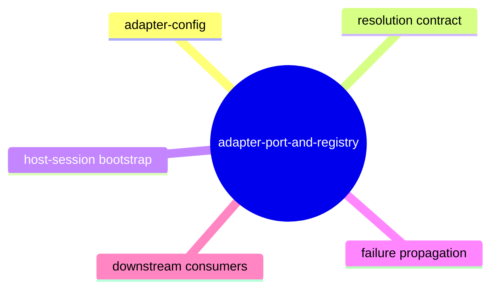
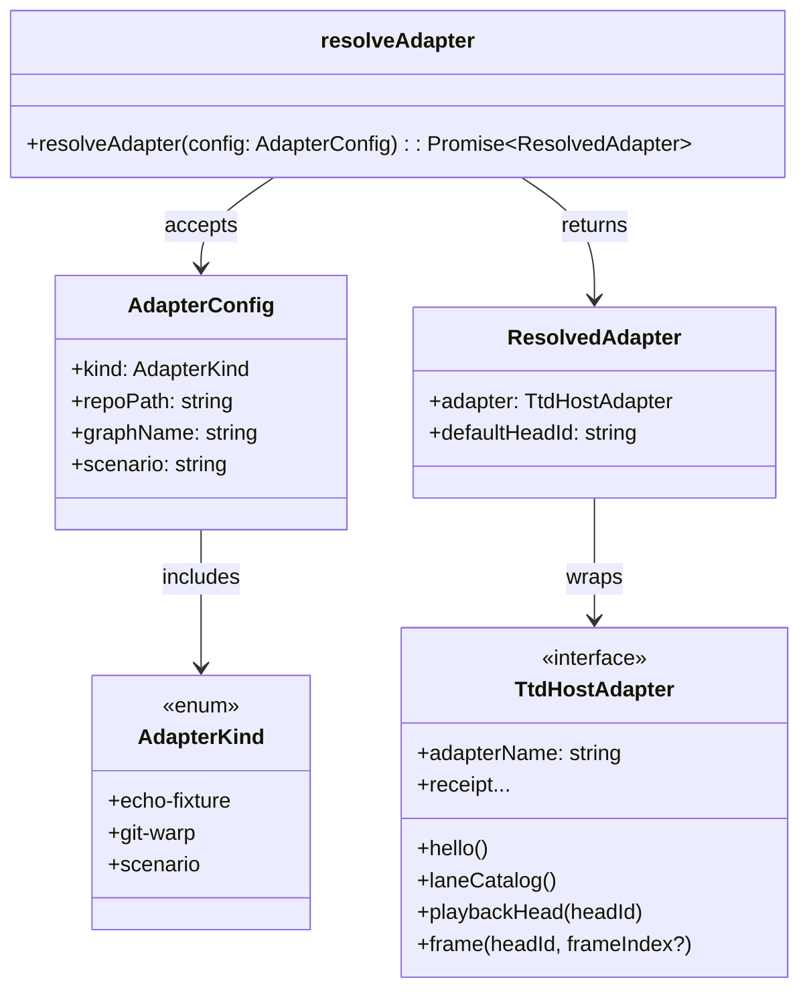
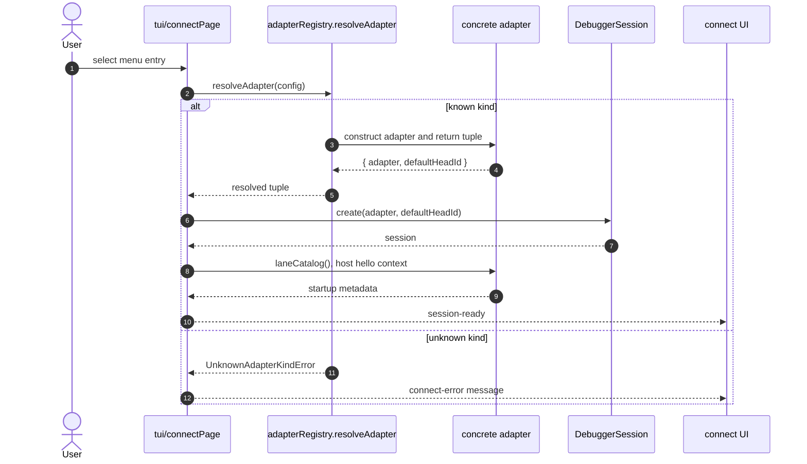
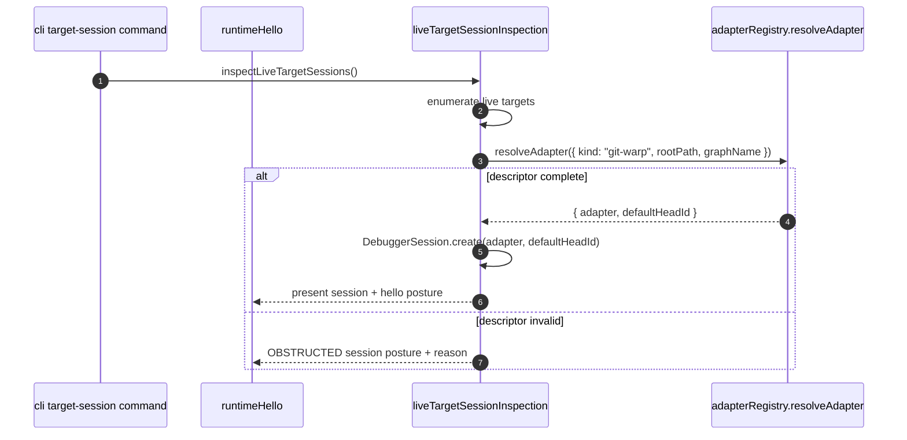
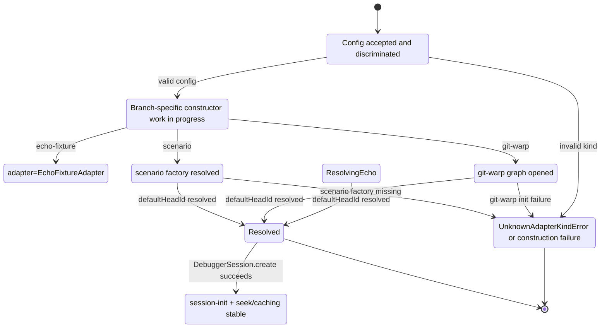
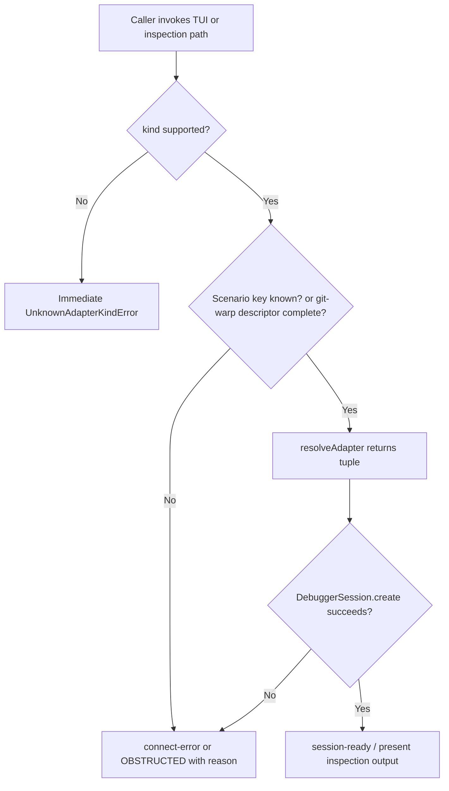

# Adapter Port and Registry

## Overview

This shelf documents the highest-impact handoff between host-agnostic surfaces and concrete runtime constructors. The registry accepts a **configuration input** (`AdapterConfig`), resolves it to an **adapter instance** plus **bootstrap head**, and guarantees that downstream entrypoints receive one coherent tuple regardless of source [C01][C02]. For someone new to WARP TTD, this means every behavior that needs to open a session should pass through this shelf before touching transport-specific APIs.

By the end of this topic, a reader should be able to make a safe adapter change, execute a practical triage path for a broken startup flow, and evaluate whether a proposal affects CLI, TUI, or discovery surfaces [C03][C23].

### Code owners

| Contact | Role | Escalation expectation |
| --- | --- | --- |
| James <james@flyingrobots.dev> | Shelf owner, contract steward, and first reviewer for changes touching selection semantics | Escalate all **edit** and **failure mode** workflow questions here before proposing merge-ready documentation updates |

*Caption: Ownership and escalation expectations for this contract boundary.*

### Related topics

| Shelf | Relation |
| --- | --- |
| protocol-contract | Defines the host method and capability vocabulary consumed by concrete adapters. |
| adapter-implementations | Exposes concrete constructors that are dynamically instantiated by registry branches. |
| tui-shell | Uses the registry through `connectPage` to launch user-driven sessions. |
| continuum-target-discovery | Consumes live-target session inspection data, including translated git-warp posture from registry-backed sessions. |
| cli-interface | Exposes `target-session` output built from `inspectLiveTargetSessions`, which uses this registry. |
| mcp-interface | Reflects runtime hello and admission output for translated git-warp targets through inspection paths built on registry outcomes. |

*Caption: Downstream shelves that reuse this selection boundary.*



*Caption: Top-level relationship map for the adapter port and registry boundary.*

## Reader pathways

When you are learning this topic for the first time, start with the contract shape, then move into execution pathways, and only after that read the failure catalog. The order keeps the mental model from configuration semantics to operational consequences [C06].

### How to make a contract edit
Contract edits begin with the type-level map in `AdapterConfig` and `AdapterKind`, then extend both positive and negative branches in `resolveAdapter` [C02][C06]. A safe edit order is to add or adjust `AdapterConfig` variants first, add the corresponding branch in the resolver, update the matching tests in the test plan, and only then update this README to record new invariants [C17][C18][C19]. If any edit would alter default-head semantics, cite the affected mode of behavior by referencing `defaultHeadId` expectations in tests, because downstream callers assume `head:main` and `head:default` are stable by adapter class [C20].

If you need to introduce a new adapter kind, make the registry branch deterministic, ensure all constructors are loaded behind that branch, and keep an explicit failure case for unsupported kinds in a runtime guard [C01][C06]. This avoids silently widening the contract through implicit `undefined` behavior.

### How to triage a failure from startup
A first triage pass should map the entrypoint: either the interactive connect flow or inspection flow. The connect flow reports direct resolver outcomes via a `connect-error` event in message handling, while the inspection flow usually returns `OBSTRUCTED` posture with an explanatory reason [C09][C10][C14].

After confirming the caller, inspect the specific mismatch shape. Unknown kinds and unknown scenario keys are synchronous failures, while missing git-warp descriptors are deterministic obstructions returned as structured session results [C06][C08][C13][C14]. The practical triage output is a pair of questions: did the resolver throw or did inspection short-circuit into obstruction posture, and which source owns the fix path?

### How to review downstream impact
Every approved edit in this shelf should be checked against consumers that reuse this tuple contract and may rely on stable `hostKind` and `defaultHeadId`. A minimum impact review reads `tui-shell` connect flow first, then discovery/runtime hello surfaces that transform inspection posture from adapter-backed sessions [C09][C10][C16][C17]. This order reveals whether an edit changes visible behavior only in error posture, or also in normal session bootstrap.

## Contract model and runtime boundary

The registry does two things. First, it normalizes the **configuration space** through a discriminated union so that every legal selection has one explicit constructor path [C02]. Second, it guarantees a **runtime output shape** (`ResolvedAdapter`) with enough context to create a session in a deterministic bootstrap sequence [C03].

### Core entities

At the edge of this shelf, the first boundary object is `AdapterConfig` with three supported variants: `echo-fixture`, `git-warp`, and `scenario` [C02]. The scenario variant depends on a bounded set of scenario names and is resolved through a lazy factory table [C05]. `resolveAdapter` does not expose adapter-specific internals; it hides constructor shape behind a single return tuple [C03][C06].



*Caption: Class-style model for the adapter selection surface and runtime-ready adapter tuple.*

`AdapterKind` is the discriminant that guarantees each config branch is finite at compile time, while `ResolvedAdapter` is the shared return value consumed by every runtime bootstrap path [C02][C03]. In prose, think of `TtdHostAdapter` as the only required runtime capability contract: all callsites are written against this port, never against concrete class constructors [C07].

### Resolution flow

The core resolver behavior is a single switch on `config.kind`, with one branch per known adapter family and one guarded fallthrough for unsupported kinds [C06]. This is the reason we call it the adapter boundary: callers stop caring about constructor mechanics at this point, and start caring about session invariants. [C01]

```mermaid
flowchart TD
  A[Caller provides AdapterConfig] --> B{config.kind?}
  B -->|echo-fixture| C[resolveEchoFixture]
  B -->|git-warp| D[resolveGitWarp]
  B -->|scenario| E[resolveScenario]
  B -->|other| F[Unsupported kind -> UnknownAdapterKindError]
  C --> G[ResolvedAdapter { adapter: EchoFixtureAdapter, defaultHeadId: head:main }]
  D --> H[Initialize plumbing & WarpCore -> GitWarpAdapter.create]
  H --> G[ResolvedAdapter { adapter: GitWarpAdapter, defaultHeadId: head:default }]
  E --> I{Scenario key exists?}
  I -->|yes| J[Build scenario adapter factory]
  I -->|no| F
  J --> K[ResolvedAdapter { adapter: scenario adapter, defaultHeadId: head:default }]
  F --> L[Throw UnknownAdapterKindError]
```

*Caption: Deterministic branch model from configuration to resolved adapter tuple.*

When reading this chart, follow the same branch order in code: echo fixture first, then git-warp, then scenario. This mirrors the switch statement and helps avoid accidentally adding a branch that never executes because of ordering assumptions [C06].

### Execution paths that consume registry output

The registry is used in two major live execution paths, one user-driven and one inspection-driven [C09][C10][C13]. User-driven flows are usually TUI-first: selection events build a concrete `AdapterConfig` and the page invokes a resolver callback.



*Caption: TUI connect path: how a user action turns into a session and where errors surface.*

Inspection-driven flows use the same resolver boundary indirectly through live-target session inspection; this path can emit obstruction posture instead of throwing when descriptors are incomplete [C13][C14][C16].



*Caption: Discovery/CLI-inspection flow that reuses registry output through live target inspection.*

### Lifecycle states and non-golden branches

A practical way to reason about this shelf is as a short state machine around adapter bootstrap [C06][C20]. It starts when a config is provided, then branches into a resolved path or an error path, and only resolves to session-ready once the adapter and head are both available.



*Caption: Lifecycle state model including non-golden branches for registry and bootstrap outcomes.*

The `ConfigProvided` state is a pre-branching gate where malformed callers can still pass through a type cast and fail later, which is why runtime validation exists at the `resolveAdapter` boundary [C02][C08]. The golden path is `ConfigProvided -> Resolving* -> Resolved -> SessionReady`; the non-golden branches are the two early-stop points: unknown kind and git-warp/scenario construction failures [C06][C08][C13].

## Failure modes and evidence

This shelf treats every failure mode as an explicit operational artifact: one mode, one shape, one expected output, and one remediation route.

### Failure mode: unknown adapter kind or malformed kind payload
This mode appears when the incoming `kind` does not match one of the declared variants. The resolver throws `UnknownAdapterKindError` through the switch default path, so this mode is **active and immediate** [C06][C08].

The shape is a thrown error before any session object is created. In practice, the UI path typically produces a `connect-error` message, and inspection paths return posture that never reaches present session shape [C10][C14].

What you can get out of this: the raw string in the exception message names the offending kind, which makes deterministic reproduction easy in tests. It also confirms whether the caller normalized config before dispatch because the failure occurs only after branch dispatch enters the default arm [C19].

### Failure mode: scenario key not recognized
When `config.kind === "scenario"` but the `scenario` string is not in the registered factory map, the registry throws `UnknownAdapterKindError` with the scenario key in scope [C05][C06][C08].

The shape is still a synchronous throw, but the signal is different in diagnostics: the error payload explicitly names `scenario:<name>` and therefore identifies whether the breakage is a typo in configuration or a registration hole in a factory map [C05][C06].

What you can get out of this: you can recover whether this is a config drift issue versus a shelf coverage gap by checking whether factory registration exists for that key and if test fixtures exercise the same scenario set [C20].

### Failure mode: live git-warp target cannot open because descriptor is incomplete
For target inspection, if a git-warp target descriptor omits `graphName`, the registry branch is not reached and inspection returns an **obstructed** live session with explicit `sessionPosture: "OBSTRUCTED"` and missing `session` field [C14][C22].

The shape is not an exception; it is a structured obstruction object in `inspectLiveTargetSessions` output. This makes it suitable for CLI and MCP callers that already render posture-driven tables or reports.

What you can get out of this: the absence/presence pattern in output is itself the triage answer. If `sessionPosture` is `OBSTRUCTED` and `session` is absent, treat it as descriptor-layer remediation rather than adapter constructor debugging [C14][C22].

### Failure mode: live git-warp inspection fails during runtime construction
Even when descriptor shape is valid, git-warp resolution can fail while opening backing graph infrastructure or creating the adapter [C13][C20]. In this case the exception is caught and converted to obstruction posture with the specific failure message in `reason` [C14][C13].

The shape is an obstructed session object rather than a thrown exception to callers that consume inspection output [C13].

What you can get out of this: the posture output preserves a plain-language failure reason, so remediation can be done without attaching a debugger first; in addition, tests can assert that this path is deterministic for malformed descriptors and missing roots [C22][C24].



*Caption: Failure propagation for the most common registry and bootstrap failure paths.*

### Remediation matrix for registry and bootstrap failures

| Failure mode | Immediate operator action | Recovery action | Evidence check |
| --- | --- | --- | --- |
| Unknown adapter kind | Validate source config against `AdapterConfig` union and caller options. | Fix caller construction path (`connectPage` menu/config input or target descriptor source). | Add/extend tests asserting `UnknownAdapterKindError` path in `resolveAdapter` and `target-session` regression coverage. [C19][C22] |
| Missing scenario key | Compare scenario key against factory registration list. | Add/update factory mapping and keep fixture coverage for the updated key. | Add `resolveScenario` coverage for the key set and include scenario-name regression tests. [C05][C20] |
| Missing git-warp descriptor data | Fix descriptor source (`graphName`, root path) before dispatching. | Re-run descriptor inspection and verify obstruction drops to present posture. | Assert `sessionPosture` transitions from `OBSTRUCTED` to `PRESENT` in integration outputs. [C14][C22] |
| git-warp runtime init failure | Capture and classify `reason` from obstruction output. | Repair runtime infrastructure assumptions and retry after infra state stabilizes. | Verify with integration path `inspectLiveTargetSessions` and any environment gating tests. [C13][C21][C24] |

*Caption: Operational recovery sequence for each cataloged failure mode.*

## Appendix A: Recent Activity

### Related GitHub PRs

| PR | Title | Link |
| --- | --- | --- |
| #109 | chore(deps): bump tar from 7.5.13 to 7.5.16 in the npm_and_yarn group across 1 directory | https://github.com/flyingrobots/warp-ttd/pull/109 |

*Caption: Open PRs visible at the time this document snapshot was authored (non-blocking for registry content).* 

### Open GitHub issues

| Issue | Title | Link |
| --- | --- | --- |
| #108 | [LP-GP4-S1] Launchpad browser runtime hello target descriptor | https://github.com/flyingrobots/warp-ttd/issues/108 |
| #107 | [LP-GP4-S2] Browser replay tick history read model | https://github.com/flyingrobots/warp-ttd/issues/107 |
| #106 | [LP-GP4-S3] Rewind current visit control contract | https://github.com/flyingrobots/warp-ttd/issues/106 |
| #101 | Retire temporary WARP TTD runtime hello mirror | https://github.com/flyingrobots/warp-ttd/issues/101 |
| #100 | Cool idea: Why-not causal query surface | https://github.com/flyingrobots/warp-ttd/issues/100 |

*Caption: Open issues for quick triage context and current backlog pressure.*

## Appendix B: Citations

| Citation ID | Source file | Line | Git SHA |
| --- | --- | --- | --- |
| C01 | src/app/adapterRegistry.ts#2 | 2@c0b4f967d4406ec19a317129488d39aaf34d19ef | c0b4f967d4406ec19a317129488d39aaf34d19ef |
| C02 | src/app/adapterRegistry.ts#14 | 14@c0b4f967d4406ec19a317129488d39aaf34d19ef | c0b4f967d4406ec19a317129488d39aaf34d19ef |
| C03 | src/app/adapterRegistry.ts#21 | 21@c0b4f967d4406ec19a317129488d39aaf34d19ef | c0b4f967d4406ec19a317129488d39aaf34d19ef |
| C04 | src/app/adapterRegistry.ts#26 | 26@c0b4f967d4406ec19a317129488d39aaf34d19ef | c0b4f967d4406ec19a317129488d39aaf34d19ef |
| C05 | src/app/adapterRegistry.ts#55 | 55@c0b4f967d4406ec19a317129488d39aaf34d19ef | c0b4f967d4406ec19a317129488d39aaf34d19ef |
| C06 | src/app/adapterRegistry.ts#87 | 87@c0b4f967d4406ec19a317129488d39aaf34d19ef | c0b4f967d4406ec19a317129488d39aaf34d19ef |
| C07 | src/adapter.ts#13 | 13@c0b4f967d4406ec19a317129488d39aaf34d19ef | c0b4f967d4406ec19a317129488d39aaf34d19ef |
| C08 | src/errors.ts#94 | 94@c0b4f967d4406ec19a317129488d39aaf34d19ef | c0b4f967d4406ec19a317129488d39aaf34d19ef |
| C09 | src/tui/pages/connectPage.ts#16 | 16@c0b4f967d4406ec19a317129488d39aaf34d19ef | c0b4f967d4406ec19a317129488d39aaf34d19ef |
| C10 | src/tui/pages/connectPage.ts#84 | 84@c0b4f967d4406ec19a317129488d39aaf34d19ef | c0b4f967d4406ec19a317129488d39aaf34d19ef |
| C11 | src/tui/pages/connectPage.ts#107 | 107@c0b4f967d4406ec19a317129488d39aaf34d19ef | c0b4f967d4406ec19a317129488d39aaf34d19ef |
| C12 | src/tui/pages/connectPage.ts#288 | 288@c0b4f967d4406ec19a317129488d39aaf34d19ef | c0b4f967d4406ec19a317129488d39aaf34d19ef |
| C13 | src/app/liveTargetSessionInspection.ts#197 | 197@c0b4f967d4406ec19a317129488d39aaf34d19ef | c0b4f967d4406ec19a317129488d39aaf34d19ef |
| C14 | src/app/liveTargetSessionInspection.ts#211 | 211@c0b4f967d4406ec19a317129488d39aaf34d19ef | c0b4f967d4406ec19a317129488d39aaf34d19ef |
| C15 | src/app/liveTargetSessionInspection.ts#267 | 267@c0b4f967d4406ec19a317129488d39aaf34d19ef | c0b4f967d4406ec19a317129488d39aaf34d19ef |
| C16 | src/app/runtimeHelloInspection.ts#10 | 10@c0b4f967d4406ec19a317129488d39aaf34d19ef | c0b4f967d4406ec19a317129488d39aaf34d19ef |
| C17 | src/cli.ts#5 | 5@c0b4f967d4406ec19a317129488d39aaf34d19ef | c0b4f967d4406ec19a317129488d39aaf34d19ef |
| C18 | src/cli.ts#169 | 169@c0b4f967d4406ec19a317129488d39aaf34d19ef | c0b4f967d4406ec19a317129488d39aaf34d19ef |
| C19 | test/adapterRegistry.spec.ts#7 | 7@c0b4f967d4406ec19a317129488d39aaf34d19ef | c0b4f967d4406ec19a317129488d39aaf34d19ef |
| C20 | test/adapterRegistry.spec.ts#18 | 18@c0b4f967d4406ec19a317129488d39aaf34d19ef | c0b4f967d4406ec19a317129488d39aaf34d19ef |
| C21 | test/adapterRegistry.integration.spec.ts#18 | 18@c0b4f967d4406ec19a317129488d39aaf34d19ef | c0b4f967d4406ec19a317129488d39aaf34d19ef |
| C22 | test/adapterRegistry.integration.spec.ts#51 | 51@c0b4f967d4406ec19a317129488d39aaf34d19ef | c0b4f967d4406ec19a317129488d39aaf34d19ef |
| C23 | test/adapterRegistry.integration.spec.ts#81 | 81@c0b4f967d4406ec19a317129488d39aaf34d19ef | c0b4f967d4406ec19a317129488d39aaf34d19ef |
| C24 | docs/topics/adapter-port-and-registry/test-plan.md#3 | 3@c0b4f967d4406ec19a317129488d39aaf34d19ef | c0b4f967d4406ec19a317129488d39aaf34d19ef |
| C25 | docs/topics/adapter-port-and-registry/test-plan.md#10 | 10@c0b4f967d4406ec19a317129488d39aaf34d19ef | c0b4f967d4406ec19a317129488d39aaf34d19ef |
| C26 | docs/topics/adapter-port-and-registry/test-plan.md#23 | 23@c0b4f967d4406ec19a317129488d39aaf34d19ef | c0b4f967d4406ec19a317129488d39aaf34d19ef |

*Caption: Evidence appendix for provenance assertions in this shelf.*

## Appendix C: Glossary

*Caption: Terms used in this shelf with concise meanings.*

| Term | Meaning |
| --- | --- |
| **AdapterConfig** | A discriminated configuration union describing how to construct a concrete adapter. |
| **AdapterRegistry** | The resolver module (`resolveAdapter`) that maps `AdapterConfig` into `ResolvedAdapter`. |
| **ResolvedAdapter** | The bootstrap pair `{ adapter, defaultHeadId }` expected by session initialization. |
| **Session posture** | Inspection output shape indicating whether a session is `PRESENT` or `OBSTRUCTED` and why. |
| **Obstruction reason** | A human-readable explanation that avoids throwing for inspection flows and carries triage signal. |
