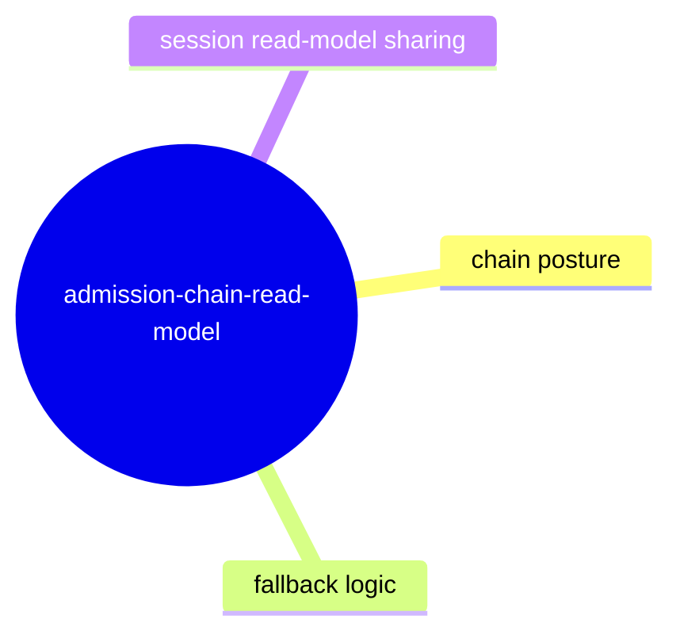

# Admission Chain Read Model

## Purpose

Capture the deterministic assembly of admission-chain facts for session inspection and export surfaces.

## Contract Points

1. Admission-chain read-model output includes stable session and target posture.
2. Obstruction and fallback states are explicit and machine-readable.
3. MCP and TUI paths consume the same normalized admission-chain summary.
4. Invalid/empty admission data is handled as structured absence, not untyped failure.

## Evidence

- `src/app/admissionChainReadModel.ts`
- `src/app/debuggerSession.ts`
- `src/mcp/admissionChainSurface.ts`
- `test/mcpAdmissionChainSurface.spec.ts`
- `test/inspectorPage.spec.ts`

## Operational Notes

- Admission-chain summaries are part of the durable contract surface and should be updated with protocol/schema evolution.
