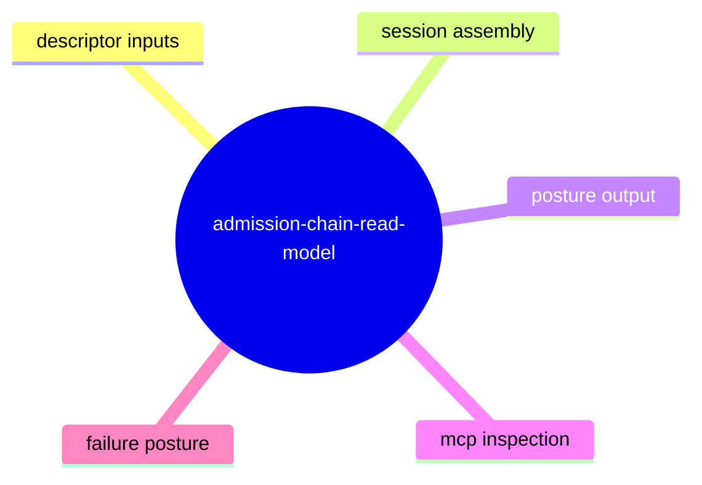
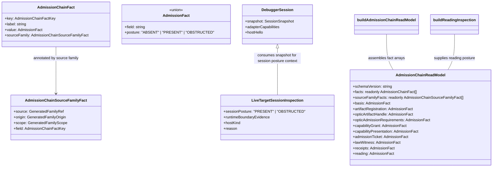
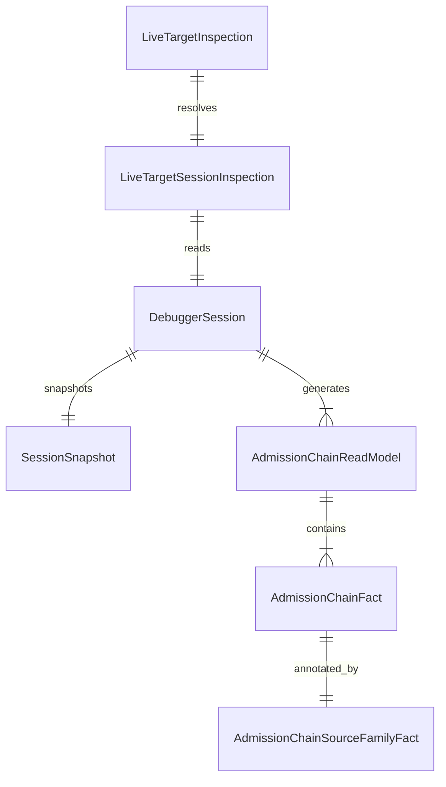
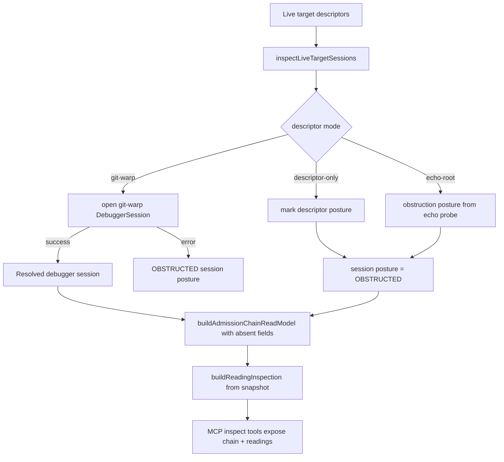
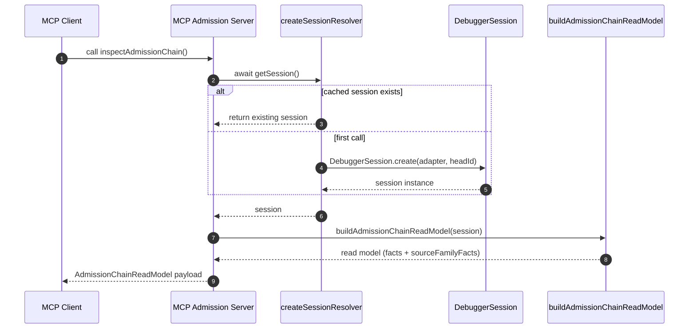
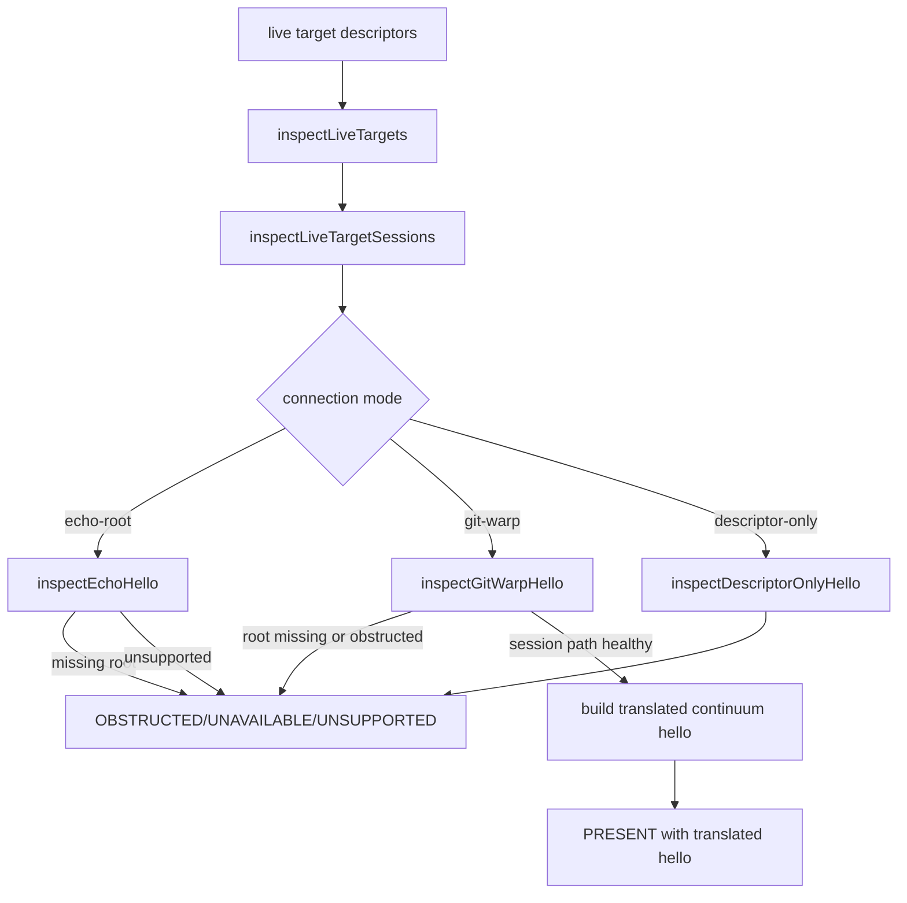
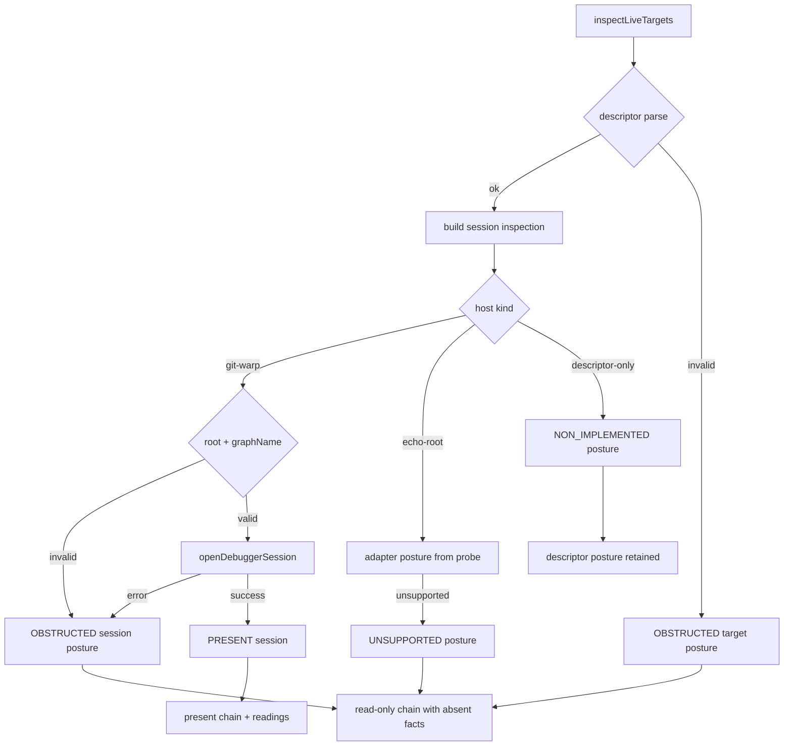

# Admission Chain Read Model

## Overview

Think of this shelf as a **forensic ledger boundary**: it turns a live debugging session into a machine-readable trace of what is definitely known, what was proven absent, and what was blocked by infrastructure, then exposes that ledger over MCP inspection surfaces without mutating state [C01, C02, C03, C16, C17]. A reader new to this repository should treat it as the contract behind “why did this inspection say absent” and “what evidence shape should a failure include” [C04, C18, C20].

Before reading this topic, you should understand that this shelf is the first place to inspect when a target inspector returns an absence where production systems expect a concrete answer [C05, C06]. The same session is still readable and inspectable; only the chain of provenance shifts from present facts to posture-rich absences [C12, C13, C15, C17].

By the end of this topic, a reader should be able to:

- map the deterministic construction path from target descriptors to session inspection artifacts,
- predict the exact failure posture for malformed descriptors, missing roots, or blocked sessions,
- trace the same fact set through MCP inspection tools with confidence that ordering and shape are preserved [C07, C18, C19, C21].

### Code owners

| Contact | Role |
| --- | --- |
| James <james@flyingrobots.dev> | Shelf steward and final approver for admission-chain contract changes |

*Caption: Canonical contacts for admission-chain read-model behavior and schema changes.*

### Related topics

| Shelf | Relation |
| --- | --- |
| debugger-session-core | Uses `DebuggerSession.snapshot` and capabilities as the source of reading posture and frame metadata for chain construction [C07, C08, C12]. |
| live-target-session | Owns session lifecycle and `sessionPosture` shape used by admission-chain propagation [C13, C17]. |
| mcp-interface | Provides the stable read-only tool surface (`inspectReadings`, `inspectAdmissionChain`) that consume this read model [C09, C10, C11]. |
| continuum-target-discovery | Produces `LiveTargetInspection` descriptors that control when read-model postures become obstructed or unavailable [C14, C16, C19]. |
| adapter-port-and-registry | Resolves git-warp adapters and throws/propagates to admission obstruction when adapter construction fails [C13]. |

*Caption: Downstream and upstream shelves that materially affect admission-chain facts, posture, or consumer interpretation.*



*Caption: Macro-level flow of the admission-chain pipeline: descriptor intake to posture surface.*

## Reader pathways

### How to make a contract edit
If you are editing contract-bearing behavior, start with the test plan and align each behavioral change to a documented requirement before touching source [C24, C25]. For this shelf, requirement coverage is concentrated in `docs/topics/admission-chain-read-model/test-plan.md`, which already includes deterministic build requirements and stability cases [C24].

When you add or adjust fact shaping, first update the corresponding section in `buildAdmissionChainReadModel` or its dependencies, then run the one-minute verification gate before implementing downstream edits [C05, C06].

```bash
npm run docs:verify && npm run test
```

If your edit touches runtime discovery or session probing behavior, add or extend `liveTarget` and runtime-hello tests in the same commit so the new obstruction semantics remain observable from external tooling [C13, C16, C17, C19, C20].

### How to triage a failure from inspection output
Start from the target that surfaced the fault and inspect two orthogonal artifacts in this order: the `sessionPosture` and each chain fact's `posture` field [C03, C05, C12].

If `sessionPosture` is `OBSTRUCTED`, triage session construction first before fact-level inspection, because the read model is still emitted but may be semantically degraded [C06, C13, C17].

If `sessionPosture` is `PRESENT`, inspect missing artifacts (`ABSENT`) as explicit semantic signals, not hidden crashes [C05, C04]. The tests codify this behavior for fields such as `artifactRegistration`, `capabilityGrant`, `admissionTicket`, and `lawWitness` [C18, C20].

### How to review downstream impact
For impact reviews, compare MCP tool registration behavior in one pass and verify runtime hello posture still aligns with target session posture [C09, C10, C17].

A new or changed artifact in this shelf should trigger synchronized review of:

- MCP inspection read-only contracts,
- live target descriptor parsing and posture mapping,
- runtime hello evidence translation and retry hints.

That sequence prevents contract drift where one surface says “absent,” while another still claims “present without context.”

## Contract model and session synthesis

### Core entities and their contract role

The read model is generated from one canonical `DebuggerSession` snapshot and is emitted as two coordinated payloads: one structured list of facts and a per-fact provenance family list [C05, C06, C07]. The key contract signal is that each fact is either `ABSENT`, `PRESENT`, or `OBSTRUCTED` and is mapped into stable source-family metadata [C04, C03].



*Caption: Data model and production boundary for admission-chain facts, including posture and provenance.*

### ER view: what is observed versus what is derived

The admission-chain shelf does not store immutable database records; it derives a stable read model every time an inspection path runs. This ER view answers: which entities are first-party observation inputs and which are computation outputs?



*Caption: Entity relationships for admission-chain assembly and their provenance chain.*

This ER view separates three concerns that are easy to confuse: target discovery, session construction, and chain projection [C13, C14, C15].

Target-level facts can be obstructed even when session discovery succeeds, and session-level posture can still block specific facts when host adapters lack data [C05, C18]. The derived read model remains deterministic because it is assembled from the same underlying snapshot and source-family resolver on each run [C07, C08, C20].

| Entity | Invariant | Ownership | Diagnostic use |
| --- | --- | --- | --- |
| `LiveTargetInspection` | Contains one normalized descriptor outcome per target input. | Runtime discovery layer | Explains why an output starts from `OBSTRUCTED` or `UNSUPPORTED`. |
| `LiveTargetSessionInspection` | Holds session posture and session-specific reasoning. | Live target session layer | Distinguishes host-kind-specific failures from pure fact absence. |
| `DebuggerSession` | Encodes replay snapshot and capabilities used by reading projections. | Session core | Indicates whether snapshot-derived facts can be built. |
| `AdmissionChainReadModel` | Deterministic projection over fixed keys. | Admission-chain shelf | Primary contract checked by MCP and UI readers. |
| `AdmissionChainFact` | Always has `key`, `label`, `value`, and `sourceFamily`. | Admission-chain shelf | Ground truth for user-facing missing/present reporting. |
| `AdmissionChainSourceFamilyFact` | Includes `source`, `origin`, `scope`, and posture metadata. | Generated-family layer | Bridges facts to auditability and reason tracing. |

*Caption: Dictionary that binds entity responsibilities to owners and practical diagnostics.*

`AdmissionChainReadModel` is the canonical artifact and exposes ordered fact content with explicit source-family annotations [C05, C07]. `AdmissionChainFact` normalizes external contract visibility into key/value/posture while preserving provenance in `AdmissionChainSourceFamilyFact` [C04, C06].

`Debug`gerSession contributes deterministic snapshot state (`frame`, `head`, `receipts`, `neighborhood`) for reading posture synthesis [C07, C08]. `LiveTargetSessionInspection` contributes posture context and obstruction reasons that are later propagated into runtime hello and MCP outputs [C13, C16].

### How the read model is built



*Caption: Deterministic assembly pipeline from live target descriptors through chain construction and MCP exposure.*

#### Reading the build flow
The flow enters through live target enumeration and branches by descriptor mode [C13, C14]. For `git-warp` descriptors, success yields a resolved session path, while any construction defect is turned into obstruction posture while preserving read-only behavior [C13, C15]. `echo-root` and `descriptor-only` modes are explicit non-golden branches and can never become native `PRESENT` sessions inside this shelf [C14, C16].

When the happy path executes, `buildReadingInspection` and `buildAdmissionChainReadModel` together produce stable factual outputs plus source-family mapping for provenance [C07, C05, C06].

### MCP exposure and tool contracts



*Caption: MCP read path and session memoization behavior for admission-chain inspection.*

The MCP layer exposes this model through one read-only tool and caches the session to avoid duplicate `hello` calls during concurrent inspection [C11, C21, C08, C09]. The same session object also serves `inspectSession`, `inspectAdapterCapabilities`, and `inspectReadings`, keeping tool output cross-consistent [C09, C11, C20].

## Downstream consumers and impact

### From live target inspection to runtime hello posture

Runtime hello inspection starts from the same target inputs, then derives postures from session visibility and adapter evidence [C16, C17]. This is why many user-facing failures are surfaced as posture transitions instead of hard crashes [C16, C17].



*Caption: Relationship between target session posture and runtime hello output posture.*

For git-warp targets with valid sessions, runtime hello posture remains `PRESENT` and is explicitly marked as translated substrate evidence [C16, C17]. If a target session cannot be opened, runtime hello degrades to obstruction with a deterministic reason and preserved retry hint [C13, C19].

### Fact-level invariants and source mapping

`ADMISSION_CHAIN_FACT_KEYS` defines the fixed contract of chain fields. The emitted ordering is deterministic and tested directly in MCP assertions [C02, C18].

`sourceFamilyFacts` is a parallel array with matching key order and per-field `posture` origin metadata so absence does not disappear; it only changes posture from present to absent/obstructed while retaining deterministic position and provenance [C04, C06, C18].

## Failure modes and evidence

Each failure mode below is intentionally explicit and actionable. For each mode we define what shape appears, where to detect it, and what a caller can recover.

### Failure mode: target descriptors malformed or unsupported
This mode appears when `liveTargetDescriptorsFromEnv` cannot parse descriptors or a descriptor entry fails validation [C14, C15]. The resulting shape is usually `LiveTargetInspection` entries with `adapterPosture: "OBSTRUCTED"` or `"UNSUPPORTED"`, preserved as structured target data instead of exceptions [C19, C20].

What this protects: malformed external inputs remain observable and debuggable through inspection output and runtime hello summaries [C16, C20].

#### Explicit recovery
Inspect `WARP_TTD_TARGETS_JSON` and descriptor shape first. Correct invalid JSON and ensure each descriptor has a valid `id`, mode-compatible fields, and required keys (`rootPath`, `graphName` for git-warp) [C14, C15].

### Failure mode: descriptor says git-warp without required graphName
This mode is deterministic in `inspectGitWarpSession` [C13]. The model returns `sessionPosture: "OBSTRUCTED"` with a reason tied to descriptor completion [C13].

What you can get from this output: no hidden error is swallowed; the `reason` string preserves missing input context for operator response [C13, C21].

### Failure mode: target root missing for a concrete host kind
When root inspection fails, the result is posture `MISSING` on roots that then flow into unobstructive inspection outputs [C14, C19]. For runtime hello, this surfaces as unavailable posture and a retry hint [C16].

What this means operationally: inspection calls still return deterministic data, and no downstream code is forced into a throwing branch [C16, C17].

### Failure mode: git-warp runtime path cannot open
The open sequence catches adapter construction or session-creation errors and emits obstruction posture with the exception text in reason [C13].

What this means for triage: check that target root exists, graph name is valid, and adapter construction path can create session state; then rerun inspection and compare whether this remains isolated or widespread [C13, C18].

### Failure mode: non-critical fact families remain absent
Certain fields, including `artifactRegistration`, `capabilityGrant`, and `admissionTicket`, are intentionally initialized as `ABSENT` when host adapter data is unavailable [C04, C06]. The fact remains in model order with explicit reason text, rather than disappearing [C05, C18].

What this means for operations: this is not a system fault if the session itself is present; it is a contractual signal for partial telemetry [C05, C20].



*Caption: Failure branches and where they land in chain outputs, including non-throwing read-only output behavior.*

### Remediation matrix for admission-chain failures

| Failure mode | Immediate action | Recovery strategy | Evidence check |
| --- | --- | --- | --- |
| Malformed descriptor JSON | Validate `WARP_TTD_TARGETS_JSON` and re-run `inspectLiveTargets` | Fix descriptor file and rehydrate environment; verify posture transitions to supported adapter posture | `test/liveTargetInspection.spec.ts` descriptor parse and duplicate-ID cases [C19] |
| Missing `graphName` for git-warp | Add `graphName` to descriptor | Re-run inspection and confirm `git-warp` branch returns session-present posture | `test/runtimeHelloInspection.spec.ts` and session-integration assertions [C13, C17] |
| Missing root paths | Restore root directories or correct `rootPath` | Re-run inspection and confirm posture transitions from UNAVAILABLE to present for healthy targets | `test/runtimeHelloInspection.spec.ts` missing-root cases and `test/liveTargetInspection.spec.ts` baseline assertions [C15, C16, C19] |
| DebuggerSession create failure | Inspect underlying adapter/session construction path | Correct config and retry; confirm one hello call per resolved session cache | `test/mcpAdmissionChainSurface.spec.ts` concurrent-session and caching assertions [C11, C21] |
| Intentional fact absence (domain gap) | Confirm whether host adapter is expected to emit the field | Coordinate with host adapter owner; keep `ABSENT` with reason intact for compatibility checks | `test/mcpAdmissionChainSurface.spec.ts` absent-fact assertions and ordered chain checks [C18] |

## Appendix A: Recent Activity

### Related GitHub PRs

| PR | Title | Link |
| --- | --- | --- |
| #109 | chore(deps): bump tar from 7.5.13 to 7.5.16 in the npm_and_yarn group across 1 directory | https://github.com/flyingrobots/warp-ttd/pull/109 |

### Open GitHub Issues

| Issue | Title | Link |
| --- | --- | --- |
| #108 | [LP-GP4-S1] Launchpad browser runtime hello target descriptor | https://github.com/flyingrobots/warp-ttd/issues/108 |
| #107 | [LP-GP4-S2] Browser replay tick history read model | https://github.com/flyingrobots/warp-ttd/issues/107 |
| #106 | [LP-GP4-S3] Rewind current visit control contract | https://github.com/flyingrobots/warp-ttd/issues/106 |
| #101 | Retire temporary WARP TTD runtime hello mirror | https://github.com/flyingrobots/warp-ttd/issues/101 |
| #100 | Cool idea: Why-not causal query surface | https://github.com/flyingrobots/warp-ttd/issues/100 |

## Appendix B: Citations

| Citation ID | Source file | Line | Git SHA |
| --- | --- | --- | --- |
| C01 | src/app/admissionChainReadModel.ts | 20 | 5ac2075c5a5b452ee03feccea7160d720fc91fbc |
| C02 | src/app/admissionChainReadModel.ts | 22 | 5ac2075c5a5b452ee03feccea7160d720fc91fbc |
| C03 | src/app/admissionChainReadModel.ts | 37 | 5ac2075c5a5b452ee03feccea7160d720fc91fbc |
| C04 | src/app/admissionChainReadModel.ts | 84 | 5ac2075c5a5b452ee03feccea7160d720fc91fbc |
| C05 | src/app/admissionChainReadModel.ts | 350 | 5ac2075c5a5b452ee03feccea7160d720fc91fbc |
| C06 | src/app/admissionChainReadModel.ts | 345 | 5ac2075c5a5b452ee03feccea7160d720fc91fbc |
| C07 | src/app/admissionChainReadModel.ts | 374 | 5ac2075c5a5b452ee03feccea7160d720fc91fbc |
| C08 | src/app/admissionChainReadModel.ts | 260 | 5ac2075c5a5b452ee03feccea7160d720fc91fbc |
| C09 | src/mcp/admissionChainSurface.ts | 15 | 5ac2075c5a5b452ee03feccea7160d720fc91fbc |
| C10 | src/mcp/admissionChainSurface.ts | 29 | 5ac2075c5a5b452ee03feccea7160d720fc91fbc |
| C11 | src/mcp/admissionChainSurface.ts | 223 | 5ac2075c5a5b452ee03feccea7160d720fc91fbc |
| C12 | src/mcp/admissionChainSurface.ts | 248 | 5ac2075c5a5b452ee03feccea7160d720fc91fbc |
| C13 | src/app/liveTargetSessionInspection.ts | 207 | 5ac2075c5a5b452ee03feccea7160d720fc91fbc |
| C14 | src/app/liveTargetSessionInspection.ts | 267 | 5ac2075c5a5b452ee03feccea7160d720fc91fbc |
| C15 | src/app/liveTargetInspection.ts | 575 | 5ac2075c5a5b452ee03feccea7160d720fc91fbc |
| C16 | src/app/runtimeHelloInspection.ts | 19 | 5ac2075c5a5b452ee03feccea7160d720fc91fbc |
| C17 | src/app/runtimeHelloInspection.ts | 472 | 5ac2075c5a5b452ee03feccea7160d720fc91fbc |
| C18 | test/mcpAdmissionChainSurface.spec.ts | 54 | 5ac2075c5a5b452ee03feccea7160d720fc91fbc |
| C19 | test/mcpAdmissionChainSurface.spec.ts | 512 | 5ac2075c5a5b452ee03feccea7160d720fc91fbc |
| C20 | test/mcpAdmissionChainSurface.spec.ts | 576 | 5ac2075c5a5b452ee03feccea7160d720fc91fbc |
| C21 | test/runtimeHelloInspection.spec.ts | 55 | 5ac2075c5a5b452ee03feccea7160d720fc91fbc |
| C22 | docs/topics/admission-chain-read-model/test-plan.md | 5 | 5ac2075c5a5b452ee03feccea7160d720fc91fbc |

## Appendix C: Glossary

| Term | Meaning |
| --- | --- |
| **Admission Chain** | Structured list of contract facts (`basis`, facts, receipts, readings) plus provenance per field. |
| **PRESENT** | A field value was generated and validated enough to be emitted with data. |
| **ABSENT** | A host adapter omitted or declined to provide a fact; represented as explicit evidence not a crash. |
| **OBSTRUCTED** | The read path was blocked (for example by descriptor/input/path failures) and could not safely emit a present fact. |
| **sessionPosture** | A coarse indicator in live target sessions that tells whether a debug session is `PRESENT` or `OBSTRUCTED`. |
| **Runtime Boundary Evidence** | Provenance about adapter translation, native witness status, and source behavior for a target. |
| **Read-only inspection path** | All MCP tools in this shelf are registered as non-mutating and should never alter source runtime state. |
