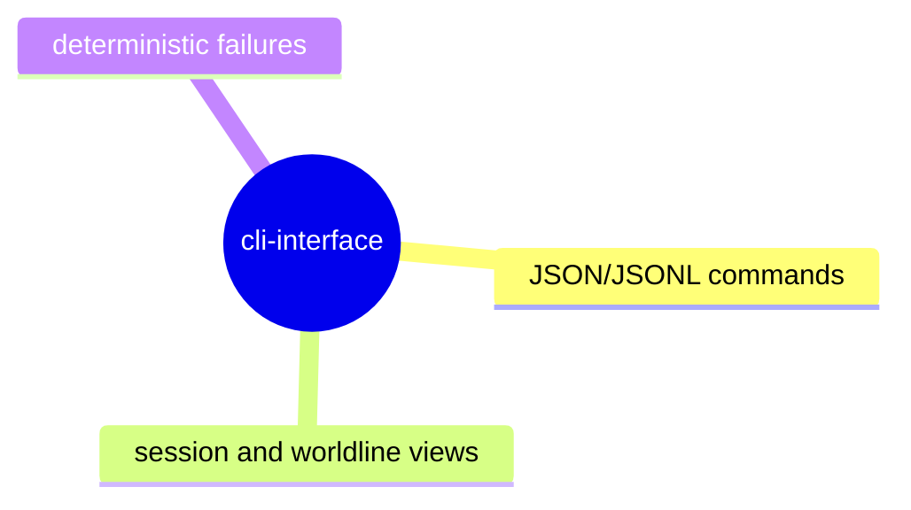

# CLI Interface

## Purpose

Define durable behavior for scriptable and human CLI surfaces that consume protocol state and session state.

## Contract Points

1. CLI commands that expose inspector data emit machine-readable JSON/JSONL when requested.
2. `session --json` remains the canonical shape for session continuity checks and snapshots.
3. Worldline and target-oriented CLI views maintain shape stability across versioned protocol updates.
4. CLI failures are deterministic with stable exit status and parseable payloads.

## Evidence

- `src/cli.ts`
- `src/app/debuggerSession.ts`
- `test/cliJson.spec.ts`
- `test/cliWorldline.spec.ts`

## Operational Notes

- CLI remains a composition layer over protocol and adapter read models; canonical behavior changes must land in shared contracts first.
