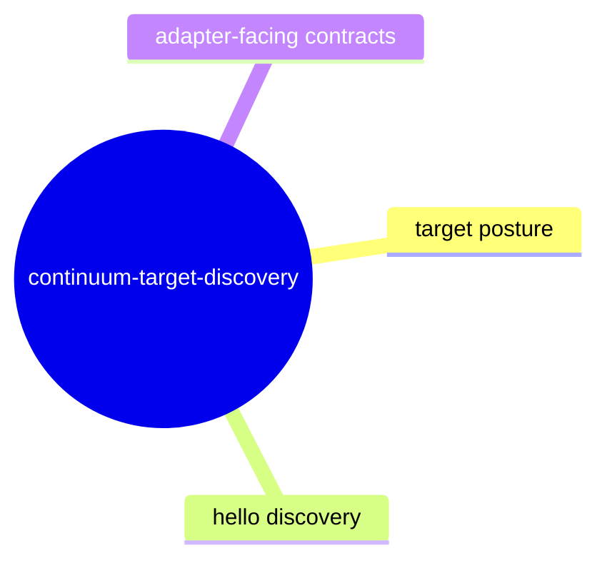

# Continuum Target Discovery

## Purpose

Track how WARP TTD discovers and represents target runtime posture across adapters and command surfaces.

## Contract Points

1. Target enumeration is deterministic for the same active adapter set and session inputs.
2. Target runtime posture includes stable enum values for probe/hello and availability states.
3. Runtime hello posture preserves source, reason, and schema markers where available.
4. Obstruction pathways are surfaced as typed posture, never as ad-hoc stringly errors.
5. Target facts are consumed by `targets --json`, `target-session --json`, and MCP read-models without interface drift.

## Evidence

- `src/adapter.ts`
- `src/cli.ts`
- `src/mcp/admissionChainSurface.ts`
- `test/cliJson.spec.ts`
- `test/adapterRegistry.integration.spec.ts`
- Design and doctrine references in `docs/design/0080-vendor-neutral-continuum-runtime-hello-handshake/*`

## Stability Notes

- Runtime discovery must not infer Continuum witnesshood solely from a present hello payload.
- Obstruction and unsupported states must remain parseable and machine-readable.
