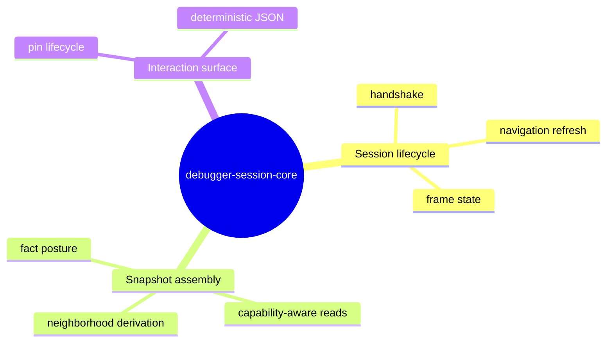
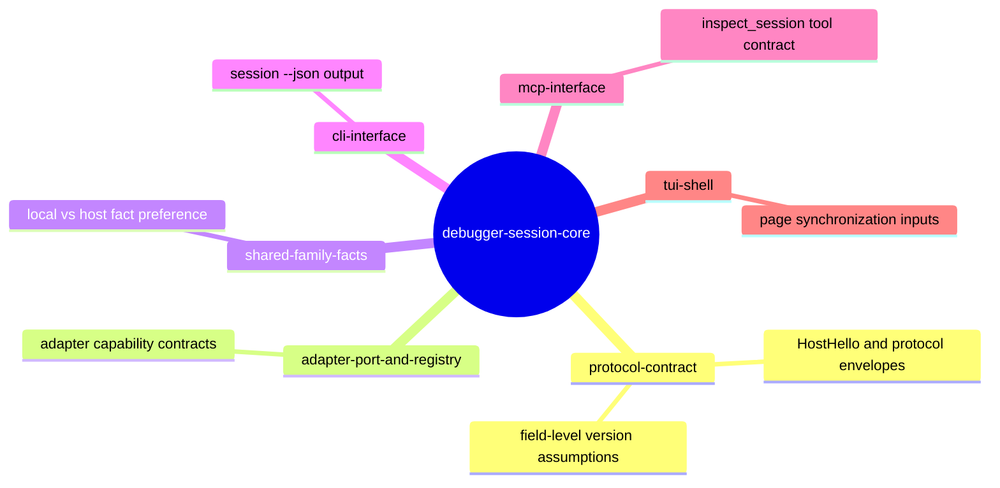
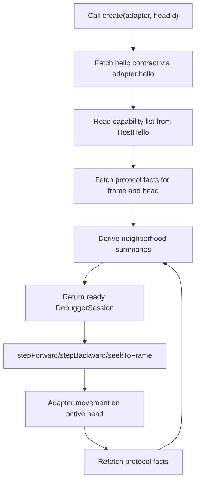
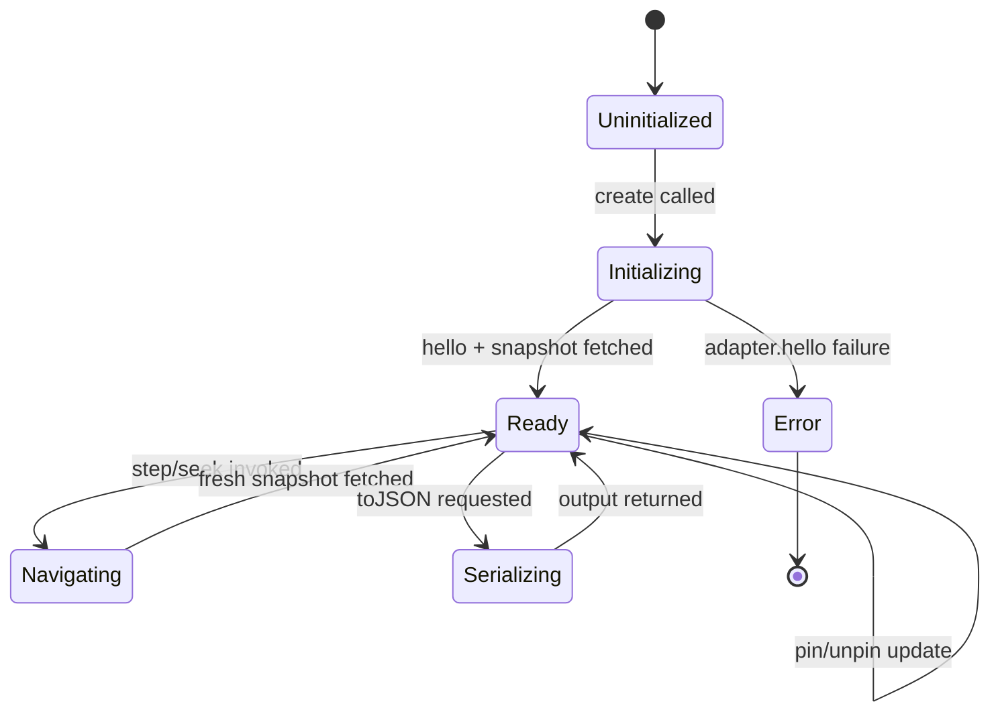
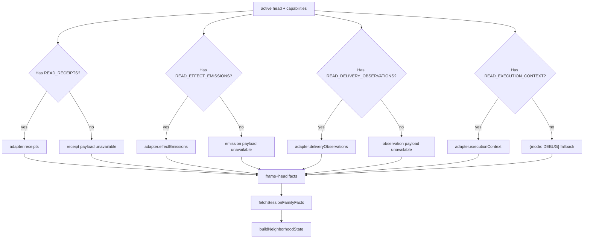
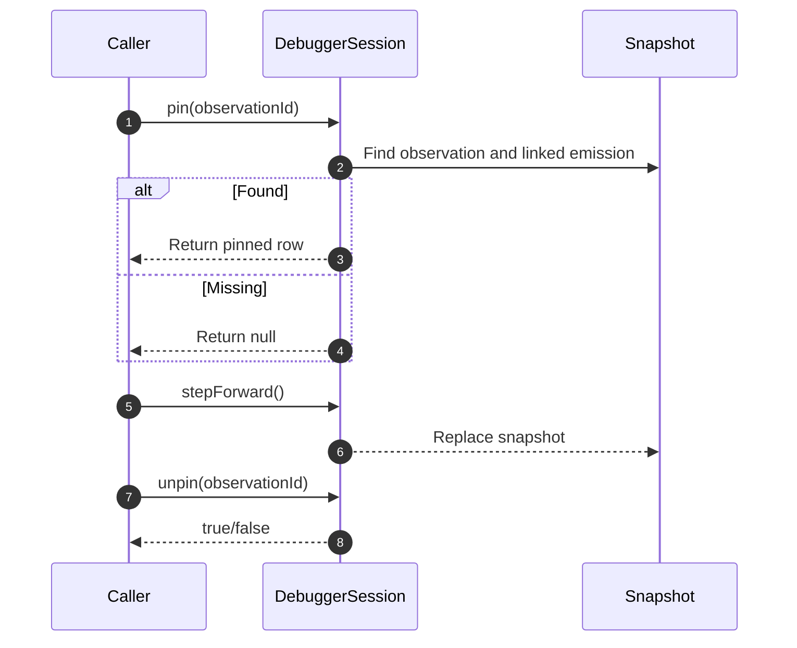
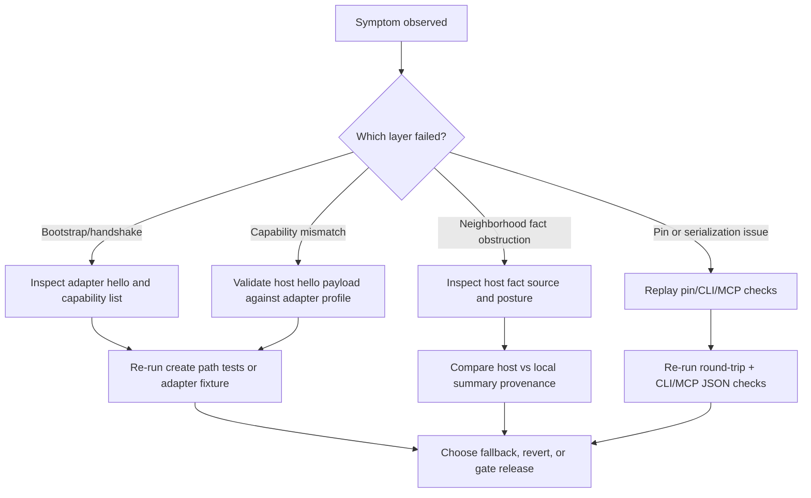

# WARP TTD Debugger Session Core

## Overview

This shelf defines the **DebuggerSession** contract for the WARP TTD session layer. After reading it, an uninitiated contributor should be able to create a valid session, mutate it via navigation, understand what survives when capabilities are missing, and verify that all serialized state is stable enough to be surfaced by CLI, MCP, and TUI without hand-waving.

**Diagram 1.0 — Core responsibility map for DebuggerSession.**

At the center of this shelf is the **session root object** created from `create()`, which captures a single active head plus a fully derived snapshot at that moment and then rehydrates that snapshot after each control movement. [C01]

The topic is intentionally practical: first understand construction and capability boundaries, then inspect data derivation, then consume the two operational paths that matter in day-one triage: pin semantics and failure modes. [C02][C03]

### Code owners

This shelf is governed through one code owner while broader session behavior still stabilizes across UI surfaces. If a session mutation affects user-visible replay semantics, ask before landing. [C06]

**Table 1 — Ownership and escalation route for this shelf.**

| Owner | Contact | Escalation responsibility |
|---|---|---|
| James | [james@flyingrobots.dev](mailto:james@flyingrobots.dev) | Any change to snapshot shape, navigation postconditions, or pin/serialization behavior |

### Related topics

Related shelves are grouped by execution impact and cross-check priority. The map below shows the dependency direction that matters when you touch a session behavior: protocol vocabulary first, adapter semantics second, and consumer surfaces third. [C22]

**Diagram 1.1 — Shelf-level dependency map for debugger session onboarding.**

**Table 1.2 — Related topics and why they matter here.**

| Shelf | Relation | How it helps when reading this one |
|---|---|---|
| [protocol-contract](../protocol-contract/README.md) | Upstream dependency | Confirms vocabulary and protocol shapes used in snapshots and envelopes. |
| [adapter-port-and-registry](../adapter-port-and-registry/README.md) | Upstream dependency | Defines capability contracts that decide which snapshot fields are populated. |
| [shared-family-facts](../shared-family-facts/README.md) | Upstream dependency | Defines the host-vs-local preference model used when neighborhood facts are assembled. |
| [cli-interface](../cli-interface/README.md) | Downstream consumer | Explains how serialized snapshots are formatted for command output. |
| [mcp-interface](../mcp-interface/README.md) | Downstream consumer | Explains read-only inspection tooling expectations built from the same session object. |
| [tui-shell](../tui-shell/README.md) | Downstream consumer | Describes page synchronization patterns that consume frame and session state. |

## Reader pathways

If your goal is to edit, triage, or review impact, choose the matching pathway.

### Edit pathway

Start with [the session lifecycle](#the-session-lifecycle) and then [capability-aware snapshot assembly](#capability-aware-snapshot-assembly). Confirm `test-plan.md` already contains each changed behavior under a stable requirement ID and evidence path, then update this shelf only after you confirm the test coverage map exists. [C23]

### Triage pathway

Start with [failure modes and evidence](#failure-modes-and-evidence), then confirm whether the failure is in handshake, capability projection, navigation refresh, or pin serialization. Only after the symptom is narrowed should you inspect adapter or UI layers. [C04][C19][C20][C22]

### Impact path

Start with [related topics](#related-topics), then inspect [downstream consumers](#interface consumers) to verify output contract impact from this shelf. The most common impact vectors are `session --json`, MCP session inspection, and snapshot-dependent UI rendering. [C20][C21][C22]

## The session lifecycle

The session lifecycle is a two-stage contract: **establish** then **refresh**. `DebuggerSession.create()` performs the handshake once, stores capabilities from `hello()`, and builds a snapshot in one pass. Once established, each navigation call uses that stored capability set to refresh the snapshot against the active head and new cursor position. [C01][C02][C03][C12]

**Diagram 2.0 — Session creation and mutation lifecycle.**

**Why this diagram exists.** This flow explains exactly which operations are safe to assume complete after session bootstrap and what changes after each navigation event.[C01][C02][C03]

**How to read it.** Start at node A: creation calls `create()` and immediately depends on the handshake result. Node B captures this contract negotiation, while C converts capabilities into allowed read operations. Path C→D→E→F is the core snapshot build; it is the only place the session becomes user-ready. The loop F→G→I→E is the refresh boundary that guarantees navigation does not mutate incrementally but replaces with a coherent projection each time. If this loop is broken, downstream consumers risk reading stale frame projections.[C01][C02][C03][C06]

**Operational takeaway.** Reproducer steps: call `create`, then call navigation once, then re-read the same session object and verify frame-based fields update together. If a step appears out of sequence, inspect `fetchSnapshot` and its helpers first.[C03]

**Cross-check anchor.** `src/app/debuggerSession.ts#150` and `src/app/debuggerSession.ts#327` for lifecycle and snapshot orchestration, then `src/app/neighborhoodAssembler.ts#222` for projection details.

The normal path is `create` to ready state and repeated navigation actions returning to the same refresh boundary, which is why the session is often treated as a projection boundary rather than a live event stream. No internal event bus exists inside `DebuggerSession`; every outwardly visible state change is produced by explicit navigation calls and snapshot replacement. [C01][C02][C03]

### Lifecycle states and behavior

**Diagram 2.1 — State machine for `DebuggerSession` behavior.**

**Why this diagram exists.** This state model separates lifecycle reliability from runtime state and shows when the session object should be trusted.[C01][C06]

**How to read it.**

`Uninitialized` represents no session yet. `Initializing` is the one-time bootstrap window. The normal path `Uninitialized → Initializing → Ready` must complete before any public consumption. `Navigating` exists only to model explicit movement events, and the immediate transition back to `Ready` is the reason downstream pages only receive completed projections. `Serializing` is a read-only endpoint that leaves session state unchanged. `Error` is terminal by design in this version to avoid silent recovery.

**Operational takeaway.** If a consumer sees partial behavior, the first question should be which state they are effectively in. For example, if creation failed, no fallback read mode exists and callers should report bootstrap failure, not partial UI rendering.[C01]

**Cross-check anchor.** `src/app/debuggerSession.ts#150`, `#189`, `#197`, and `#205` for the stateful APIs that map onto this machine.

The **golden path** is `Uninitialized → Initializing → Ready`. In that path, each transition is synchronous in intent and deterministic in output: the same input head and capabilities produce a snapshot that includes protocol, neighborhood, and fact posture fields. [C01][C06][C07]

The **non-golden path** is `Initializing → Error`, which only arises from adapter handshake failure because there is no local recovery branch in `create()`. When that happens, no session object should be used and consumers should treat failure as a host/session bootstrap issue rather than a UI rendering issue. [C01]

## Capability-aware snapshot assembly

Snapshot projection is intentionally capability-gated, which makes **graceful degradation** a correctness feature, not a fallback bug. If a capability is missing, the session returns empty arrays or default values and continues to build a complete session object. [C10][C12]

**Figure 3.0 — Capability gating and payload selection path.**

The map ends in `SessionSnapshot`, which includes frame and head protocol data, neighborhood summaries, and session family facts. This means capability absence never blocks the whole graph; it only influences detail-level enrichment. [C06][C07][C09][C10]

When a capability is missing, the branch is explicit. The fallback nodes carry the same shape as successful nodes (`[]` semantics) so downstream aggregation stays total and type-stable. This is why the snapshot assembler can replace only the data-bearing leaves while preserving deterministic refresh boundaries at `J` and the subsequent neighborhood steps.

The **neighborhood assembly** step is where host-provided family facts are preferred only when they are present and hydrate cleanly. Local summaries are always computed from frame data first and then overlaid with host facts where allowed by capability and valid payload shape. [C08][C09]

### Session data contracts and collaborators

The session graph has one practical object model. `DebuggerSession` is the session boundary, while `SessionSnapshot` is the transport shape for both in-memory operation and serialized output. [C06][C06]

**Diagram 3.1 — Class relationships in debugger session state composition.**

```mermaid
classDiagram
  class DebuggerSession {
    +create(adapter, headId): Promise~DebuggerSession~
    +stepForward(): Promise~SessionSnapshot~
    +stepBackward(): Promise~SessionSnapshot~
    +seekToFrame(frameIndex): Promise~SessionSnapshot~
    +pin(observationId): PinnedObservation | null
    +unpin(observationId): boolean
    +toJSON(): SerializedSession
    -#adapter: TtdHostAdapter
    -#snapshot: SessionSnapshot
    -#pins: PinnedObservation[]
  }
  class SessionSnapshot {
    +head: PlaybackHeadSnapshot
    +frame: PlaybackFrame
    +receipts: ReceiptSummary[]
    +emissions: EffectEmissionSummary[]
    +observations: DeliveryObservationSummary[]
    +execCtx: ExecutionContext
    +neighborhoodCore: NeighborhoodCoreSummary
    +neighborhoodSites: NeighborhoodSiteCatalog
    +reintegrationDetail: ReintegrationDetailSummary
    +receiptShell: ReceiptShellSummary
    +sessionFamilyFacts: SessionFamilyFact[]
  }
  class SerializedSession {
    +sessionId: string
    +activeHeadId: string
    +snapshot: SerializedSessionSnapshot
    +pins: PinnedObservation[]
  }
  class SerializedSessionSnapshot {
    +head: PlaybackHeadSnapshot
    +frame: PlaybackFrame
    +receipts: ReceiptSummary[]
    +emissions: EffectEmissionSummary[]
    +observations: DeliveryObservationSummary[]
    +execCtx: ExecutionContext
    +neighborhoodCore: SerializedNeighborhoodCoreSummary
    +neighborhoodSites: SerializedNeighborhoodSiteCatalog
    +reintegrationDetail: SerializedReintegrationDetailSummary
    +receiptShell: SerializedReceiptShellSummary
    +sessionFamilyFacts: SessionFamilyFact[]
  }
  class SessionFamilyFact {
    +kind: string
    +field: string
    +posture: string
    +origin: string
    +scope: string
    +target: string
    +source: JsonValue
    +reason: string
  }
  class PinnedObservation {
    +pinnedAt: number
    +observation: DeliveryObservationSummary
    +emission: EffectEmissionSummary
  }
  class NeighborhoodCoreSummary {
    +siteId: string
    +headId: string
    +frameIndex: number
    +coordinate: object
    +primaryLaneId: string
    +primaryWorldlineId: string
    +participatingLaneIds: string[]
    +outcome: string
    +alternatives: NeighborhoodAlternativeSummary[]
    +summary: string
  }
  class NeighborhoodSiteCatalog {
    +activeSiteId: string
    +sites: NeighborhoodSiteSummary[]
  }
  class NeighborhoodSiteSummary {
    +siteId: string
    +kind: string
    +outcome: string
    +label: string
    +summary: string
    +laneId: string
    +worldlineId: string
    +parentSiteId: string
  }
  class NeighborhoodAlternativeSummary {
    +alternativeId: string
    +kind: string
    +laneId: string
    +worldlineId: string
    +outcome: string
    +summary: string
  }
  class ReintegrationDetailSummary {
    +siteId: string
    +anchors: SeamAnchorSummary[]
    +obligations: CompatibilityObligationSummary[]
    +evidence: CompatibilityEvidenceSummary[]
    +summary: string
  }
  class ReceiptShellSummary {
    +siteId: string
    +receiptIds: string[]
    +candidateCount: number
    +rejectedCount: number
    +hasBlockingRelation: boolean
    +summary: string
  }
  class SerializedNeighborhoodCoreSummary {
    +siteId: string
    +headId: string
    +frameIndex: number
    +coordinate: object
    +primaryLaneId: string
    +primaryWorldlineId: string
    +participatingLaneIds: string[]
    +outcome: string
    +alternatives: NeighborhoodAlternativeSummary[]
    +summary: string
  }
  class SerializedNeighborhoodSiteCatalog {
    +activeSiteId: string
    +sites: SerializedNeighborhoodSiteSummary[]
  }
  class SerializedReintegrationDetailSummary {
    +siteId: string
    +anchors: SeamAnchorSummary[]
    +obligations: CompatibilityObligationSummary[]
    +evidence: CompatibilityEvidenceSummary[]
    +summary: string
  }
  class SerializedReceiptShellSummary {
    +siteId: string
    +receiptIds: string[]
    +candidateCount: number
    +rejectedCount: number
    +hasBlockingRelation: boolean
    +summary: string
  }
  class SeamAnchorSummary {
    +anchorId: string
    +kind: string
    +laneId: string
    +worldlineId: string
    +summary: string
  }
  class CompatibilityObligationSummary {
    +obligationId: string
    +kind: string
    +status: string
    +summary: string
  }
  class CompatibilityEvidenceSummary {
    +evidenceId: string
    +obligationId: string
    +visibility: string
    +summary: string
  }
  class PlaybackHeadSnapshot {
    +headId: string
    +label: string
    +currentFrameIndex: number
    +trackedLaneIds: string[]
    +writableLaneIds: string[]
    +paused: boolean
  }
  class PlaybackFrame {
    +headId: string
    +frameIndex: number
    +lanes: LaneFrameView[]
  }
  class ReceiptSummary {
    +receiptId: string
    +laneId: string
    +worldlineId: string
    +headId: string
    +frameIndex: number
    +admittedRewriteCount: number
    +rejectedRewriteCount: number
    +counterfactualCount: number
    +summary: string
  }
  class EffectEmissionSummary {
    +emissionId: string
    +laneId: string
    +worldlineId: string
    +headId: string
    +frameIndex: number
    +effectKind: string
    +summary: string
  }
  class DeliveryObservationSummary {
    +observationId: string
    +emissionId: string
    +headId: string
    +frameIndex: number
    +sinkId: string
    +outcome: string
    +reason: string
    +summary: string
  }
  class ExecutionContext {
    +mode: string
    +sessionId: string
    +observerId: string
    +apertureId: string
  }
  class TtdHostAdapter {
    +adapterName: string
    +hello(): Promise~HostHello~
    +laneCatalog(): Promise~LaneCatalog~
    +playbackHead(headId: string): Promise~PlaybackHeadSnapshot~
    +frame(headId: string, frameIndex?: number): Promise~PlaybackFrame~
    +receipts(headId: string, frameIndex?: number): Promise~ReceiptSummary[]~
    +stepForward(headId: string): Promise~PlaybackFrame~
    +stepBackward(headId: string): Promise~PlaybackFrame~
    +seekToFrame(headId: string, frameIndex: number): Promise~PlaybackFrame~
    +effectEmissions(headId: string, frameIndex?: number): Promise~EffectEmissionSummary[]~
    +deliveryObservations(headId: string, frameIndex?: number): Promise~DeliveryObservationSummary[]~
    +executionContext(): Promise~ExecutionContext~
    +sessionFamilyFacts(headId: string, frameIndex?: number): Promise~SessionFamilyFact[]~
  }
  class HostHello {
    +hostKind: string
    +hostVersion: string
    +protocolVersion: string
    +schemaId: string
    +capabilities: string[]
  }
  class LaneCatalog {
    +lanes: string[]
  }
  class SerializedNeighborhoodSiteSummary {
    +siteId: string
    +kind: string
    +outcome: string
    +label: string
    +summary: string
    +laneId: string
    +worldlineId: string
    +parentSiteId: string
  }
  class LaneFrameView {
    +laneId: string
    +worldlineId: string
    +coordinate: object
    +changed: boolean
    +btrDigest: string
  }
  class JsonValue {
    +value: string
  }
  DebuggerSession o-- SessionSnapshot
  DebuggerSession o-- "0..1" TtdHostAdapter
  SessionSnapshot o-- SessionFamilyFact
  SessionSnapshot o-- PinnedObservation
  SessionSnapshot o-- NeighborhoodCoreSummary
  SessionSnapshot o-- NeighborhoodSiteCatalog
  SessionSnapshot o-- ReintegrationDetailSummary
  SessionSnapshot o-- ReceiptShellSummary
  SessionSnapshot o-- "1..*" ReceiptSummary
  SessionSnapshot o-- "1..*" EffectEmissionSummary
  SessionSnapshot o-- "1..*" DeliveryObservationSummary
  SessionSnapshot --> SerializedSessionSnapshot
  PlaybackFrame o-- LaneFrameView
  SerializedSessionSnapshot --> SerializedNeighborhoodCoreSummary
  SerializedSessionSnapshot --> SerializedNeighborhoodSiteCatalog
  SerializedSessionSnapshot --> SerializedReintegrationDetailSummary
  SerializedSessionSnapshot --> SerializedReceiptShellSummary
  TtdHostAdapter --> HostHello
  TtdHostAdapter --> LaneCatalog
  SerializedNeighborhoodSiteCatalog o-- SerializedNeighborhoodSiteSummary
  SerializedSession --> SerializedSessionSnapshot
  SerializedNeighborhoodCoreSummary o-- NeighborhoodAlternativeSummary
  NeighborhoodCoreSummary o-- NeighborhoodAlternativeSummary
  NeighborhoodSiteCatalog o-- NeighborhoodSiteSummary
  ReintegrationDetailSummary o-- SeamAnchorSummary
  ReintegrationDetailSummary o-- CompatibilityObligationSummary
  ReintegrationDetailSummary o-- CompatibilityEvidenceSummary
```

**Table 3.1.1 — Class dictionary for Diagram 3.1.**

| Class | Role in the model | Ownership | Invariant | Cross-check anchor |
|---|---|---|---|---|
| `DebuggerSession` | Session boundary and orchestration entry point | **Session boundary** | Owns mutable transport and snapshot state and is the only API for navigation lifecycle. | `src/app/debuggerSession.ts#131` |
| `SessionSnapshot` | Runtime projection consumed by interfaces | **Session boundary / runtime payload** | Represents exactly one head plus one frame worth of synchronized facts and derived summaries. | `src/app/debuggerSession.ts#293` |
| `SerializedSession` | JSON-safe read surface | **Output boundary** | Includes a cloned snapshot and detached pins so no caller can mutate internal session state. | `src/app/debuggerSession.ts#292` |
| `SerializedSessionSnapshot` | Transport mirror of runtime snapshot | **Output boundary** | Preserves the snapshot contract with serialized neighborhood and reintegration details. | `src/app/debuggerSession.ts#293` |
| `SessionFamilyFact` | Capability posture signal for family-level data | **Protocol fact contract** | Carries `posture`, `origin`, `scope`, and `target` so missing/fallback states remain explicit. | `src/app/sessionFamilyFacts.ts#25` |
| `PinnedObservation` | Inspector state carried across navigation | **Session boundary** | Binds observation+emission by ID and stamps `pinnedAt` with the frame index for temporal context. | `src/app/debuggerSession.ts#194` |
| `NeighborhoodCoreSummary` | Deterministic neighborhood composition from protocol signals | **Derived artifact** | Contains one active site identity and its alternatives at a single frame index. | `src/app/NeighborhoodCoreSummary.ts#74` |
| `NeighborhoodSiteCatalog` | Deterministic set of selectable neighborhood sites | **Derived artifact** | Always has a resolvable `activeSiteId` and ordered site collection. | `src/app/NeighborhoodSiteCatalog.ts#80` |
| `NeighborhoodSiteSummary` | Site-level neighbor descriptor | **Derived artifact** | Preserves a site identity, visibility label, and parent/child relation for selection. | `src/app/NeighborhoodSiteCatalog.ts#20` |
| `NeighborhoodAlternativeSummary` | Counterfactual alternative descriptor | **Derived artifact** | Identifies alternatives by unique `(site, lane, worldline)` lineage. | `src/app/NeighborhoodCoreSummary.ts#17` |
| `ReintegrationDetailSummary` | Compliance and obligation context | **Derived artifact** | Binds anchors, obligations, and evidence under a single site summary. | `src/app/ReintegrationDetailSummary.ts#96` |
| `ReceiptShellSummary` | Receipt pressure and obstruction summary | **Derived artifact** | Computes candidate/rejected counts and blocking status deterministically per site. | `src/app/ReceiptShellSummary.ts#24` |
| `SerializedNeighborhoodCoreSummary` | Wire-safe neighborhood core snapshot | **Output boundary** | Mirrors neighborhood core fields using serialized field shapes. | `src/app/NeighborhoodCoreSummary.ts#74` |
| `SerializedNeighborhoodSiteCatalog` | Wire-safe catalog mirror | **Output boundary** | Mirrors selected site set and active site id for client consumption. | `src/app/NeighborhoodSiteCatalog.ts#80` |
| `SerializedReintegrationDetailSummary` | Wire-safe compliance summary mirror | **Output boundary** | Preserves reintegration evidence and obligations for downstream readers. | `src/app/ReintegrationDetailSummary.ts#96` |
| `SerializedReceiptShellSummary` | Wire-safe receipt summary mirror | **Output boundary** | Preserves candidate/rejected/blocking summary fields in transport-safe form. | `src/app/ReceiptShellSummary.ts#27` |
| `SeamAnchorSummary` | Compliance anchor reference | **Derived artifact** | Holds a stable anchor id and location metadata for evidence interpretation. | `src/app/ReintegrationDetailSummary.ts#38` |
| `CompatibilityObligationSummary` | Rule or constraint outcome summary | **Derived artifact** | Encodes deterministic obligation state as `status` plus summary text. | `src/app/ReintegrationDetailSummary.ts#69` |
| `CompatibilityEvidenceSummary` | Evidence reference row for obligations | **Derived artifact** | Preserves evidence id and visibility labels for traceability. | `src/app/ReintegrationDetailSummary.ts#89` |
| `PlaybackHeadSnapshot` | Frame/head protocol anchor for session projection | **Protocol boundary** | Supplies `headId`, frame index, lane ids, and pause state at snapshot build time. | `src/protocol.ts#47` |
| `PlaybackFrame` | Lane-frame view used by neighborhood inference | **Protocol boundary** | Provides ordered lane views and frame index used for deterministic derivation. | `src/protocol.ts#58` |
| `ReceiptSummary` | Protocol receipt facts used for neighborhood/reasoning | **Protocol boundary** | Must include rewritten/rejected/counterfactual counters for posture derivation. | `src/protocol.ts#93` |
| `EffectEmissionSummary` | Protocol emission facts used for pinning and summary | **Protocol boundary** | Links lane/worldline output to summary traces and effect shape. | `src/protocol.ts#126` |
| `DeliveryObservationSummary` | Protocol delivery observations linked into snapshot | **Protocol boundary** | Must include reason plus outcome and observation identifiers for pin linkage. | `src/protocol.ts#145` |
| `ExecutionContext` | Runtime execution mode signal | **Protocol boundary** | Defaults to `DEBUG` when host execution context capability is absent. | `src/app/debuggerSession.ts#226` |
| `TtdHostAdapter` | Host capability provider and control surface | **Adapter boundary** | All session capabilities and control commands are delegated through this boundary. | `src/adapter.ts#2` |
| `HostHello` | Host capability declaration and compatibility envelope | **Adapter boundary** | Defines capability list and protocol/schema identity before fetch begins. | `src/protocol.ts#35` |
| `LaneCatalog` | Lane and worldline metadata from adapter | **Adapter boundary** | Supplies lane graph metadata used by neighborhood and site builders. | `src/adapter.ts#2` |
| `SerializedNeighborhoodSiteSummary` | Wire-safe site payload used by UI tooling | **Output boundary** | Preserves human-readable labeling and parent/child site intent. | `src/app/NeighborhoodSiteCatalog.ts#17` |
| `LaneFrameView` | Per-lane snapshot data source for inference | **Protocol boundary** | Contains coordinate and change flags used by neighborhood derivation decisions. | `src/protocol.ts#50` |
| `JsonValue` | Polymorphic fact payload carrier | **Protocol fact contract** | Carries raw payload without overfitting the class diagram to transport internals. | `src/app/generatedFamilyIngress.ts#1` |

**Why this diagram exists.** The model helps you answer whether a behavior change belongs at the control boundary, protocol boundary, runtime projection, or serialization layer before editing code. That question matters because each layer has a different compatibility expectation and test surface.[C06][C07]

The first family is the control boundary, where `DebuggerSession` owns private state and exposes navigation methods that replace `SessionSnapshot` rather than mutating it incrementally. That means most contract risk from this shelf is centered on boundary transitions (`create`, `stepForward`, `stepBackward`, `seekToFrame`, `pin`, `unpin`, `toJSON`) and their ordering semantics.

The second family is the snapshot payload, where `SessionSnapshot` plus protocol entities (`PlaybackHeadSnapshot`, `PlaybackFrame`, `ReceiptSummary`, `EffectEmissionSummary`, `DeliveryObservationSummary`, `ExecutionContext`) are the concrete evidence of what was read and when. When you read this graph, the first trust signal is that the snapshot is a synchronized projection keyed by frame and head rather than a stitched patchwork.

The third family is neighborhood-derived output, where `NeighborhoodCoreSummary`, `NeighborhoodSiteCatalog`, and `ReintegrationDetailSummary` encode inferable context that is absent from raw protocol transport. These are deterministic computations over protocol facts and therefore should be interpreted as derived posture, not source truth. That distinction is why these nodes sit one hop below `SessionSnapshot` and not under adapter calls.

The fourth family is serialized transport, where `SerializedSession`, `SerializedSessionSnapshot`, and related serialized siblings preserve compatibility guarantees for external readers. The snapshot is cloned on export, so callers cannot mutate live session internals, and pin rows are preserved as separate value objects in this boundary.

The final family is protocol fact posture, where `SessionFamilyFact` and `JsonValue` preserve explicit availability semantics (`ABSENT`/`PRESENT`/`OBSTRUCTED`) for host family facts. This is the resilience seam; if one fact family has missing or malformed input, consumers can still reason about which downstream nodes remain trustworthy.

When a capability or fact branch is missing, the class model still remains valid because each missing source feeds a stable empty collection or deterministic fallback, not a partial write. If such a branch fails, the reader can trust frame/head continuity and deterministic projection semantics, but should treat neighborhood and reintegration summaries as degraded by that branch until restored.[C04][C07]

**Operational takeaway.** Any change in these class shapes is a contract change even if method signatures stay the same. Update this shelf before shipping, then rerun the parse loop and the relevant `test-plan` evidence checks before code review. [C04][C05][C06]

**Cross-check anchor.** `src/app/debuggerSession.ts#131` for orchestration, `src/app/debuggerSession.ts#293` for serialization internals, `src/app/sessionFamilyFacts.ts#1` for posture construction, `src/app/NeighborhoodCoreSummary.ts#58` for neighborhood invariants, `src/app/NeighborhoodSiteCatalog.ts#72` for selection logic, and `src/app/ReintegrationDetailSummary.ts#120` for compliance assembly.

`SessionSnapshot` is not a persistence record; it is a deterministic aggregate produced from one frame and one head. The **adapter** drives the source data, and neighborhood summary classes compute derived views on that source each time navigation updates the active frame. [C06][C07][C08]

`PinnedObservation` pairs two protocol objects: one observation and its emitting effect. This pairing is what lets an inspector keep meaningful context even after future frame transitions because pins are independent rows from current `snapshot` content. [C04][C05]

## Pin and serialization behavior

Pins are intentionally idempotent at the edges and explicit in shape. Unknown observation IDs return `null` from `pin` and unknown IDs for `unpin` return `false`; these are explicit runtime signals that the caller should surface as no-op outcomes instead of hard failures. [C04][C05]

**Figure 4.0 — Pin lifecycle and persistence across navigation.**

**Why this diagram exists.** It captures how the pin store behaves when data is sparse, found, or absent, and how that behavior survives navigation.[C04][C05]

**How to read it.** The top branch (`Found`) returns a pinned pair with stable `observationId` + emission linkage. The `Missing` branch returns `null`, which is intentionally a no-op signal. After one navigation call, the same pins are retained and remain detached from the newly fetched `snapshot`. Final unpin is idempotent in signal shape (`true` or `false`) so callers can safely retry.[C04][C05]

**Operational takeaway.** Pin workflow failures should be handled as UX no-ops with clear user messaging, not as hard exceptions.[C04][C05]

**Cross-check anchor.** `src/app/debuggerSession.ts#213` and `#233` for pin methods.

The pinned row stores `pinnedAt` using current `frameIndex`, the snapshot clone of observation, and the clone of emission. Because pins are stored separately from `snapshot`, they can persist across frame transitions and still reference the original linked emission. [C04][C05]

Serialization is also intentionally plain data. `toJSON()` returns `SerializedSession` and uses cloning to keep callers from mutating internal references; round-tripping through `JSON.stringify` must preserve exact value parity in tests. [C05][C19]

## Interface consumers

The most direct proof of session value is that it is already used in two external surfaces: CLI `session` output and MCP inspection tools. CLI prints `session.toJSON()` directly, while MCP wraps the same representation through `inspectSession`. [C20][C21]

**Table 4.1 — Consumer posture for this shelf.**

| Surface | Read path | Contract implication |
|---|---|---|
| CLI `session` command | `DebuggerSession.create` + `toJSON` | Always returns serializable snapshot data in both human and JSON modes. |
| MCP `inspectSession` tool | Cached session + read-only tool wrapper | Reuses a single session instance and avoids repeated handshakes for repeated tooling calls. |

This implies that any schema-visible shift here must be validated against both surfaces before release, because both rely on the same shape and both can leak unstable details quickly when used in automation. [C20][C21]

## Failure modes and evidence

When the session fails, the first useful question is not where the defect is, but which contract layer dropped data versus dropped behavior. The following modes are intentionally separable so a triager can answer "what can I still trust" in under a minute. [C13][C14][C15][C17]

**Table 5.0 — Failure catalog for DebuggerSession.**

| Mode | Mismatch shape | Detection point | Runtime impact | What you can get from this signal |
|---|---|---|---|---|
| FM-01: Handshake never returns | `create()` rejects or never returns | Test or UI bootstrap stack when session open is attempted | Entire session surface unavailable | You can still trust that adapter identity was not established and should avoid partial reads. |
| FM-02: Missing capability in host hello | `session.snapshot.observations = []`, `execCtx = {mode: "DEBUG"}` | `DebuggerSession.create()` with restricted hello + assertion in tests | Reduced snapshot depth with explicit data omission | You can still trust core frame/head continuity and treat missing streams as host-limited capabilities. |
| FM-03: Host fact missing while summary needed | session family fact for key has posture `LOCAL_FALLBACK` and origin `LOCAL_FALLBACK` | `buildNeighborhoodState` + neighborhood assertions | Local-generated summaries are used instead of host payloads | You still receive complete session data from protocol-derived inputs, with provenance that payload was not host-published. |
| FM-04: Host fact present but malformed | neighborhood fact has posture `OBSTRUCTED` and reason text | Fact hydration branch in `neighborhoodAssembler` | Local summary remains available but provenance marks an obstruction reason | You gain a localized warning indicating host-vs-local disagreement and can inspect payload shape separately from UI behavior. |
| FM-05: Unknown pin request | `pin(nonexistentId) => null`, `unpin(nonexistentId) => false` | Caller-level API return check | No pin rows changed and no mutation failure | You get an explicit no-op signal to keep the operator flow idempotent. |
| FM-06: Serialization drift | Round-trip mismatch after `JSON.stringify(session.toJSON())` | Test guard in session spec | Consumers of command/tool output can break deterministically if a shape changed | You gain a hard signal that contracts should be migrated before any UI or automation consumes the payload. |

**Diagram 5.0 — Failure effect propagation and operator response sequence.**

**Table 5.1 — Remediation matrix.**

| Failure mode | First response | Recovery strategy | Verification |
|---|---|---|---|
| FM-01 | Stop and fail the session entry point | Check adapter startup, target availability, and hello contract compliance | Re-run session creation path via targeted session tests |
| FM-02 | Confirm advertised capabilities | Add capability gating check in adapter implementation and host hello fixture | Re-run `create()` and sparse-adapter tests |
| FM-03 | Confirm neighborhood local baseline | Add host fact fixture for core/detail/shell and inspect payload drift | Re-run snapshot and obstruction tests |
| FM-04 | Inspect payload shape and source | Compare host payload serialization with local model factory and fix host publisher | Re-run frame-obstruction scenario checks |
| FM-05 | Return user-facing no-op guidance | Keep pin flows idempotent; avoid throwing | Re-run pin/no-op tests and UI workflows |
| FM-06 | Freeze release and migrate schema consumers | Preserve shape compatibility or provide a migration-backed replacement | Re-run `session --json`, MCP inspect output checks, and `toJSON` round-trip test |

## Maintenance and extension workflow

For implementation work, this shelf follows the same deterministic edit gate as other behavior shelves. Keep changes to this file tightly coupled with test coverage in `test-plan.md`, and use its requirement IDs to map each behavior adjustment before touching runtime code. [C23]

## Appendix A — Recent Activity

**Table A.1 — Shelf-level project activity.**

| Type | ID | Title / summary | State |
|---|---|---|---|
| PRs | none | No dedicated PR references are recorded in this topic file. | n/a |
| Issues | none | No dedicated issue links are recorded in this topic file. | n/a |

Update this appendix when a PR lands against this shelf or when a live issue is filed for session behavior.

## Appendix B — Glossary

| Term | Meaning |
|---|---|
| **Session root** | The top-level `DebuggerSession` object that owns snapshot and pin state. |
| **Snapshot** | A derived aggregate containing protocol protocol objects plus neighborhood summaries for a single frame. |
| **Capability gate** | A run-time capability check that decides whether a protocol call should execute or be replaced by a safe default. |
| **Fact posture** | The provenance marker that indicates where a neighborhood-derived fact came from (host published, local fallback, unavailable, obstructed). |
| **Golden path** | The expected end-to-end flow for successful read behavior, usually from create to serialized output without exceptions. |

## Appendix C — Evidence and citations

| Citation ID | Source |
|---|---|
| C01 | src/app/debuggerSession.ts#150@c0b4f967d4406ec19a317129488d39aaf34d19ef |
| C02 | src/app/debuggerSession.ts#154@c0b4f967d4406ec19a317129488d39aaf34d19ef |
| C03 | src/app/debuggerSession.ts#189@c0b4f967d4406ec19a317129488d39aaf34d19ef |
| C04 | src/app/debuggerSession.ts#213@c0b4f967d4406ec19a317129488d39aaf34d19ef |
| C05 | src/app/debuggerSession.ts#242@c0b4f967d4406ec19a317129488d39aaf34d19ef |
| C06 | src/app/debuggerSession.ts#256-345@c0b4f967d4406ec19a317129488d39aaf34d19ef |
| C07 | src/app/neighborhoodAssembler.ts#222-235@c0b4f967d4406ec19a317129488d39aaf34d19ef |
| C08 | src/app/neighborhoodAssembler.ts#141-155@c0b4f967d4406ec19a317129488d39aaf34d19ef |
| C09 | src/app/sessionFamilyFacts.ts#57-103@c0b4f967d4406ec19a317129488d39aaf34d19ef |
| C10 | src/app/neighborhoodAssembler.ts#141-155, src/app/debuggerSession.ts#263-325@c0b4f967d4406ec19a317129488d39aaf34d19ef |
| C11 | src/protocol.ts#29-48@c0b4f967d4406ec19a317129488d39aaf34d19ef |
| C12 | src/adapter.ts#13-27@c0b4f967d4406ec19a317129488d39aaf34d19ef |
| C13 | test/debuggerSession.spec.ts#93-123@c0b4f967d4406ec19a317129488d39aaf34d19ef |
| C14 | test/debuggerSession.spec.ts#126-135@c0b4f967d4406ec19a317129488d39aaf34d19ef |
| C15 | test/debuggerSession.spec.ts#153-170@c0b4f967d4406ec19a317129488d39aaf34d19ef |
| C16 | test/debuggerSession.spec.ts#206-217@c0b4f967d4406ec19a317129488d39aaf34d19ef |
| C17 | test/debuggerSession.spec.ts#226-260@c0b4f967d4406ec19a317129488d39aaf34d19ef |
| C18 | test/debuggerSession.spec.ts#262-319@c0b4f967d4406ec19a317129488d39aaf34d19ef |
| C19 | src/cli.ts#150-157@c0b4f967d4406ec19a317129488d39aaf34d19ef |
| C20 | src/mcp/admissionChainSurface.ts#139-146@c0b4f967d4406ec19a317129488d39aaf34d19ef |
| C21 | src/mcp/admissionChainSurface.ts#223-246@c0b4f967d4406ec19a317129488d39aaf34d19ef |
| C22 | test/debuggerSession.spec.ts#206-217@c0b4f967d4406ec19a317129488d39aaf34d19ef |
| C23 | docs/topics/debugger-session-core/test-plan.md#1-33@c0b4f967d4406ec19a317129488d39aaf34d19ef |
