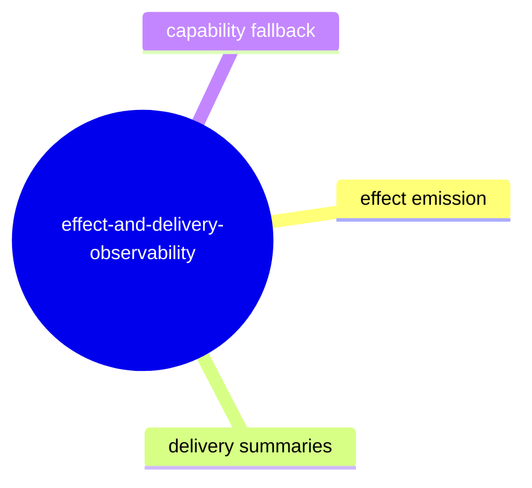

# Effect and Delivery Observability

## Purpose

Track how effect, delivery, and emission surfaces are represented for inspection workflows.

## Contract Points

1. Delivery observations and effect emissions are represented as protocol contracts in stable tuple-like summaries.
2. Effect extraction surfaces include deterministic lane/worldline references.
3. Posture and presence rules avoid throwing for adapters without effect emission capability.
4. Delivery and effect summaries remain synchronized with frame progression.
5. Observability summaries are stable in CLI JSON, TUI snapshots, and MCP outputs.

## Evidence

- `src/protocol.ts`
- `src/adapters/gitWarpAdapter.ts`
- `src/adapters/gitWarpEffectEmissionExtractor.ts`
- `src/adapters/scenarioFixtureAdapter.ts`
- `test/effectEmission.spec.ts`
- `test/debuggerSession.spec.ts`

## Stability Notes

- Empty capability paths are explicit and should emit empty lists/absent blocks, not partial malformed records.
