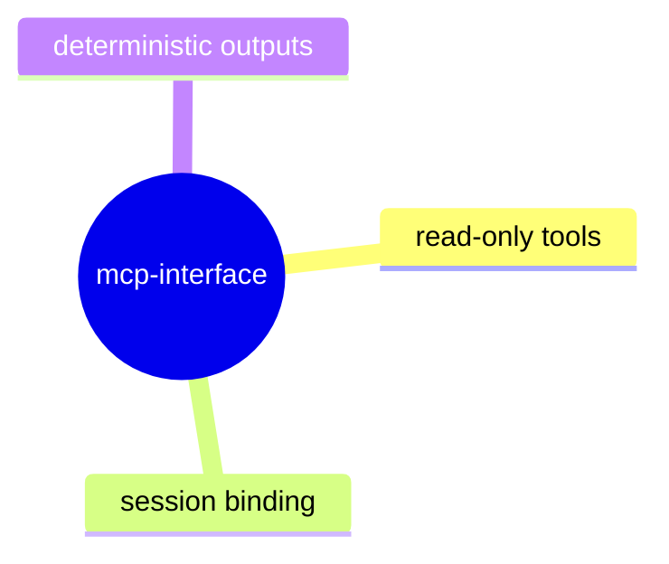

# MCP Interface

## Purpose

Track deterministic behavior of MCP read-only surfaces and session-backed tool output contracts.

## Contract Points

1. MCP tool outputs are derived from adapter-backed read-model data and session state.
2. Tool calls avoid side effects and keep deterministic ordering on fixed inputs.
3. Admission-chain and session tools share stable protocol vocabulary with CLI and TUI.
4. MCP errors are structured and recoverable.

## Evidence

- `src/mcp/main.ts`
- `src/mcp/admissionChainSurface.ts`
- `src/app/debuggerSession.ts`
- `test/mcpAdmissionChainSurface.spec.ts`

## Operational Notes

- MCP should preserve existing read-model contracts and provide JSON-safe posture summaries.
