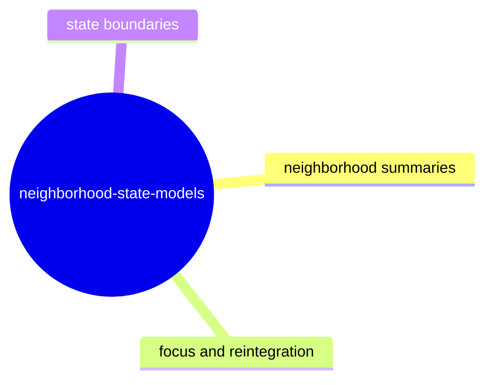

# Neighborhood State Models

## Purpose

Define all derived neighborhood and focus summaries used for inspection views.

## Contract Points

1. `NeighborhoodCoreSummary` derives participating sites, primary lane, and outcome.
2. `NeighborhoodSiteCatalog` normalizes selected site/lane identity across catalog moves.
3. `NeighborhoodFocusSummary` captures current focus object used by inspector and worldline views.
4. `ReceiptShellSummary` derives receipt counters and evidence flags from frame receipts.
5. `ReintegrationDetailSummary` projects anchors/obligations/evidence for the active frame.
6. `buildNeighborhoodState()` in `src/app/neighborhoodAssembler.ts` composes all summaries from protocol and session facts.

## Evidence

- `src/app/NeighborhoodCoreSummary.ts`
- `src/app/NeighborhoodSiteCatalog.ts`
- `src/app/NeighborhoodFocusSummary.ts`
- `src/app/ReceiptShellSummary.ts`
- `src/app/ReintegrationDetailSummary.ts`
- `src/app/neighborhoodAssembler.ts`
- `test/neighborhood*Summary.spec.ts`
- `test/inspectorPage.spec.ts`
- `test/sessionSync.spec.ts`

## Behavior Boundary

- Neighborhood outputs are deterministic for a given frame and input facts and are not directly mutation-capable.
- Selection normalization must reject stale ids and fall back to stable primary alternatives.
