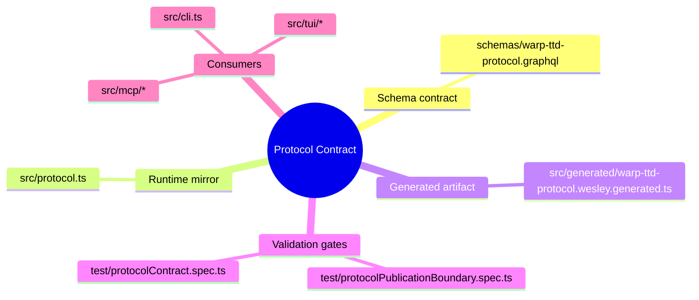
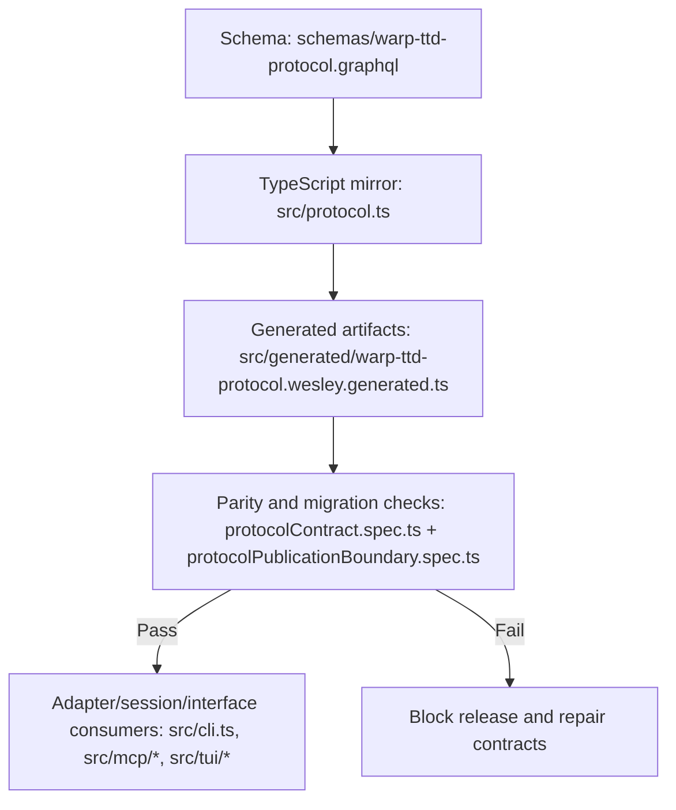
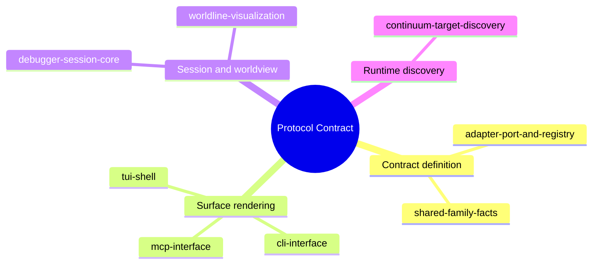
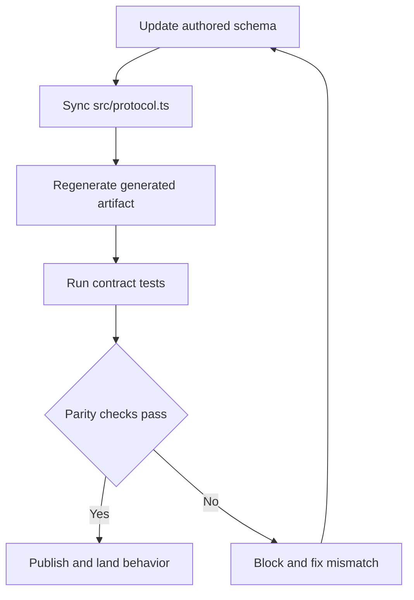
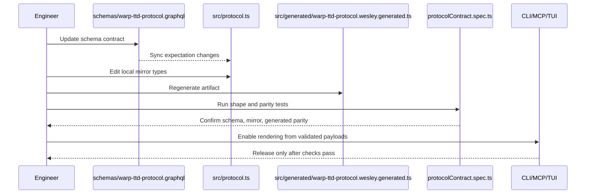
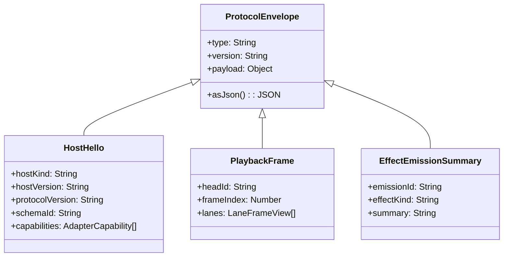
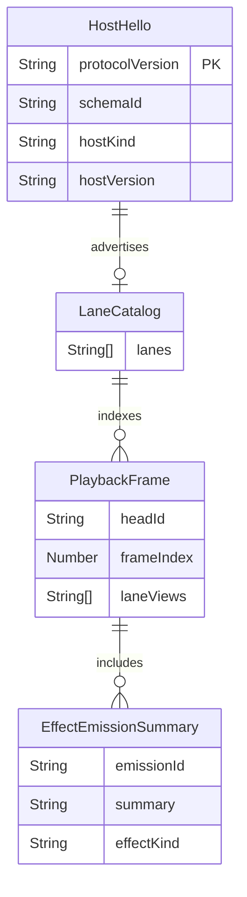
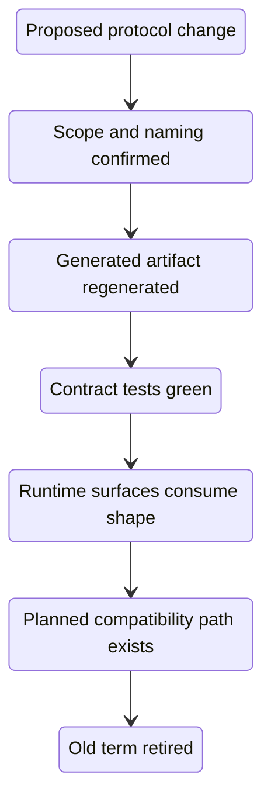
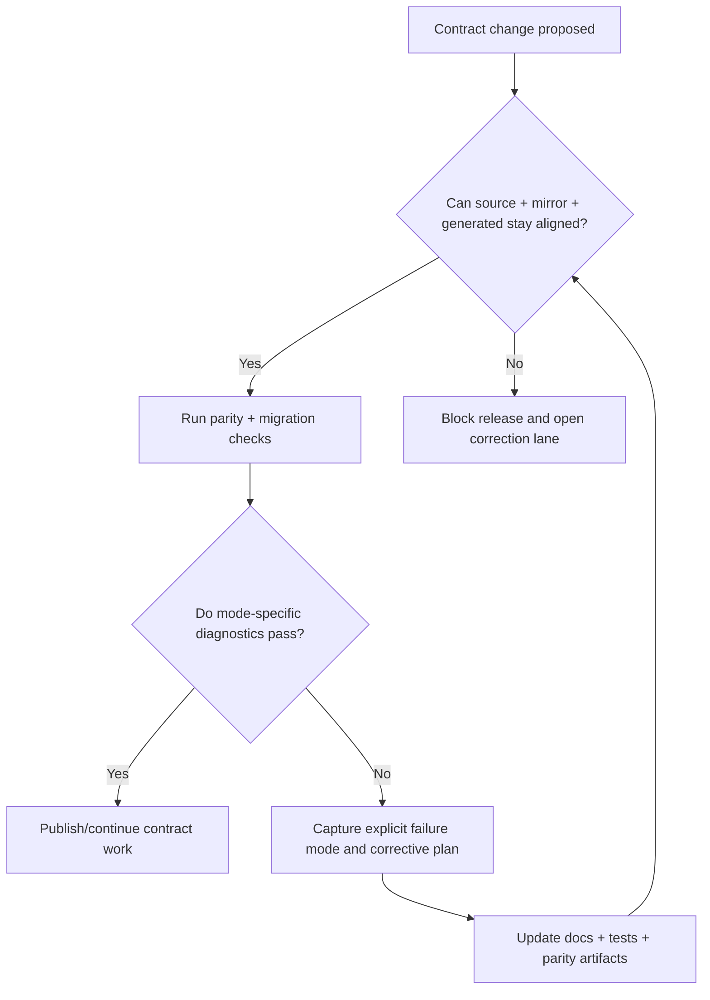
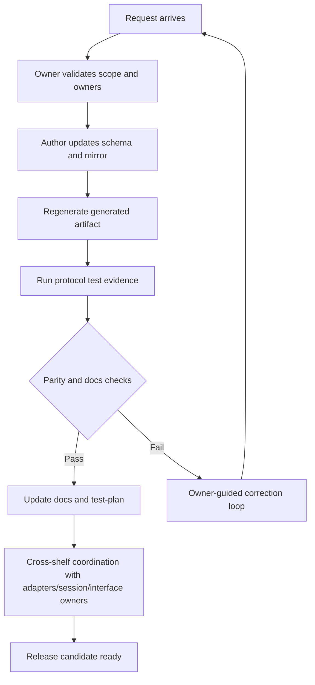

# Protocol Contract

## Overview

**Diagram 0.0: Protocol contract map used by this shelf.**



This shelf exists so an engineer can make a contract edit without guessing what files must change, how evidence is generated, or which consumers must move with the change.[C03][C04][C05][C06][C07]

The **protocol contract** is the shared language that keeps protocol-facing surfaces aligned when they read and render runtime facts. This topic answers what that language is, where it is born, and how a proposed shape change becomes safe to expose to adapters, CLI, MCP, and TUI.[C01][C02]

By the end of this document, you will understand the **canonical source chain** for protocol shapes, how validation and **parity checks** block unsafe release, where adjacent shelves complete the contract story at session, adapter, interface, and discovery layers, and what to change when a **protocol migration** is required.[C03][C04][C05][C06][C07][C10][C11]

**Diagram 0.1: Contract lifecycle from source definitions to consumable runtime outputs.**



At this level, the first thing to know is the canonical source chain. The contract intent starts in `schemas/warp-ttd-protocol.graphql`, moves through the local mirror in `src/protocol.ts`, and becomes part of generated output in `src/generated/warp-ttd-protocol.wesley.generated.ts` once sync and generation steps complete.[C03][C04][C05]

Scope for this shelf is explicit: the contract model, file lineage, validation gates, migration posture, and failure handling are covered in depth; adapter internals, CLI rendering details, and transport protocol internals are intentionally out of scope.

### Reader pathways

If you are here to make a fast change, start with the pathway that matches your immediate goal:

1. [Add or modify a protocol field](#workflow-example-new-field-introduction) for edit-first work.
2. [Triage a contract failure](#failure-mode-catalog) for CI breakage or drift response.
3. [Plan cross-shelf impact](#governance-and-boundary-dependencies) for release risk and owner alignment.

For design rationale and architectural justification, see [rationale.md](rationale.md). This README stays focused on execution, verification, and recovery.

### Code owners

High-impact **protocol** edits need explicit stewardship because this shelf controls shapes that flow directly into adapters, CLI, MCP, and TUI behavior. This topic has one declared code owner while behavior remains in flux and should be reviewed with them before any contract-shape migration.[C25]

**Table 0.2 — Code owners for protocol-contract.**

| Name | Contact | Ownership scope |
|---|---|---|
| James | [james@flyingrobots.dev](mailto:james@flyingrobots.dev) | Protocol contract ownership, schema/mirror/generation parity, and migration posture review |

For protocol edits outside this scope, route proposals through James first so release posture and compatibility assumptions can be validated before implementation details are finalized.[C25]

In summary, protocol traceability depends on a single source-of-truth chain, which is why the neighboring shelves are presented next and explain where that contract is consumed.

### Related topics

A reader should move from contract grammar to boundary, session, and interface shelves in a deliberate order to prevent accidental overfitting to one layer, because those shelves split responsibility across adapters, sessions, facts, and protocol consumers where wording and behavior can drift if not read together.

**Mindmap 0.1 — How neighboring shelves consume and constrain the protocol contract.**



**Table 0: Topic dependency map for follow-up reading.**

| Shelf | How it relates |
|---|---|
| [adapter-port-and-registry](../adapter-port-and-registry/README.md) | Defines adapter boundary contracts and capability semantics that depend on protocol data types. |
| [debugger-session-core](../debugger-session-core/README.md) | Shows how the protocol contract drives session assembly and debugging navigation. |
| [shared-family-facts](../shared-family-facts/README.md) | Covers fact ownership, reconciliation, and preference rules used by protocol payloads. |
| [cli-interface](../cli-interface/README.md) | Defines command output shapes that consume protocol envelopes as JSON/JSONL. |
| [mcp-interface](../mcp-interface/README.md) | Defines MCP tool contracts that depend on protocol event shape stability. |
| [worldline-visualization](../worldline-visualization/README.md) | Explains how protocol lane and worldline models are projected in visualization pages. |
| [continuum-target-discovery](../continuum-target-discovery/README.md) | Documents hello and discovery posture checks that shape runtime protocol expectations. |
| [tui-shell](../tui-shell/README.md) | Shows how protocol data is rendered in shell views and session inspectors. |

These adjacent shelves are the minimal onboarding ring around protocol.

### Reading path and outcomes

Read this section as: contract source definitions, evidence gates, and then operational recovery. If your goal is to implement quickly, skim directly to [The protocol chain in practice](#the-protocol-chain-in-practice) and [Workflow example: new field introduction](#workflow-example-new-field-introduction).

## The protocol chain in practice

A protocol change is release-ready only if the schema, mirror, and generated artifact stay in lockstep and parity checks are green. Release risk is reduced when every handoff has an explicit test gate before cross-shelf consumers can adopt the change.

### Stage-by-stage contract movement

The contract can be understood as a strict sequence, where each step must complete before behavior can be treated as released.

**Diagram 1: Chain from schema authoring to release gating.**



The source step (`Schema`) is where every protocol statement begins; this is the only place where vocabulary is defined before any language or tooling adaptation.

### Mirror consolidation step

The mirror step (`src/protocol.ts`) is where schema intent becomes runtime-local types so adapters and consumers can compile against an in-repo representation.

### Generated artifact step

The generated step is the serialization bridge: it exports **canonicalized protocol artifacts** and ensures that hand-rolled type usage stays consistent with the canonical definition.

### Contract test gate

The contract-testing step is where evidence is produced; parity tests become the release gate because they can fail deterministically when schema, mirror, and artifact diverge.

### Release decision gate

The final decision step enforces outcomes: a pass allows publishing and landing, while a fail routes the change back to the earlier source update path until consistency is restored.

`src/adapters/echoFixtureAdapter.ts` and its protocol tests show that consumers assert this chain by reading protocol-shaped payloads and verifying shape stability, so the chain is not optional implementation preference. In particular, `test/protocolPublicationBoundary.spec.ts` and `test/protocolContract.spec.ts` both fail fast when parity or field expectations are violated.[C06][C07]

This flow has four meaningful milestones worth calling out explicitly for readers. Schema authoring is the origin of truth and the only place where vocabulary can expand safely without ambiguity because intent and compatibility expectations are defined together with migration boundaries.[C03]

### Evidence-backed milestone walkthrough

Synchronization into `src/protocol.ts` is the implementation handshake that makes the SDL schema executable in runtime code paths while preserving names and constraints required by downstream readers.[C04]

Artifact generation is the handoff where the type-safe protocol surface is regenerated and serialized for shared consumption, which is why this step cannot be skipped or deferred into test time.[C05][C12]

Contract tests are the safety barrier for both directionality and completeness: they are where parity assertions are converted into hard failure semantics before any interface-level consumer can rely on the changed contract.[C06][C07]

The gate behavior then partitions outcomes into two paths. The pass path publishes only after evidence is clean; the fail path sends the change back into rework because drift or incompatibility is still active debt.

Release decisions therefore depend on a closed evidence chain, not merely implementation intent.

Takeaway: lockstep movement is the release contract; any skipped stage is a potential compatibility risk.

### Workflow example: new field introduction

New protocol payload fields must be introduced at the schema boundary first, then propagated through mirrors and generators, because this order keeps consumers deterministic; they only render from validated contracts and avoids local-only shape divergence.

If you add a field intended for hello payloads, the order is deterministic: schema first, then mirror and generated artifact, and only then interface rendering.

### New-field sequence walkthrough

The practical sequence is intentionally strict: define intent in schema, mirror it for local code, regenerate artifacts, then run tests before permitting surface rendering.

This prevents early consumers from reading half-shaped payloads and makes migration reversible when issues are caught early.

**Code Block 1 — Post-creation payload shape for a protocol-ready HostHello example.**

```json
{
  "schemaVersion": "0.7.0",
  "type": "HostHello",
  "payload": {
    "runtimeId": "continuum://localhost:3000",
    "name": "Local Continuum",
    "envelopeVersion": "hello-v1"
  }
}
```

`HostHello` is defined in the schema, and the local mirror keeps the same contract for runtime use.[C08][C09]

This schema-first workflow keeps runtime readability and protocol correctness coupled through the same process.

The section takeaway is that deterministic sequencing is how protocol safety is preserved at contribution time.

## How one change becomes an observable result

Observability is the mechanism that proves a protocol edit is truly release-safe, not a local refactor, because a direct consumer trace shows every release decision is backed by verified schema/mirror/generated parity and an explicit release handoff.

### Evidence loop as an operational proof

**Diagram 2: Evidence loop from engineer edit to consumer activation.**



This sequence starts with an engineer editing the authored schema and continues through each required checkpoint so there is no ambiguity about who touched what at each step.

The schema step captures intent, the mirror step aligns local code, and the generated step materializes the published contract artifact.

The test checkpoint is the technical validator that confirms all three sources agree on shape and migration behavior before any runtime surface can consume the update.

The final consumer step records release readiness as a practical safety boundary: only validated payloads are allowed to drive interface output.

The sequence connects to adapter and fact boundaries so readers can trace behavior to adjacent shelves. The adapter contract is treated in [adapter-port-and-registry](../adapter-port-and-registry/README.md), while shared fact folding is documented in [shared-family-facts](../shared-family-facts/README.md).[C10][C11]

A change is observable only when consumers can be reloaded from validated contract sources.

### Onboarding implication of observability

For onboarding contributors, the contract checkpoint is direct: if consumers cannot be reloaded from validated artifacts, treat the change as incomplete and pause release.

The takeaway is that observability closes the distance between schema edits and operational behavior.

## Contract model shape

Protocol stability is achieved when core concepts are expressed as explicit envelope types instead of unscoped inline objects, because families like `HostHello`, `LaneCatalog`, and `PlaybackFrame` define bounded meanings and reduce downstream ambiguity.

### Envelope model and bounded semantics

`HostHello`, `LaneCatalog`, `PlaybackFrame`, and related types define the most common protocol boundaries. In practice these are envelopes with named payloads and version fields carried consistently across surface consumers.[C03][C12][C08]

**Diagram 3: Class-level protocol model for schema-mirror-generated alignment.**



#### ProtocolEnvelope

`ProtocolEnvelope` is the shared abstraction for every protocol payload: it defines the minimal envelope fields and a single serialization surface that allows all higher-level types to be consumed uniformly while retaining explicit version and payload identity.[C03][C04][C12]

When debugging a shape mismatch, this class is the first check because most contract issues start with envelope metadata before they surface in a concrete payload field.[C03][C12]

#### HostHello

`HostHello` models runtime onboarding and target metadata by naming host identity and negotiation-relevant fields, which is why handshake readers and discovery flows rely on this class as a first-contact contract.[C06][C10]

If `HostHello` shifts, target discovery and admission decisions are usually the first consumers to exhibit symptoms, because onboarding depends on this envelope being semantically consistent.[C06][C10]

#### PlaybackFrame

`PlaybackFrame` captures temporal progression through session replay semantics by bundling head position, index, and lane visibility state, and it is the most practical vehicle for deterministic timeline rendering.[C07]

When `PlaybackFrame` changes, replay ordering and cursor math become the primary validation checkpoints; any inconsistency there usually predicts downstream UI and sequence reconstruction issues.[C07][C12]

#### EffectEmissionSummary

`EffectEmissionSummary` records delivery evidence and effect characterization so downstream tools can surface impact and not just raw event identity, tying protocol observability to operational interpretation.[C11][C18]

Effect summaries are the audit bridge between protocol semantics and runtime delivery interpretation, so keep this class coupled to any observability updates.[C11][C18]

### Envelope model takeaway

The shape remains stable when the model keeps explicit boundaries and avoids inline ad-hoc structure, because bounded semantics reduce accidental interpretation variance across readers.

### Type alignment evidence and relationship shape

Parity is meaningful only when the same object identities are represented consistently across schema, mirror, and generated output, because the evidence below anchors each family to explicit tests and object relationships.

Schema and mirror/interface files share the same major protocol objects and are continuously compared by parity tests.[C08][C09][C12][C06]

#### ER traceability package

**Question this diagram answers.** What structure must hold so runtime onboarding facts can flow consistently into replay sequencing and effect diagnostics without cross-layer assumptions.

**Diagram 4: Entity relationships for protocol payload families and lifecycle dependencies.**



**ER entities**

| Entity | Why this entity exists | Invariant | Owner source |
|---|---|---|---|
| `HostHello` | Provides onboarding and capability declaration facts. | `protocolVersion` and `schemaId` must remain stable for a successful compatibility gate. | `schemas/warp-ttd-protocol.graphql`; `src/protocol.ts` |
| `LaneCatalog` | Enumerates lane metadata used by replay projection consumers. | Every known lane family must be represented for frame indexing to resolve. | `schemas/warp-ttd-protocol.graphql`; `src/generated/warp-ttd-protocol.wesley.generated.ts` |
| `PlaybackFrame` | Describes replay progression, ordered by frame index. | `headId` and `frameIndex` form the replay cursor identity. | `schemas/warp-ttd-protocol.graphql`; `test/protocolContract.spec.ts` |
| `EffectEmissionSummary` | Captures effect delivery observations for operational diagnostics. | Summary text must remain tied to a specific emission identity. | `schemas/warp-ttd-protocol.graphql`; `src/generated/warp-ttd-protocol.wesley.generated.ts` |

This table gives the first debugging anchor for each node in this ER block and keeps model questions linked to concrete source files for immediate triage.[C06][C08][C09]

**ER relationships**

| Edge | Direction intent | Cardinality | Why this direction exists | Failure signal |
|---|---|---|---|---|
| `HostHello` → `LaneCatalog` (`advertises`) | 1-to-1 | `HostHello` carries one published lane declaration, and each lane family maps to a concrete catalog scope. | Discovery must know which lane families are valid before replay requests are interpreted. | Missing or stale lane references make `LaneCatalog` lookups non-deterministic. |
| `LaneCatalog` → `PlaybackFrame` (`indexes`) | 1-to-many | Each catalog maps to one or more replay frames over time. | Replay tools must reconstruct lane order from the same lane index. | Reordered or orphaned frames can break deterministic render and cursor math. |
| `PlaybackFrame` → `EffectEmissionSummary` (`includes`) | 1-to-many | Each frame can emit multiple effect summaries per sequence index. | Diagnostics requires effect context in the same temporal position. | Effect evidence can be assigned to the wrong frame without this linkage. |

If any row in this table cannot be tied to an explicit parity or behavioral check, the edge remains documentation debt and must be tagged with owner-backed follow-up before merge.[C07][C11][C17]

Diagnostic takeaway is straightforward: if the graph holds, onboarding scope is complete, replay order is deterministic, and effect evidence remains attributable. If an edge fails, isolate the failed node/edge and trace backward through its owning source file to identify whether the source, mirror, generation, or read-model path needs correction.[C06][C09][C12][C16][C17]

### Alignment checks and their risk envelope

The practical implication is that conceptual clarity and contract evidence must always stay paired, because any edge that cannot be defended by test evidence is a false compatibility claim.

## Version and migration behavior

Protocol evolution requires explicit migration posture, otherwise interfaces and adapters unknowingly diverge, because version labels and verification checkpoints convert migration from assumption into a concrete operational guarantee.

### Migration lifecycle boundaries

Protocol evolution is not a silent refactor. Version labels in schema type directives and test assertions establish explicit migration posture.[C03][C14][C15]

**Diagram 5: Protocol migration posture from proposal to removal.**



`Draft` is the proposal surface, where a contract change exists as intent but has not yet been evaluated against existing behavior and owners.[C14]

`Reviewed` means naming, scope, and compatibility assumptions are validated so the candidate can be regenerated without surprising interface behavior.[C15]

`Generated` marks the build-time synthesis point where the source schema has been transformed into runtime artifacts and therefore can be tested with parity checks.[C05][C12]

`Verified` is the pre-release evidence state; all contract tests and publication-boundary assertions are green in this phase, making release safety an observable condition rather than an opinion.[C06][C07][C16]

`Released` indicates consumers can safely read the contract shape because boundary tests and generation outputs are consistent with current runtime readers.[C21][C22][C23]

`Deprecated` creates explicit deprecation intent, giving downstream maintainers and callers a planned path to migrate before hard removal.[C15]

`Removed` is the terminal retirement point where the old term is no longer part of live contract guarantees; this state is only safe after deprecation has been observed and consumed.

The golden migration path is `Draft -> Reviewed -> Generated -> Verified -> Released`; only if `Deprecated` is needed does the path continue to `Removed`, and only with documented, coordinated migration.

`Draft -> Reviewed` is the first non-negotiable safety cut: it gives a point to validate terminology and compatibility assumptions before any generated artifact changes become normative.

`Reviewed -> Generated` is the build boundary; if this edge is skipped, consumers eventually receive artifacts that do not match governance intent.

`Generated -> Verified` ensures both generated files and tests agree on shape; this edge is the difference between local convenience and release safety.

`Verified -> Released` is the handoff from engineer confidence to runtime confidence.

`Deprecated -> Removed` is the compatibility window and only valid when migration notes and downstream readers have a transition plan.

Golden path summary: one state transition at a time, one evidence source per transition.[C14][C15][C16][C17]

Non-golden path example: `Released -> Deprecated` without clear consumer comms means a policy change has occurred without contract handoff, and the fix is to pause release and return to `Owner validates scope` in the owner workflow.

Migration safety therefore comes from explicit lifecycle stages and enforced parity at each handoff.

### Why migration posture prevents surprises

This state flow is a release protocol in disguise: each state transitions only when its required evidence exists, and no state is assumed to imply compatibility.

## Failure modes and evidence

The operational failure mode for this shelf is shape drift, because any uncaught desync between source, mirror, and generated artifacts makes downstream readers consume unsafe contracts.[C16][C17][C18]

If CI is failing, use the catalog below first to identify the mode, then jump to the matching row in the remediation matrix.

**Diagram 6: Failure propagation and release-blocking behavior for protocol defects.**



The first question is not whether the implementation is “working,” but whether the contract chain remains complete enough for consumers to reason about shape and ownership without external assumptions.[C06][C16][C17]

### Failure mode catalog

This shelf tracks each concrete failure mode by the shape it breaks, how it is detected, and what immediate operational signal it yields for triage.[C06][C11][C16]

**Table 4.3 — Failure modes, diagnostic shape, and extraction value for protocol editors.**

| Failure mode | Explicit failure shape | Detection path | What you can extract immediately |
|---|---|---|---|
| Schema-to-mirror drift | A type exists in `schemas/warp-ttd-protocol.graphql` but differs from the TypeScript mirror `src/protocol.ts`. | `protocolContract.spec.ts` parity assertion and `protocolPublicationBoundary.spec.ts` schema checks. | You can isolate whether the source contract was edited without synchronized mirror updates and block release for that specific type. |
| Mirror-to-generated drift | A mirrored type appears compatible in `src/protocol.ts` but differs from generated TypeScript outputs. | `test/wesleyGeneratedProtocol.spec.ts` and generated artifact diff checks. | You can determine that build/sync tooling is stale and regenerate artifacts before runtime consumers are trusted. |
| Publication boundary drift | Boundary files claim support for fields or transitions that are not mirrored in schema/mirror. | Protocol publication boundary tests and schema snapshot assertions. | You get a direct compatibility gap list that can be used to scope rollback or migration edits. |
| Migration-state drift | A migrated shape is present but state transition guards are not updated to reflect that transition. | State lifecycle checks in migration flow tests plus release gate assertions. | You can identify unsafe rollout points and stop promotion until migration semantics are revalidated. |
| Consumer-facing regression | Adapter/session/tui-facing outputs diverge despite passing schema parity. | Consumer-level smoke checks in CLI/MCP/TUI coverage and contract consumption tests. | You gain a direct index of downstream surfaces that must be updated together before reopening release. |

The catalog makes skimming straightforward: shape-first signals identify whether to patch source, generation, migration, or consumers, and each row gives the likely first fix path from the observed symptom.[C06][C16][C17][C18]

For one-line triage, map this to the mode sequence: schema mismatch → drift in mirror; mirror mismatch → artifact regeneration; boundary mismatch → documentation/spec correction; lifecycle mismatch → migration rollback guard; consumer mismatch → cross-shelf interface correction.

### Failure mode walkthroughs

#### Schema-to-mirror drift

This mode manifests when a schema field is added, removed, or retyped in `schemas/warp-ttd-protocol.graphql` without a synchronized TypeScript mirror update. The explicit shape is visible as mismatched type signatures or missing members when parity assertions compare expected object families.

The extraction value is twofold: you can pinpoint the exact source file to edit first (`schemas/warp-ttd-protocol.graphql`), and you can confirm whether the change is backward compatible before touching any generated output.[C08][C16][C03]

#### Mirror-to-generated drift

This mode appears when the mirror file is updated but generation artifacts lag or diverge. The explicit shape is stale generated unions or payload typing that suggests older behavior while source mirrors advertise newer contract shapes.

The extraction value is a deterministic recovery sequence: regenerate artifacts, rerun parity checks, and only then compare migration state and consumer surfaces for behavior alignment.[C12][C17][C05]

#### Publication boundary drift

Publication boundary drift shows up as a declaration mismatch between what is documented as available behavior and what tests treat as authoritative contract scope. It often appears as failing boundary assertions rather than obvious schema errors.

The extraction value is strongest here for release decisions, because this mode identifies whether to pause the rollout for compatibility communication or to convert scope before continuing with migration tasks.[C06][C18][C10]

#### Migration-state drift

Migration-state drift is a failure of sequencing more than syntax; the shape can look correct while lifecycle sequencing is incomplete. The explicit shape is contradictory checkpoints, where state transitions in documentation or implementation do not match actual gate outcomes.

The extraction value is clarity on rollout order: you can either defer release entirely or convert the sequence into a safe two-step if only non-breaking changes remain in staging.[C14][C15][C07]

#### Consumer-facing regression

Consumer-facing regression is the failure mode where parity checks pass in isolation but adapters, CLI, MCP, or TUI readers interpret payloads differently due to stale assumptions. The explicit shape is mismatch between contract shape and output semantics, typically visible as UI rendering shifts without contract violations.

The extraction value is a focused blast-radius map: identify which consumers read each failed family and update interfaces before any user-visible promise is reintroduced.[C21][C22][C23]

### Failure closure and prevention loop

Failure closures in this shelf are now explicitly mapped to mode, owner action, and verification steps, so triage can move from symptom to fix without hunting for context.

**Table 4.4 — Remediation matrix for protocol failures.**

| Failure mode | First response | Recovery action | Validation before release |
|---|---|---|---|
| Schema-to-mirror drift | Stop rollout and freeze interface changes for that family. | Update schema and mirror together under owner review. | Re-run parity and publication-boundary checks. |
| Mirror-to-generated drift | Halt generated artifact consumers. | Regenerate artifacts and confirm output shape deltas. | Re-run protocol and generated parity specs. |
| Publication boundary drift | Escalate to protocol owner and defer release for affected feature area. | Align boundary docs, tests, and shelf claims before reopening gate. | Re-run publication-boundary and versioned migration tests. |
| Migration-state drift | Pause release promotion for affected migration edge. | Resolve transition rules and sequencing semantics first, then rerun migration state test suite. | Confirm state graph checks and lifecycle assertions. |
| Consumer-facing regression | Coordinate with interface owners before release unfreeze. | Update affected consumers and their contract adapters in one batch. | Run interface-focused checks plus end-to-end protocol smoke checks. |

The practical meaning is that each failure should close with a source of truth check, not just a changed test file, because the contract remains safe only when its consuming surfaces agree on the corrected meaning.

Governance remains stable when the failure loop has explicit ownership and measurable handoff criteria instead of informal postmortem notes.[C01][C20][C24]

## Governance and boundary dependencies

Protocol-facing modules treat this shelf as a hard dependency because all listed consumers render protocol-backed shapes directly into user-visible output.

### Boundary ownership model

The protocol shelf is consumed by adapter factories, session builders, and interface readers, and those boundaries should treat protocol as canonical data. If you need the behavioral boundary details for adapters, use [adapter-port-and-registry](../adapter-port-and-registry/README.md).

`src/cli.ts`, `src/mcp/*`, and `src/tui/*` consume protocol-backed data shapes and bind those values into output surfaces.[C21][C22][C23]

The generated protocol artifact exposes the shape set that these consumers render against.[C05][C12]

### Why this shelf is a hard dependency

This is the compatibility boundary for protocol shape. If this shelf changes, adjacent adapter/session/interface shelves must move with it.

## Owner playbook for protocol evolution

A maintainable protocol change happens when the owner frames the change as a sequence from intent to validated evidence, because one-off edits without review can satisfy type checkers while silently breaking runtime compatibility assumptions.

### Claim and gate checkpoints

The practical owner flow is to confirm intent, stage synchronized file edits, and refuse release until parity and evidence checks complete.[C25]

**Diagram 7: Owner-centric protocol change workflow from proposal to release lock-in.**



`Request arrives` marks the point where intent is recorded and can be triaged before any source file changes, preventing unscoped edits from entering the chain.

`Owner validates scope and owners` is the ownership gate for compatibility assumptions and for confirming the right people are aligned before code movement begins.

`Author updates schema and mirror` is where the contract language and runtime type layer are kept in lockstep; any divergence here is immediately visible as a future parity failure.

`Regenerate generated artifact` refreshes protocol outputs so runtime readers and documentation artifacts target the same type set.

`Run protocol test evidence` executes the shape and parity contracts that detect field drift, boundary mismatch, and publication parity before release decisioning.[C06][C07][C11]

`Parity and docs checks` is the release gate with two axes: technical compatibility and narrative accuracy. If it passes, the shelf and cross-shelf references can be finalized; if it fails, the change is sent back into coordinated correction.

`Update docs and test-plan` is the handoff state where readers get the new contract truth and evidence map in one operation.

`Cross-shelf coordination with adapters/session/interface owners` is the final safety tie-in that prevents a protocol-only change from silently breaking sibling topics.

The successful golden path is `Request arrives -> Owner validates scope and owners -> ... -> Update docs and test-plan -> Cross-shelf coordination -> Release candidate ready`, while the failed path is explicitly closed by returning to correction under owner guidance.

This flow keeps migration decisions explicit because every release path either passes contract evidence and documentation, or returns to the owner for correction before any downstream reader can rely on the shape.

### Owner handoff and escalation guidance

The owner is expected to gate scope first, then synchronize mirrors/artifacts/tests, then update governance artifacts in one pass. Escalation should happen when a requested change affects migration posture without already mapped dependencies.

The final takeaway is that the owner role is not ceremonial; it is the last integrity check before cross-shelf deployment.

## Appendix A — Recent Activity

This shelf was changed from a concise checklist into a complete onboarding-first topic so new contributors can understand protocol ownership, migration behavior, and failure posture before editing behavior.

Onboarding context reduces protocol mistakes by making recent change history and open risk explicit at the point of use, because PR and issue links form a practical memory channel for why the contract evolved and where unresolved risks remain.

### Appendix A.1 — Related GitHub PRs

PR history is the first signal of why this contract changed and what compatibility assumptions were accepted at each step, because historical PRs usually preserve intent more stably than transient implementation details.

- [#109](https://github.com/flyingrobots/warp-ttd/pull/109) — chore(deps): bump tar from 7.5.13 to 7.5.16 in the npm_and_yarn group across 1 directory
- [#105](https://github.com/flyingrobots/warp-ttd/pull/105) — chore(deps): bump hono from 4.12.23 to 4.12.26 in the npm_and_yarn group across 1 directory
- [#102](https://github.com/flyingrobots/warp-ttd/pull/102) — Expose Continuum runtime hello read model
- [#93](https://github.com/flyingrobots/warp-ttd/pull/93) — docs(design): define Continuum runtime hello handshake
- [#87](https://github.com/flyingrobots/warp-ttd/pull/87) — docs(design): define Continuum causal debugger experience
- [#77](https://github.com/flyingrobots/warp-ttd/pull/77) — feat(targets): add Continuum target discovery contract
- [#75](https://github.com/flyingrobots/warp-ttd/pull/75) — feat(live): report Wesley-generated Echo family artifacts
- [#25](https://github.com/flyingrobots/warp-ttd/pull/25) — feat(proto): add host-published family facts
- [#24](https://github.com/flyingrobots/warp-ttd/pull/24) — feat(proto): add generated family ingress seam
- [#23](https://github.com/flyingrobots/warp-ttd/pull/23) — docs(manual): start generated family ingress manual

These PRs provide the practical acceptance trail for each protocol-era decision.

### Appendix A.2 — Related Open GitHub Issues

Open issues surface unresolved contract risks that should gate future changes to this topic, because unresolved issues are forward-pressure indicators and need to inform next-step planning.

- [#108](https://github.com/flyingrobots/warp-ttd/issues/108) — [LP-GP4-S1] Launchpad browser runtime hello target descriptor
- [#107](https://github.com/flyingrobots/warp-ttd/issues/107) — [LP-GP4-S2] Browser replay tick history read model
- [#106](https://github.com/flyingrobots/warp-ttd/issues/106) — [LP-GP4-S3] Rewind current visit control contract
- [#64](https://github.com/flyingrobots/warp-ttd/issues/64) — Generated protocol authority cutover
- [#63](https://github.com/flyingrobots/warp-ttd/issues/63) — Protocol evolution for Echo's runtime schema
- [#49](https://github.com/flyingrobots/warp-ttd/issues/49) — Take ownership of ttd-protocol-rs generation
- [#65](https://github.com/flyingrobots/warp-ttd/issues/65) — PROTO neighborhood core cutover
- [#62](https://github.com/flyingrobots/warp-ttd/issues/62) — Echo host adapter
- [#61](https://github.com/flyingrobots/warp-ttd/issues/61) — Echo causal commit evidence read model
- [#60](https://github.com/flyingrobots/warp-ttd/issues/60) — Compliance reporting protocol extension

Unresolved issues are contract debt and should influence both scope decisions and migration plans.

## Appendix B — Source Evidence Citations

Every major claim needs repeatable traceability so future edits can be audited without reverse engineering, because `[Cxx]` markers require a single ledger table that supports review and maintenance context.

**Table 1: Provenance table for all `[Cxx]` claims.**

| Citation | Source file | Line | Git SHA |
|---|---|---|---|
| C01 | AGENTS.md | AGENTS.md#7@c0b4f967d4406ec19a317129488d39aaf34d19ef | c0b4f967d4406ec19a317129488d39aaf34d19ef |
| C02 | docs/BEARING.md | docs/BEARING.md#20@c0b4f967d4406ec19a317129488d39aaf34d19ef | c0b4f967d4406ec19a317129488d39aaf34d19ef |
| C03 | schemas/warp-ttd-protocol.graphql | schemas/warp-ttd-protocol.graphql#10@c0b4f967d4406ec19a317129488d39aaf34d19ef | c0b4f967d4406ec19a317129488d39aaf34d19ef |
| C04 | src/protocol.ts | src/protocol.ts#1@c0b4f967d4406ec19a317129488d39aaf34d19ef | c0b4f967d4406ec19a317129488d39aaf34d19ef |
| C05 | src/generated/warp-ttd-protocol.wesley.generated.ts | src/generated/warp-ttd-protocol.wesley.generated.ts#1@c0b4f967d4406ec19a317129488d39aaf34d19ef | c0b4f967d4406ec19a317129488d39aaf34d19ef |
| C06 | test/protocolPublicationBoundary.spec.ts | test/protocolPublicationBoundary.spec.ts#36@c0b4f967d4406ec19a317129488d39aaf34d19ef | c0b4f967d4406ec19a317129488d39aaf34d19ef |
| C07 | test/protocolContract.spec.ts | test/protocolContract.spec.ts#16@c0b4f967d4406ec19a317129488d39aaf34d19ef | c0b4f967d4406ec19a317129488d39aaf34d19ef |
| C08 | schemas/warp-ttd-protocol.graphql | schemas/warp-ttd-protocol.graphql#49@c0b4f967d4406ec19a317129488d39aaf34d19ef | c0b4f967d4406ec19a317129488d39aaf34d19ef |
| C09 | src/protocol.ts | src/protocol.ts#43@c0b4f967d4406ec19a317129488d39aaf34d19ef | c0b4f967d4406ec19a317129488d39aaf34d19ef |
| C10 | test/protocolPublicationBoundary.spec.ts | test/protocolPublicationBoundary.spec.ts#98@c0b4f967d4406ec19a317129488d39aaf34d19ef | c0b4f967d4406ec19a317129488d39aaf34d19ef |
| C11 | test/wesleyGeneratedProtocol.spec.ts | test/wesleyGeneratedProtocol.spec.ts#129@c0b4f967d4406ec19a317129488d39aaf34d19ef | c0b4f967d4406ec19a317129488d39aaf34d19ef |
| C12 | src/generated/warp-ttd-protocol.wesley.generated.ts | src/generated/warp-ttd-protocol.wesley.generated.ts#51@c0b4f967d4406ec19a317129488d39aaf34d19ef | c0b4f967d4406ec19a317129488d39aaf34d19ef |
| C14 | test/protocolContract.spec.ts | test/protocolContract.spec.ts#26@c0b4f967d4406ec19a317129488d39aaf34d19ef | c0b4f967d4406ec19a317129488d39aaf34d19ef |
| C15 | test/protocolPublicationBoundary.spec.ts | test/protocolPublicationBoundary.spec.ts#96@c0b4f967d4406ec19a317129488d39aaf34d19ef | c0b4f967d4406ec19a317129488d39aaf34d19ef |
| C16 | test/protocolContract.spec.ts | test/protocolContract.spec.ts#112@c0b4f967d4406ec19a317129488d39aaf34d19ef | c0b4f967d4406ec19a317129488d39aaf34d19ef |
| C17 | test/wesleyGeneratedProtocol.spec.ts | test/wesleyGeneratedProtocol.spec.ts#129@c0b4f967d4406ec19a317129488d39aaf34d19ef | c0b4f967d4406ec19a317129488d39aaf34d19ef |
| C18 | test/protocolPublicationBoundary.spec.ts | test/protocolPublicationBoundary.spec.ts#113@c0b4f967d4406ec19a317129488d39aaf34d19ef | c0b4f967d4406ec19a317129488d39aaf34d19ef |
| C20 | docs/design/doctrine.md | docs/design/doctrine.md#60@c0b4f967d4406ec19a317129488d39aaf34d19ef | c0b4f967d4406ec19a317129488d39aaf34d19ef |
| C21 | src/cli.ts | src/cli.ts#104@c0b4f967d4406ec19a317129488d39aaf34d19ef | c0b4f967d4406ec19a317129488d39aaf34d19ef |
| C22 | src/mcp/admissionChainSurface.ts | src/mcp/admissionChainSurface.ts#18@c0b4f967d4406ec19a317129488d39aaf34d19ef | c0b4f967d4406ec19a317129488d39aaf34d19ef |
| C23 | src/tui/pages/shared.ts | src/tui/pages/shared.ts#11@c0b4f967d4406ec19a317129488d39aaf34d19ef | c0b4f967d4406ec19a317129488d39aaf34d19ef |
| C24 | docs/topics/protocol-contract/test-plan.md | docs/topics/protocol-contract/test-plan.md#7@c0b4f967d4406ec19a317129488d39aaf34d19ef | c0b4f967d4406ec19a317129488d39aaf34d19ef |
| C25 | docs/topics/protocol-contract/README.md | docs/topics/protocol-contract/README.md#17@c0b4f967d4406ec19a317129488d39aaf34d19ef | c0b4f967d4406ec19a317129488d39aaf34d19ef |

This appendix concludes that the evidence ledger is the binding artifact connecting narrative claims to repository history.

## Appendix C — Glossary

The glossary below defines vocabulary introduced in this topic so contributors can align terms quickly and avoid interpretation drift when editing protocol behavior.

**Table 2: Protocol contract glossary.**

| Term | Meaning | Where it appears |
|---|---|---|
| **protocol contract** | The shared canonical data vocabulary used by adapter, session, and interface surfaces. | [Overview](#overview) |
| **canonical source chain** | The ordered link from SDL schema to protocol mirror to generated artifact plus test-backed validation. | [Overview](#overview), [The protocol chain in practice](#the-protocol-chain-in-practice) |
| **parity check** | Validation that schema, mirror, and generated artifacts remain shape-consistent and migration-safe. | [The protocol chain in practice](#the-protocol-chain-in-practice), [How one change becomes an observable result](#how-one-change-becomes-an-observable-result), [Owner playbook for protocol evolution](#owner-playbook-for-protocol-evolution) |
| **release gate** | The explicit pass/fail decision point where parity and documentation checks determine whether behavior can land. | [The protocol chain in practice](#the-protocol-chain-in-practice), [Owner playbook for protocol evolution](#owner-playbook-for-protocol-evolution) |
| **protocol migration** | A controlled, documented transition of protocol shape where old and new payload terms coexist only through explicit compatibility guidance. | [Overview](#overview), [Version and migration behavior](#version-and-migration-behavior) |
| **mature evidence path** | The sequence from design intent to source edits, regeneration, tests, and cross-shelf documentation updates. | [Owner playbook for protocol evolution](#owner-playbook-for-protocol-evolution) |
