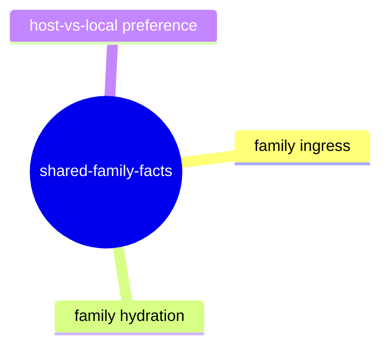

# Shared-Family Facts

## Purpose

Track how WARP TTD ingests and projects host/published and generated family facts
into debugger-readable observability facts.

## Contract Points

1. `src/app/generatedFamilyIngress.ts` defines canonical encoded family fact wrappers
   with source/origin/scope/posture metadata.
2. `sessionFamilyFacts` from adapters are consumed and normalized by
   `src/app/sessionFamilyFacts.ts` and related hydration helpers.
3. `src/app/sharedFamilyHydration.ts` applies local fallback and malformed-host-fact guards
   so corrupted host facts do not crash sessions.
4. Live Echo ingress path (`src/app/liveEchoFamilyIntake.ts`) exposes:
   - target posture
   - manifest/descriptor validation
   - generated artifact consumption posture (present/absent/obstructed)
5. Adapter-published family data is combined into session summaries where available and
   gracefully falls back when absent.

## Evidence

- `src/app/generatedFamilyIngress.ts`
- `src/app/sessionFamilyFacts.ts`
- `src/app/sharedFamilyHydration.ts`
- `src/app/liveEchoFamilyIntake.ts`
- `test/generatedFamilyIngress.spec.ts`
- `test/liveEchoFamilyIntake.spec.ts`
- `test/liveEchoAdapterProbe.spec.ts` (protocol-facing fact posture from probe support)

## Stability Notes

- Family sources are postureed (`PRESENT`, `ABSENT`, `OBSTRUCTED`) and should remain machine-parsed
  with no implicit assumptions about vendor-specific payload formats.
