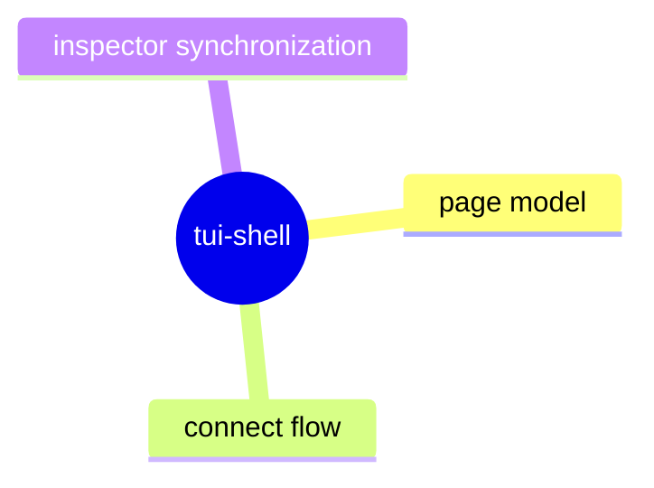

# TUI Shell

## Purpose

Define durable layout and navigation contracts for the terminal user interface shell.

## Contract Points

1. The shell initializes from adapter-backed snapshots and remains page-driven.
2. Connect and navigator pages use stable page identities and transition model.
3. Error and loading states are represented without bypassing the shell state machine.
4. Shell behavior mirrors adapter/command posture transitions in a deterministic way.

## Evidence

- `src/tui/main.ts`
- `src/tui/pages/connectPage.ts`
- `src/tui/pages/navigatorPage.ts`
- `src/tui/pages/shared.ts`
- `test/tuiPageStructure.spec.ts`
- `test/sessionSync.spec.ts`

## Operational Notes

- New TUI pages should be model-driven and not inject arbitrary runtime state.
