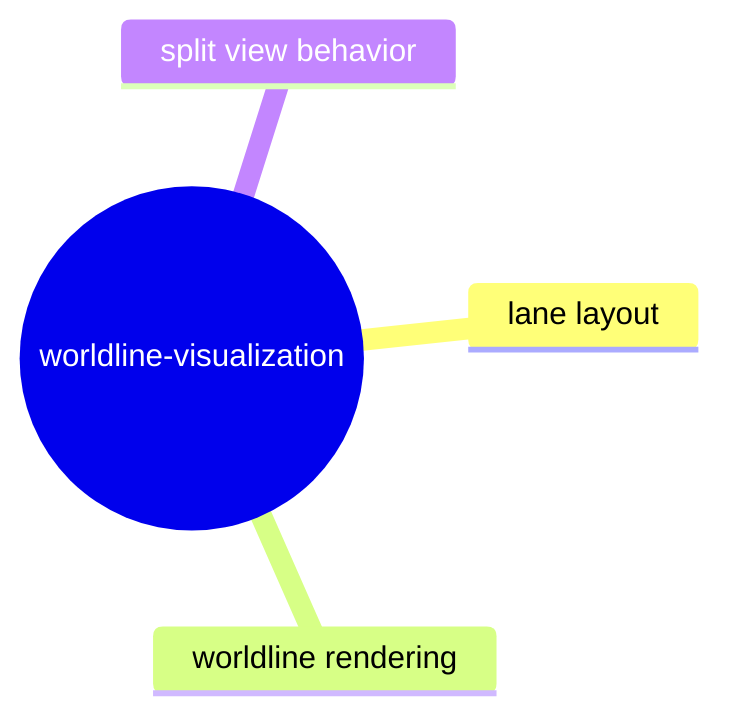

# Worldline Visualization

## Purpose

Define how worldline, lane, and rendering summaries are assembled for inspection and CLI/TUI views.

## Contract Points

1. Worldline summaries are derived from stable lane and protocol inputs.
2. Rendering models preserve stable lane/worldline identifiers and outcome metadata.
3. Split-view and layout artifacts are deterministic for equal frame inputs.
4. Worldline output degrades gracefully with empty or malformed lanes.

## Evidence

- `src/tui/worldlineLayout.ts`
- `src/tui/laneGraph.ts`
- `src/tui/pages/worldlinePage.ts`
- `test/worldlineRender.spec.ts`
- `test/worldlineLayout.spec.ts`
- `test/worldlineSplitView.spec.ts`
- `test/worldlinePage.spec.ts`

## Operational Notes

- Worldline rendering contracts are presentation-compatible only where protocol contract values remain unchanged.
